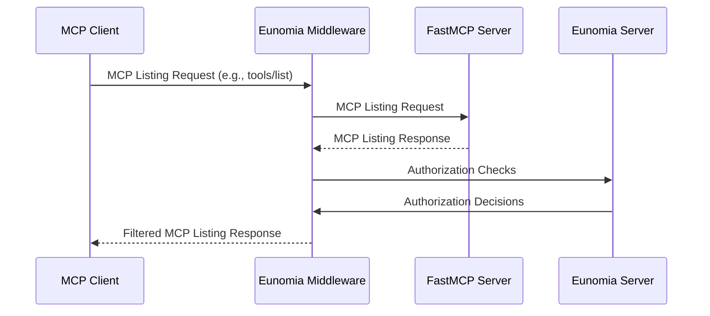
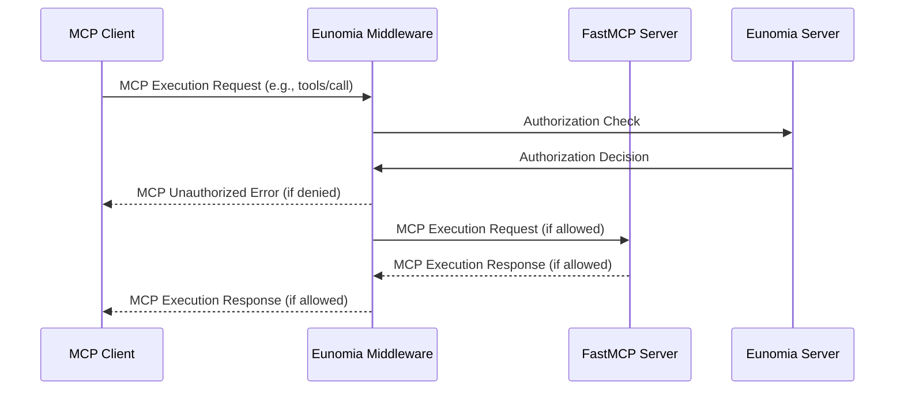

# Client and Framework Integrations

Source lines: 7347-9928 from the original FastMCP documentation dump.

ChatGPT, Claude Code/Desktop, Cursor, FastAPI, Gemini, GitHub, Google, and Goose integration guides.

---

# ChatGPT 🤝 FastMCP
Source: https://gofastmcp.com/integrations/chatgpt

Connect FastMCP servers to ChatGPT in Chat and Deep Research modes

[ChatGPT](https://chatgpt.com/) supports MCP servers through remote HTTP connections in two modes: **Chat mode** for interactive conversations and **Deep Research mode** for comprehensive information retrieval.

<Tip>
  **Developer Mode Required for Chat Mode**: To use MCP servers in regular ChatGPT conversations, you must first enable Developer Mode in your ChatGPT settings. This feature is available for ChatGPT Pro, Team, Enterprise, and Edu users.
</Tip>

<Note>
  OpenAI's official MCP documentation and examples are built with **FastMCP v2**! Learn more from their [MCP documentation](https://platform.openai.com/docs/mcp) and [Developer Mode guide](https://platform.openai.com/docs/guides/developer-mode).
</Note>

## Build a Server

First, let's create a simple FastMCP server:

```python server.py theme={"theme":{"light":"snazzy-light","dark":"dark-plus"}}
from fastmcp import FastMCP
import random

mcp = FastMCP("Demo Server")

@mcp.tool
def roll_dice(sides: int = 6) -> int:
    """Roll a dice with the specified number of sides."""
    return random.randint(1, sides)

if __name__ == "__main__":
    mcp.run(transport="http", port=8000)
```

### Deploy Your Server

Your server must be accessible from the internet. For development, use `ngrok`:

<CodeGroup>
  ```bash Terminal 1 theme={"theme":{"light":"snazzy-light","dark":"dark-plus"}}
  python server.py
  ```

  ```bash Terminal 2 theme={"theme":{"light":"snazzy-light","dark":"dark-plus"}}
  ngrok http 8000
  ```
</CodeGroup>

Note your public URL (e.g., `https://abc123.ngrok.io`) for the next steps.

## Chat Mode

Chat mode lets you use MCP tools directly in ChatGPT conversations. See [OpenAI's Developer Mode guide](https://platform.openai.com/docs/guides/developer-mode) for the latest requirements.

### Add to ChatGPT

#### 1. Enable Developer Mode

1. Open ChatGPT and go to **Settings** → **Connectors**
2. Under **Advanced**, toggle **Developer Mode** to enabled

#### 2. Create Connector

1. In **Settings** → **Connectors**, click **Create**
2. Enter:
   * **Name**: Your server name
   * **Server URL**: `https://your-server.ngrok.io/mcp/`
3. Check **I trust this provider**
4. Add authentication if needed
5. Click **Create**

<Note>
  **Without Developer Mode**: If you don't have search/fetch tools, ChatGPT will reject the server. With Developer Mode enabled, you don't need search/fetch tools for Chat mode.
</Note>

#### 3. Use in Chat

1. Start a new chat
2. Click the **+** button → **More** → **Developer Mode**
3. **Enable your MCP server connector** (required - the connector must be explicitly added to each chat)
4. Now you can use your tools:

Example usage:

* "Roll a 20-sided dice"
* "Roll dice" (uses default 6 sides)

<Tip>
  The connector must be explicitly enabled in each chat session through Developer Mode. Once added, it remains active for the entire conversation.
</Tip>

### Skip Confirmations

Use `annotations={"readOnlyHint": True}` to skip confirmation prompts for read-only tools:

```python theme={"theme":{"light":"snazzy-light","dark":"dark-plus"}}
@mcp.tool(annotations={"readOnlyHint": True})
def get_status() -> str:
    """Check system status."""
    return "All systems operational"

@mcp.tool()  # No annotation - ChatGPT may ask for confirmation
def delete_item(id: str) -> str:
    """Delete an item."""
    return f"Deleted {id}"
```

## Deep Research Mode

Deep Research mode provides systematic information retrieval with citations. See [OpenAI's MCP documentation](https://platform.openai.com/docs/mcp) for the latest Deep Research specifications.

<Warning>
  **Search and Fetch Required**: Without Developer Mode, ChatGPT will reject any server that doesn't have both `search` and `fetch` tools. Even in Developer Mode, Deep Research only uses these two tools.
</Warning>

### Tool Implementation

Deep Research tools must follow this pattern:

```python theme={"theme":{"light":"snazzy-light","dark":"dark-plus"}}
@mcp.tool()
def search(query: str) -> dict:
    """
    Search for records matching the query.
    Must return {"ids": [list of string IDs]}
    """
    # Your search logic
    matching_ids = ["id1", "id2", "id3"]
    return {"ids": matching_ids}

@mcp.tool()
def fetch(id: str) -> dict:
    """
    Fetch a complete record by ID.
    Return the full record data for ChatGPT to analyze.
    """
    # Your fetch logic
    return {
        "id": id,
        "title": "Record Title",
        "content": "Full record content...",
        "metadata": {"author": "Jane Doe", "date": "2024"}
    }
```

### Using Deep Research

1. Ensure your server is added to ChatGPT's connectors (same as Chat mode)
2. Start a new chat
3. Click **+** → **Deep Research**
4. Select your MCP server as a source
5. Ask research questions

ChatGPT will use your `search` and `fetch` tools to find and cite relevant information.


# Claude Code 🤝 FastMCP
Source: https://gofastmcp.com/integrations/claude-code

Install and use FastMCP servers in Claude Code

<LocalFocusTip />

[Claude Code](https://docs.anthropic.com/en/docs/claude-code) supports MCP servers through multiple transport methods including STDIO, SSE, and HTTP, allowing you to extend Claude's capabilities with custom tools, resources, and prompts from your FastMCP servers.

## Requirements

This integration uses STDIO transport to run your FastMCP server locally. For remote deployments, you can run your FastMCP server with HTTP or SSE transport and configure it directly using Claude Code's built-in MCP management commands.

## Create a Server

The examples in this guide will use the following simple dice-rolling server, saved as `server.py`.

```python server.py theme={"theme":{"light":"snazzy-light","dark":"dark-plus"}}
import random
from fastmcp import FastMCP

mcp = FastMCP(name="Dice Roller")

@mcp.tool
def roll_dice(n_dice: int) -> list[int]:
    """Roll `n_dice` 6-sided dice and return the results."""
    return [random.randint(1, 6) for _ in range(n_dice)]

if __name__ == "__main__":
    mcp.run()
```

## Install the Server

### FastMCP CLI

<VersionBadge />

The easiest way to install a FastMCP server in Claude Code is using the `fastmcp install claude-code` command. This automatically handles the configuration, dependency management, and calls Claude Code's built-in MCP management system.

```bash theme={"theme":{"light":"snazzy-light","dark":"dark-plus"}}
fastmcp install claude-code server.py
```

The install command supports the same `file.py:object` notation as the `run` command. If no object is specified, it will automatically look for a FastMCP server object named `mcp`, `server`, or `app` in your file:

```bash theme={"theme":{"light":"snazzy-light","dark":"dark-plus"}}
# These are equivalent if your server object is named 'mcp'
fastmcp install claude-code server.py
fastmcp install claude-code server.py:mcp

# Use explicit object name if your server has a different name
fastmcp install claude-code server.py:my_custom_server
```

The command will automatically configure the server with Claude Code's `claude mcp add` command.

#### Dependencies

FastMCP provides flexible dependency management options for your Claude Code servers:

**Individual packages**: Use the `--with` flag to specify packages your server needs. You can use this flag multiple times:

```bash theme={"theme":{"light":"snazzy-light","dark":"dark-plus"}}
fastmcp install claude-code server.py --with pandas --with requests
```

**Requirements file**: If you maintain a `requirements.txt` file with all your dependencies, use `--with-requirements` to install them:

```bash theme={"theme":{"light":"snazzy-light","dark":"dark-plus"}}
fastmcp install claude-code server.py --with-requirements requirements.txt
```

**Editable packages**: For local packages under development, use `--with-editable` to install them in editable mode:

```bash theme={"theme":{"light":"snazzy-light","dark":"dark-plus"}}
fastmcp install claude-code server.py --with-editable ./my-local-package
```

Alternatively, you can use a `fastmcp.json` configuration file (recommended):

```json fastmcp.json theme={"theme":{"light":"snazzy-light","dark":"dark-plus"}}
{
  "$schema": "https://gofastmcp.com/public/schemas/fastmcp.json/v1.json",
  "source": {
    "path": "server.py",
    "entrypoint": "mcp"
  },
  "environment": {
    "dependencies": ["pandas", "requests"]
  }
}
```

#### Python Version and Project Configuration

Control the Python environment for your server with these options:

**Python version**: Use `--python` to specify which Python version your server requires. This ensures compatibility when your server needs specific Python features:

```bash theme={"theme":{"light":"snazzy-light","dark":"dark-plus"}}
fastmcp install claude-code server.py --python 3.11
```

**Project directory**: Use `--project` to run your server within a specific project context. This tells `uv` to use the project's configuration files and virtual environment:

```bash theme={"theme":{"light":"snazzy-light","dark":"dark-plus"}}
fastmcp install claude-code server.py --project /path/to/my-project
```

#### Environment Variables

If your server needs environment variables (like API keys), you must include them:

```bash theme={"theme":{"light":"snazzy-light","dark":"dark-plus"}}
fastmcp install claude-code server.py --server-name "Weather Server" \
  --env API_KEY=your-api-key \
  --env DEBUG=true
```

Or load them from a `.env` file:

```bash theme={"theme":{"light":"snazzy-light","dark":"dark-plus"}}
fastmcp install claude-code server.py --server-name "Weather Server" --env-file .env
```

<Warning>
  **Claude Code must be installed**. The integration looks for the Claude Code CLI at the default installation location (`~/.claude/local/claude`) and uses the `claude mcp add` command to register servers.
</Warning>

### Manual Configuration

For more control over the configuration, you can manually use Claude Code's built-in MCP management commands. This gives you direct control over how your server is launched:

```bash theme={"theme":{"light":"snazzy-light","dark":"dark-plus"}}
# Add a server with custom configuration
claude mcp add dice-roller -- uv run --with fastmcp fastmcp run server.py

# Add with environment variables
claude mcp add weather-server -e API_KEY=secret -e DEBUG=true -- uv run --with fastmcp fastmcp run server.py

# Add with specific scope (local, user, or project)
claude mcp add my-server --scope user -- uv run --with fastmcp fastmcp run server.py
```

You can also manually specify Python versions and project directories in your Claude Code commands:

```bash theme={"theme":{"light":"snazzy-light","dark":"dark-plus"}}
# With specific Python version
claude mcp add ml-server -- uv run --python 3.11 --with fastmcp fastmcp run server.py

# Within a project directory
claude mcp add project-server -- uv run --project /path/to/project --with fastmcp fastmcp run server.py
```

## Using the Server

Once your server is installed, you can start using your FastMCP server with Claude Code.

Try asking Claude something like:

> "Roll some dice for me"

Claude will automatically detect your `roll_dice` tool and use it to fulfill your request, returning something like:

> I'll roll some dice for you! Here are your results: \[4, 2, 6]
>
> You rolled three dice and got a 4, a 2, and a 6!

Claude Code can now access all the tools, resources, and prompts you've defined in your FastMCP server.

If your server provides resources, you can reference them with `@` mentions using the format `@server:protocol://resource/path`. If your server provides prompts, you can use them as slash commands with `/mcp__servername__promptname`.


# Claude Desktop 🤝 FastMCP
Source: https://gofastmcp.com/integrations/claude-desktop

Connect FastMCP servers to Claude Desktop

<LocalFocusTip />

[Claude Desktop](https://www.claude.com/download) supports MCP servers through local STDIO connections and remote servers (beta), allowing you to extend Claude's capabilities with custom tools, resources, and prompts from your FastMCP servers.

<Note>
  Remote MCP server support is currently in beta and available for users on Claude Pro, Max, Team, and Enterprise plans (as of June 2025). Most users will still need to use local STDIO connections.
</Note>

<Note>
  This guide focuses specifically on using FastMCP servers with Claude Desktop. For general Claude Desktop MCP setup and official examples, see the [official Claude Desktop quickstart guide](https://modelcontextprotocol.io/quickstart/user).
</Note>

## Requirements

Claude Desktop traditionally requires MCP servers to run locally using STDIO transport, where your server communicates with Claude through standard input/output rather than HTTP. However, users on certain plans now have access to remote server support as well.

<Tip>
  If you don't have access to remote server support or need to connect to remote servers, you can create a **proxy server** that runs locally via STDIO and forwards requests to remote HTTP servers. See the [Proxy Servers](#proxy-servers) section below.
</Tip>

## Create a Server

The examples in this guide will use the following simple dice-rolling server, saved as `server.py`.

```python server.py theme={"theme":{"light":"snazzy-light","dark":"dark-plus"}}
import random
from fastmcp import FastMCP

mcp = FastMCP(name="Dice Roller")

@mcp.tool
def roll_dice(n_dice: int) -> list[int]:
    """Roll `n_dice` 6-sided dice and return the results."""
    return [random.randint(1, 6) for _ in range(n_dice)]

if __name__ == "__main__":
    mcp.run()
```

## Install the Server

### FastMCP CLI

<VersionBadge />

The easiest way to install a FastMCP server in Claude Desktop is using the `fastmcp install claude-desktop` command. This automatically handles the configuration and dependency management.

<Tip>
  Prior to version 2.10.3, Claude Desktop could be managed by running `fastmcp install <path>` without specifying the client.
</Tip>

```bash theme={"theme":{"light":"snazzy-light","dark":"dark-plus"}}
fastmcp install claude-desktop server.py
```

The install command supports the same `file.py:object` notation as the `run` command. If no object is specified, it will automatically look for a FastMCP server object named `mcp`, `server`, or `app` in your file:

```bash theme={"theme":{"light":"snazzy-light","dark":"dark-plus"}}
# These are equivalent if your server object is named 'mcp'
fastmcp install claude-desktop server.py
fastmcp install claude-desktop server.py:mcp

# Use explicit object name if your server has a different name
fastmcp install claude-desktop server.py:my_custom_server
```

After installation, restart Claude Desktop completely. You should see a hammer icon (🔨) in the bottom left of the input box, indicating that MCP tools are available.

#### Dependencies

FastMCP provides several ways to manage your server's dependencies when installing in Claude Desktop:

**Individual packages**: Use the `--with` flag to specify packages your server needs. You can use this flag multiple times:

```bash theme={"theme":{"light":"snazzy-light","dark":"dark-plus"}}
fastmcp install claude-desktop server.py --with pandas --with requests
```

**Requirements file**: If you have a `requirements.txt` file listing all your dependencies, use `--with-requirements` to install them all at once:

```bash theme={"theme":{"light":"snazzy-light","dark":"dark-plus"}}
fastmcp install claude-desktop server.py --with-requirements requirements.txt
```

**Editable packages**: For local packages in development, use `--with-editable` to install them in editable mode:

```bash theme={"theme":{"light":"snazzy-light","dark":"dark-plus"}}
fastmcp install claude-desktop server.py --with-editable ./my-local-package
```

Alternatively, you can use a `fastmcp.json` configuration file (recommended):

```json fastmcp.json theme={"theme":{"light":"snazzy-light","dark":"dark-plus"}}
{
  "$schema": "https://gofastmcp.com/public/schemas/fastmcp.json/v1.json",
  "source": {
    "path": "server.py",
    "entrypoint": "mcp"
  },
  "environment": {
    "dependencies": ["pandas", "requests"]
  }
}
```

#### Python Version and Project Directory

FastMCP allows you to control the Python environment for your server:

**Python version**: Use `--python` to specify which Python version your server should run with. This is particularly useful when your server requires a specific Python version:

```bash theme={"theme":{"light":"snazzy-light","dark":"dark-plus"}}
fastmcp install claude-desktop server.py --python 3.11
```

**Project directory**: Use `--project` to run your server within a specific project directory. This ensures that `uv` will discover all `pyproject.toml`, `uv.toml`, and `.python-version` files from that project:

```bash theme={"theme":{"light":"snazzy-light","dark":"dark-plus"}}
fastmcp install claude-desktop server.py --project /path/to/my-project
```

When you specify a project directory, all relative paths in your server will be resolved from that directory, and the project's virtual environment will be used.

#### Environment Variables

<Warning>
  Claude Desktop runs servers in a completely isolated environment with no access to your shell environment or locally installed applications. You must explicitly pass any environment variables your server needs.
</Warning>

If your server needs environment variables (like API keys), you must include them:

```bash theme={"theme":{"light":"snazzy-light","dark":"dark-plus"}}
fastmcp install claude-desktop server.py --server-name "Weather Server" \
  --env API_KEY=your-api-key \
  --env DEBUG=true
```

Or load them from a `.env` file:

```bash theme={"theme":{"light":"snazzy-light","dark":"dark-plus"}}
fastmcp install claude-desktop server.py --server-name "Weather Server" --env-file .env
```

<Warning>
  * **`uv` must be installed and available in your system PATH**. Claude Desktop runs in its own isolated environment and needs `uv` to manage dependencies.
  * **On macOS, it is recommended to install `uv` globally with Homebrew** so that Claude Desktop will detect it: `brew install uv`. Installing `uv` with other methods may not make it accessible to Claude Desktop.
</Warning>

### Manual Configuration

For more control over the configuration, you can manually edit Claude Desktop's configuration file. You can open the configuration file from Claude's developer settings, or find it in the following locations:

* **macOS**: `~/Library/Application Support/Claude/claude_desktop_config.json`
* **Windows**: `%APPDATA%\Claude\claude_desktop_config.json`

The configuration file is a JSON object with a `mcpServers` key, which contains the configuration for each MCP server.

```json theme={"theme":{"light":"snazzy-light","dark":"dark-plus"}}
{
  "mcpServers": {
    "dice-roller": {
      "command": "python",
      "args": ["path/to/your/server.py"]
    }
  }
}
```

After updating the configuration file, restart Claude Desktop completely. Look for the hammer icon (🔨) to confirm your server is loaded.

#### Dependencies

If your server has dependencies, you can use `uv` or another package manager to set up the environment.

When manually configuring dependencies, the recommended approach is to use `uv` with FastMCP. The configuration uses `uv run` to create an isolated environment with your specified packages:

```json theme={"theme":{"light":"snazzy-light","dark":"dark-plus"}}
{
  "mcpServers": {
    "dice-roller": {
      "command": "uv",
      "args": [
        "run",
        "--with", "fastmcp",
        "--with", "pandas",
        "--with", "requests", 
        "fastmcp",
        "run",
        "path/to/your/server.py"
      ]
    }
  }
}
```

You can also manually specify Python versions and project directories in your configuration. Add `--python` to use a specific Python version, or `--project` to run within a project directory:

```json theme={"theme":{"light":"snazzy-light","dark":"dark-plus"}}
{
  "mcpServers": {
    "dice-roller": {
      "command": "uv",
      "args": [
        "run",
        "--python", "3.11",
        "--project", "/path/to/project",
        "--with", "fastmcp",
        "fastmcp",
        "run",
        "path/to/your/server.py"
      ]
    }
  }
}
```

The order of arguments matters: Python version and project settings come before package specifications, which come before the actual command to run.

<Warning>
  * **`uv` must be installed and available in your system PATH**. Claude Desktop runs in its own isolated environment and needs `uv` to manage dependencies.
  * **On macOS, it is recommended to install `uv` globally with Homebrew** so that Claude Desktop will detect it: `brew install uv`. Installing `uv` with other methods may not make it accessible to Claude Desktop.
</Warning>

#### Environment Variables

You can also specify environment variables in the configuration:

```json theme={"theme":{"light":"snazzy-light","dark":"dark-plus"}}
{
  "mcpServers": {
    "weather-server": {
      "command": "python",
      "args": ["path/to/weather_server.py"],
      "env": {
        "API_KEY": "your-api-key",
        "DEBUG": "true"
      }
    }
  }
}
```

<Warning>
  Claude Desktop runs servers in a completely isolated environment with no access to your shell environment or locally installed applications. You must explicitly pass any environment variables your server needs.
</Warning>

## Remote Servers

Users on Claude Pro, Max, Team, and Enterprise plans have first-class remote server support via integrations. For other users, or as an alternative approach, FastMCP can create a proxy server that forwards requests to a remote HTTP server. You can install the proxy server in Claude Desktop.

Create a proxy server that connects to a remote HTTP server:

```python proxy_server.py theme={"theme":{"light":"snazzy-light","dark":"dark-plus"}}
from fastmcp.server import create_proxy

# Create a proxy to a remote server
proxy = create_proxy(
    "https://example.com/mcp/sse",
    name="Remote Server Proxy"
)

if __name__ == "__main__":
    proxy.run()  # Runs via STDIO for Claude Desktop
```

### Authentication

For authenticated remote servers, create an authenticated client following the guidance in the [client auth documentation](/clients/auth/bearer) and pass it to the proxy:

```python auth_proxy_server.py {7} theme={"theme":{"light":"snazzy-light","dark":"dark-plus"}}
from fastmcp import Client
from fastmcp.client.auth import BearerAuth
from fastmcp.server import create_proxy

# Create authenticated client
client = Client(
    "https://api.example.com/mcp/sse",
    auth=BearerAuth(token="your-access-token")
)

# Create proxy using the authenticated client
proxy = create_proxy(client, name="Authenticated Proxy")

if __name__ == "__main__":
    proxy.run()
```


# Cursor 🤝 FastMCP
Source: https://gofastmcp.com/integrations/cursor

Install and use FastMCP servers in Cursor

<LocalFocusTip />

[Cursor](https://www.cursor.com/) supports MCP servers through multiple transport methods including STDIO, SSE, and Streamable HTTP, allowing you to extend Cursor's AI assistant with custom tools, resources, and prompts from your FastMCP servers.

## Requirements

This integration uses STDIO transport to run your FastMCP server locally. For remote deployments, you can run your FastMCP server with HTTP or SSE transport and configure it directly in Cursor's settings.

## Create a Server

The examples in this guide will use the following simple dice-rolling server, saved as `server.py`.

```python server.py theme={"theme":{"light":"snazzy-light","dark":"dark-plus"}}
import random
from fastmcp import FastMCP

mcp = FastMCP(name="Dice Roller")

@mcp.tool
def roll_dice(n_dice: int) -> list[int]:
    """Roll `n_dice` 6-sided dice and return the results."""
    return [random.randint(1, 6) for _ in range(n_dice)]

if __name__ == "__main__":
    mcp.run()
```

## Install the Server

### FastMCP CLI

<VersionBadge />

The easiest way to install a FastMCP server in Cursor is using the `fastmcp install cursor` command. This automatically handles the configuration, dependency management, and opens Cursor with a deeplink to install the server.

```bash theme={"theme":{"light":"snazzy-light","dark":"dark-plus"}}
fastmcp install cursor server.py
```

#### Workspace Installation

<VersionBadge />

By default, FastMCP installs servers globally for Cursor. You can also install servers to project-specific workspaces using the `--workspace` flag:

```bash theme={"theme":{"light":"snazzy-light","dark":"dark-plus"}}
# Install to current directory's .cursor/ folder
fastmcp install cursor server.py --workspace .

# Install to specific workspace
fastmcp install cursor server.py --workspace /path/to/project
```

This creates a `.cursor/mcp.json` configuration file in the specified workspace directory, allowing different projects to have their own MCP server configurations.

The install command supports the same `file.py:object` notation as the `run` command. If no object is specified, it will automatically look for a FastMCP server object named `mcp`, `server`, or `app` in your file:

```bash theme={"theme":{"light":"snazzy-light","dark":"dark-plus"}}
# These are equivalent if your server object is named 'mcp'
fastmcp install cursor server.py
fastmcp install cursor server.py:mcp

# Use explicit object name if your server has a different name
fastmcp install cursor server.py:my_custom_server
```

After running the command, Cursor will open automatically and prompt you to install the server. The command will be `uv`, which is expected as this is a Python STDIO server. Click "Install" to confirm:


#### Dependencies

FastMCP offers multiple ways to manage dependencies for your Cursor servers:

**Individual packages**: Use the `--with` flag to specify packages your server needs. You can use this flag multiple times:

```bash theme={"theme":{"light":"snazzy-light","dark":"dark-plus"}}
fastmcp install cursor server.py --with pandas --with requests
```

**Requirements file**: For projects with a `requirements.txt` file, use `--with-requirements` to install all dependencies at once:

```bash theme={"theme":{"light":"snazzy-light","dark":"dark-plus"}}
fastmcp install cursor server.py --with-requirements requirements.txt
```

**Editable packages**: When developing local packages, use `--with-editable` to install them in editable mode:

```bash theme={"theme":{"light":"snazzy-light","dark":"dark-plus"}}
fastmcp install cursor server.py --with-editable ./my-local-package
```

Alternatively, you can use a `fastmcp.json` configuration file (recommended):

```json fastmcp.json theme={"theme":{"light":"snazzy-light","dark":"dark-plus"}}
{
  "$schema": "https://gofastmcp.com/public/schemas/fastmcp.json/v1.json",
  "source": {
    "path": "server.py",
    "entrypoint": "mcp"
  },
  "environment": {
    "dependencies": ["pandas", "requests"]
  }
}
```

#### Python Version and Project Configuration

Control your server's Python environment with these options:

**Python version**: Use `--python` to specify which Python version your server should use. This is essential when your server requires specific Python features:

```bash theme={"theme":{"light":"snazzy-light","dark":"dark-plus"}}
fastmcp install cursor server.py --python 3.11
```

**Project directory**: Use `--project` to run your server within a specific project context. This ensures `uv` discovers all project configuration files and uses the correct virtual environment:

```bash theme={"theme":{"light":"snazzy-light","dark":"dark-plus"}}
fastmcp install cursor server.py --project /path/to/my-project
```

#### Environment Variables

<Warning>
  Cursor runs servers in a completely isolated environment with no access to your shell environment or locally installed applications. You must explicitly pass any environment variables your server needs.
</Warning>

If your server needs environment variables (like API keys), you must include them:

```bash theme={"theme":{"light":"snazzy-light","dark":"dark-plus"}}
fastmcp install cursor server.py --server-name "Weather Server" \
  --env API_KEY=your-api-key \
  --env DEBUG=true
```

Or load them from a `.env` file:

```bash theme={"theme":{"light":"snazzy-light","dark":"dark-plus"}}
fastmcp install cursor server.py --server-name "Weather Server" --env-file .env
```

<Warning>
  **`uv` must be installed and available in your system PATH**. Cursor runs in its own isolated environment and needs `uv` to manage dependencies.
</Warning>

### Generate MCP JSON

<Note>
  **Use the first-class integration above for the best experience.** The MCP JSON generation is useful for advanced use cases, manual configuration, or integration with other tools.
</Note>

You can generate MCP JSON configuration for manual use:

```bash theme={"theme":{"light":"snazzy-light","dark":"dark-plus"}}
# Generate configuration and output to stdout
fastmcp install mcp-json server.py --server-name "Dice Roller" --with pandas

# Copy configuration to clipboard for easy pasting
fastmcp install mcp-json server.py --server-name "Dice Roller" --copy
```

This generates the standard `mcpServers` configuration format that can be used with any MCP-compatible client.

### Manual Configuration

For more control over the configuration, you can manually edit Cursor's configuration file. The configuration file is located at:

* **All platforms**: `~/.cursor/mcp.json`

The configuration file is a JSON object with a `mcpServers` key, which contains the configuration for each MCP server.

```json theme={"theme":{"light":"snazzy-light","dark":"dark-plus"}}
{
  "mcpServers": {
    "dice-roller": {
      "command": "python",
      "args": ["path/to/your/server.py"]
    }
  }
}
```

After updating the configuration file, your server should be available in Cursor.

#### Dependencies

If your server has dependencies, you can use `uv` or another package manager to set up the environment.

When manually configuring dependencies, the recommended approach is to use `uv` with FastMCP. The configuration should use `uv run` to create an isolated environment with your specified packages:

```json theme={"theme":{"light":"snazzy-light","dark":"dark-plus"}}
{
  "mcpServers": {
    "dice-roller": {
      "command": "uv",
      "args": [
        "run",
        "--with", "fastmcp",
        "--with", "pandas",
        "--with", "requests", 
        "fastmcp",
        "run",
        "path/to/your/server.py"
      ]
    }
  }
}
```

You can also manually specify Python versions and project directories in your configuration:

```json theme={"theme":{"light":"snazzy-light","dark":"dark-plus"}}
{
  "mcpServers": {
    "dice-roller": {
      "command": "uv",
      "args": [
        "run",
        "--python", "3.11",
        "--project", "/path/to/project",
        "--with", "fastmcp",
        "fastmcp",
        "run",
        "path/to/your/server.py"
      ]
    }
  }
}
```

Note that the order of arguments is important: Python version and project settings should come before package specifications.

<Warning>
  **`uv` must be installed and available in your system PATH**. Cursor runs in its own isolated environment and needs `uv` to manage dependencies.
</Warning>

#### Environment Variables

You can also specify environment variables in the configuration:

```json theme={"theme":{"light":"snazzy-light","dark":"dark-plus"}}
{
  "mcpServers": {
    "weather-server": {
      "command": "python",
      "args": ["path/to/weather_server.py"],
      "env": {
        "API_KEY": "your-api-key",
        "DEBUG": "true"
      }
    }
  }
}
```

<Warning>
  Cursor runs servers in a completely isolated environment with no access to your shell environment or locally installed applications. You must explicitly pass any environment variables your server needs.
</Warning>

## Using the Server

Once your server is installed, you can start using your FastMCP server with Cursor's AI assistant.

Try asking Cursor something like:

> "Roll some dice for me"

Cursor will automatically detect your `roll_dice` tool and use it to fulfill your request, returning something like:

> 🎲 Here are your dice rolls: 4, 6, 4
>
> You rolled 3 dice with a total of 14! The 6 was a nice high roll there!

The AI assistant can now access all the tools, resources, and prompts you've defined in your FastMCP server.


# Descope 🤝 FastMCP
Source: https://gofastmcp.com/integrations/descope

Secure your FastMCP server with Descope

<VersionBadge />

This guide shows you how to secure your FastMCP server using [**Descope**](https://www.descope.com), a complete authentication and user management solution. This integration uses the [**Remote OAuth**](/servers/auth/remote-oauth) pattern, where Descope handles user login and your FastMCP server validates the tokens.

## Configuration

### Prerequisites

Before you begin, you will need:

1. To [sign up](https://www.descope.com/sign-up) for a Free Forever Descope account
2. Your FastMCP server's URL (can be localhost for development, e.g., `http://localhost:3000`)

### Step 1: Configure Descope

<Steps>
  <Step title="Create an MCP Server">
    1. Go to the [MCP Servers page](https://app.descope.com/mcp-servers) of the Descope Console, and create a new MCP Server.

    2. Give the MCP server a name and description.

    3. Ensure that **Dynamic Client Registration (DCR)** is enabled. Then click **Create**.

    4. Once you've created the MCP Server, note your Well-Known URL.

    <Warning>
      DCR is required for FastMCP clients to automatically register with your authentication server.
    </Warning>
  </Step>

  <Step title="Note Your Well-Known URL">
    Save your Well-Known URL from [MCP Server Settings](https://app.descope.com/mcp-servers):

    ```
    Well-Known URL: https://.../v1/apps/agentic/P.../M.../.well-known/openid-configuration
    ```
  </Step>
</Steps>

### Step 2: Environment Setup

Create a `.env` file with your Descope configuration:

```bash theme={"theme":{"light":"snazzy-light","dark":"dark-plus"}}
DESCOPE_CONFIG_URL=https://.../v1/apps/agentic/P.../M.../.well-known/openid-configuration     # Your Descope Well-Known URL
SERVER_URL=http://localhost:3000     # Your server's base URL
```

### Step 3: FastMCP Configuration

Create your FastMCP server file and use the DescopeProvider to handle all the OAuth integration automatically:

```python server.py theme={"theme":{"light":"snazzy-light","dark":"dark-plus"}}
from fastmcp import FastMCP
from fastmcp.server.auth.providers.descope import DescopeProvider

# The DescopeProvider automatically discovers Descope endpoints
# and configures JWT token validation
auth_provider = DescopeProvider(
    config_url=https://.../.well-known/openid-configuration,        # Your MCP Server .well-known URL
    base_url=SERVER_URL,                  # Your server's public URL
)

# Create FastMCP server with auth
mcp = FastMCP(name="My Descope Protected Server", auth=auth_provider)

```

## Testing

To test your server, you can use the `fastmcp` CLI to run it locally. Assuming you've saved the above code to `server.py` (after replacing the environment variables with your actual values!), you can run the following command:

```bash theme={"theme":{"light":"snazzy-light","dark":"dark-plus"}}
fastmcp run server.py --transport http --port 8000
```

Now, you can use a FastMCP client to test that you can reach your server after authenticating:

```python theme={"theme":{"light":"snazzy-light","dark":"dark-plus"}}
from fastmcp import Client
import asyncio

async def main():
    async with Client("http://localhost:8000/mcp", auth="oauth") as client:
        assert await client.ping()

if __name__ == "__main__":
    asyncio.run(main())
```

## Production Configuration

For production deployments, load configuration from environment variables:

```python server.py theme={"theme":{"light":"snazzy-light","dark":"dark-plus"}}
import os
from fastmcp import FastMCP
from fastmcp.server.auth.providers.descope import DescopeProvider

# Load configuration from environment variables
auth = DescopeProvider(
    config_url=os.environ.get("DESCOPE_CONFIG_URL"),
    base_url=os.environ.get("BASE_URL", "https://your-server.com")
)

mcp = FastMCP(name="My Descope Protected Server", auth=auth)
```


# Discord OAuth 🤝 FastMCP
Source: https://gofastmcp.com/integrations/discord

Secure your FastMCP server with Discord OAuth

<VersionBadge />

This guide shows you how to secure your FastMCP server using **Discord OAuth**. Since Discord doesn't support Dynamic Client Registration, this integration uses the [**OAuth Proxy**](/servers/auth/oauth-proxy) pattern to bridge Discord's traditional OAuth with MCP's authentication requirements.

## Configuration

### Prerequisites

Before you begin, you will need:

1. A **[Discord Account](https://discord.com/)** with access to create applications
2. Your FastMCP server's URL (can be localhost for development, e.g., `http://localhost:8000`)

### Step 1: Create a Discord Application

Create an application in the Discord Developer Portal to get the credentials needed for authentication:

<Steps>
  <Step title="Navigate to Discord Developer Portal">
    Go to the [Discord Developer Portal](https://discord.com/developers/applications).

    Click **"New Application"** and give it a name users will recognize (e.g., "My FastMCP Server").
  </Step>

  <Step title="Configure OAuth2 Settings">
    In the left sidebar, click **"OAuth2"**.

    In the **Redirects** section, click **"Add Redirect"** and enter your callback URL:

    * For development: `http://localhost:8000/auth/callback`
    * For production: `https://your-domain.com/auth/callback`

    <Warning>
      The redirect URL must match exactly. The default path is `/auth/callback`, but you can customize it using the `redirect_path` parameter. Discord allows `http://localhost` URLs for development. For production, use HTTPS.
    </Warning>
  </Step>

  <Step title="Save Your Credentials">
    On the same OAuth2 page, you'll find:

    * **Client ID**: A numeric string like `12345`
    * **Client Secret**: Click "Reset Secret" to generate one

    <Tip>
      Store these credentials securely. Never commit them to version control. Use environment variables or a secrets manager in production.
    </Tip>
  </Step>
</Steps>

### Step 2: FastMCP Configuration

Create your FastMCP server using the `DiscordProvider`, which handles Discord's OAuth flow automatically:

```python server.py theme={"theme":{"light":"snazzy-light","dark":"dark-plus"}}
from fastmcp import FastMCP
from fastmcp.server.auth.providers.discord import DiscordProvider

auth_provider = DiscordProvider(
    client_id="12345",      # Your Discord Application Client ID
    client_secret="your-client-secret",    # Your Discord OAuth Client Secret
    base_url="http://localhost:8000",      # Must match your OAuth configuration
)

mcp = FastMCP(name="Discord Secured App", auth=auth_provider)

@mcp.tool
async def get_user_info() -> dict:
    """Returns information about the authenticated Discord user."""
    from fastmcp.server.dependencies import get_access_token

    token = get_access_token()
    return {
        "discord_id": token.claims.get("sub"),
        "username": token.claims.get("username"),
        "avatar": token.claims.get("avatar"),
    }
```

## Testing

### Running the Server

Start your FastMCP server with HTTP transport to enable OAuth flows:

```bash theme={"theme":{"light":"snazzy-light","dark":"dark-plus"}}
fastmcp run server.py --transport http --port 8000
```

Your server is now running and protected by Discord OAuth authentication.

### Testing with a Client

Create a test client that authenticates with your Discord-protected server:

```python test_client.py theme={"theme":{"light":"snazzy-light","dark":"dark-plus"}}
from fastmcp import Client
import asyncio

async def main():
    async with Client("http://localhost:8000/mcp", auth="oauth") as client:
        print("✓ Authenticated with Discord!")

        result = await client.call_tool("get_user_info")
        print(f"Discord user: {result['username']}")

if __name__ == "__main__":
    asyncio.run(main())
```

When you run the client for the first time:

1. Your browser will open to Discord's authorization page
2. Sign in with your Discord account and authorize the app
3. After authorization, you'll be redirected back
4. The client receives the token and can make authenticated requests

<Info>
  The client caches tokens locally, so you won't need to re-authenticate for subsequent runs unless the token expires or you explicitly clear the cache.
</Info>

## Discord Scopes

Discord OAuth supports several scopes for accessing different types of user data:

| Scope         | Description                                          |
| ------------- | ---------------------------------------------------- |
| `identify`    | Access username, avatar, and discriminator (default) |
| `email`       | Access the user's email address                      |
| `guilds`      | Access the user's list of servers                    |
| `guilds.join` | Ability to add the user to a server                  |

To request additional scopes:

```python theme={"theme":{"light":"snazzy-light","dark":"dark-plus"}}
auth_provider = DiscordProvider(
    client_id="...",
    client_secret="...",
    base_url="http://localhost:8000",
    required_scopes=["identify", "email"],
)
```

## Production Configuration

For production deployments with persistent token management across server restarts, configure `jwt_signing_key` and `client_storage`:

```python server.py theme={"theme":{"light":"snazzy-light","dark":"dark-plus"}}
import os
from fastmcp import FastMCP
from fastmcp.server.auth.providers.discord import DiscordProvider
from key_value.aio.stores.redis import RedisStore
from key_value.aio.wrappers.encryption import FernetEncryptionWrapper
from cryptography.fernet import Fernet

auth_provider = DiscordProvider(
    client_id="12345",
    client_secret=os.environ["DISCORD_CLIENT_SECRET"],
    base_url="https://your-production-domain.com",

    jwt_signing_key=os.environ["JWT_SIGNING_KEY"],
    client_storage=FernetEncryptionWrapper(
        key_value=RedisStore(
            host=os.environ["REDIS_HOST"],
            port=int(os.environ["REDIS_PORT"])
        ),
        fernet=Fernet(os.environ["STORAGE_ENCRYPTION_KEY"])
    )
)

mcp = FastMCP(name="Production Discord App", auth=auth_provider)
```

<Note>
  Parameters (`jwt_signing_key` and `client_storage`) work together to ensure tokens and client registrations survive server restarts. **Wrap your storage in `FernetEncryptionWrapper` to encrypt sensitive OAuth tokens at rest** - without it, tokens are stored in plaintext. Store secrets in environment variables and use a persistent storage backend like Redis for distributed deployments.

  For complete details on these parameters, see the [OAuth Proxy documentation](/servers/auth/oauth-proxy#configuration-parameters).
</Note>


# Eunomia Authorization 🤝 FastMCP
Source: https://gofastmcp.com/integrations/eunomia-authorization

Add policy-based authorization to your FastMCP servers with Eunomia

Add **policy-based authorization** to your FastMCP servers with one-line code addition with the **[Eunomia][eunomia-github] authorization middleware**.

Control which tools, resources and prompts MCP clients can view and execute on your server. Define dynamic JSON-based policies and obtain a comprehensive audit log of all access attempts and violations.

## How it Works

Exploiting FastMCP's [Middleware][fastmcp-middleware], the Eunomia middleware intercepts all MCP requests to your server and automatically maps MCP methods to authorization checks.

### Listing Operations

The middleware behaves as a filter for listing operations (`tools/list`, `resources/list`, `prompts/list`), hiding to the client components that are not authorized by the defined policies.



### Execution Operations

The middleware behaves as a firewall for execution operations (`tools/call`, `resources/read`, `prompts/get`), blocking operations that are not authorized by the defined policies.



## Add Authorization to Your Server

<Note>
  Eunomia is an AI-specific authorization server that handles policy decisions. The server runs embedded within your MCP server by default for a zero-effort configuration, but can alternatively be run remotely for centralized policy decisions.
</Note>

### Create a Server with Authorization

First, install the `eunomia-mcp` package:

```bash theme={"theme":{"light":"snazzy-light","dark":"dark-plus"}}
pip install eunomia-mcp
```

Then create a FastMCP server and add the Eunomia middleware in one line:

```python server.py theme={"theme":{"light":"snazzy-light","dark":"dark-plus"}}
from fastmcp import FastMCP
from eunomia_mcp import create_eunomia_middleware

# Create your FastMCP server
mcp = FastMCP("Secure MCP Server 🔒")

@mcp.tool()
def add(a: int, b: int) -> int:
    """Add two numbers"""
    return a + b

# Add middleware to your server
middleware = create_eunomia_middleware(policy_file="mcp_policies.json")
mcp.add_middleware(middleware)

if __name__ == "__main__":
    mcp.run()
```

### Configure Access Policies

Use the `eunomia-mcp` CLI in your terminal to manage your authorization policies:

```bash theme={"theme":{"light":"snazzy-light","dark":"dark-plus"}}
# Create a default policy file
eunomia-mcp init

# Or create a policy file customized for your FastMCP server
eunomia-mcp init --custom-mcp "app.server:mcp"
```

This creates `mcp_policies.json` file that you can further edit to your access control needs.

```bash theme={"theme":{"light":"snazzy-light","dark":"dark-plus"}}
# Once edited, validate your policy file
eunomia-mcp validate mcp_policies.json
```

### Run the Server

Start your FastMCP server normally:

```bash theme={"theme":{"light":"snazzy-light","dark":"dark-plus"}}
python server.py
```

The middleware will now intercept all MCP requests and check them against your policies. Requests include agent identification through headers like `X-Agent-ID`, `X-User-ID`, `User-Agent`, or `Authorization` and an automatic mapping of MCP methods to authorization resources and actions.

<Tip>
  For detailed policy configuration, custom authentication, and remote
  deployments, visit the [Eunomia MCP Middleware
  repository][eunomia-mcp-github].
</Tip>

[eunomia-github]: https://github.com/whataboutyou-ai/eunomia

[eunomia-mcp-github]: https://github.com/whataboutyou-ai/eunomia/tree/main/pkgs/extensions/mcp

[fastmcp-middleware]: /servers/middleware


# FastAPI 🤝 FastMCP
Source: https://gofastmcp.com/integrations/fastapi

Integrate FastMCP with FastAPI applications

FastMCP provides two powerful ways to integrate with FastAPI applications:

1. **[Generate an MCP server FROM your FastAPI app](#generating-an-mcp-server)** - Convert existing API endpoints into MCP tools
2. **[Mount an MCP server INTO your FastAPI app](#mounting-an-mcp-server)** - Add MCP functionality to your web application

<Note>
  When generating an MCP server from FastAPI, FastMCP uses OpenAPIProvider (v3.0.0+) under the hood to source tools from your FastAPI app's OpenAPI spec. See [Providers](/servers/providers/overview) to understand how FastMCP sources components.
</Note>

<Tip>
  Generating MCP servers from OpenAPI is a great way to get started with FastMCP, but in practice LLMs achieve **significantly better performance** with well-designed and curated MCP servers than with auto-converted OpenAPI servers. This is especially true for complex APIs with many endpoints and parameters.

  We recommend using the FastAPI integration for bootstrapping and prototyping, not for mirroring your API to LLM clients. See the post [Stop Converting Your REST APIs to MCP](https://www.jlowin.dev/blog/stop-converting-rest-apis-to-mcp) for more details.
</Tip>

<Note>
  FastMCP does *not* include FastAPI as a dependency; you must install it separately to use this integration.
</Note>

## Example FastAPI Application

Throughout this guide, we'll use this e-commerce API as our example (click the `Copy` button to copy it for use with other code blocks):

```python [expandable] theme={"theme":{"light":"snazzy-light","dark":"dark-plus"}}
# Copy this FastAPI server into other code blocks in this guide

from fastapi import FastAPI, HTTPException
from pydantic import BaseModel

# Models
class Product(BaseModel):
    name: str
    price: float
    category: str
    description: str | None = None

class ProductResponse(BaseModel):
    id: int
    name: str
    price: float
    category: str
    description: str | None = None

# Create FastAPI app
app = FastAPI(title="E-commerce API", version="1.0.0")

# In-memory database
products_db = {
    1: ProductResponse(
        id=1, name="Laptop", price=999.99, category="Electronics"
    ),
    2: ProductResponse(
        id=2, name="Mouse", price=29.99, category="Electronics"
    ),
    3: ProductResponse(
        id=3, name="Desk Chair", price=299.99, category="Furniture"
    ),
}
next_id = 4

@app.get("/products", response_model=list[ProductResponse])
def list_products(
    category: str | None = None,
    max_price: float | None = None,
) -> list[ProductResponse]:
    """List all products with optional filtering."""
    products = list(products_db.values())
    if category:
        products = [p for p in products if p.category == category]
    if max_price:
        products = [p for p in products if p.price <= max_price]
    return products

@app.get("/products/{product_id}", response_model=ProductResponse)
def get_product(product_id: int):
    """Get a specific product by ID."""
    if product_id not in products_db:
        raise HTTPException(status_code=404, detail="Product not found")
    return products_db[product_id]

@app.post("/products", response_model=ProductResponse)
def create_product(product: Product):
    """Create a new product."""
    global next_id
    product_response = ProductResponse(id=next_id, **product.model_dump())
    products_db[next_id] = product_response
    next_id += 1
    return product_response

@app.put("/products/{product_id}", response_model=ProductResponse)
def update_product(product_id: int, product: Product):
    """Update an existing product."""
    if product_id not in products_db:
        raise HTTPException(status_code=404, detail="Product not found")
    products_db[product_id] = ProductResponse(
        id=product_id,
        **product.model_dump(),
    )
    return products_db[product_id]

@app.delete("/products/{product_id}")
def delete_product(product_id: int):
    """Delete a product."""
    if product_id not in products_db:
        raise HTTPException(status_code=404, detail="Product not found")
    del products_db[product_id]
    return {"message": "Product deleted"}
```

<Tip>
  All subsequent code examples in this guide assume you have the above FastAPI application code already defined. Each example builds upon this base application, `app`.
</Tip>

## Generating an MCP Server

<VersionBadge />

One of the most common ways to bootstrap an MCP server is to generate it from an existing FastAPI application. FastMCP will expose your FastAPI endpoints as MCP components (tools, by default) in order to expose your API to LLM clients.

### Basic Conversion

Convert the FastAPI app to an MCP server with a single line:

```python {5} theme={"theme":{"light":"snazzy-light","dark":"dark-plus"}}
# Assumes the FastAPI app from above is already defined
from fastmcp import FastMCP

# Convert to MCP server
mcp = FastMCP.from_fastapi(app=app)

if __name__ == "__main__":
    mcp.run()
```

### Adding Components

Your converted MCP server is a full FastMCP instance, meaning you can add new tools, resources, and other components to it just like you would with any other FastMCP instance.

```python {8-11} theme={"theme":{"light":"snazzy-light","dark":"dark-plus"}}
# Assumes the FastAPI app from above is already defined
from fastmcp import FastMCP

# Convert to MCP server
mcp = FastMCP.from_fastapi(app=app)

# Add a new tool
@mcp.tool
def get_product(product_id: int) -> ProductResponse:
    """Get a product by ID."""
    return products_db[product_id]

# Run the MCP server
if __name__ == "__main__":
    mcp.run()
```

### Interacting with the MCP Server

Once you've converted your FastAPI app to an MCP server, you can interact with it using the FastMCP client to test functionality before deploying it to an LLM-based application.

```python {3, } theme={"theme":{"light":"snazzy-light","dark":"dark-plus"}}
# Assumes the FastAPI app from above is already defined
from fastmcp import FastMCP
from fastmcp.client import Client
import asyncio

# Convert to MCP server
mcp = FastMCP.from_fastapi(app=app)

async def demo():
    async with Client(mcp) as client:
        # List available tools
        tools = await client.list_tools()
        print(f"Available tools: {[t.name for t in tools]}")
        
        # Create a product
        result = await client.call_tool(
            "create_product_products_post",
            {
                "name": "Wireless Keyboard",
                "price": 79.99,
                "category": "Electronics",
                "description": "Bluetooth mechanical keyboard"
            }
        )
        print(f"Created product: {result.data}")
        
        # List electronics under $100
        result = await client.call_tool(
            "list_products_products_get",
            {"category": "Electronics", "max_price": 100}
        )
        print(f"Affordable electronics: {result.data}")

if __name__ == "__main__":
    asyncio.run(demo())
```

### Custom Route Mapping

Because FastMCP's FastAPI integration is based on its [OpenAPI integration](/integrations/openapi), you can customize how endpoints are converted to MCP components in exactly the same way. For example, here we use a `RouteMap` to map all GET requests to MCP resources, and all POST/PUT/DELETE requests to MCP tools:

```python theme={"theme":{"light":"snazzy-light","dark":"dark-plus"}}
# Assumes the FastAPI app from above is already defined
from fastmcp import FastMCP
from fastmcp.server.openapi import RouteMap, MCPType

# Custom mapping rules
mcp = FastMCP.from_fastapi(
    app=app,
    route_maps=[
        # GET with path params → ResourceTemplates
        RouteMap(
            methods=["GET"], 
            pattern=r".*\{.*\}.*", 
            mcp_type=MCPType.RESOURCE_TEMPLATE
        ),
        # Other GETs → Resources
        RouteMap(
            methods=["GET"], 
            pattern=r".*", 
            mcp_type=MCPType.RESOURCE
        ),
        # POST/PUT/DELETE → Tools (default)
    ],
)

# Now:
# - GET /products → Resource
# - GET /products/{id} → ResourceTemplate
# - POST/PUT/DELETE → Tools
```

<Tip>
  To learn more about customizing the conversion process, see the [OpenAPI Integration guide](/integrations/openapi).
</Tip>

### Authentication and Headers

You can configure headers and other client options via the `httpx_client_kwargs` parameter. For example, to add authentication to your FastAPI app, you can pass a `headers` dictionary to the `httpx_client_kwargs` parameter:

```python {27-31} theme={"theme":{"light":"snazzy-light","dark":"dark-plus"}}
# Assumes the FastAPI app from above is already defined
from fastmcp import FastMCP

# Add authentication to your FastAPI app
from fastapi import Depends, Header
from fastapi.security import HTTPBearer, HTTPAuthorizationCredentials

security = HTTPBearer()

def verify_token(credentials: HTTPAuthorizationCredentials = Depends(security)):
    if credentials.credentials != "secret-token":
        raise HTTPException(status_code=401, detail="Invalid authentication")
    return credentials.credentials

# Add a protected endpoint
@app.get("/admin/stats", dependencies=[Depends(verify_token)])
def get_admin_stats():
    return {
        "total_products": len(products_db),
        "categories": list(set(p.category for p in products_db.values()))
    }

# Create MCP server with authentication headers
mcp = FastMCP.from_fastapi(
    app=app,
    httpx_client_kwargs={
        "headers": {
            "Authorization": "Bearer secret-token",
        }
    }
)
```

## Mounting an MCP Server

<VersionBadge />

In addition to generating servers, FastMCP can facilitate adding MCP servers to your existing FastAPI application. You can do this by mounting the MCP ASGI application.

### Basic Mounting

To mount an MCP server, you can use the `http_app` method on your FastMCP instance. This will return an ASGI application that can be mounted to your FastAPI application.

```python {23-30} theme={"theme":{"light":"snazzy-light","dark":"dark-plus"}}
from fastmcp import FastMCP
from fastapi import FastAPI

# Create MCP server
mcp = FastMCP("Analytics Tools")

@mcp.tool
def analyze_pricing(category: str) -> dict:
    """Analyze pricing for a category."""
    products = [p for p in products_db.values() if p.category == category]
    if not products:
        return {"error": f"No products in {category}"}
    
    prices = [p.price for p in products]
    return {
        "category": category,
        "avg_price": round(sum(prices) / len(prices), 2),
        "min": min(prices),
        "max": max(prices),
    }

# Create ASGI app from MCP server
mcp_app = mcp.http_app(path='/mcp')

# Key: Pass lifespan to FastAPI
app = FastAPI(title="E-commerce API", lifespan=mcp_app.lifespan)

# Mount the MCP server
app.mount("/analytics", mcp_app)

# Now: API at /products/*, MCP at /analytics/mcp/
```

## Offering an LLM-Friendly API

A common pattern is to generate an MCP server from your FastAPI app and serve both interfaces from the same application. This provides an LLM-optimized interface alongside your regular API:

```python theme={"theme":{"light":"snazzy-light","dark":"dark-plus"}}
# Assumes the FastAPI app from above is already defined
from fastmcp import FastMCP
from fastapi import FastAPI

# 1. Generate MCP server from your API
mcp = FastMCP.from_fastapi(app=app, name="E-commerce MCP")

# 2. Create the MCP's ASGI app
mcp_app = mcp.http_app(path='/mcp')

# 3. Create a new FastAPI app that combines both sets of routes
combined_app = FastAPI(
    title="E-commerce API with MCP",
    routes=[
        *mcp_app.routes,  # MCP routes
        *app.routes,      # Original API routes
    ],
    lifespan=mcp_app.lifespan,
)

# Now you have:
# - Regular API: http://localhost:8000/products
# - LLM-friendly MCP: http://localhost:8000/mcp
# Both served from the same FastAPI application!
```

This approach lets you maintain a single codebase while offering both traditional REST endpoints and MCP-compatible endpoints for LLM clients.

## Key Considerations

### Operation IDs

FastAPI operation IDs become MCP component names. Always specify meaningful operation IDs:

```python theme={"theme":{"light":"snazzy-light","dark":"dark-plus"}}
# Good - explicit operation_id
@app.get("/users/{user_id}", operation_id="get_user_by_id")
def get_user(user_id: int):
    return {"id": user_id}

# Less ideal - auto-generated name
@app.get("/users/{user_id}")
def get_user(user_id: int):
    return {"id": user_id}
```

### Lifespan Management

When mounting MCP servers, always pass the lifespan context:

```python theme={"theme":{"light":"snazzy-light","dark":"dark-plus"}}
# Correct - lifespan passed, path="/" since we mount at /mcp
mcp_app = mcp.http_app(path="/")
app = FastAPI(lifespan=mcp_app.lifespan)
app.mount("/mcp", mcp_app)  # MCP endpoint at /mcp

# Incorrect - missing lifespan
app = FastAPI()
app.mount("/mcp", mcp.http_app(path="/"))  # Session manager won't initialize
```

If you're mounting an authenticated MCP server under a path prefix, see [Mounting Authenticated Servers](/deployment/http#mounting-authenticated-servers) for important OAuth routing considerations.

### CORS Middleware

If your FastAPI app uses `CORSMiddleware` and you're mounting an OAuth-protected FastMCP server, avoid adding application-wide CORS middleware. FastMCP and the MCP SDK already handle CORS for OAuth routes, and layering CORS middleware can cause conflicts (such as 404 errors on `.well-known` routes or OPTIONS requests).

If you need CORS on your own FastAPI routes, use the sub-app pattern: mount your API and FastMCP as separate apps, each with their own middleware, rather than adding top-level `CORSMiddleware` to the combined application.

### Combining Lifespans

If your FastAPI app already has a lifespan (for database connections, startup tasks, etc.), you can't simply replace it with the MCP lifespan. Use `combine_lifespans` to run both:

```python theme={"theme":{"light":"snazzy-light","dark":"dark-plus"}}
from fastapi import FastAPI
from fastmcp import FastMCP
from fastmcp.utilities.lifespan import combine_lifespans
from contextlib import asynccontextmanager

# Your existing lifespan
@asynccontextmanager
async def app_lifespan(app: FastAPI):
    print("Starting up the app...")
    yield
    print("Shutting down the app...")

# Create MCP server
mcp = FastMCP("Tools")
mcp_app = mcp.http_app(path="/")

# Combine both lifespans
app = FastAPI(lifespan=combine_lifespans(app_lifespan, mcp_app.lifespan))
app.mount("/mcp", mcp_app)  # MCP endpoint at /mcp
```

`combine_lifespans` enters lifespans in order and exits in reverse order.

### Performance Tips

1. **Use in-memory transport for testing** - Pass MCP servers directly to clients
2. **Design purpose-built MCP tools** - Better than auto-converting complex APIs
3. **Keep tool parameters simple** - LLMs perform better with focused interfaces

For more details on configuration options, see the [OpenAPI Integration guide](/integrations/openapi).


# Gemini SDK 🤝 FastMCP
Source: https://gofastmcp.com/integrations/gemini

Connect FastMCP servers to the Google Gemini SDK

Google's Gemini API includes built-in support for MCP servers in their Python and JavaScript SDKs, allowing you to connect directly to MCP servers and use their tools seamlessly with Gemini models.

## Gemini Python SDK

Google's [Gemini Python SDK](https://ai.google.dev/gemini-api/docs) can use FastMCP clients directly.

<Note>
  Google's MCP integration is currently experimental and available in the Python and JavaScript SDKs. The API automatically calls MCP tools when needed and can connect to both local and remote MCP servers.
</Note>

<Tip>
  Currently, Gemini's MCP support only accesses **tools** from MCP servers—it queries the `list_tools` endpoint and exposes those functions to the AI. Other MCP features like resources and prompts are not currently supported.
</Tip>

### Create a Server

First, create a FastMCP server with the tools you want to expose. For this example, we'll create a server with a single tool that rolls dice.

```python server.py theme={"theme":{"light":"snazzy-light","dark":"dark-plus"}}
import random
from fastmcp import FastMCP

mcp = FastMCP(name="Dice Roller")

@mcp.tool
def roll_dice(n_dice: int) -> list[int]:
    """Roll `n_dice` 6-sided dice and return the results."""
    return [random.randint(1, 6) for _ in range(n_dice)]

if __name__ == "__main__":
    mcp.run()
```

### Call the Server

To use the Gemini API with MCP, you'll need to install the Google Generative AI SDK:

```bash theme={"theme":{"light":"snazzy-light","dark":"dark-plus"}}
pip install google-genai
```

You'll also need to authenticate with Google. You can do this by setting the `GEMINI_API_KEY` environment variable. Consult the Gemini SDK documentation for more information.

```bash theme={"theme":{"light":"snazzy-light","dark":"dark-plus"}}
export GEMINI_API_KEY="your-api-key"
```

Gemini's SDK interacts directly with the MCP client session. To call the server, you'll need to instantiate a FastMCP client, enter its connection context, and pass the client session to the Gemini SDK.

```python {5, 9, 15} theme={"theme":{"light":"snazzy-light","dark":"dark-plus"}}
from fastmcp import Client
from google import genai
import asyncio

mcp_client = Client("server.py")
gemini_client = genai.Client()

async def main():    
    async with mcp_client:
        response = await gemini_client.aio.models.generate_content(
            model="gemini-2.0-flash",
            contents="Roll 3 dice!",
            config=genai.types.GenerateContentConfig(
                temperature=0,
                tools=[mcp_client.session],  # Pass the FastMCP client session
            ),
        )
        print(response.text)

if __name__ == "__main__":
    asyncio.run(main())
```

If you run this code, you'll see output like:

```text theme={"theme":{"light":"snazzy-light","dark":"dark-plus"}}
Okay, I rolled 3 dice and got a 5, 4, and 1.
```

### Remote & Authenticated Servers

In the above example, we connected to our local server using `stdio` transport. Because we're using a FastMCP client, you can also connect to any local or remote MCP server, using any [transport](/clients/transports) or [auth](/clients/auth) method supported by FastMCP, simply by changing the client configuration.

For example, to connect to a remote, authenticated server, you can use the following client:

```python theme={"theme":{"light":"snazzy-light","dark":"dark-plus"}}
from fastmcp import Client
from fastmcp.client.auth import BearerAuth

mcp_client = Client(
    "https://my-server.com/mcp/",
    auth=BearerAuth("<your-token>"),
)
```

The rest of the code remains the same.


# Gemini CLI 🤝 FastMCP
Source: https://gofastmcp.com/integrations/gemini-cli

Install and use FastMCP servers in Gemini CLI

<LocalFocusTip />

[Gemini CLI](https://geminicli.com/) supports MCP servers through multiple transport methods including STDIO, SSE, and HTTP, allowing you to extend Gemini's capabilities with custom tools, resources, and prompts from your FastMCP servers.

## Requirements

This integration uses STDIO transport to run your FastMCP server locally. For remote deployments, you can run your FastMCP server with HTTP or SSE transport and configure it directly using Gemini CLI's built-in MCP management commands.

## Create a Server

The examples in this guide will use the following simple dice-rolling server, saved as `server.py`.

```python server.py theme={"theme":{"light":"snazzy-light","dark":"dark-plus"}}
import random
from fastmcp import FastMCP

mcp = FastMCP(name="Dice Roller")

@mcp.tool
def roll_dice(n_dice: int) -> list[int]:
    """Roll `n_dice` 6-sided dice and return the results."""
    return [random.randint(1, 6) for _ in range(n_dice)]

if __name__ == "__main__":
    mcp.run()
```

## Install the Server

### FastMCP CLI

<VersionBadge />

The easiest way to install a FastMCP server in Gemini CLI is using the `fastmcp install gemini-cli` command. This automatically handles the configuration, dependency management, and calls Gemini CLI's built-in MCP management system.

```bash theme={"theme":{"light":"snazzy-light","dark":"dark-plus"}}
fastmcp install gemini-cli server.py
```

The install command supports the same `file.py:object` notation as the `run` command. If no object is specified, it will automatically look for a FastMCP server object named `mcp`, `server`, or `app` in your file:

```bash theme={"theme":{"light":"snazzy-light","dark":"dark-plus"}}
# These are equivalent if your server object is named 'mcp'
fastmcp install gemini-cli server.py
fastmcp install gemini-cli server.py:mcp

# Use explicit object name if your server has a different name
fastmcp install gemini-cli server.py:my_custom_server
```

The command will automatically configure the server with Gemini CLI's `gemini mcp add` command.

#### Dependencies

FastMCP provides flexible dependency management options for your Gemini CLI servers:

**Individual packages**: Use the `--with` flag to specify packages your server needs. You can use this flag multiple times:

```bash theme={"theme":{"light":"snazzy-light","dark":"dark-plus"}}
fastmcp install gemini-cli server.py --with pandas --with requests
```

**Requirements file**: If you maintain a `requirements.txt` file with all your dependencies, use `--with-requirements` to install them:

```bash theme={"theme":{"light":"snazzy-light","dark":"dark-plus"}}
fastmcp install gemini-cli server.py --with-requirements requirements.txt
```

**Editable packages**: For local packages under development, use `--with-editable` to install them in editable mode:

```bash theme={"theme":{"light":"snazzy-light","dark":"dark-plus"}}
fastmcp install gemini-cli server.py --with-editable ./my-local-package
```

Alternatively, you can use a `fastmcp.json` configuration file (recommended):

```json fastmcp.json theme={"theme":{"light":"snazzy-light","dark":"dark-plus"}}
{
  "$schema": "https://gofastmcp.com/public/schemas/fastmcp.json/v1.json",
  "source": {
    "path": "server.py",
    "entrypoint": "mcp"
  },
  "environment": {
    "dependencies": ["pandas", "requests"]
  }
}
```

#### Python Version and Project Configuration

Control the Python environment for your server with these options:

**Python version**: Use `--python` to specify which Python version your server requires. This ensures compatibility when your server needs specific Python features:

```bash theme={"theme":{"light":"snazzy-light","dark":"dark-plus"}}
fastmcp install gemini-cli server.py --python 3.11
```

**Project directory**: Use `--project` to run your server within a specific project context. This tells `uv` to use the project's configuration files and virtual environment:

```bash theme={"theme":{"light":"snazzy-light","dark":"dark-plus"}}
fastmcp install gemini-cli server.py --project /path/to/my-project
```

#### Environment Variables

If your server needs environment variables (like API keys), you must include them:

```bash theme={"theme":{"light":"snazzy-light","dark":"dark-plus"}}
fastmcp install gemini-cli server.py --server-name "Weather Server" \
  --env API_KEY=your-api-key \
  --env DEBUG=true
```

Or load them from a `.env` file:

```bash theme={"theme":{"light":"snazzy-light","dark":"dark-plus"}}
fastmcp install gemini-cli server.py --server-name "Weather Server" --env-file .env
```

<Warning>
  **Gemini CLI must be installed**. The integration looks for the Gemini CLI and uses the `gemini mcp add` command to register servers.
</Warning>

### Manual Configuration

For more control over the configuration, you can manually use Gemini CLI's built-in MCP management commands. This gives you direct control over how your server is launched:

```bash theme={"theme":{"light":"snazzy-light","dark":"dark-plus"}}
# Add a server with custom configuration
gemini mcp add dice-roller uv -- run --with fastmcp fastmcp run server.py

# Add with environment variables
gemini mcp add weather-server -e API_KEY=secret -e DEBUG=true uv -- run --with fastmcp fastmcp run server.py

# Add with specific scope (user, or project)
gemini mcp add my-server --scope user uv -- run --with fastmcp fastmcp run server.py
```

You can also manually specify Python versions and project directories in your Gemini CLI commands:

```bash theme={"theme":{"light":"snazzy-light","dark":"dark-plus"}}
# With specific Python version
gemini mcp add ml-server uv -- run --python 3.11 --with fastmcp fastmcp run server.py

# Within a project directory
gemini mcp add project-server uv -- run --project /path/to/project --with fastmcp fastmcp run server.py
```

## Using the Server

Once your server is installed, you can start using your FastMCP server with Gemini CLI.

Try asking Gemini something like:

> "Roll some dice for me"

Gemini will automatically detect your `roll_dice` tool and use it to fulfill your request.

Gemini CLI can now access all the tools and prompts you've defined in your FastMCP server.

If your server provides prompts, you can use them as slash commands with `/prompt_name`.


# GitHub OAuth 🤝 FastMCP
Source: https://gofastmcp.com/integrations/github

Secure your FastMCP server with GitHub OAuth

<VersionBadge />

This guide shows you how to secure your FastMCP server using **GitHub OAuth**. Since GitHub doesn't support Dynamic Client Registration, this integration uses the [**OAuth Proxy**](/servers/auth/oauth-proxy) pattern to bridge GitHub's traditional OAuth with MCP's authentication requirements.

## Configuration

### Prerequisites

Before you begin, you will need:

1. A **[GitHub Account](https://github.com/)** with access to create OAuth Apps
2. Your FastMCP server's URL (can be localhost for development, e.g., `http://localhost:8000`)

### Step 1: Create a GitHub OAuth App

Create an OAuth App in your GitHub settings to get the credentials needed for authentication:

<Steps>
  <Step title="Navigate to OAuth Apps">
    Go to **Settings → Developer settings → OAuth Apps** in your GitHub account, or visit [github.com/settings/developers](https://github.com/settings/developers).

    Click **"New OAuth App"** to create a new application.
  </Step>

  <Step title="Configure Your OAuth App">
    Fill in the application details:

    * **Application name**: Choose a name users will recognize (e.g., "My FastMCP Server")
    * **Homepage URL**: Your application's homepage or documentation URL
    * **Authorization callback URL**: Your server URL + `/auth/callback` (e.g., `http://localhost:8000/auth/callback`)

    <Warning>
      The callback URL must match exactly. The default path is `/auth/callback`, but you can customize it using the `redirect_path` parameter. For local development, GitHub allows `http://localhost` URLs. For production, you must use HTTPS.
    </Warning>

    <Tip>
      If you want to use a custom callback path (e.g., `/auth/github/callback`), make sure to set the same path in both your GitHub OAuth App settings and the `redirect_path` parameter when configuring the GitHubProvider.
    </Tip>
  </Step>

  <Step title="Save Your Credentials">
    After creating the app, you'll see:

    * **Client ID**: A public identifier like `Ov23liAbcDefGhiJkLmN`
    * **Client Secret**: Click "Generate a new client secret" and save the value securely

    <Tip>
      Store these credentials securely. Never commit them to version control. Use environment variables or a secrets manager in production.
    </Tip>
  </Step>
</Steps>

### Step 2: FastMCP Configuration

Create your FastMCP server using the `GitHubProvider`, which handles GitHub's OAuth quirks automatically:

```python server.py theme={"theme":{"light":"snazzy-light","dark":"dark-plus"}}
from fastmcp import FastMCP
from fastmcp.server.auth.providers.github import GitHubProvider

# The GitHubProvider handles GitHub's token format and validation
auth_provider = GitHubProvider(
    client_id="Ov23liAbcDefGhiJkLmN",  # Your GitHub OAuth App Client ID
    client_secret="github_pat_...",     # Your GitHub OAuth App Client Secret
    base_url="http://localhost:8000",   # Must match your OAuth App configuration
    # redirect_path="/auth/callback"   # Default value, customize if needed
)

mcp = FastMCP(name="GitHub Secured App", auth=auth_provider)

# Add a protected tool to test authentication
@mcp.tool
async def get_user_info() -> dict:
    """Returns information about the authenticated GitHub user."""
    from fastmcp.server.dependencies import get_access_token
    
    token = get_access_token()
    # The GitHubProvider stores user data in token claims
    return {
        "github_user": token.claims.get("login"),
        "name": token.claims.get("name"),
        "email": token.claims.get("email")
    }
```

## Testing

### Running the Server

Start your FastMCP server with HTTP transport to enable OAuth flows:

```bash theme={"theme":{"light":"snazzy-light","dark":"dark-plus"}}
fastmcp run server.py --transport http --port 8000
```

Your server is now running and protected by GitHub OAuth authentication.

### Testing with a Client

Create a test client that authenticates with your GitHub-protected server:

```python test_client.py theme={"theme":{"light":"snazzy-light","dark":"dark-plus"}}
from fastmcp import Client
import asyncio

async def main():
    # The client will automatically handle GitHub OAuth
    async with Client("http://localhost:8000/mcp", auth="oauth") as client:
        # First-time connection will open GitHub login in your browser
        print("✓ Authenticated with GitHub!")
        
        # Test the protected tool
        result = await client.call_tool("get_user_info")
        print(f"GitHub user: {result['github_user']}")

if __name__ == "__main__":
    asyncio.run(main())
```

When you run the client for the first time:

1. Your browser will open to GitHub's authorization page
2. After you authorize the app, you'll be redirected back
3. The client receives the token and can make authenticated requests

<Info>
  The client caches tokens locally, so you won't need to re-authenticate for subsequent runs unless the token expires or you explicitly clear the cache.
</Info>

## Production Configuration

<VersionBadge />

For production deployments with persistent token management across server restarts, configure `jwt_signing_key` and `client_storage`:

```python server.py theme={"theme":{"light":"snazzy-light","dark":"dark-plus"}}
import os
from fastmcp import FastMCP
from fastmcp.server.auth.providers.github import GitHubProvider
from key_value.aio.stores.redis import RedisStore
from key_value.aio.wrappers.encryption import FernetEncryptionWrapper
from cryptography.fernet import Fernet

# Production setup with encrypted persistent token storage
auth_provider = GitHubProvider(
    client_id="Ov23liAbcDefGhiJkLmN",
    client_secret="github_pat_...",
    base_url="https://your-production-domain.com",

    # Production token management
    jwt_signing_key=os.environ["JWT_SIGNING_KEY"],
    client_storage=FernetEncryptionWrapper(
        key_value=RedisStore(
            host=os.environ["REDIS_HOST"],
            port=int(os.environ["REDIS_PORT"])
        ),
        fernet=Fernet(os.environ["STORAGE_ENCRYPTION_KEY"])
    )
)

mcp = FastMCP(name="Production GitHub App", auth=auth_provider)
```

<Note>
  Parameters (`jwt_signing_key` and `client_storage`) work together to ensure tokens and client registrations survive server restarts. **Wrap your storage in `FernetEncryptionWrapper` to encrypt sensitive OAuth tokens at rest** - without it, tokens are stored in plaintext. Store secrets in environment variables and use a persistent storage backend like Redis for distributed deployments.

  For complete details on these parameters, see the [OAuth Proxy documentation](/servers/auth/oauth-proxy#configuration-parameters).
</Note>


# Google OAuth 🤝 FastMCP
Source: https://gofastmcp.com/integrations/google

Secure your FastMCP server with Google OAuth

<VersionBadge />

This guide shows you how to secure your FastMCP server using **Google OAuth**. Since Google doesn't support Dynamic Client Registration, this integration uses the [**OAuth Proxy**](/servers/auth/oauth-proxy) pattern to bridge Google's traditional OAuth with MCP's authentication requirements.

## Configuration

### Prerequisites

Before you begin, you will need:

1. A **[Google Cloud Account](https://console.cloud.google.com/)** with access to create OAuth 2.0 Client IDs
2. Your FastMCP server's URL (can be localhost for development, e.g., `http://localhost:8000`)

### Step 1: Create a Google OAuth 2.0 Client ID

Create an OAuth 2.0 Client ID in your Google Cloud Console to get the credentials needed for authentication:

<Steps>
  <Step title="Navigate to OAuth Consent Screen">
    Go to the [Google Cloud Console](https://console.cloud.google.com/apis/credentials) and select your project (or create a new one).

    First, configure the OAuth consent screen by navigating to **APIs & Services → OAuth consent screen**. Choose "External" for testing or "Internal" for G Suite organizations.
  </Step>

  <Step title="Create OAuth 2.0 Client ID">
    Navigate to **APIs & Services → Credentials** and click **"+ CREATE CREDENTIALS"** → **"OAuth client ID"**.

    Configure your OAuth client:

    * **Application type**: Web application
    * **Name**: Choose a descriptive name (e.g., "FastMCP Server")
    * **Authorized JavaScript origins**: Add your server's base URL (e.g., `http://localhost:8000`)
    * **Authorized redirect URIs**: Add your server URL + `/auth/callback` (e.g., `http://localhost:8000/auth/callback`)

    <Warning>
      The redirect URI must match exactly. The default path is `/auth/callback`, but you can customize it using the `redirect_path` parameter. For local development, Google allows `http://localhost` URLs with various ports. For production, you must use HTTPS.
    </Warning>

    <Tip>
      If you want to use a custom callback path (e.g., `/auth/google/callback`), make sure to set the same path in both your Google OAuth Client settings and the `redirect_path` parameter when configuring the GoogleProvider.
    </Tip>
  </Step>

  <Step title="Save Your Credentials">
    After creating the client, you'll receive:

    * **Client ID**: A string ending in `.apps.googleusercontent.com`
    * **Client Secret**: A string starting with `GOCSPX-`

    Download the JSON credentials or copy these values securely.

    <Tip>
      Store these credentials securely. Never commit them to version control. Use environment variables or a secrets manager in production.
    </Tip>
  </Step>
</Steps>

### Step 2: FastMCP Configuration

Create your FastMCP server using the `GoogleProvider`, which handles Google's OAuth flow automatically:

```python server.py theme={"theme":{"light":"snazzy-light","dark":"dark-plus"}}
from fastmcp import FastMCP
from fastmcp.server.auth.providers.google import GoogleProvider

# The GoogleProvider handles Google's token format and validation
auth_provider = GoogleProvider(
    client_id="123456789.apps.googleusercontent.com",  # Your Google OAuth Client ID
    client_secret="GOCSPX-abc123...",                  # Your Google OAuth Client Secret
    base_url="http://localhost:8000",                  # Must match your OAuth configuration
    required_scopes=[                                  # Request user information
        "openid",
        "https://www.googleapis.com/auth/userinfo.email",
    ],
    # redirect_path="/auth/callback"                  # Default value, customize if needed
)

mcp = FastMCP(name="Google Secured App", auth=auth_provider)

# Add a protected tool to test authentication
@mcp.tool
async def get_user_info() -> dict:
    """Returns information about the authenticated Google user."""
    from fastmcp.server.dependencies import get_access_token
    
    token = get_access_token()
    # The GoogleProvider stores user data in token claims
    return {
        "google_id": token.claims.get("sub"),
        "email": token.claims.get("email"),
        "name": token.claims.get("name"),
        "picture": token.claims.get("picture"),
        "locale": token.claims.get("locale")
    }
```

## Testing

### Running the Server

Start your FastMCP server with HTTP transport to enable OAuth flows:

```bash theme={"theme":{"light":"snazzy-light","dark":"dark-plus"}}
fastmcp run server.py --transport http --port 8000
```

Your server is now running and protected by Google OAuth authentication.

### Testing with a Client

Create a test client that authenticates with your Google-protected server:

```python test_client.py theme={"theme":{"light":"snazzy-light","dark":"dark-plus"}}
from fastmcp import Client
import asyncio

async def main():
    # The client will automatically handle Google OAuth
    async with Client("http://localhost:8000/mcp", auth="oauth") as client:
        # First-time connection will open Google login in your browser
        print("✓ Authenticated with Google!")
        
        # Test the protected tool
        result = await client.call_tool("get_user_info")
        print(f"Google user: {result['email']}")
        print(f"Name: {result['name']}")

if __name__ == "__main__":
    asyncio.run(main())
```

When you run the client for the first time:

1. Your browser will open to Google's authorization page
2. Sign in with your Google account and grant the requested permissions
3. After authorization, you'll be redirected back
4. The client receives the token and can make authenticated requests

<Info>
  The client caches tokens locally, so you won't need to re-authenticate for subsequent runs unless the token expires or you explicitly clear the cache.
</Info>

## Production Configuration

<VersionBadge />

For production deployments with persistent token management across server restarts, configure `jwt_signing_key` and `client_storage`:

```python server.py theme={"theme":{"light":"snazzy-light","dark":"dark-plus"}}
import os
from fastmcp import FastMCP
from fastmcp.server.auth.providers.google import GoogleProvider
from key_value.aio.stores.redis import RedisStore
from key_value.aio.wrappers.encryption import FernetEncryptionWrapper
from cryptography.fernet import Fernet

# Production setup with encrypted persistent token storage
auth_provider = GoogleProvider(
    client_id="123456789.apps.googleusercontent.com",
    client_secret="GOCSPX-abc123...",
    base_url="https://your-production-domain.com",
    required_scopes=["openid", "https://www.googleapis.com/auth/userinfo.email"],

    # Production token management
    jwt_signing_key=os.environ["JWT_SIGNING_KEY"],
    client_storage=FernetEncryptionWrapper(
        key_value=RedisStore(
            host=os.environ["REDIS_HOST"],
            port=int(os.environ["REDIS_PORT"])
        ),
        fernet=Fernet(os.environ["STORAGE_ENCRYPTION_KEY"])
    )
)

mcp = FastMCP(name="Production Google App", auth=auth_provider)
```

<Note>
  Parameters (`jwt_signing_key` and `client_storage`) work together to ensure tokens and client registrations survive server restarts. **Wrap your storage in `FernetEncryptionWrapper` to encrypt sensitive OAuth tokens at rest** - without it, tokens are stored in plaintext. Store secrets in environment variables and use a persistent storage backend like Redis for distributed deployments.

  For complete details on these parameters, see the [OAuth Proxy documentation](/servers/auth/oauth-proxy#configuration-parameters).
</Note>


# Goose 🤝 FastMCP
Source: https://gofastmcp.com/integrations/goose

Install and use FastMCP servers in Goose

<LocalFocusTip />

[Goose](https://block.github.io/goose/) is an open-source AI agent from Block that supports MCP servers as extensions. FastMCP can install your server directly into Goose using its deeplink protocol — one command opens Goose with an install dialog ready to go.

## Requirements

This integration uses Goose's deeplink protocol to register your server as a STDIO extension running via `uvx`. You must have Goose installed on your system for the deeplink to open automatically.

For remote deployments, configure your FastMCP server with HTTP transport and add it to Goose directly using `goose configure` or the config file.

## Create a Server

The examples in this guide will use the following simple dice-rolling server, saved as `server.py`.

```python server.py theme={"theme":{"light":"snazzy-light","dark":"dark-plus"}}
import random
from fastmcp import FastMCP

mcp = FastMCP(name="Dice Roller")

@mcp.tool
def roll_dice(n_dice: int) -> list[int]:
    """Roll `n_dice` 6-sided dice and return the results."""
    return [random.randint(1, 6) for _ in range(n_dice)]

if __name__ == "__main__":
    mcp.run()
```

## Install the Server

### FastMCP CLI

<VersionBadge />

The easiest way to install a FastMCP server in Goose is using the `fastmcp install goose` command. This generates a `goose://` deeplink and opens it, prompting Goose to install the server.

```bash theme={"theme":{"light":"snazzy-light","dark":"dark-plus"}}
fastmcp install goose server.py
```

The install command supports the same `file.py:object` notation as the `run` command. If no object is specified, it will automatically look for a FastMCP server object named `mcp`, `server`, or `app` in your file:

```bash theme={"theme":{"light":"snazzy-light","dark":"dark-plus"}}
# These are equivalent if your server object is named 'mcp'
fastmcp install goose server.py
fastmcp install goose server.py:mcp

# Use explicit object name if your server has a different name
fastmcp install goose server.py:my_custom_server
```

Under the hood, the generated command uses `uvx` to run your server in an isolated environment. Goose requires `uvx` rather than `uv run`, so the install produces a command like:

```bash theme={"theme":{"light":"snazzy-light","dark":"dark-plus"}}
uvx --with pandas fastmcp run /path/to/server.py
```

#### Dependencies

Use the `--with` flag to specify additional packages your server needs:

```bash theme={"theme":{"light":"snazzy-light","dark":"dark-plus"}}
fastmcp install goose server.py --with pandas --with requests
```

Alternatively, you can use a `fastmcp.json` configuration file (recommended):

```json fastmcp.json theme={"theme":{"light":"snazzy-light","dark":"dark-plus"}}
{
  "$schema": "https://gofastmcp.com/public/schemas/fastmcp.json/v1.json",
  "source": {
    "path": "server.py",
    "entrypoint": "mcp"
  },
  "environment": {
    "dependencies": ["pandas", "requests"]
  }
}
```

#### Python Version

Use `--python` to specify which Python version your server should use:

```bash theme={"theme":{"light":"snazzy-light","dark":"dark-plus"}}
fastmcp install goose server.py --python 3.11
```

<Note>
  The Goose install uses `uvx`, which does not support `--project`, `--with-requirements`, or `--with-editable`. If you need these options, use `fastmcp install mcp-json` to generate a full configuration and add it to Goose manually.
</Note>

#### Environment Variables

Goose's deeplink protocol does not support environment variables. If your server needs them (like API keys), you have two options:

1. **Configure after install**: Run `goose configure` and add environment variables to the extension.
2. **Manual config**: Use `fastmcp install mcp-json` to generate the full configuration, then add it to `~/.config/goose/config.yaml` with the `envs` field.

### Manual Configuration

For more control, you can manually edit Goose's configuration file at `~/.config/goose/config.yaml`:

```yaml theme={"theme":{"light":"snazzy-light","dark":"dark-plus"}}
extensions:
  dice-roller:
    name: Dice Roller
    cmd: uvx
    args: [fastmcp, run, /path/to/server.py]
    enabled: true
    type: stdio
    timeout: 300
```

#### Dependencies

When manually configuring, add packages using `--with` flags in the args:

```yaml theme={"theme":{"light":"snazzy-light","dark":"dark-plus"}}
extensions:
  dice-roller:
    name: Dice Roller
    cmd: uvx
    args: [--with, pandas, --with, requests, fastmcp, run, /path/to/server.py]
    enabled: true
    type: stdio
    timeout: 300
```

#### Environment Variables

Environment variables can be specified in the `envs` field:

```yaml theme={"theme":{"light":"snazzy-light","dark":"dark-plus"}}
extensions:
  weather-server:
    name: Weather Server
    cmd: uvx
    args: [fastmcp, run, /path/to/weather_server.py]
    enabled: true
    envs:
      API_KEY: your-api-key
      DEBUG: "true"
    type: stdio
    timeout: 300
```

You can also use `goose configure` to add extensions interactively, which prompts for environment variables.

<Warning>
  **`uvx` (from `uv`) must be installed and available in your system PATH**. Goose uses `uvx` to run Python-based extensions in isolated environments.
</Warning>

## Using the Server

Once your server is installed, you can start using your FastMCP server with Goose.

Try asking Goose something like:

> "Roll some dice for me"

Goose will automatically detect your `roll_dice` tool and use it to fulfill your request, returning something like:

> 🎲 Here are your dice rolls: 4, 6, 4
>
> You rolled 3 dice with a total of 14!

Goose can now access all the tools, resources, and prompts you've defined in your FastMCP server.
