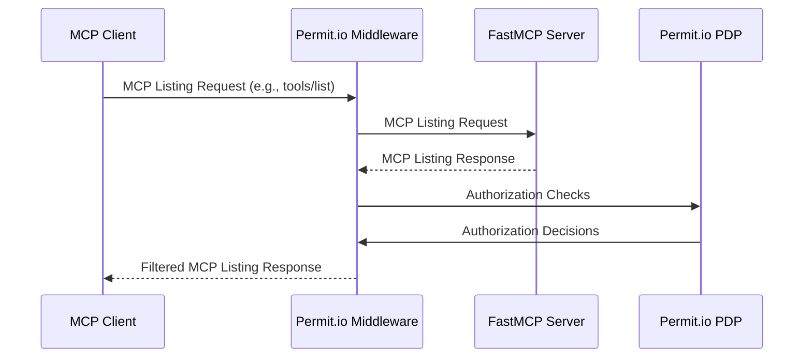
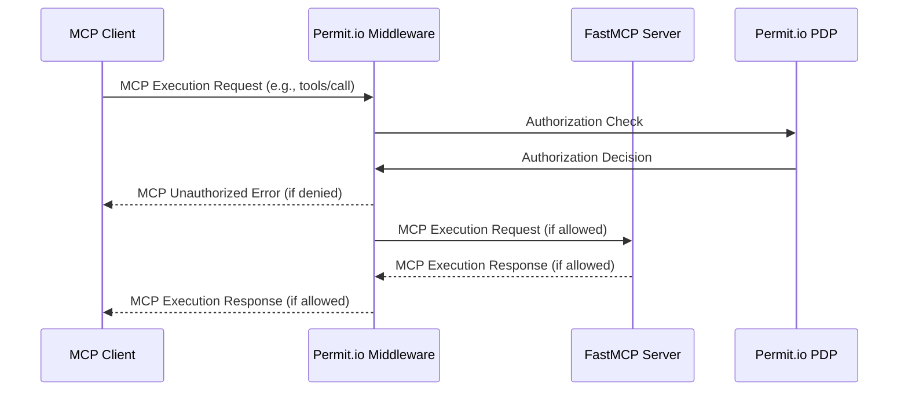

# Config, OpenAPI, and Auth Provider Guides II

Source lines: 9929-12281 from the original FastMCP documentation dump.

MCP JSON config, OCI IAM, OpenAI API integration, OpenAPI conversion, Permit.io, PropelAuth, Scalekit, Supabase, and WorkOS guides.

---

# MCP JSON Configuration 🤝 FastMCP
Source: https://gofastmcp.com/integrations/mcp-json-configuration

Generate standard MCP configuration files for any compatible client

<VersionBadge />

FastMCP can generate standard MCP JSON configuration files that work with any MCP-compatible client including Claude Desktop, VS Code, Cursor, and other applications that support the Model Context Protocol.

## MCP JSON Configuration Standard

The MCP JSON configuration format is an **emergent standard** that has developed across the MCP ecosystem. This format defines how MCP clients should configure and launch MCP servers, providing a consistent way to specify server commands, arguments, and environment variables.

### Configuration Structure

The standard uses a `mcpServers` object where each key represents a server name and the value contains the server's configuration:

```json theme={"theme":{"light":"snazzy-light","dark":"dark-plus"}}
{
  "mcpServers": {
    "server-name": {
      "command": "executable",
      "args": ["arg1", "arg2"],
      "env": {
        "VAR": "value"
      }
    }
  }
}
```

### Server Configuration Fields

#### `command` (required)

The executable command to run the MCP server. This should be an absolute path or a command available in the system PATH.

```json theme={"theme":{"light":"snazzy-light","dark":"dark-plus"}}
{
  "command": "python"
}
```

#### `args` (optional)

An array of command-line arguments passed to the server executable. Arguments are passed in order.

```json theme={"theme":{"light":"snazzy-light","dark":"dark-plus"}}
{
  "args": ["server.py", "--verbose", "--port", "8080"]
}
```

#### `env` (optional)

An object containing environment variables to set when launching the server. All values must be strings.

```json theme={"theme":{"light":"snazzy-light","dark":"dark-plus"}}
{
  "env": {
    "API_KEY": "secret-key",
    "DEBUG": "true",
    "PORT": "8080"
  }
}
```

### Client Adoption

This format is widely adopted across the MCP ecosystem:

* **Claude Desktop**: Uses `~/.claude/claude_desktop_config.json`
* **Cursor**: Uses `~/.cursor/mcp.json`
* **VS Code**: Uses workspace `.vscode/mcp.json`
* **Other clients**: Many MCP-compatible applications follow this standard

## Overview

<Note>
  **For the best experience, use FastMCP's first-class integrations:** [`fastmcp install claude-code`](/integrations/claude-code), [`fastmcp install claude-desktop`](/integrations/claude-desktop), or [`fastmcp install cursor`](/integrations/cursor). Use MCP JSON generation for advanced use cases and unsupported clients.
</Note>

The `fastmcp install mcp-json` command generates configuration in the standard `mcpServers` format used across the MCP ecosystem. This is useful when:

* **Working with unsupported clients** - Any MCP client not directly integrated with FastMCP
* **CI/CD environments** - Automated configuration generation for deployments
* **Configuration sharing** - Easy distribution of server setups to team members
* **Custom tooling** - Integration with your own MCP management tools
* **Manual setup** - When you prefer to manually configure your MCP client

## Basic Usage

Generate configuration and output to stdout (useful for piping):

```bash theme={"theme":{"light":"snazzy-light","dark":"dark-plus"}}
fastmcp install mcp-json server.py
```

This outputs the server configuration JSON with the server name as the root key:

```json theme={"theme":{"light":"snazzy-light","dark":"dark-plus"}}
{
  "My Server": {
    "command": "uv",
    "args": [
      "run",
      "--with",
      "fastmcp", 
      "fastmcp",
      "run",
      "/absolute/path/to/server.py"
    ]
  }
}
```

To use this in a client configuration file, add it to the `mcpServers` object in your client's configuration:

```json theme={"theme":{"light":"snazzy-light","dark":"dark-plus"}}
{
  "mcpServers": {
    "My Server": {
      "command": "uv",
      "args": [
        "run",
        "--with",
        "fastmcp", 
        "fastmcp",
        "run",
        "/absolute/path/to/server.py"
      ]
    }
  }
}
```

<Note>
  When using `--python`, `--project`, or `--with-requirements`, the generated configuration will include these options in the `uv run` command, ensuring your server runs with the correct Python version and dependencies.
</Note>

<Note>
  Different MCP clients may have specific configuration requirements or formatting needs. Always consult your client's documentation to ensure proper integration.
</Note>

## Configuration Options

### Server Naming

```bash theme={"theme":{"light":"snazzy-light","dark":"dark-plus"}}
# Use server's built-in name (from FastMCP constructor)
fastmcp install mcp-json server.py

# Override with custom name
fastmcp install mcp-json server.py --name "Custom Server Name"
```

### Dependencies

Add Python packages your server needs:

```bash theme={"theme":{"light":"snazzy-light","dark":"dark-plus"}}
# Single package
fastmcp install mcp-json server.py --with pandas

# Multiple packages  
fastmcp install mcp-json server.py --with pandas --with requests --with httpx

# Editable local package
fastmcp install mcp-json server.py --with-editable ./my-package

# From requirements file
fastmcp install mcp-json server.py --with-requirements requirements.txt
```

You can also use a `fastmcp.json` configuration file (recommended):

```json fastmcp.json theme={"theme":{"light":"snazzy-light","dark":"dark-plus"}}
{
  "$schema": "https://gofastmcp.com/public/schemas/fastmcp.json/v1.json",
  "source": {
    "path": "server.py",
    "entrypoint": "mcp"
  },
  "environment": {
    "dependencies": ["pandas", "matplotlib", "seaborn"]
  }
}
```

Then simply install with:

```bash theme={"theme":{"light":"snazzy-light","dark":"dark-plus"}}
fastmcp install mcp-json fastmcp.json
```

### Environment Variables

```bash theme={"theme":{"light":"snazzy-light","dark":"dark-plus"}}
# Individual environment variables
fastmcp install mcp-json server.py \
  --env API_KEY=your-secret-key \
  --env DEBUG=true

# Load from .env file
fastmcp install mcp-json server.py --env-file .env
```

### Python Version and Project Directory

Specify Python version or run within a specific project:

```bash theme={"theme":{"light":"snazzy-light","dark":"dark-plus"}}
# Use specific Python version
fastmcp install mcp-json server.py --python 3.11

# Run within a project directory
fastmcp install mcp-json server.py --project /path/to/project
```

### Server Object Selection

Use the same `file.py:object` notation as other FastMCP commands:

```bash theme={"theme":{"light":"snazzy-light","dark":"dark-plus"}}
# Auto-detects server object (looks for 'mcp', 'server', or 'app')
fastmcp install mcp-json server.py

# Explicit server object
fastmcp install mcp-json server.py:my_custom_server
```

## Clipboard Integration

Copy configuration directly to your clipboard for easy pasting:

```bash theme={"theme":{"light":"snazzy-light","dark":"dark-plus"}}
fastmcp install mcp-json server.py --copy
```

<Note>
  The `--copy` flag requires the `pyperclip` Python package. If not installed, you'll see an error message with installation instructions.
</Note>

## Usage Examples

### Basic Server

```bash theme={"theme":{"light":"snazzy-light","dark":"dark-plus"}}
fastmcp install mcp-json dice_server.py
```

Output:

```json theme={"theme":{"light":"snazzy-light","dark":"dark-plus"}}
{
  "Dice Server": {
    "command": "uv",
    "args": [
      "run",
      "--with",
      "fastmcp",
      "fastmcp", 
      "run",
      "/home/user/dice_server.py"
    ]
  }
}
```

### Production Server with Dependencies

```bash theme={"theme":{"light":"snazzy-light","dark":"dark-plus"}}
fastmcp install mcp-json api_server.py \
  --name "Production API Server" \
  --with requests \
  --with python-dotenv \
  --env API_BASE_URL=https://api.example.com \
  --env TIMEOUT=30
```

### Advanced Configuration

```bash theme={"theme":{"light":"snazzy-light","dark":"dark-plus"}}
fastmcp install mcp-json ml_server.py \
  --name "ML Analysis Server" \
  --python 3.11 \
  --with-requirements requirements.txt \
  --project /home/user/ml-project \
  --env GPU_DEVICE=0
```

Output:

```json theme={"theme":{"light":"snazzy-light","dark":"dark-plus"}}
{
  "Production API Server": {
    "command": "uv",
    "args": [
      "run",
      "--with",
      "fastmcp",
      "--with",
      "python-dotenv", 
      "--with",
      "requests",
      "fastmcp",
      "run", 
      "/home/user/api_server.py"
    ],
    "env": {
      "API_BASE_URL": "https://api.example.com",
      "TIMEOUT": "30"
    }
  }
}
```

The advanced configuration example generates:

```json theme={"theme":{"light":"snazzy-light","dark":"dark-plus"}}
{
  "ML Analysis Server": {
    "command": "uv",
    "args": [
      "run",
      "--python",
      "3.11",
      "--project",
      "/home/user/ml-project",
      "--with",
      "fastmcp",
      "--with-requirements",
      "requirements.txt",
      "fastmcp",
      "run",
      "/home/user/ml_server.py"
    ],
    "env": {
      "GPU_DEVICE": "0"
    }
  }
}
```

### Pipeline Usage

Save configuration to file:

```bash theme={"theme":{"light":"snazzy-light","dark":"dark-plus"}}
fastmcp install mcp-json server.py > mcp-config.json
```

Use in shell scripts:

```bash theme={"theme":{"light":"snazzy-light","dark":"dark-plus"}}
#!/bin/bash
CONFIG=$(fastmcp install mcp-json server.py --name "CI Server")
echo "$CONFIG" | jq '."CI Server".command'
# Output: "uv"
```

## Integration with MCP Clients

The generated configuration works with any MCP-compatible application:

### Claude Desktop

<Note>
  **Prefer [`fastmcp install claude-desktop`](/integrations/claude-desktop)** for automatic installation. Use MCP JSON for advanced configuration needs.
</Note>

Copy the `mcpServers` object into `~/.claude/claude_desktop_config.json`

### Cursor

<Note>
  **Prefer [`fastmcp install cursor`](/integrations/cursor)** for automatic installation. Use MCP JSON for advanced configuration needs.
</Note>

Add to `~/.cursor/mcp.json`

### VS Code

Add to your workspace's `.vscode/mcp.json` file

### Custom Applications

Use the JSON configuration with any application that supports the MCP protocol

## Configuration Format

The generated configuration outputs a server object with the server name as the root key:

```json theme={"theme":{"light":"snazzy-light","dark":"dark-plus"}}
{
  "<server-name>": {
    "command": "<executable>",
    "args": ["<arg1>", "<arg2>", "..."],
    "env": {
      "<ENV_VAR>": "<value>"
    }
  }
}
```

To use this in an MCP client, add it to the client's `mcpServers` configuration object.

**Fields:**

* `command`: The executable to run (always `uv` for FastMCP servers)
* `args`: Command-line arguments including dependencies and server path
* `env`: Environment variables (only included if specified)

<Warning>
  **All file paths in the generated configuration are absolute paths**. This ensures the configuration works regardless of the working directory when the MCP client starts the server.
</Warning>

## Requirements

* **uv**: Must be installed and available in your system PATH
* **pyperclip** (optional): Required only for `--copy` functionality

Install uv if not already available:

```bash theme={"theme":{"light":"snazzy-light","dark":"dark-plus"}}
# macOS
brew install uv

# Linux/Windows  
curl -LsSf https://astral.sh/uv/install.sh | sh
```


# OCI IAM OAuth 🤝 FastMCP
Source: https://gofastmcp.com/integrations/oci

Secure your FastMCP server with OCI IAM OAuth

<VersionBadge />

This guide shows you how to secure your FastMCP server using **OCI IAM OAuth**. Since OCI IAM doesn't support Dynamic Client Registration, this integration uses the [**OIDC Proxy**](/servers/auth/oidc-proxy) pattern to bridge OCI's traditional OAuth with MCP's authentication requirements.

## Configuration

### Prerequisites

1. An OCI cloud Account with access to create an Integrated Application in an Identity Domain.
2. Your FastMCP server's URL (For dev environments, it is [http://localhost:8000](http://localhost:8000). For PROD environments, it could be [https://mcp.yourdomain.com](https://mcp.yourdomain.com))

### Step 1: Make sure client access is enabled for JWK's URL

<Steps>
  <Step title="Navigate to OCI IAM Domain Settings">
    Login to OCI console ([https://cloud.oracle.com](https://cloud.oracle.com) for OCI commercial cloud).
    From "Identity & Security" menu, open Domains page.
    On the Domains list page, select the domain that you are using for MCP Authentication.
    Open Settings tab.
    Click on "Edit Domain Settings" button.

    <Frame>
      
    </Frame>
  </Step>

  <Step title="Update Domain Setting">
    Enable "Configure client access" checkbox as shown in the screenshot.

    <Frame>
      
    </Frame>
  </Step>
</Steps>

### Step 2: Create OAuth client for MCP server authentication

Follow the Steps as mentioned below to create an OAuth client.

<Steps>
  <Step title="Navigate to OCI IAM Integrated Applications">
    Login to OCI console ([https://cloud.oracle.com](https://cloud.oracle.com) for OCI commercial cloud).
    From "Identity & Security" menu, open Domains page.
    On the Domains list page, select the domain in which you want to create MCP server OAuth client. If you need help finding the list page for the domain, see [Listing Identity Domains.](https://docs.oracle.com/en-us/iaas/Content/Identity/domains/to-view-identity-domains.htm#view-identity-domains).
    On the details page, select Integrated applications. A list of applications in the domain is displayed.
  </Step>

  <Step title="Add an Integrated Application">
    Select Add application.
    In the Add application window, select Confidential Application.
    Select Launch workflow.
    In the Add application details page, Enter name and description as shown below.

    <Frame>
      
    </Frame>
  </Step>

  <Step title="Update OAuth Configuration for an Integrated Application">
    Once the Integrated Application is created, Click on "OAuth configuration" tab.
    Click on "Edit OAuth configuration" button.
    Configure the application as OAuth client by selecting "Configure this application as a client now" radio button.
    Select "Authorization code" grant type. If you are planning to use the same OAuth client application for token exchange, select "Client credentials" grant type as well. In the sample, we will use the same client.
    For Authorization grant type, select redirect URL. In most cases, this will be the MCP server URL followed by "/oauth/callback".

    <Frame>
      
    </Frame>
  </Step>

  <Step title="Activate the Integrated Application">
    Click on "Submit" button to update OAuth configuration for the client application.
    **Note: You don't need to do any special configuration to support PKCE for the OAuth client.**
    Make sure to Activate the client application.
    Note down client ID and client secret for the application. You'll use these values when configuring the OCIProvider in your code.
  </Step>
</Steps>

This is all you need to implement MCP server authentication against OCI IAM. However, you may want to use an authenticated user token to invoke OCI control plane APIs and propagate identity to the OCI control plane instead of using a service user account. In that case, you need to implement token exchange.

### Step 3: Token Exchange Setup (Only if MCP server needs to talk to OCI Control Plane)

Token exchange helps you exchange a logged-in user's OCI IAM token for an OCI control plane session token, also known as UPST (User Principal Session Token). To learn more about token exchange, refer to my [Workload Identity Federation Blog](https://www.ateam-oracle.com/post/workload-identity-federation)

For token exchange, we need to configure Identity propagation trust. The blog above discusses setting up the trust using REST APIs. However, you can also use OCI CLI. Before using the CLI command below, ensure that you have created a token exchange OAuth client. In most cases, you can use the same OAuth client that you created above. Replace `<IAM_GUID>` and `<CLIENT_ID>` in the CLI command below with your actual values.

```bash theme={"theme":{"light":"snazzy-light","dark":"dark-plus"}}
oci identity-domains identity-propagation-trust create \
--schemas '["urn:ietf:params:scim:schemas:oracle:idcs:IdentityPropagationTrust"]' \
--public-key-endpoint "https://<IAM_GUID>.identity.oraclecloud.com/admin/v1/SigningCert/jwk" \
--name "For Token Exchange" --type "JWT" \
--issuer "https://identity.oraclecloud.com/" --active true \
--endpoint "https://<IAM_GUID>.identity.oraclecloud.com" \
--subject-claim-name "sub" --allow-impersonation false \
--subject-mapping-attribute "username" \
--subject-type "User" --client-claim-name "iss" \
--client-claim-values '["https://identity.oraclecloud.com/"]' \
--oauth-clients '["<CLIENT_ID>"]'
```

To exchange access token for OCI token and create a signer object, you need to add below code in MCP server. You can then use the signer object to create any OCI control plane client.

```python theme={"theme":{"light":"snazzy-light","dark":"dark-plus"}}

from fastmcp.server.dependencies import get_access_token
from fastmcp.utilities.logging import get_logger
from oci.auth.signers import TokenExchangeSigner
import os

logger = get_logger(__name__)

# Load configuration from environment
OCI_IAM_GUID = os.environ.get("OCI_IAM_GUID")
OCI_CLIENT_ID = os.environ.get("OCI_CLIENT_ID")
OCI_CLIENT_SECRET = os.environ.get("OCI_CLIENT_SECRET")

_global_token_cache = {} #In memory cache for OCI session token signer
    
def get_oci_signer() -> TokenExchangeSigner:

    authntoken = get_access_token()
    tokenID = authntoken.claims.get("jti")
    token = authntoken.token
    
    #Check if the signer exists for the token ID in memory cache
    cached_signer = _global_token_cache.get(tokenID)
    logger.debug(f"Global cached signer: {cached_signer}")
    if cached_signer:
        logger.debug(f"Using globally cached signer for token ID: {tokenID}")
        return cached_signer

    #If the signer is not yet created for the token then create new OCI signer object
    logger.debug(f"Creating new signer for token ID: {tokenID}")
    signer = TokenExchangeSigner(
        jwt_or_func=token,
        oci_domain_id=OCI_IAM_GUID.split(".")[0] if OCI_IAM_GUID else "",
        client_id=OCI_CLIENT_ID,
        client_secret=OCI_CLIENT_SECRET,
    )
    logger.debug(f"Signer {signer} created for token ID: {tokenID}")
        
    #Cache the signer object in memory cache
    _global_token_cache[tokenID] = signer
    logger.debug(f"Signer cached for token ID: {tokenID}")

    return signer
```

## Running MCP server

Once the setup is complete, to run the MCP server, run the below command.

```bash theme={"theme":{"light":"snazzy-light","dark":"dark-plus"}}
fastmcp run server.py:mcp --transport http --port 8000
```

To run MCP client, run the below command.

```bash theme={"theme":{"light":"snazzy-light","dark":"dark-plus"}}
python3 client.py
```

MCP Client sample is as below.

```python client.py theme={"theme":{"light":"snazzy-light","dark":"dark-plus"}}
from fastmcp import Client
import asyncio

async def main():
    # The client will automatically handle OCI OAuth flows
    async with Client("http://localhost:8000/mcp/", auth="oauth") as client:
        # First-time connection will open OCI login in your browser
        print("✓ Authenticated with OCI IAM")

        tools = await client.list_tools()
        print(f"🔧 Available tools ({len(tools)}):")
        for tool in tools:
            print(f"   - {tool.name}: {tool.description}")

if __name__ == "__main__":
    asyncio.run(main())
```

When you run the client for the first time:

1. Your browser will open to OCI IAM's login page
2. Sign in with your OCI account and grant the requested consent
3. After authorization, you'll be redirected back to the redirect path
4. The client receives the token and can make authenticated requests

## Production Configuration

<VersionBadge />

For production deployments with persistent token management across server restarts, configure `jwt_signing_key`, and `client_storage`:

```python server.py theme={"theme":{"light":"snazzy-light","dark":"dark-plus"}}

import os
from fastmcp import FastMCP
from fastmcp.server.auth.providers.oci import OCIProvider

from key_value.aio.stores.redis import RedisStore
from key_value.aio.wrappers.encryption import FernetEncryptionWrapper
from cryptography.fernet import Fernet

# Load configuration from environment
# Production setup with encrypted persistent token storage
auth_provider = OCIProvider(
    config_url=os.environ.get("OCI_CONFIG_URL"),
    client_id=os.environ.get("OCI_CLIENT_ID"),
    client_secret=os.environ.get("OCI_CLIENT_SECRET"),
    base_url=os.environ.get("BASE_URL", "https://your-production-domain.com"),

    # Production token management
    jwt_signing_key=os.environ["JWT_SIGNING_KEY"],
    client_storage=FernetEncryptionWrapper(
        key_value=RedisStore(
            host=os.environ["REDIS_HOST"],
            port=int(os.environ["REDIS_PORT"])
        ),
        fernet=Fernet(os.environ["STORAGE_ENCRYPTION_KEY"])
    )
)

mcp = FastMCP(name="Production OCI App", auth=auth_provider)
```

<Note>
  Parameters (`jwt_signing_key` and `client_storage`) work together to ensure tokens and client registrations survive server restarts. **Wrap your storage in `FernetEncryptionWrapper` to encrypt sensitive OAuth tokens at Rest** - without it, tokens are stored in plaintext. Store secrets in environment variables and use a persistent storage backend like Redis for distributed deployments.

  For complete details on these parameters, see the [OAuth Proxy documentation](/servers/auth/oauth-proxy#configuration-parameters).
</Note>

<Info>
  The client caches tokens locally, so you won't need to re-authenticate for subsequent runs unless the token expires or you explicitly clear the cache.
</Info>


# OpenAI API 🤝 FastMCP
Source: https://gofastmcp.com/integrations/openai

Connect FastMCP servers to the OpenAI API

## Responses API

OpenAI's [Responses API](https://platform.openai.com/docs/api-reference/responses) supports [MCP servers](https://platform.openai.com/docs/guides/tools-remote-mcp) as remote tool sources, allowing you to extend AI capabilities with custom functions.

<Note>
  The Responses API is a distinct API from OpenAI's Completions API or Assistants API. At this time, only the Responses API supports MCP.
</Note>

<Tip>
  Currently, the Responses API only accesses **tools** from MCP servers—it queries the `list_tools` endpoint and exposes those functions to the AI agent. Other MCP features like resources and prompts are not currently supported.
</Tip>

### Create a Server

First, create a FastMCP server with the tools you want to expose. For this example, we'll create a server with a single tool that rolls dice.

```python server.py theme={"theme":{"light":"snazzy-light","dark":"dark-plus"}}
import random
from fastmcp import FastMCP

mcp = FastMCP(name="Dice Roller")

@mcp.tool
def roll_dice(n_dice: int) -> list[int]:
    """Roll `n_dice` 6-sided dice and return the results."""
    return [random.randint(1, 6) for _ in range(n_dice)]

if __name__ == "__main__":
    mcp.run(transport="http", port=8000)
```

### Deploy the Server

Your server must be deployed to a public URL in order for OpenAI to access it.

For development, you can use tools like `ngrok` to temporarily expose a locally-running server to the internet. We'll do that for this example (you may need to install `ngrok` and create a free account), but you can use any other method to deploy your server.

Assuming you saved the above code as `server.py`, you can run the following two commands in two separate terminals to deploy your server and expose it to the internet:

<CodeGroup>
  ```bash FastMCP server theme={"theme":{"light":"snazzy-light","dark":"dark-plus"}}
  python server.py
  ```

  ```bash ngrok theme={"theme":{"light":"snazzy-light","dark":"dark-plus"}}
  ngrok http 8000
  ```
</CodeGroup>

<Warning>
  This exposes your unauthenticated server to the internet. Only run this command in a safe environment if you understand the risks.
</Warning>

### Call the Server

To use the Responses API, you'll need to install the OpenAI Python SDK (not included with FastMCP):

```bash theme={"theme":{"light":"snazzy-light","dark":"dark-plus"}}
pip install openai
```

You'll also need to authenticate with OpenAI. You can do this by setting the `OPENAI_API_KEY` environment variable. Consult the OpenAI SDK documentation for more information.

```bash theme={"theme":{"light":"snazzy-light","dark":"dark-plus"}}
export OPENAI_API_KEY="your-api-key"
```

Here is an example of how to call your server from Python. Note that you'll need to replace `https://your-server-url.com` with the actual URL of your server. In addition, we use `/mcp/` as the endpoint because we deployed a streamable-HTTP server with the default path; you may need to use a different endpoint if you customized your server's deployment.

```python {4, 11-16} theme={"theme":{"light":"snazzy-light","dark":"dark-plus"}}
from openai import OpenAI

# Your server URL (replace with your actual URL)
url = 'https://your-server-url.com'

client = OpenAI()

resp = client.responses.create(
    model="gpt-4.1",
    tools=[
        {
            "type": "mcp",
            "server_label": "dice_server",
            "server_url": f"{url}/mcp/",
            "require_approval": "never",
        },
    ],
    input="Roll a few dice!",
)

print(resp.output_text)
```

If you run this code, you'll see something like the following output:

```text theme={"theme":{"light":"snazzy-light","dark":"dark-plus"}}
You rolled 3 dice and got the following results: 6, 4, and 2!
```

### Authentication

<VersionBadge />

The Responses API can include headers to authenticate the request, which means you don't have to worry about your server being publicly accessible.

#### Server Authentication

The simplest way to add authentication to the server is to use a bearer token scheme.

For this example, we'll quickly generate our own tokens with FastMCP's `RSAKeyPair` utility, but this may not be appropriate for production use. For more details, see the complete server-side [Token Verification](/servers/auth/token-verification) documentation.

We'll start by creating an RSA key pair to sign and verify tokens.

```python theme={"theme":{"light":"snazzy-light","dark":"dark-plus"}}
from fastmcp.server.auth.providers.jwt import RSAKeyPair

key_pair = RSAKeyPair.generate()
access_token = key_pair.create_token(audience="dice-server")
```

<Warning>
  FastMCP's `RSAKeyPair` utility is for development and testing only.
</Warning>

Next, we'll create a `JWTVerifier` to authenticate the server.

```python theme={"theme":{"light":"snazzy-light","dark":"dark-plus"}}
from fastmcp import FastMCP
from fastmcp.server.auth import JWTVerifier

auth = JWTVerifier(
    public_key=key_pair.public_key,
    audience="dice-server",
)

mcp = FastMCP(name="Dice Roller", auth=auth)
```

Here is a complete example that you can copy/paste. For simplicity and the purposes of this example only, it will print the token to the console. **Do NOT do this in production!**

```python server.py [expandable] theme={"theme":{"light":"snazzy-light","dark":"dark-plus"}}
from fastmcp import FastMCP
from fastmcp.server.auth import JWTVerifier
from fastmcp.server.auth.providers.jwt import RSAKeyPair
import random

key_pair = RSAKeyPair.generate()
access_token = key_pair.create_token(audience="dice-server")

auth = JWTVerifier(
    public_key=key_pair.public_key,
    audience="dice-server",
)

mcp = FastMCP(name="Dice Roller", auth=auth)

@mcp.tool
def roll_dice(n_dice: int) -> list[int]:
    """Roll `n_dice` 6-sided dice and return the results."""
    return [random.randint(1, 6) for _ in range(n_dice)]

if __name__ == "__main__":
    print(f"\n---\n\n🔑 Dice Roller access token:\n\n{access_token}\n\n---\n")
    mcp.run(transport="http", port=8000)
```

#### Client Authentication

If you try to call the authenticated server with the same OpenAI code we wrote earlier, you'll get an error like this:

```python theme={"theme":{"light":"snazzy-light","dark":"dark-plus"}}
pythonAPIStatusError: Error code: 424 - {
    "error": {
        "message": "Error retrieving tool list from MCP server: 'dice_server'. Http status code: 401 (Unauthorized)",
        "type": "external_connector_error",
        "param": "tools",
        "code": "http_error"
    }
}
```

As expected, the server is rejecting the request because it's not authenticated.

To authenticate the client, you can pass the token in the `Authorization` header with the `Bearer` scheme:

```python {4, 7, 19-21} [expandable] theme={"theme":{"light":"snazzy-light","dark":"dark-plus"}}
from openai import OpenAI

# Your server URL (replace with your actual URL)
url = 'https://your-server-url.com'

# Your access token (replace with your actual token)
access_token = 'your-access-token'

client = OpenAI()

resp = client.responses.create(
    model="gpt-4.1",
    tools=[
        {
            "type": "mcp",
            "server_label": "dice_server",
            "server_url": f"{url}/mcp/",
            "require_approval": "never",
            "headers": {
                "Authorization": f"Bearer {access_token}"
            }
        },
    ],
    input="Roll a few dice!",
)

print(resp.output_text)
```

You should now see the dice roll results in the output.


# OpenAPI 🤝 FastMCP
Source: https://gofastmcp.com/integrations/openapi

Generate MCP servers from any OpenAPI specification

<VersionBadge />

FastMCP can automatically generate an MCP server from any OpenAPI specification, allowing AI models to interact with existing APIs through the MCP protocol. Instead of manually creating tools and resources, you provide an OpenAPI spec and FastMCP intelligently converts API endpoints into the appropriate MCP components.

<Note>
  Under the hood, OpenAPI integration uses OpenAPIProvider (v3.0.0+) to source tools from the specification. See [Providers](/servers/providers/overview) to understand how FastMCP sources components.
</Note>

<Tip>
  Generating MCP servers from OpenAPI is a great way to get started with FastMCP, but in practice LLMs achieve **significantly better performance** with well-designed and curated MCP servers than with auto-converted OpenAPI servers. This is especially true for complex APIs with many endpoints and parameters.

  We recommend using the FastAPI integration for bootstrapping and prototyping, not for mirroring your API to LLM clients. See the post [Stop Converting Your REST APIs to MCP](https://www.jlowin.dev/blog/stop-converting-rest-apis-to-mcp) for more details.
</Tip>

## Create a Server

To convert an OpenAPI specification to an MCP server, use the `FastMCP.from_openapi()` class method:

```python server.py theme={"theme":{"light":"snazzy-light","dark":"dark-plus"}}
import httpx
from fastmcp import FastMCP

# Create an HTTP client for your API
client = httpx.AsyncClient(base_url="https://api.example.com")

# Load your OpenAPI spec 
openapi_spec = httpx.get("https://api.example.com/openapi.json").json()

# Create the MCP server
mcp = FastMCP.from_openapi(
    openapi_spec=openapi_spec,
    client=client,
    name="My API Server"
)

if __name__ == "__main__":
    mcp.run()
```

### Authentication

If your API requires authentication, configure it on the HTTP client:

```python theme={"theme":{"light":"snazzy-light","dark":"dark-plus"}}
import httpx
from fastmcp import FastMCP

# Bearer token authentication
api_client = httpx.AsyncClient(
    base_url="https://api.example.com",
    headers={"Authorization": "Bearer YOUR_TOKEN"}
)

# Create MCP server with authenticated client
mcp = FastMCP.from_openapi(
    openapi_spec=spec, 
    client=api_client,
    timeout=30.0  # 30 second timeout for all requests
)
```

## Route Mapping

By default, FastMCP converts **every endpoint** in your OpenAPI specification into an MCP **Tool**. This provides a simple, predictable starting point that ensures all your API's functionality is immediately available to the vast majority of LLM clients which only support MCP tools.

While this is a pragmatic default for maximum compatibility, you can easily customize this behavior. Internally, FastMCP uses an ordered list of `RouteMap` objects to determine how to map OpenAPI routes to various MCP component types.

Each `RouteMap` specifies a combination of methods, patterns, and tags, as well as a corresponding MCP component type. Each OpenAPI route is checked against each `RouteMap` in order, and the first one that matches every criteria is used to determine its converted MCP type. A special type, `EXCLUDE`, can be used to exclude routes from the MCP server entirely.

* **Methods**: HTTP methods to match (e.g. `["GET", "POST"]` or `"*"` for all)
* **Pattern**: Regex pattern to match the route path (e.g. `r"^/users/.*"` or `r".*"` for all)
* **Tags**: A set of OpenAPI tags that must all be present. An empty set (`{}`) means no tag filtering, so the route matches regardless of its tags.
* **MCP type**: What MCP component type to create (`TOOL`, `RESOURCE`, `RESOURCE_TEMPLATE`, or `EXCLUDE`)
* **MCP tags**: A set of custom tags to add to components created from matching routes

Here is FastMCP's default rule:

```python theme={"theme":{"light":"snazzy-light","dark":"dark-plus"}}
from fastmcp.server.openapi import RouteMap, MCPType

DEFAULT_ROUTE_MAPPINGS = [
    # All routes become tools
    RouteMap(mcp_type=MCPType.TOOL),
]
```

### Custom Route Maps

When creating your FastMCP server, you can customize routing behavior by providing your own list of `RouteMap` objects. Your custom maps are processed before the default route maps, and routes will be assigned to the first matching custom map.

For example, prior to FastMCP 2.8.0, GET requests were automatically mapped to `Resource` and `ResourceTemplate` components based on whether they had path parameters. (This was changed solely for client compatibility reasons.) You can restore this behavior by providing custom route maps:

```python theme={"theme":{"light":"snazzy-light","dark":"dark-plus"}}
from fastmcp import FastMCP
from fastmcp.server.openapi import RouteMap, MCPType

# Restore pre-2.8.0 semantic mapping
semantic_maps = [
    # GET requests with path parameters become ResourceTemplates
    RouteMap(methods=["GET"], pattern=r".*\{.*\}.*", mcp_type=MCPType.RESOURCE_TEMPLATE),
    # All other GET requests become Resources
    RouteMap(methods=["GET"], pattern=r".*", mcp_type=MCPType.RESOURCE),
]

mcp = FastMCP.from_openapi(
    openapi_spec=spec,
    client=client,
    route_maps=semantic_maps,
)
```

With these maps, `GET` requests are handled semantically, and all other methods (`POST`, `PUT`, etc.) will fall through to the default rule and become `Tool`s.

Here is a more complete example that uses custom route maps to convert all `GET` endpoints under `/analytics/` to tools while excluding all admin endpoints and all routes tagged "internal". All other routes will be handled by the default rules:

```python theme={"theme":{"light":"snazzy-light","dark":"dark-plus"}}
from fastmcp import FastMCP
from fastmcp.server.openapi import RouteMap, MCPType

mcp = FastMCP.from_openapi(
    openapi_spec=spec,
    client=client,
    route_maps=[
        # Analytics `GET` endpoints are tools
        RouteMap(
            methods=["GET"], 
            pattern=r"^/analytics/.*", 
            mcp_type=MCPType.TOOL,
        ),

        # Exclude all admin endpoints
        RouteMap(
            pattern=r"^/admin/.*", 
            mcp_type=MCPType.EXCLUDE,
        ),

        # Exclude all routes tagged "internal"
        RouteMap(
            tags={"internal"},
            mcp_type=MCPType.EXCLUDE,
        ),
    ],
)
```

<Tip>
  The default route maps are always applied after your custom maps, so you do not have to create route maps for every possible route.
</Tip>

### Excluding Routes

To exclude routes from the MCP server, use a route map to assign them to `MCPType.EXCLUDE`.

You can use this to remove sensitive or internal routes by targeting them specifically:

```python theme={"theme":{"light":"snazzy-light","dark":"dark-plus"}}
from fastmcp import FastMCP
from fastmcp.server.openapi import RouteMap, MCPType

mcp = FastMCP.from_openapi(
    openapi_spec=spec,
    client=client,
    route_maps=[
        RouteMap(pattern=r"^/admin/.*", mcp_type=MCPType.EXCLUDE),
        RouteMap(tags={"internal"}, mcp_type=MCPType.EXCLUDE),
    ],
)
```

Or you can use a catch-all rule to exclude everything that your maps don't handle explicitly:

```python theme={"theme":{"light":"snazzy-light","dark":"dark-plus"}}
from fastmcp import FastMCP
from fastmcp.server.openapi import RouteMap, MCPType

mcp = FastMCP.from_openapi(
    openapi_spec=spec,
    client=client,
    route_maps=[
        # custom mapping logic goes here
        # ... your specific route maps ...
        # exclude all remaining routes
        RouteMap(mcp_type=MCPType.EXCLUDE),
    ],
)
```

<Tip>
  Using a catch-all exclusion rule will prevent the default route mappings from being applied, since it will match every remaining route. This is useful if you want to explicitly allow-list certain routes.
</Tip>

### Advanced Route Mapping

<VersionBadge />

For advanced use cases that require more complex logic, you can provide a `route_map_fn` callable. After the route map logic is applied, this function is called on each matched route and its assigned MCP component type. It can optionally return a different component type to override the mapped assignment. If it returns `None`, the assigned type is used.

In addition to more precise targeting of methods, patterns, and tags, this function can access any additional OpenAPI metadata about the route.

<Tip>
  The `route_map_fn` is called on all routes, even those that matched `MCPType.EXCLUDE` in your custom maps. This gives you an opportunity to customize the mapping or even override an exclusion.
</Tip>

```python theme={"theme":{"light":"snazzy-light","dark":"dark-plus"}}
from fastmcp import FastMCP
from fastmcp.server.openapi import RouteMap, MCPType, HTTPRoute

def custom_route_mapper(route: HTTPRoute, mcp_type: MCPType) -> MCPType | None:
    """Advanced route type mapping."""
    # Convert all admin routes to tools regardless of HTTP method
    if "/admin/" in route.path:
        return MCPType.TOOL

    elif "internal" in route.tags:
        return MCPType.EXCLUDE
    
    # Convert user detail routes to templates even if they're POST
    elif route.path.startswith("/users/") and route.method == "POST":
        return MCPType.RESOURCE_TEMPLATE
    
    # Use defaults for all other routes
    return None

mcp = FastMCP.from_openapi(
    openapi_spec=spec,
    client=client,
    route_map_fn=custom_route_mapper,
)
```

## Customization

### Component Names

<VersionBadge />

FastMCP automatically generates names for MCP components based on the OpenAPI specification. By default, it uses the `operationId` from your OpenAPI spec, up to the first double underscore (`__`).

All component names are automatically:

* **Slugified**: Spaces and special characters are converted to underscores or removed
* **Truncated**: Limited to 56 characters maximum to ensure compatibility
* **Unique**: If multiple components have the same name, a number is automatically appended to make them unique

For more control over component names, you can provide an `mcp_names` dictionary that maps `operationId` values to your desired names. The `operationId` must be exactly as it appears in the OpenAPI spec. The provided name will always be slugified and truncated.

```python theme={"theme":{"light":"snazzy-light","dark":"dark-plus"}}
mcp = FastMCP.from_openapi(
    openapi_spec=spec,
    client=client,
    mcp_names={
        "list_users__with_pagination": "user_list",
        "create_user__admin_required": "create_user", 
        "get_user_details__admin_required": "user_detail",
    }
)
```

Any `operationId` not found in `mcp_names` will use the default strategy (operationId up to the first `__`).

### Tags

<VersionBadge />

FastMCP provides several ways to add tags to your MCP components, allowing you to categorize and organize them for better discoverability and filtering. Tags are combined from multiple sources to create the final set of tags on each component.

#### RouteMap Tags

You can add custom tags to components created from specific routes using the `mcp_tags` parameter in `RouteMap`. These tags will be applied to all components created from routes that match that particular route map.

```python theme={"theme":{"light":"snazzy-light","dark":"dark-plus"}}
from fastmcp.server.openapi import RouteMap, MCPType

mcp = FastMCP.from_openapi(
    openapi_spec=spec,
    client=client,
    route_maps=[
        # Add custom tags to all POST endpoints
        RouteMap(
            methods=["POST"],
            pattern=r".*",
            mcp_type=MCPType.TOOL,
            mcp_tags={"write-operation", "api-mutation"}
        ),
        
        # Add different tags to detail view endpoints
        RouteMap(
            methods=["GET"],
            pattern=r".*\{.*\}.*",
            mcp_type=MCPType.RESOURCE_TEMPLATE,
            mcp_tags={"detail-view", "parameterized"}
        ),
        
        # Add tags to list endpoints
        RouteMap(
            methods=["GET"],
            pattern=r".*",
            mcp_type=MCPType.RESOURCE,
            mcp_tags={"list-data", "collection"}
        ),
    ],
)
```

#### Global Tags

You can add tags to **all** components by providing a `tags` parameter when creating your MCP server. These global tags will be applied to every component created from your OpenAPI specification.

```python theme={"theme":{"light":"snazzy-light","dark":"dark-plus"}}
mcp = FastMCP.from_openapi(
    openapi_spec=spec,
    client=client,
    tags={"api-v2", "production", "external"}
)
```

#### OpenAPI Tags in Client Meta

FastMCP automatically includes OpenAPI tags from your specification in the component's metadata. These tags are available to MCP clients through the `meta.fastmcp.tags` field, allowing clients to filter and organize components based on the original OpenAPI tagging:

<CodeGroup>
  ```json {5} OpenAPI spec with tags theme={"theme":{"light":"snazzy-light","dark":"dark-plus"}}
  {
    "paths": {
      "/users": {
        "get": {
          "tags": ["users", "public"],
          "operationId": "list_users",
          "summary": "List all users"
        }
      }
    }
  }
  ```

  ```python {6-9} Access OpenAPI tags in MCP client theme={"theme":{"light":"snazzy-light","dark":"dark-plus"}}
  async with client:
      tools = await client.list_tools()
      for tool in tools:
          if tool.meta:
              # OpenAPI tags are now available in fastmcp namespace!
              fastmcp_meta = tool.meta.get('fastmcp', {})
              openapi_tags = fastmcp_meta.get('tags', [])
              if 'users' in openapi_tags:
                  print(f"Found user-related tool: {tool.name}")
  ```
</CodeGroup>

This makes it easy for clients to understand and organize API endpoints based on their original OpenAPI categorization.

### Advanced Customization

<VersionBadge />

By default, FastMCP creates MCP components using a variety of metadata from the OpenAPI spec, such as incorporating the OpenAPI description into the MCP component description.

At times you may want to modify those MCP components in a variety of ways, such as adding LLM-specific instructions or tags. For fine-grained customization, you can provide a `mcp_component_fn` when creating the MCP server. After each MCP component has been created, this function is called on it and has the opportunity to modify it in-place.

<Tip>
  Your `mcp_component_fn` is expected to modify the component in-place, not to return a new component. The result of the function is ignored.
</Tip>

```python theme={"theme":{"light":"snazzy-light","dark":"dark-plus"}}
from fastmcp.server.openapi import (
    HTTPRoute,
    OpenAPITool,
    OpenAPIResource,
    OpenAPIResourceTemplate,
)

def customize_components(
    route: HTTPRoute, 
    component: OpenAPITool | OpenAPIResource | OpenAPIResourceTemplate,
) -> None:
    # Add custom tags to all components
    component.tags.add("openapi")
    
    # Customize based on component type
    if isinstance(component, OpenAPITool):
        component.description = f"🔧 {component.description} (via API)"
    
    if isinstance(component, OpenAPIResource):
        component.description = f"📊 {component.description}"
        component.tags.add("data")

mcp = FastMCP.from_openapi(
    openapi_spec=spec,
    client=client,
    mcp_component_fn=customize_components,
)
```

## Request Parameter Handling

FastMCP intelligently handles different types of parameters in OpenAPI requests:

### Query Parameters

By default, FastMCP only includes query parameters that have non-empty values. Parameters with `None` values or empty strings are automatically filtered out.

```python theme={"theme":{"light":"snazzy-light","dark":"dark-plus"}}
# When calling this tool...
await client.call_tool("search_products", {
    "category": "electronics",  # ✅ Included
    "min_price": 100,           # ✅ Included  
    "max_price": None,          # ❌ Excluded
    "brand": "",                # ❌ Excluded
})

# The HTTP request will be: GET /products?category=electronics&min_price=100
```

### Path Parameters

Path parameters are typically required by REST APIs. FastMCP:

* Filters out `None` values
* Validates that all required path parameters are provided
* Raises clear errors for missing required parameters

```python theme={"theme":{"light":"snazzy-light","dark":"dark-plus"}}
# ✅ This works
await client.call_tool("get_user", {"user_id": 123})

# ❌ This raises: "Missing required path parameters: {'user_id'}"
await client.call_tool("get_user", {"user_id": None})
```

### Array Parameters

FastMCP handles array parameters according to OpenAPI specifications:

* **Query arrays**: Serialized based on the `explode` parameter (default: `True`)
* **Path arrays**: Serialized as comma-separated values (OpenAPI 'simple' style)

```python theme={"theme":{"light":"snazzy-light","dark":"dark-plus"}}
# Query array with explode=true (default)
# ?tags=red&tags=blue&tags=green

# Query array with explode=false  
# ?tags=red,blue,green

# Path array (always comma-separated)
# /items/red,blue,green
```

### Headers

Header parameters are automatically converted to strings and included in the HTTP request.


# Permit.io Authorization 🤝 FastMCP
Source: https://gofastmcp.com/integrations/permit

Add fine-grained authorization to your FastMCP servers with Permit.io

Add **policy-based authorization** to your FastMCP servers with one-line code addition with the **[Permit.io][permit-github] authorization middleware**.

Control which tools, resources and prompts MCP clients can view and execute on your server. Define dynamic policies using Permit.io's powerful RBAC, ABAC, and REBAC capabilities, and obtain comprehensive audit logs of all access attempts and violations.

## How it Works

Leveraging FastMCP's [Middleware][fastmcp-middleware], the Permit.io middleware intercepts all MCP requests to your server and automatically maps MCP methods to authorization checks against your Permit.io policies; covering both server methods and tool execution.

### Policy Mapping

The middleware automatically maps MCP methods to Permit.io resources and actions:

* **MCP server methods** (e.g., `tools/list`, `resources/read`):
  * **Resource**: `{server_name}_{component}` (e.g., `myserver_tools`)
  * **Action**: The method verb (e.g., `list`, `read`)
* **Tool execution** (method `tools/call`):
  * **Resource**: `{server_name}` (e.g., `myserver`)
  * **Action**: The tool name (e.g., `greet`)


*Example: In Permit.io, the 'Admin' role is granted permissions on resources and actions as mapped by the middleware. For example, 'greet', 'greet-jwt', and 'login' are actions on the 'mcp\_server' resource, and 'list' is an action on the 'mcp\_server\_tools' resource.*

> **Note:**
> Don't forget to assign the relevant role (e.g., Admin, User) to the user authenticating to your MCP server (such as the user in the JWT) in the Permit.io Directory. Without the correct role assignment, users will not have access to the resources and actions you've configured in your policies.
>
> 
>
> *Example: In Permit.io Directory, both 'client' and 'admin' users are assigned the 'Admin' role, granting them the permissions defined in your policy mapping.*

For detailed policy mapping examples and configuration, see [Detailed Policy Mapping](https://github.com/permitio/permit-fastmcp/blob/main/docs/policy-mapping.md).

### Listing Operations

The middleware behaves as a filter for listing operations (`tools/list`, `resources/list`, `prompts/list`), hiding to the client components that are not authorized by the defined policies.



### Execution Operations

The middleware behaves as an enforcement point for execution operations (`tools/call`, `resources/read`, `prompts/get`), blocking operations that are not authorized by the defined policies.



## Add Authorization to Your Server

<Note>
  Permit.io is a cloud-native authorization service. You need a Permit.io account and a running Policy Decision Point (PDP) for the middleware to function. You can run the PDP locally with Docker or use Permit.io's cloud PDP.
</Note>

### Prerequisites

1. **Permit.io Account**: Sign up at [permit.io](https://permit.io)
2. **PDP Setup**: Run the Permit.io PDP locally or use the cloud PDP (RBAC only)
3. **API Key**: Get your Permit.io API key from the dashboard

### Run the Permit.io PDP

Run the PDP locally with Docker:

```bash theme={"theme":{"light":"snazzy-light","dark":"dark-plus"}}
docker run -p 7766:7766 permitio/pdp:latest
```

Or use the cloud PDP URL: `https://cloudpdp.api.permit.io`

### Create a Server with Authorization

First, install the `permit-fastmcp` package:

```bash theme={"theme":{"light":"snazzy-light","dark":"dark-plus"}}
# Using UV (recommended)
uv add permit-fastmcp

# Using pip
pip install permit-fastmcp
```

Then create a FastMCP server and add the Permit.io middleware:

```python server.py theme={"theme":{"light":"snazzy-light","dark":"dark-plus"}}
from fastmcp import FastMCP
from permit_fastmcp.middleware.middleware import PermitMcpMiddleware

mcp = FastMCP("Secure FastMCP Server 🔒")

@mcp.tool
def greet(name: str) -> str:
    """Greet a user by name"""
    return f"Hello, {name}!"

@mcp.tool
def add(a: int, b: int) -> int:
    """Add two numbers"""
    return a + b

# Add Permit.io authorization middleware
mcp.add_middleware(PermitMcpMiddleware(
    permit_pdp_url="http://localhost:7766",
    permit_api_key="your-permit-api-key"
))

if __name__ == "__main__":
    mcp.run(transport="http")
```

### Configure Access Policies

Create your authorization policies in the Permit.io dashboard:

1. **Create Resources**: Define resources like `mcp_server` and `mcp_server_tools`
2. **Define Actions**: Add actions like `greet`, `add`, `list`, `read`
3. **Create Roles**: Define roles like `Admin`, `User`, `Guest`
4. **Assign Permissions**: Grant roles access to specific resources and actions
5. **Assign Users**: Assign roles to users in the Permit.io Directory

For step-by-step setup instructions and troubleshooting, see [Getting Started & FAQ](https://github.com/permitio/permit-fastmcp/blob/main/docs/getting-started.md).

#### Example Policy Configuration

Policies are defined in the Permit.io dashboard, but you can also use the [Permit.io Terraform provider](https://github.com/permitio/terraform-provider-permitio) to define policies in code.

```terraform theme={"theme":{"light":"snazzy-light","dark":"dark-plus"}}
# Resources
resource "permitio_resource" "mcp_server" {
  name = "mcp_server"
  key  = "mcp_server"
  
  actions = {
    "greet" = { name = "greet" }
    "add"   = { name = "add" }
  }
}

resource "permitio_resource" "mcp_server_tools" {
  name = "mcp_server_tools"
  key  = "mcp_server_tools"
  
  actions = {
    "list" = { name = "list" }
  }
}

# Roles
resource "permitio_role" "Admin" {
  key         = "Admin"
  name        = "Admin"
  permissions = [
    "mcp_server:greet",
    "mcp_server:add", 
    "mcp_server_tools:list"
  ]
}
```

You can also use the [Permit.io CLI](https://github.com/permitio/permit-cli), [API](https://api.permit.io/scalar) or [SDKs](https://github.com/permitio/permit-python) to manage policies, as well as writing policies directly in REGO (Open Policy Agent's policy language).

For complete policy examples including ABAC and RBAC configurations, see [Example Policies](https://github.com/permitio/permit-fastmcp/tree/main/docs/example_policies).

### Identity Management

The middleware supports multiple identity extraction modes:

* **Fixed Identity**: Use a fixed identity for all requests
* **Header-based**: Extract identity from HTTP headers
* **JWT-based**: Extract and verify JWT tokens
* **Source-based**: Use the MCP context source field

For detailed identity mode configuration and environment variables, see [Identity Modes & Environment Variables](https://github.com/permitio/permit-fastmcp/blob/main/docs/identity-modes.md).

#### JWT Authentication Example

```python theme={"theme":{"light":"snazzy-light","dark":"dark-plus"}}
import os

# Configure JWT identity extraction
os.environ["PERMIT_MCP_IDENTITY_MODE"] = "jwt"
os.environ["PERMIT_MCP_IDENTITY_JWT_SECRET"] = "your-jwt-secret"

mcp.add_middleware(PermitMcpMiddleware(
    permit_pdp_url="http://localhost:7766",
    permit_api_key="your-permit-api-key"
))
```

### ABAC Policies with Tool Arguments

The middleware supports Attribute-Based Access Control (ABAC) policies that can evaluate tool arguments as attributes. Tool arguments are automatically flattened as individual attributes (e.g., `arg_name`, `arg_number`) for granular policy conditions.


*Example: Create dynamic resources with conditions like `resource.arg_number greater-than 10` to allow the `conditional-greet` tool only when the number argument exceeds 10.*

#### Example: Conditional Access

Create a dynamic resource with conditions like `resource.arg_number greater-than 10` to allow the `conditional-greet` tool only when the number argument exceeds 10.

```python theme={"theme":{"light":"snazzy-light","dark":"dark-plus"}}
@mcp.tool
def conditional_greet(name: str, number: int) -> str:
    """Greet a user only if number > 10"""
    return f"Hello, {name}! Your number is {number}"
```


*Example: The Admin role is granted access to the "conditional-greet" action on the "Big-greets" dynamic resource, while other tools like "greet", "greet-jwt", and "login" are granted on the base "mcp\_server" resource.*

For comprehensive ABAC configuration and advanced policy examples, see [ABAC Policies with Tool Arguments](https://github.com/permitio/permit-fastmcp/blob/main/docs/policy-mapping.md#abac-policies-with-tool-arguments).

### Run the Server

Start your FastMCP server normally:

```bash theme={"theme":{"light":"snazzy-light","dark":"dark-plus"}}
python server.py
```

The middleware will now intercept all MCP requests and check them against your Permit.io policies. Requests include user identification through the configured identity mode and automatic mapping of MCP methods to authorization resources and actions.

## Advanced Configuration

### Environment Variables

Configure the middleware using environment variables:

```bash theme={"theme":{"light":"snazzy-light","dark":"dark-plus"}}
# Permit.io configuration
export PERMIT_MCP_PERMIT_PDP_URL="http://localhost:7766"
export PERMIT_MCP_PERMIT_API_KEY="your-api-key"

# Identity configuration
export PERMIT_MCP_IDENTITY_MODE="jwt"
export PERMIT_MCP_IDENTITY_JWT_SECRET="your-jwt-secret"

# Method configuration
export PERMIT_MCP_KNOWN_METHODS='["tools/list","tools/call"]'
export PERMIT_MCP_BYPASSED_METHODS='["initialize","ping"]'

# Logging configuration
export PERMIT_MCP_ENABLE_AUDIT_LOGGING="true"
```

For a complete list of all configuration options and environment variables, see [Configuration Reference](https://github.com/permitio/permit-fastmcp/blob/main/docs/configuration-reference.md).

### Custom Middleware Configuration

```python theme={"theme":{"light":"snazzy-light","dark":"dark-plus"}}
from permit_fastmcp.middleware.middleware import PermitMcpMiddleware

middleware = PermitMcpMiddleware(
    permit_pdp_url="http://localhost:7766",
    permit_api_key="your-api-key",
    enable_audit_logging=True,
    bypass_methods=["initialize", "ping", "health/*"]
)

mcp.add_middleware(middleware)
```

For advanced configuration options and custom middleware extensions, see [Advanced Configuration](https://github.com/permitio/permit-fastmcp/blob/main/docs/advanced-configuration.md).

## Example: Complete JWT Authentication Server

See the [example server](https://github.com/permitio/permit-fastmcp/blob/main/permit_fastmcp/example_server/example.py) for a full implementation with JWT-based authentication. For additional examples and usage patterns, see [Example Server](https://github.com/permitio/permit-fastmcp/blob/main/permit_fastmcp/example_server/):

```python theme={"theme":{"light":"snazzy-light","dark":"dark-plus"}}
from fastmcp import FastMCP, Context
from permit_fastmcp.middleware.middleware import PermitMcpMiddleware
import jwt
import datetime

# Configure JWT identity extraction
os.environ["PERMIT_MCP_IDENTITY_MODE"] = "jwt"
os.environ["PERMIT_MCP_IDENTITY_JWT_SECRET"] = "mysecretkey"

mcp = FastMCP("My MCP Server")

@mcp.tool
def login(username: str, password: str) -> str:
    """Login to get a JWT token"""
    if username == "admin" and password == "password":
        token = jwt.encode(
            {"sub": username, "exp": datetime.datetime.utcnow() + datetime.timedelta(hours=1)},
            "mysecretkey",
            algorithm="HS256"
        )
        return f"Bearer {token}"
    raise Exception("Invalid credentials")

@mcp.tool
def greet_jwt(ctx: Context) -> str:
    """Greet a user by extracting their name from JWT"""
    # JWT extraction handled by middleware
    return "Hello, authenticated user!"

mcp.add_middleware(PermitMcpMiddleware(
    permit_pdp_url="http://localhost:7766",
    permit_api_key="your-permit-api-key"
))

if __name__ == "__main__":
    mcp.run(transport="http")
```

<Tip>
  For detailed policy configuration, custom authentication, and advanced
  deployment patterns, visit the [Permit.io FastMCP Middleware
  repository][permit-fastmcp-github]. For troubleshooting common issues, see [Troubleshooting](https://github.com/permitio/permit-fastmcp/blob/main/docs/troubleshooting.md).
</Tip>

[permit.io]: https://www.permit.io

[permit-github]: https://github.com/permitio

[permit-fastmcp-github]: https://github.com/permitio/permit-fastmcp

[Agent.Security]: https://agent.security

[fastmcp-middleware]: /servers/middleware


# PropelAuth 🤝 FastMCP
Source: https://gofastmcp.com/integrations/propelauth

Secure your FastMCP server with PropelAuth

<VersionBadge />

This guide shows you how to secure your FastMCP server using [**PropelAuth**](https://www.propelauth.com), a complete authentication and user management solution. This integration uses the [**Remote OAuth**](/servers/auth/remote-oauth) pattern, where PropelAuth handles user login, consent management, and your FastMCP server validates the tokens.

## Configuration

### Prerequisites

Before you begin, you will need:

1. A [PropelAuth](https://www.propelauth.com) account
2. Your FastMCP server's base URL (can be localhost for development, e.g., `http://localhost:8000`)

### Step 1: Configure PropelAuth

<Steps>
  <Step title="Enable MCP Authentication">
    Navigate to the **MCP** section in your PropelAuth dashboard, click **Enable MCP**, and choose which environments to enable it for (Test, Staging, Prod).
  </Step>

  <Step title="Configure Allowed MCP Clients">
    Under **MCP > Allowed MCP Clients**, add redirect URIs for each MCP client you want to allow. PropelAuth provides templates for popular clients like Claude, Cursor, and ChatGPT.
  </Step>

  <Step title="Configure Scopes">
    Under **MCP > Scopes**, define the permissions available to MCP clients (e.g., `read:user_data`).
  </Step>

  <Step title="Choose How Users Create OAuth Clients">
    Under **MCP > Settings > How Do Users Create OAuth Clients?**, you can optionally enable:

    * **Dynamic Client Registration** — clients self-register automatically via the DCR protocol
    * **Manually via Hosted Pages** — PropelAuth creates a UI for your users to register OAuth clients

    You can enable neither, one, or both. If you enable neither, you'll manage OAuth client creation yourself.
  </Step>

  <Step title="Generate Introspection Credentials">
    Go to **MCP > Request Validation** and click **Create Credentials**. Note the **Client ID** and **Client Secret** - you'll need these to validate tokens.
  </Step>

  <Step title="Note Your Auth URL">
    Find your Auth URL in the **Backend Integration** section of the dashboard (e.g., `https://auth.yourdomain.com`).
  </Step>
</Steps>

For more details, see the [PropelAuth MCP documentation](https://docs.propelauth.com/mcp-authentication/overview).

### Step 2: Environment Setup

Create a `.env` file with your PropelAuth configuration:

```bash theme={"theme":{"light":"snazzy-light","dark":"dark-plus"}}
PROPELAUTH_AUTH_URL=https://auth.yourdomain.com          # From Backend Integration page
PROPELAUTH_INTROSPECTION_CLIENT_ID=your-client-id        # From MCP > Request Validation
PROPELAUTH_INTROSPECTION_CLIENT_SECRET=your-client-secret # From MCP > Request Validation
SERVER_URL=http://localhost:8000                          # Your server's base URL
```

### Step 3: FastMCP Configuration

Create your FastMCP server file and use the PropelAuthProvider to handle all the OAuth integration automatically:

```python server.py theme={"theme":{"light":"snazzy-light","dark":"dark-plus"}}
import os
from fastmcp import FastMCP
from fastmcp.server.auth.providers.propelauth import PropelAuthProvider

auth_provider = PropelAuthProvider(
    auth_url=os.environ["PROPELAUTH_AUTH_URL"],
    introspection_client_id=os.environ["PROPELAUTH_INTROSPECTION_CLIENT_ID"],
    introspection_client_secret=os.environ["PROPELAUTH_INTROSPECTION_CLIENT_SECRET"],
    base_url=os.environ["SERVER_URL"],
    required_scopes=["read:user_data"],                          # Optional scope enforcement
)

mcp = FastMCP(name="My PropelAuth Protected Server", auth=auth_provider)
```

## Testing

With your `.env` loaded, start the server:

```bash theme={"theme":{"light":"snazzy-light","dark":"dark-plus"}}
fastmcp run server.py --transport http --port 8000
```

Then use a FastMCP client to verify authentication works:

```python theme={"theme":{"light":"snazzy-light","dark":"dark-plus"}}
from fastmcp import Client
import asyncio

async def main():
    async with Client("http://localhost:8000/mcp", auth="oauth") as client:
        assert await client.ping()

if __name__ == "__main__":
    asyncio.run(main())
```

## Accessing User Information

You can use `get_access_token()` inside your tools to identify the authenticated user:

```python server.py theme={"theme":{"light":"snazzy-light","dark":"dark-plus"}}
import os
from fastmcp import FastMCP
from fastmcp.server.auth.providers.propelauth import PropelAuthProvider
from fastmcp.server.dependencies import get_access_token

auth = PropelAuthProvider(
    auth_url=os.environ["PROPELAUTH_AUTH_URL"],
    introspection_client_id=os.environ["PROPELAUTH_INTROSPECTION_CLIENT_ID"],
    introspection_client_secret=os.environ["PROPELAUTH_INTROSPECTION_CLIENT_SECRET"],
    base_url=os.environ["SERVER_URL"],
    required_scopes=["read:user_data"],
)

mcp = FastMCP(name="My PropelAuth Protected Server", auth=auth)

@mcp.tool
def whoami() -> dict:
    """Return the authenticated user's ID."""
    token = get_access_token()
    if token is None:
        return {"error": "Not authenticated"}
    user_id = token.claims.get("sub")
    return {"user_id": user_id}
```

## Advanced Configuration

The `PropelAuthProvider` supports optional overrides for token introspection behavior, including caching and request timeouts:

```python server.py theme={"theme":{"light":"snazzy-light","dark":"dark-plus"}}
import os
from fastmcp import FastMCP
from fastmcp.server.auth.providers.propelauth import PropelAuthProvider

auth = PropelAuthProvider(
    auth_url=os.environ["PROPELAUTH_AUTH_URL"],
    introspection_client_id=os.environ["PROPELAUTH_INTROSPECTION_CLIENT_ID"],
    introspection_client_secret=os.environ["PROPELAUTH_INTROSPECTION_CLIENT_SECRET"],
    base_url=os.environ.get("BASE_URL", "https://your-server.com"),
    required_scopes=["read:user_data"],
    resource="https://your-server.com/mcp",              # Restrict to tokens intended for this server (RFC 8707)
    token_introspection_overrides={
        "cache_ttl_seconds": 300,       # Cache introspection results for 5 minutes
        "max_cache_size": 1000,         # Maximum cached tokens
        "timeout_seconds": 15,          # HTTP request timeout
    },
)

mcp = FastMCP(name="My PropelAuth Protected Server", auth=auth)
```


# Scalekit 🤝 FastMCP
Source: https://gofastmcp.com/integrations/scalekit

Secure your FastMCP server with Scalekit

<VersionBadge />

Install auth stack to your FastMCP server with [Scalekit](https://scalekit.com) using the [Remote OAuth](/servers/auth/remote-oauth) pattern: Scalekit handles user authentication, and the MCP server validates issued tokens.

### Prerequisites

Before you begin

1. Get a [Scalekit account](https://app.scalekit.com/) and grab your **Environment URL** from *Dashboard > Settings* .
2. Have your FastMCP server's base URL ready (can be localhost for development, e.g., `http://localhost:8000/`)

### Step 1: Configure MCP server in Scalekit environment

<Steps>
  <Step title="Register MCP server and set environment">
    In your Scalekit dashboard:

    1. Open the **MCP Servers** section, then select **Create new server**
    2. Enter server details: a name, a resource identifier, and the desired MCP client authentication settings
    3. Save, then copy the **Resource ID** (for example, res\_92015146095)

    In your FastMCP project's `.env`:

    ```sh theme={"theme":{"light":"snazzy-light","dark":"dark-plus"}}
    SCALEKIT_ENVIRONMENT_URL=<YOUR_APP_ENVIRONMENT_URL>
    SCALEKIT_RESOURCE_ID=<YOUR_APP_RESOURCE_ID> # res_926EXAMPLE5878
    BASE_URL=http://localhost:8000/
    # Optional: additional scopes tokens must have
    # SCALEKIT_REQUIRED_SCOPES=read,write
    ```
  </Step>
</Steps>

### Step 2: Add auth to FastMCP server

Create your FastMCP server file and use the ScalekitProvider to handle all the OAuth integration automatically:

> **Warning:** The legacy `mcp_url` and `client_id` parameters are deprecated and will be removed in a future release. Use `base_url` instead of `mcp_url` and remove `client_id` from your configuration.

```python server.py theme={"theme":{"light":"snazzy-light","dark":"dark-plus"}}
from fastmcp import FastMCP
from fastmcp.server.auth.providers.scalekit import ScalekitProvider

# Discovers Scalekit endpoints and set up JWT token validation
auth_provider = ScalekitProvider(
    environment_url=SCALEKIT_ENVIRONMENT_URL,    # Scalekit environment URL
    resource_id=SCALEKIT_RESOURCE_ID,            # Resource server ID
    base_url=SERVER_URL,                         # Public MCP endpoint
    required_scopes=["read"],                    # Optional scope enforcement
)

# Create FastMCP server with auth
mcp = FastMCP(name="My Scalekit Protected Server", auth=auth_provider)

@mcp.tool
def auth_status() -> dict:
    """Show Scalekit authentication status."""
    # Extract user claims from the JWT
    return {
        "message": "This tool requires authentication via Scalekit",
        "authenticated": True,
        "provider": "Scalekit"
    }

```

<Tip>
  Set `required_scopes` when you need tokens to carry specific permissions. Leave it unset to allow any token issued for the resource.
</Tip>

## Testing

### Start the MCP server

```sh theme={"theme":{"light":"snazzy-light","dark":"dark-plus"}}
uv run python server.py
```

Use any MCP client (for example, mcp-inspector, Claude, VS Code, or Windsurf) to connect to the running serve. Verify that authentication succeeds and requests are authorized as expected.

## Production Configuration

For production deployments, load configuration from environment variables:

```python server.py theme={"theme":{"light":"snazzy-light","dark":"dark-plus"}}
import os
from fastmcp import FastMCP
from fastmcp.server.auth.providers.scalekit import ScalekitProvider

# Load configuration from environment variables
auth = ScalekitProvider(
    environment_url=os.environ.get("SCALEKIT_ENVIRONMENT_URL"),
    resource_id=os.environ.get("SCALEKIT_RESOURCE_ID"),
    base_url=os.environ.get("BASE_URL", "https://your-server.com")
)

mcp = FastMCP(name="My Scalekit Protected Server", auth=auth)

@mcp.tool
def protected_action() -> str:
    """A tool that requires authentication."""
    return "Access granted via Scalekit!"
```

## Capabilities

Scalekit supports OAuth 2.1 with Dynamic Client Registration for MCP clients and enterprise SSO, and provides built‑in JWT validation and security controls.

**OAuth 2.1/DCR**: clients self‑register, use PKCE, and work with the Remote OAuth pattern without pre‑provisioned credentials.

**Validation and SSO**: tokens are verified (keys, RS256, issuer, audience, expiry), and SAML, OIDC, OAuth 2.0, ADFS, Azure AD, and Google Workspace are supported; use HTTPS in production and review auth logs as needed.

## Debugging

Enable detailed logging to troubleshoot authentication issues:

```python theme={"theme":{"light":"snazzy-light","dark":"dark-plus"}}
import logging
logging.basicConfig(level=logging.DEBUG)
```

### Token inspection

You can inspect JWT tokens in your tools to understand the user context:

```python theme={"theme":{"light":"snazzy-light","dark":"dark-plus"}}
from fastmcp.server.context import request_ctx
import jwt

@mcp.tool
def inspect_token() -> dict:
    """Inspect the current JWT token claims."""
    context = request_ctx.get()

    # Extract token from Authorization header
    if hasattr(context, 'request') and hasattr(context.request, 'headers'):
        auth_header = context.request.headers.get('authorization', '')
        if auth_header.startswith('Bearer '):
            token = auth_header[7:]
            # Decode without verification (already verified by provider)
            claims = jwt.decode(token, options={"verify_signature": False})
            return claims

    return {"error": "No token found"}
```


# Supabase 🤝 FastMCP
Source: https://gofastmcp.com/integrations/supabase

Secure your FastMCP server with Supabase Auth

<VersionBadge />

This guide shows you how to secure your FastMCP server using **Supabase Auth**. This integration uses the [**Remote OAuth**](/servers/auth/remote-oauth) pattern, where Supabase handles user authentication and your FastMCP server validates the tokens.

<Warning>
  Supabase Auth does not currently support [RFC 8707](https://www.rfc-editor.org/rfc/rfc8707.html) resource indicators, so FastMCP cannot validate that tokens were issued for the specific resource server.
</Warning>

## Consent UI Requirement

Supabase's OAuth Server delegates the user consent screen to your application. When an MCP client initiates authorization, Supabase authenticates the user and then redirects to your application at a configured callback URL (e.g., `https://your-app.com/oauth/callback?authorization_id=...`). Your application must host a page that calls Supabase's `approveAuthorization()` or `denyAuthorization()` APIs to complete the flow.

`SupabaseProvider` handles the resource server side (token verification and metadata), but you are responsible for building and hosting the consent UI separately. See [Supabase's OAuth Server documentation](https://supabase.com/docs/guides/auth/oauth-server/getting-started) for details on implementing the authorization page.

## Configuration

### Prerequisites

Before you begin, you will need:

1. A **[Supabase Account](https://supabase.com/)** with a project or a self-hosted **Supabase Auth** instance
2. **OAuth Server enabled** in your Supabase Dashboard (Authentication → OAuth Server)
3. **Dynamic Client Registration enabled** in the same settings
4. A **consent UI** hosted at your configured authorization path (see above)
5. Your FastMCP server's URL (can be localhost for development, e.g., `http://localhost:8000`)

### Step 1: Enable Supabase OAuth Server

In your Supabase Dashboard:

1. Go to **Authentication → OAuth Server**
2. Enable the **OAuth Server**
3. Set your **Site URL** to where your consent UI is hosted
4. Set the **Authorization Path** (e.g., `/oauth/callback`)
5. Enable **Allow Dynamic OAuth Apps** for MCP client registration

### Step 2: Get Supabase Project URL

In your Supabase Dashboard:

1. Go to **Project Settings**
2. Copy your **Project URL** (e.g., `https://abc123.supabase.co`)

### Step 3: FastMCP Configuration

Create your FastMCP server using the `SupabaseProvider`:

```python server.py theme={"theme":{"light":"snazzy-light","dark":"dark-plus"}}
from fastmcp import FastMCP
from fastmcp.server.auth.providers.supabase import SupabaseProvider

auth = SupabaseProvider(
    project_url="https://abc123.supabase.co",
    base_url="http://localhost:8000",
)

mcp = FastMCP("Supabase Protected Server", auth=auth)

@mcp.tool
def protected_tool(message: str) -> str:
    """This tool requires authentication."""
    return f"Authenticated user says: {message}"

if __name__ == "__main__":
    mcp.run(transport="http", port=8000)
```

## Testing

### Running the Server

Start your FastMCP server with HTTP transport to enable OAuth flows:

```bash theme={"theme":{"light":"snazzy-light","dark":"dark-plus"}}
fastmcp run server.py --transport http --port 8000
```

### Testing with a Client

Create a test client that authenticates with your Supabase-protected server:

```python client.py theme={"theme":{"light":"snazzy-light","dark":"dark-plus"}}
from fastmcp import Client
import asyncio

async def main():
    async with Client("http://localhost:8000/mcp", auth="oauth") as client:
        print("Authenticated with Supabase!")

        result = await client.call_tool("protected_tool", {"message": "Hello!"})
        print(result)

if __name__ == "__main__":
    asyncio.run(main())
```

When you run the client for the first time:

1. Your browser will open to Supabase's authorization endpoint
2. After authenticating, Supabase redirects to your consent UI
3. After you approve, the client receives the token and can make authenticated requests

## Production Configuration

For production deployments, load configuration from environment variables:

```python server.py theme={"theme":{"light":"snazzy-light","dark":"dark-plus"}}
import os
from fastmcp import FastMCP
from fastmcp.server.auth.providers.supabase import SupabaseProvider

auth = SupabaseProvider(
    project_url=os.environ["SUPABASE_PROJECT_URL"],
    base_url=os.environ.get("BASE_URL", "https://your-server.com"),
)

mcp = FastMCP(name="Supabase Secured App", auth=auth)
```


# WorkOS 🤝 FastMCP
Source: https://gofastmcp.com/integrations/workos

Authenticate FastMCP servers with WorkOS Connect

<VersionBadge />

Secure your FastMCP server with WorkOS Connect authentication. This integration uses the OAuth Proxy pattern to handle authentication through WorkOS Connect while maintaining compatibility with MCP clients.

<Note>
  This guide covers WorkOS Connect applications. For Dynamic Client Registration (DCR) with AuthKit, see the [AuthKit integration](/integrations/authkit) instead.
</Note>

## Configuration

### Prerequisites

Before you begin, you will need:

1. A **[WorkOS Account](https://workos.com/)** with access to create OAuth Apps
2. Your FastMCP server's URL (can be localhost for development, e.g., `http://localhost:8000`)

### Step 1: Create a WorkOS OAuth App

Create an OAuth App in your WorkOS dashboard to get the credentials needed for authentication:

<Steps>
  <Step title="Create OAuth Application">
    In your WorkOS dashboard:

    1. Navigate to **Applications**
    2. Click **Create Application**
    3. Select **OAuth Application**
    4. Name your application
  </Step>

  <Step title="Get Credentials">
    In your OAuth application settings:

    1. Copy your **Client ID** (starts with `client_`)
    2. Click **Generate Client Secret** and save it securely
    3. Copy your **AuthKit Domain** (e.g., `https://your-app.authkit.app`)
  </Step>

  <Step title="Configure Redirect URI">
    In the **Redirect URIs** section:

    * Add: `http://localhost:8000/auth/callback` (for development)
    * For production, add your server's public URL + `/auth/callback`

    <Warning>
      The callback URL must match exactly. The default path is `/auth/callback`, but you can customize it using the `redirect_path` parameter.
    </Warning>
  </Step>
</Steps>

### Step 2: FastMCP Configuration

Create your FastMCP server using the `WorkOSProvider`:

```python server.py theme={"theme":{"light":"snazzy-light","dark":"dark-plus"}}
from fastmcp import FastMCP
from fastmcp.server.auth.providers.workos import WorkOSProvider

# Configure WorkOS OAuth
auth = WorkOSProvider(
    client_id="client_YOUR_CLIENT_ID",
    client_secret="YOUR_CLIENT_SECRET",
    authkit_domain="https://your-app.authkit.app",
    base_url="http://localhost:8000",
    required_scopes=["openid", "profile", "email"]
)

mcp = FastMCP("WorkOS Protected Server", auth=auth)

@mcp.tool
def protected_tool(message: str) -> str:
    """This tool requires authentication."""
    return f"Authenticated user says: {message}"

if __name__ == "__main__":
    mcp.run(transport="http", port=8000)
```

## Testing

### Running the Server

Start your FastMCP server with HTTP transport to enable OAuth flows:

```bash theme={"theme":{"light":"snazzy-light","dark":"dark-plus"}}
fastmcp run server.py --transport http --port 8000
```

Your server is now running and protected by WorkOS OAuth authentication.

### Testing with a Client

Create a test client that authenticates with your WorkOS-protected server:

```python client.py theme={"theme":{"light":"snazzy-light","dark":"dark-plus"}}
from fastmcp import Client
import asyncio

async def main():    
    # The client will automatically handle WorkOS OAuth
    async with Client("http://localhost:8000/mcp", auth="oauth") as client:
        # First-time connection will open WorkOS login in your browser
        print("✓ Authenticated with WorkOS!")
        
        # Test the protected tool
        result = await client.call_tool("protected_tool", {"message": "Hello!"})
        print(result)

if __name__ == "__main__":
    asyncio.run(main())
```

When you run the client for the first time:

1. Your browser will open to WorkOS's authorization page
2. After you authorize the app, you'll be redirected back
3. The client receives the token and can make authenticated requests

<Info>
  The client caches tokens locally, so you won't need to re-authenticate for subsequent runs unless the token expires or you explicitly clear the cache.
</Info>

## Production Configuration

<VersionBadge />

For production deployments with persistent token management across server restarts, configure `jwt_signing_key`, and `client_storage`:

```python server.py theme={"theme":{"light":"snazzy-light","dark":"dark-plus"}}
import os
from fastmcp import FastMCP
from fastmcp.server.auth.providers.workos import WorkOSProvider
from key_value.aio.stores.redis import RedisStore
from key_value.aio.wrappers.encryption import FernetEncryptionWrapper
from cryptography.fernet import Fernet

# Production setup with encrypted persistent token storage
auth = WorkOSProvider(
    client_id="client_YOUR_CLIENT_ID",
    client_secret="YOUR_CLIENT_SECRET",
    authkit_domain="https://your-app.authkit.app",
    base_url="https://your-production-domain.com",
    required_scopes=["openid", "profile", "email"],

    # Production token management
    jwt_signing_key=os.environ["JWT_SIGNING_KEY"],
    client_storage=FernetEncryptionWrapper(
        key_value=RedisStore(
            host=os.environ["REDIS_HOST"],
            port=int(os.environ["REDIS_PORT"])
        ),
        fernet=Fernet(os.environ["STORAGE_ENCRYPTION_KEY"])
    )
)

mcp = FastMCP(name="Production WorkOS App", auth=auth)
```

<Note>
  Parameters (`jwt_signing_key` and `client_storage`) work together to ensure tokens and client registrations survive server restarts. **Wrap your storage in `FernetEncryptionWrapper` to encrypt sensitive OAuth tokens at rest** - without it, tokens are stored in plaintext. Store secrets in environment variables and use a persistent storage backend like Redis for distributed deployments.

  For complete details on these parameters, see the [OAuth Proxy documentation](/servers/auth/oauth-proxy#configuration-parameters).
</Note>

## Configuration Options

<Card>
  <ParamField>
    WorkOS OAuth application client ID
  </ParamField>

  <ParamField>
    WorkOS OAuth application client secret
  </ParamField>

  <ParamField>
    Your WorkOS AuthKit domain URL (e.g., `https://your-app.authkit.app`)
  </ParamField>

  <ParamField>
    Your FastMCP server's public URL
  </ParamField>

  <ParamField>
    OAuth scopes to request
  </ParamField>

  <ParamField>
    OAuth callback path
  </ParamField>

  <ParamField>
    API request timeout
  </ParamField>
</Card>
