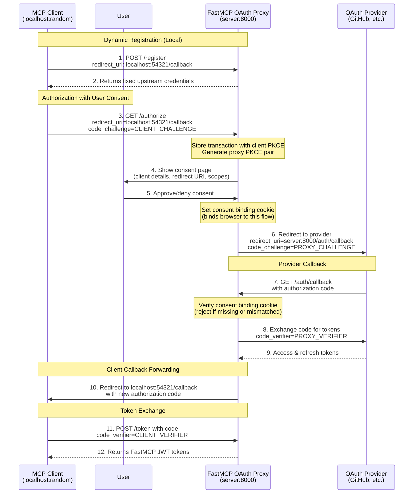
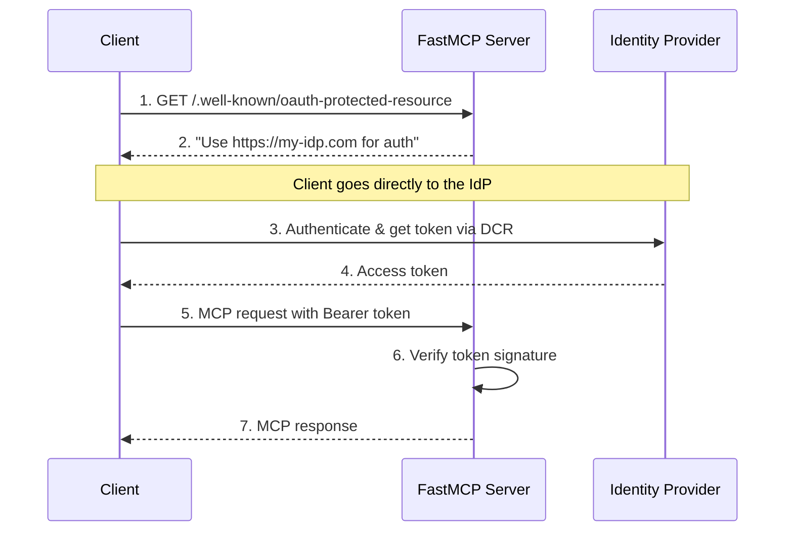

# Authentication Architecture

Source lines: 12282-14858 from the original FastMCP documentation dump.

Core authentication model, OAuth server and proxy patterns, remote auth, token verification, and authorization middleware concepts.

---

# Authentication
Source: https://gofastmcp.com/servers/auth/authentication

Secure your FastMCP server with flexible authentication patterns, from simple API keys to full OAuth 2.1 integration with external identity providers.

<VersionBadge />

Authentication in MCP presents unique challenges that differ from traditional web applications. MCP clients need to discover authentication requirements automatically, negotiate OAuth flows without user intervention, and work seamlessly across different identity providers. FastMCP addresses these challenges by providing authentication patterns that integrate with the MCP protocol while remaining simple to implement and deploy.

<Tip>
  Authentication applies only to FastMCP's HTTP-based transports (`http` and `sse`). The STDIO transport inherits security from its local execution environment.
</Tip>

<Warning>
  **Authentication is rapidly evolving in MCP.** The specification and best practices are changing quickly. FastMCP aims to provide stable, secure patterns that adapt to these changes while keeping your code simple and maintainable.
</Warning>

## MCP Authentication Challenges

Traditional web authentication assumes a human user with a browser who can interact with login forms and consent screens. MCP clients are often automated systems that need to authenticate without human intervention. This creates several unique requirements:

**Automatic Discovery**: MCP clients must discover authentication requirements by examining server metadata rather than encountering login redirects.

**Programmatic OAuth**: OAuth flows must work without human interaction, relying on pre-configured credentials or Dynamic Client Registration.

**Token Management**: Clients need to obtain, refresh, and manage tokens automatically across multiple MCP servers.

**Protocol Integration**: Authentication must integrate cleanly with MCP's transport mechanisms and error handling.

These challenges mean that not all authentication approaches work well with MCP. The patterns that do work fall into three categories based on the level of authentication responsibility your server assumes.

## Authentication Responsibility

Authentication responsibility exists on a spectrum. Your MCP server can validate tokens created elsewhere, coordinate with external identity providers, or handle the complete authentication lifecycle internally. Each approach involves different trade-offs between simplicity, security, and control.

### Token Validation

Your server validates tokens but delegates their creation to external systems. This approach treats your MCP server as a pure resource server that trusts tokens signed by known issuers.

Token validation works well when you already have authentication infrastructure that can issue structured tokens like JWTs. Your existing API gateway, microservices platform, or enterprise SSO system becomes the source of truth for user identity, while your MCP server focuses on its core functionality.

The key insight is that token validation separates authentication (proving who you are) from authorization (determining what you can do). Your MCP server receives proof of identity in the form of a signed token and makes access decisions based on the claims within that token.

This pattern excels in microservices architectures where multiple services need to validate the same tokens, or when integrating MCP servers into existing systems that already handle user authentication.

### External Identity Providers

Your server coordinates with established identity providers to create seamless authentication experiences for MCP clients. This approach leverages OAuth 2.0 and OpenID Connect protocols to delegate user authentication while maintaining control over authorization decisions.

External identity providers handle the complex aspects of authentication: user credential verification, multi-factor authentication, account recovery, and security monitoring. Your MCP server receives tokens from these trusted providers and validates them using the provider's public keys.

The MCP protocol's support for Dynamic Client Registration makes this pattern particularly powerful. MCP clients can automatically discover your authentication requirements and register themselves with your identity provider without manual configuration.

This approach works best for production applications that need enterprise-grade authentication features without the complexity of building them from scratch. It scales well across multiple applications and provides consistent user experiences.

### Full OAuth Implementation

Your server implements a complete OAuth 2.0 authorization server, handling everything from user credential verification to token lifecycle management. This approach provides maximum control at the cost of significant complexity.

Full OAuth implementation means building user interfaces for login and consent, implementing secure credential storage, managing token lifecycles, and maintaining ongoing security updates. The complexity extends beyond initial implementation to include threat monitoring, compliance requirements, and keeping pace with evolving security best practices.

This pattern makes sense only when you need complete control over the authentication process, operate in air-gapped environments, or have specialized requirements that external providers cannot meet.

## FastMCP Authentication Providers

FastMCP translates these authentication responsibility levels into a variety of concrete classes that handle the complexities of MCP protocol integration. You can build on these classes to handle the complexities of MCP protocol integration.

### TokenVerifier

`TokenVerifier` provides pure token validation without OAuth metadata endpoints. This class focuses on the essential task of determining whether a token is valid and extracting authorization information from its claims.

The implementation handles JWT signature verification, expiration checking, and claim extraction. It validates tokens against known issuers and audiences, ensuring that tokens intended for your server are not accepted by other systems.

```python theme={"theme":{"light":"snazzy-light","dark":"dark-plus"}}
from fastmcp import FastMCP
from fastmcp.server.auth.providers.jwt import JWTVerifier

auth = JWTVerifier(
    jwks_uri="https://your-auth-system.com/.well-known/jwks.json",
    issuer="https://your-auth-system.com", 
    audience="your-mcp-server"
)

mcp = FastMCP(name="Protected Server", auth=auth)
```

This example configures token validation against a JWT issuer. The `JWTVerifier` will fetch public keys from the JWKS endpoint and validate incoming tokens against those keys. Only tokens with the correct issuer and audience claims will be accepted.

`TokenVerifier` works well when you control both the token issuer and your MCP server, or when integrating with existing JWT-based infrastructure.

→ **Complete guide**: [Token Verification](/servers/auth/token-verification)

### RemoteAuthProvider

`RemoteAuthProvider` enables authentication with identity providers that **support Dynamic Client Registration (DCR)**, such as Descope and WorkOS AuthKit. With DCR, MCP clients can automatically register themselves with the identity provider and obtain credentials without any manual configuration.

This class combines token validation with OAuth discovery metadata. It extends `TokenVerifier` functionality by adding OAuth 2.0 protected resource endpoints that advertise your authentication requirements. MCP clients examine these endpoints to understand which identity providers you trust and how to obtain valid tokens.

The key requirement is that your identity provider must support DCR - the ability for clients to dynamically register and obtain credentials. This is what enables the seamless, automated authentication flow that MCP requires.

For example, the built-in `AuthKitProvider` uses WorkOS AuthKit, which fully supports DCR:

```python theme={"theme":{"light":"snazzy-light","dark":"dark-plus"}}
from fastmcp import FastMCP
from fastmcp.server.auth.providers.workos import AuthKitProvider

auth = AuthKitProvider(
    authkit_domain="https://your-project.authkit.app",
    base_url="https://your-fastmcp-server.com"
)

mcp = FastMCP(name="Enterprise Server", auth=auth)
```

This example uses WorkOS AuthKit as the external identity provider. The `AuthKitProvider` automatically configures token validation against WorkOS and provides the OAuth metadata that MCP clients need for automatic authentication.

`RemoteAuthProvider` is ideal for production applications when your identity provider supports Dynamic Client Registration (DCR). This enables fully automated authentication without manual client configuration.

→ **Complete guide**: [Remote OAuth](/servers/auth/remote-oauth)

### OAuthProxy

<VersionBadge />

`OAuthProxy` enables authentication with OAuth providers that **don't support Dynamic Client Registration (DCR)**, such as GitHub, Google, Azure, AWS, and most traditional enterprise identity systems.

When identity providers require manual app registration and fixed credentials, `OAuthProxy` bridges the gap. It presents a DCR-compliant interface to MCP clients (accepting any registration request) while using your pre-registered credentials with the upstream provider. The proxy handles the complexity of callback forwarding, enabling dynamic client callbacks to work with providers that require fixed redirect URIs.

This class solves the fundamental incompatibility between MCP's expectation of dynamic registration and traditional OAuth providers' requirement for manual app registration.

For example, the built-in `GitHubProvider` extends `OAuthProxy` to work with GitHub's OAuth system:

```python theme={"theme":{"light":"snazzy-light","dark":"dark-plus"}}
from fastmcp import FastMCP
from fastmcp.server.auth.providers.github import GitHubProvider

auth = GitHubProvider(
    client_id="Ov23li...",  # Your GitHub OAuth App ID
    client_secret="abc123...",  # Your GitHub OAuth App Secret
    base_url="https://your-server.com"
)

mcp = FastMCP(name="GitHub-Protected Server", auth=auth)
```

This example uses the GitHub provider, which extends `OAuthProxy` with GitHub-specific token validation. The proxy handles the complete OAuth flow while making GitHub's non-DCR authentication work seamlessly with MCP clients.

`OAuthProxy` is essential when integrating with OAuth providers that don't support DCR. This includes most established providers like GitHub, Google, and Azure, which require manual app registration through their developer consoles.

→ **Complete guide**: [OAuth Proxy](/servers/auth/oauth-proxy)

### OAuthProvider

`OAuthProvider` implements a complete OAuth 2.0 authorization server within your MCP server. This class handles the full authentication lifecycle from user credential verification to token management.

The implementation provides all required OAuth endpoints including authorization, token, and discovery endpoints. It manages client registration, user consent, and token lifecycle while integrating with your user storage and authentication logic.

```python theme={"theme":{"light":"snazzy-light","dark":"dark-plus"}}
from fastmcp import FastMCP
from fastmcp.server.auth.providers.oauth import MyOAuthProvider

auth = MyOAuthProvider(
    user_store=your_user_database,
    client_store=your_client_registry,
    # Additional configuration...
)

mcp = FastMCP(name="Auth Server", auth=auth)
```

This example shows the basic structure of a custom OAuth provider. The actual implementation requires significant additional configuration for user management, client registration, and security policies.

`OAuthProvider` should be used only when you have specific requirements that external providers cannot meet and the expertise to implement OAuth securely.

→ **Complete guide**: [Full OAuth Server](/servers/auth/full-oauth-server)

### MultiAuth

<VersionBadge />

`MultiAuth` composes multiple authentication sources into a single `auth` provider. When a server needs to accept tokens from different issuers — for example, an OAuth proxy for interactive clients alongside JWT verification for machine-to-machine tokens — `MultiAuth` tries each source in order and accepts the first successful verification.

```python theme={"theme":{"light":"snazzy-light","dark":"dark-plus"}}
from fastmcp import FastMCP
from fastmcp.server.auth import MultiAuth, OAuthProxy
from fastmcp.server.auth.providers.jwt import JWTVerifier

auth = MultiAuth(
    server=OAuthProxy(
        issuer_url="https://login.example.com/...",
        client_id="my-app",
        client_secret="secret",
        base_url="https://my-server.com",
    ),
    verifiers=[
        JWTVerifier(
            jwks_uri="https://internal-issuer.example.com/.well-known/jwks.json",
            issuer="https://internal-issuer.example.com",
            audience="my-mcp-server",
        ),
    ],
)

mcp = FastMCP("My Server", auth=auth)
```

The server (if provided) owns all OAuth routes and metadata. Verifiers contribute only token verification logic. This keeps the MCP discovery surface clean while supporting multiple token sources.

→ **Complete guide**: [Multiple Auth Sources](/servers/auth/multi-auth)

## Configuration

Authentication providers are configured programmatically by instantiating them directly in your code with their required parameters. This makes dependencies explicit and allows your IDE to provide helpful autocompletion and type checking.

For production deployments, load sensitive values like client secrets from environment variables:

```python theme={"theme":{"light":"snazzy-light","dark":"dark-plus"}}
import os
from fastmcp import FastMCP
from fastmcp.server.auth.providers.github import GitHubProvider

# Load secrets from environment variables
auth = GitHubProvider(
    client_id=os.environ.get("GITHUB_CLIENT_ID"),
    client_secret=os.environ.get("GITHUB_CLIENT_SECRET"),
    base_url=os.environ.get("BASE_URL", "http://localhost:8000")
)

mcp = FastMCP(name="My Server", auth=auth)
```

This approach keeps secrets out of your codebase while maintaining explicit configuration. You can use any environment variable names you prefer - there are no special prefixes required.

## Choosing Your Implementation

The authentication approach you choose depends on your existing infrastructure, security requirements, and operational constraints.

**For OAuth providers without DCR support (GitHub, Google, Azure, AWS, most enterprise systems), use OAuth Proxy.** These providers require manual app registration through their developer consoles. OAuth Proxy bridges the gap by presenting a DCR-compliant interface to MCP clients while using your fixed credentials with the provider. The proxy's callback forwarding pattern enables dynamic client ports to work with providers that require fixed redirect URIs.

**For identity providers with DCR support (Descope, WorkOS AuthKit, modern auth platforms), use RemoteAuthProvider.** These providers allow clients to dynamically register and obtain credentials without manual configuration. This enables the fully automated authentication flow that MCP is designed for, providing the best user experience and simplest implementation.

**Token validation works well when you already have authentication infrastructure that issues structured tokens.** If your organization already uses JWT-based systems, API gateways, or enterprise SSO that can generate tokens, this approach integrates seamlessly while keeping your MCP server focused on its core functionality. The simplicity comes from leveraging existing investment in authentication infrastructure.

**When you need tokens from multiple sources, use MultiAuth.** This is common in hybrid architectures where interactive clients authenticate through an OAuth proxy while backend services send JWT tokens directly. `MultiAuth` composes an optional auth server with additional token verifiers, trying each source in order until one succeeds.

**Full OAuth implementation should be avoided unless you have compelling reasons that external providers cannot address.** Air-gapped environments, specialized compliance requirements, or unique organizational constraints might justify this approach, but it requires significant security expertise and ongoing maintenance commitment. The complexity extends far beyond initial implementation to include threat monitoring, security updates, and keeping pace with evolving attack vectors.

FastMCP's architecture supports migration between these approaches as your requirements evolve. You can integrate with existing token systems initially and migrate to external identity providers as your application scales, or implement custom solutions when your requirements outgrow standard patterns.


# Full OAuth Server
Source: https://gofastmcp.com/servers/auth/full-oauth-server

Build a self-contained authentication system where your FastMCP server manages users, issues tokens, and validates them.

<VersionBadge />

<Warning>
  **This is an extremely advanced pattern that most users should avoid.** Building a secure OAuth 2.1 server requires deep expertise in authentication protocols, cryptography, and security best practices. The complexity extends far beyond initial implementation to include ongoing security monitoring, threat response, and compliance maintenance.

  **Use [Remote OAuth](/servers/auth/remote-oauth) instead** unless you have compelling requirements that external identity providers cannot meet, such as air-gapped environments or specialized compliance needs.
</Warning>

The Full OAuth Server pattern exists to support the MCP protocol specification's requirements. Your FastMCP server becomes both an Authorization Server and Resource Server, handling the complete authentication lifecycle from user login to token validation.

This documentation exists for completeness - the vast majority of applications should use external identity providers instead.

## OAuthProvider

FastMCP provides the `OAuthProvider` abstract class that implements the OAuth 2.1 specification. To use this pattern, you must subclass `OAuthProvider` and implement all required abstract methods.

<Note>
  `OAuthProvider` handles OAuth endpoints, protocol flows, and security requirements, but delegates all storage, user management, and business logic to your implementation of the abstract methods.
</Note>

## Required Implementation

You must implement these abstract methods to create a functioning OAuth server:

### Client Management

<Card icon="code" title="Client Management Methods">
  <ParamField type="async method">
    Retrieve client information by ID from your database.

    <Expandable title="Parameters">
      <ParamField type="str">
        Client identifier to look up
      </ParamField>
    </Expandable>

    <Expandable title="Returns">
      <ParamField type="return type">
        Client information object or `None` if client not found
      </ParamField>
    </Expandable>
  </ParamField>

  <ParamField type="async method">
    Store new client registration information in your database.

    <Expandable title="Parameters">
      <ParamField type="OAuthClientInformationFull">
        Complete client registration information to store
      </ParamField>
    </Expandable>

    <Expandable title="Returns">
      <ParamField type="return type">
        No return value
      </ParamField>
    </Expandable>
  </ParamField>
</Card>

### Authorization Flow

<Card icon="code" title="Authorization Flow Methods">
  <ParamField type="async method">
    Handle authorization request and return redirect URL. Must implement user authentication and consent collection.

    <Expandable title="Parameters">
      <ParamField type="OAuthClientInformationFull">
        OAuth client making the authorization request
      </ParamField>

      <ParamField type="AuthorizationParams">
        Authorization request parameters from the client
      </ParamField>
    </Expandable>

    <Expandable title="Returns">
      <ParamField type="return type">
        Redirect URL to send the client to
      </ParamField>
    </Expandable>
  </ParamField>

  <ParamField type="async method">
    Load authorization code from storage by code string. Return `None` if code is invalid or expired.

    <Expandable title="Parameters">
      <ParamField type="OAuthClientInformationFull">
        OAuth client attempting to use the authorization code
      </ParamField>

      <ParamField type="str">
        Authorization code string to look up
      </ParamField>
    </Expandable>

    <Expandable title="Returns">
      <ParamField type="return type">
        Authorization code object or `None` if not found
      </ParamField>
    </Expandable>
  </ParamField>
</Card>

### Token Management

<Card icon="code" title="Token Management Methods">
  <ParamField type="async method">
    Exchange authorization code for access and refresh tokens. Must validate code and create new tokens.

    <Expandable title="Parameters">
      <ParamField type="OAuthClientInformationFull">
        OAuth client exchanging the authorization code
      </ParamField>

      <ParamField type="AuthorizationCode">
        Valid authorization code object to exchange
      </ParamField>
    </Expandable>

    <Expandable title="Returns">
      <ParamField type="return type">
        New OAuth token containing access and refresh tokens
      </ParamField>
    </Expandable>
  </ParamField>

  <ParamField type="async method">
    Load refresh token from storage by token string. Return `None` if token is invalid or expired.

    <Expandable title="Parameters">
      <ParamField type="OAuthClientInformationFull">
        OAuth client attempting to use the refresh token
      </ParamField>

      <ParamField type="str">
        Refresh token string to look up
      </ParamField>
    </Expandable>

    <Expandable title="Returns">
      <ParamField type="return type">
        Refresh token object or `None` if not found
      </ParamField>
    </Expandable>
  </ParamField>

  <ParamField type="async method">
    Exchange refresh token for new access/refresh token pair. Must validate scopes and token.

    <Expandable title="Parameters">
      <ParamField type="OAuthClientInformationFull">
        OAuth client using the refresh token
      </ParamField>

      <ParamField type="RefreshToken">
        Valid refresh token object to exchange
      </ParamField>

      <ParamField type="list[str]">
        Requested scopes for the new access token
      </ParamField>
    </Expandable>

    <Expandable title="Returns">
      <ParamField type="return type">
        New OAuth token with updated access and refresh tokens
      </ParamField>
    </Expandable>
  </ParamField>

  <ParamField type="async method">
    Load an access token by its token string.

    <Expandable title="Parameters">
      <ParamField type="str">
        The access token to verify
      </ParamField>
    </Expandable>

    <Expandable title="Returns">
      <ParamField type="return type">
        The access token object, or `None` if the token is invalid
      </ParamField>
    </Expandable>
  </ParamField>

  <ParamField type="async method">
    Revoke access or refresh token, marking it as invalid in storage.

    <Expandable title="Parameters">
      <ParamField type="AccessToken | RefreshToken">
        Token object to revoke and mark invalid
      </ParamField>
    </Expandable>

    <Expandable title="Returns">
      <ParamField type="return type">
        No return value
      </ParamField>
    </Expandable>
  </ParamField>

  <ParamField type="async method">
    Verify bearer token for incoming requests. Return `AccessToken` if valid, `None` if invalid.

    <Expandable title="Parameters">
      <ParamField type="str">
        Bearer token string from incoming request
      </ParamField>
    </Expandable>

    <Expandable title="Returns">
      <ParamField type="return type">
        Access token object if valid, `None` if invalid or expired
      </ParamField>
    </Expandable>
  </ParamField>
</Card>

Each method must handle storage, validation, security, and error cases according to the OAuth 2.1 specification. The implementation complexity is substantial and requires expertise in OAuth security considerations.

<Warning>
  **Security Notice:** OAuth server implementation involves numerous security considerations including PKCE, state parameters, redirect URI validation, token binding, replay attack prevention, and secure storage requirements. Mistakes can lead to serious security vulnerabilities.
</Warning>


# Multiple Auth Sources
Source: https://gofastmcp.com/servers/auth/multi-auth

Accept tokens from multiple authentication sources with a single server.

<VersionBadge />

Production servers often need to accept tokens from multiple authentication sources. An interactive application might authenticate through an OAuth proxy, while a backend service sends machine-to-machine JWT tokens directly. `MultiAuth` composes these sources into a single `auth` provider so every valid token is accepted regardless of where it was issued.

## Understanding MultiAuth

`MultiAuth` wraps an optional auth server (like `OAuthProxy`) together with one or more token verifiers (like `JWTVerifier`). When a request arrives with a bearer token, `MultiAuth` tries each source in order and accepts the first successful verification.

The auth server, if provided, is tried first. It owns all OAuth routes and metadata — the verifiers contribute only token verification logic. This keeps the MCP discovery surface clean: one set of routes, one set of metadata, multiple verification paths.

```python theme={"theme":{"light":"snazzy-light","dark":"dark-plus"}}
from fastmcp import FastMCP
from fastmcp.server.auth import MultiAuth, OAuthProxy
from fastmcp.server.auth.providers.jwt import JWTVerifier

auth = MultiAuth(
    server=OAuthProxy(
        issuer_url="https://login.example.com/...",
        client_id="my-app",
        client_secret="secret",
        base_url="https://my-server.com",
    ),
    verifiers=[
        JWTVerifier(
            jwks_uri="https://internal-issuer.example.com/.well-known/jwks.json",
            issuer="https://internal-issuer.example.com",
            audience="my-mcp-server",
        ),
    ],
)

mcp = FastMCP("My Server", auth=auth)
```

Interactive MCP clients authenticate through the OAuth proxy as usual. Backend services skip OAuth entirely and send a JWT signed by the internal issuer. Both paths are validated, and the first match wins.

## Verification Order

`MultiAuth` checks sources in a deterministic order:

1. **Server** (if provided) — the full auth provider's `verify_token` runs first
2. **Verifiers** — each `TokenVerifier` is tried in list order

The first source that returns a valid `AccessToken` wins. If every source returns `None`, the request receives a 401 response.

This ordering means the server acts as the "primary" authentication path, with verifiers as fallbacks for tokens the server doesn't recognize.

## Verifiers Only

You don't always need a full OAuth server. If your server only needs to accept tokens from multiple issuers, pass verifiers without a server:

```python theme={"theme":{"light":"snazzy-light","dark":"dark-plus"}}
from fastmcp import FastMCP
from fastmcp.server.auth import MultiAuth
from fastmcp.server.auth.providers.jwt import JWTVerifier, StaticTokenVerifier

auth = MultiAuth(
    verifiers=[
        JWTVerifier(
            jwks_uri="https://issuer-a.example.com/.well-known/jwks.json",
            issuer="https://issuer-a.example.com",
            audience="my-server",
        ),
        JWTVerifier(
            jwks_uri="https://issuer-b.example.com/.well-known/jwks.json",
            issuer="https://issuer-b.example.com",
            audience="my-server",
        ),
    ],
)

mcp = FastMCP("Multi-Issuer Server", auth=auth)
```

Without a server, no OAuth routes or metadata are served. This is appropriate for internal systems where clients already know how to obtain tokens.

## API Reference

### MultiAuth

| Parameter         | Type                                   | Description                                                                                          |
| ----------------- | -------------------------------------- | ---------------------------------------------------------------------------------------------------- |
| `server`          | `AuthProvider \| None`                 | Optional auth provider that owns routes and OAuth metadata. Also tried first for token verification. |
| `verifiers`       | `list[TokenVerifier] \| TokenVerifier` | One or more token verifiers tried after the server.                                                  |
| `base_url`        | `str \| None`                          | Override the base URL. Defaults to the server's `base_url`.                                          |
| `required_scopes` | `list[str] \| None`                    | Override required scopes. Defaults to the server's scopes.                                           |


# OAuth Proxy
Source: https://gofastmcp.com/servers/auth/oauth-proxy

Bridge traditional OAuth providers to work seamlessly with MCP's authentication flow.

<VersionBadge />

The OAuth proxy enables FastMCP servers to authenticate with OAuth providers that **don't support Dynamic Client Registration (DCR)**. This includes virtually all traditional OAuth providers: GitHub, Google, Azure, AWS, Discord, Facebook, and most enterprise identity systems. For providers that do support DCR (like Descope and WorkOS AuthKit), use [`RemoteAuthProvider`](/servers/auth/remote-oauth) instead.

MCP clients expect to register automatically and obtain credentials on the fly, but traditional providers require manual app registration through their developer consoles. The OAuth proxy bridges this gap by presenting a DCR-compliant interface to MCP clients while using your pre-registered credentials with the upstream provider. When a client attempts to register, the proxy returns your fixed credentials. When a client initiates authorization, the proxy handles the complexity of callback forwarding—storing the client's dynamic callback URL, using its own fixed callback with the provider, then forwarding back to the client after token exchange.

This approach enables any MCP client (whether using random localhost ports or fixed URLs like Claude.ai) to authenticate with any traditional OAuth provider, all while maintaining full OAuth 2.1 and PKCE security.

<Note>
  For providers that support OIDC discovery (Auth0, Google with OIDC
  configuration, Azure AD), consider using [`OIDC
      Proxy`](/servers/auth/oidc-proxy) for automatic configuration. OIDC Proxy
  extends the OAuth proxy to automatically discover endpoints from the provider's
  `/.well-known/openid-configuration` URL, simplifying setup.
</Note>

## Implementation

### Provider Setup Requirements

Before using the OAuth proxy, you need to register your application with your OAuth provider:

1. **Register your application** in the provider's developer console (GitHub Settings, Google Cloud Console, Azure Portal, etc.)
2. **Configure the redirect URI** as your FastMCP server URL plus your chosen callback path:
   * Default: `https://your-server.com/auth/callback`
   * Custom: `https://your-server.com/your/custom/path` (if you set `redirect_path`)
   * Development: `http://localhost:8000/auth/callback`
3. **Obtain your credentials**: Client ID and Client Secret
4. **Note the OAuth endpoints**: Authorization URL and Token URL (usually found in the provider's OAuth documentation)

<Warning>
  The redirect URI you configure with your provider must exactly match your
  FastMCP server's URL plus the callback path. If you customize `redirect_path`
  in the OAuth proxy, update your provider's redirect URI accordingly.
</Warning>

### Basic Setup

Here's how to implement the OAuth proxy with any provider:

```python theme={"theme":{"light":"snazzy-light","dark":"dark-plus"}}
from fastmcp import FastMCP
from fastmcp.server.auth import OAuthProxy
from fastmcp.server.auth.providers.jwt import JWTVerifier

# Configure token verification for your provider
# See the Token Verification guide for provider-specific setups
token_verifier = JWTVerifier(
    jwks_uri="https://your-provider.com/.well-known/jwks.json",
    issuer="https://your-provider.com",
    audience="your-app-id"
)

# Create the OAuth proxy
auth = OAuthProxy(
    # Provider's OAuth endpoints (from their documentation)
    upstream_authorization_endpoint="https://provider.com/oauth/authorize",
    upstream_token_endpoint="https://provider.com/oauth/token",

    # Your registered app credentials
    upstream_client_id="your-client-id",
    upstream_client_secret="your-client-secret",

    # Token validation (see Token Verification guide)
    token_verifier=token_verifier,

    # Your FastMCP server's public URL
    base_url="https://your-server.com",

    # Optional: customize the callback path (default is "/auth/callback")
    # redirect_path="/custom/callback",
)

mcp = FastMCP(name="My Server", auth=auth)
```

### Configuration Parameters

<Card icon="code" title="OAuthProxy Parameters">
  <ParamField type="str">
    URL of your OAuth provider's authorization endpoint (e.g., `https://github.com/login/oauth/authorize`)
  </ParamField>

  <ParamField type="str">
    URL of your OAuth provider's token endpoint (e.g.,
    `https://github.com/login/oauth/access_token`)
  </ParamField>

  <ParamField type="str">
    Client ID from your registered OAuth application
  </ParamField>

  <ParamField type="str">
    Client secret from your registered OAuth application
  </ParamField>

  <ParamField type="TokenVerifier">
    A [`TokenVerifier`](/servers/auth/token-verification) instance to validate the
    provider's tokens
  </ParamField>

  <ParamField type="AnyHttpUrl | str">
    Public URL where OAuth endpoints will be accessible, **including any mount path** (e.g., `https://your-server.com/api`).

    This URL is used to construct OAuth callback URLs and operational endpoints. When mounting under a path prefix, include that prefix in `base_url`. Use `issuer_url` separately to specify where auth server metadata is located (typically at root level).
  </ParamField>

  <ParamField type="str">
    Path for OAuth callbacks. Must match the redirect URI configured in your OAuth
    application
  </ParamField>

  <ParamField type="str | None">
    Optional URL of provider's token revocation endpoint
  </ParamField>

  <ParamField type="AnyHttpUrl | str | None">
    Issuer URL for OAuth authorization server metadata (defaults to `base_url`).

    When `issuer_url` has a path component (either explicitly or by defaulting from `base_url`), FastMCP creates path-aware discovery routes per RFC 8414. For example, if `base_url` is `http://localhost:8000/api`, the authorization server metadata will be at `/.well-known/oauth-authorization-server/api`.

    **Default behavior (recommended for most cases):**

    ```python theme={"theme":{"light":"snazzy-light","dark":"dark-plus"}}
    auth = GitHubProvider(
        base_url="http://localhost:8000/api",  # OAuth endpoints under /api
        # issuer_url defaults to base_url - path-aware discovery works automatically
    )
    ```

    **When to set explicitly:**
    Set `issuer_url` to root level only if you want multiple MCP servers to share a single discovery endpoint:

    ```python theme={"theme":{"light":"snazzy-light","dark":"dark-plus"}}
    auth = GitHubProvider(
        base_url="http://localhost:8000/api",
        issuer_url="http://localhost:8000"  # Shared root-level discovery
    )
    ```

    See the [HTTP Deployment guide](/deployment/http#mounting-authenticated-servers) for complete mounting examples.
  </ParamField>

  <ParamField type="AnyHttpUrl | str | None">
    Optional URL to your service documentation
  </ParamField>

  <ParamField type="bool">
    Whether to forward PKCE (Proof Key for Code Exchange) to the upstream OAuth
    provider. When enabled and the client uses PKCE, the proxy generates its own
    PKCE parameters to send upstream while separately validating the client's
    PKCE. This ensures end-to-end PKCE security at both layers (client-to-proxy
    and proxy-to-upstream). - `True` (default): Forward PKCE for providers that
    support it (Google, Azure, AWS, GitHub, etc.) - `False`: Disable only if upstream
    provider doesn't support PKCE
  </ParamField>

  <ParamField type="str | None">
    Token endpoint authentication method for the upstream OAuth server. Controls
    how the proxy authenticates when exchanging authorization codes and refresh
    tokens with the upstream provider. - `"client_secret_basic"`: Send credentials
    in Authorization header (most common) - `"client_secret_post"`: Send
    credentials in request body (required by some providers) - `"none"`: No
    authentication (for public clients) - `None` (default): Uses authlib's default
    (typically `"client_secret_basic"`) Set this if your provider requires a
    specific authentication method and the default doesn't work.
  </ParamField>

  <ParamField type="list[str] | None">
    List of allowed redirect URI patterns for MCP clients. Patterns support
    wildcards (e.g., `"http://localhost:*"`, `"https://*.example.com/*"`). -
    `None` (default): All redirect URIs allowed (for MCP/DCR compatibility) -
    Empty list `[]`: No redirect URIs allowed - Custom list: Only matching
    patterns allowed These patterns apply to MCP client loopback redirects, NOT
    the upstream OAuth app redirect URI.
  </ParamField>

  <ParamField type="list[str] | None">
    List of all possible valid scopes for the OAuth provider. These are advertised
    to clients through the `/.well-known` endpoints. Defaults to `required_scopes`
    from your TokenVerifier if not specified.
  </ParamField>

  <ParamField type="dict[str, str] | None">
    Additional parameters to forward to the upstream authorization endpoint. Useful for provider-specific parameters that aren't part of the standard OAuth2 flow.

    For example, Auth0 requires an `audience` parameter to issue JWT tokens:

    ```python theme={"theme":{"light":"snazzy-light","dark":"dark-plus"}}
    extra_authorize_params={"audience": "https://api.example.com"}
    ```

    These parameters are added to every authorization request sent to the upstream provider.
  </ParamField>

  <ParamField type="dict[str, str] | None">
    Additional parameters to forward to the upstream token endpoint during code exchange and token refresh. Useful for provider-specific requirements during token operations.

    For example, some providers require additional context during token exchange:

    ```python theme={"theme":{"light":"snazzy-light","dark":"dark-plus"}}
    extra_token_params={"audience": "https://api.example.com"}
    ```

    These parameters are included in all token requests to the upstream provider.
  </ParamField>

  <ParamField type="AsyncKeyValue | None">
    <VersionBadge />

    Storage backend for persisting OAuth client registrations and upstream tokens.

    **Default behavior:**
    By default, clients are automatically persisted to an encrypted disk store, allowing them to survive server restarts as long as the filesystem remains accessible. This means MCP clients only need to register once and can reconnect seamlessly. The disk store is encrypted using a key derived from the JWT Signing Key (which is derived from the upstream client secret by default). For client registrations to survive upstream client secret rotation, you should provide a JWT Signing Key or your own client\_storage.

    For production deployments with multiple servers or cloud deployments, see [Storage Backends](/servers/storage-backends) for available options.

    <Warning>
      **When providing custom storage**, wrap it in `FernetEncryptionWrapper` to encrypt sensitive OAuth tokens at rest:

      ```python theme={"theme":{"light":"snazzy-light","dark":"dark-plus"}}
      from key_value.aio.stores.redis import RedisStore
      from key_value.aio.wrappers.encryption import FernetEncryptionWrapper
      from cryptography.fernet import Fernet
      import os

      auth = OAuthProxy(
          ...,
          jwt_signing_key=os.environ["JWT_SIGNING_KEY"],
          client_storage=FernetEncryptionWrapper(
              key_value=RedisStore(host="redis.example.com", port=6379),
              fernet=Fernet(os.environ["STORAGE_ENCRYPTION_KEY"])
          )
      )
      ```

      Without encryption, upstream OAuth tokens are stored in plaintext.
    </Warning>

    Testing with in-memory storage (unencrypted):

    ```python theme={"theme":{"light":"snazzy-light","dark":"dark-plus"}}
    from key_value.aio.stores.memory import MemoryStore

    # Use in-memory storage for testing (clients lost on restart)
    auth = OAuthProxy(..., client_storage=MemoryStore())
    ```
  </ParamField>

  <ParamField type="str | bytes | None">
    <VersionBadge />

    Secret used to sign FastMCP JWT tokens issued to clients. Accepts any string or bytes - will be derived into a proper 32-byte cryptographic key using HKDF.

    **Default behavior (`None`):**
    Derives a 32-byte key using PBKDF2 from the upstream client secret.

    **For production:**
    Provide an explicit secret (e.g., from environment variable) to use a fixed key instead of the key derived from the upstream client secret. This allows you to manage keys securely in cloud environments, allows keys to work across multiple instances, and allows you to rotate keys without losing client registrations.

    ```python theme={"theme":{"light":"snazzy-light","dark":"dark-plus"}}
    import os

    auth = OAuthProxy(
        ...,
        jwt_signing_key=os.environ["JWT_SIGNING_KEY"],  # Any sufficiently complex string!
        client_storage=RedisStore(...)  # Persistent storage
    )
    ```

    See [HTTP Deployment - OAuth Token Security](/deployment/http#oauth-token-security) for complete production setup.
  </ParamField>

  <ParamField type="bool">
    Whether to require user consent before authorizing MCP clients. When enabled (default), users see a consent screen that displays which client is requesting access, preventing [confused deputy attacks](https://modelcontextprotocol.io/specification/2025-06-18/basic/security_best_practices#confused-deputy-problem) by ensuring users explicitly approve new clients.

    **Default behavior (True):**
    Users see a consent screen on first authorization. Consent choices are remembered via signed cookies, so users only need to approve each client once. This protects against malicious clients impersonating the user.

    **Disabling consent (False):**
    Authorization proceeds directly to the upstream provider without user confirmation. Only use this for local development or testing environments where the security trade-off is acceptable.

    ```python theme={"theme":{"light":"snazzy-light","dark":"dark-plus"}}
    # Development/testing only - skip consent screen
    auth = OAuthProxy(
        ...,
        require_authorization_consent=False  # ⚠️ Security warning: only for local/testing
    )
    ```

    <Warning>
      Disabling consent removes an important security layer. Only disable for local development or testing environments where you fully control all connecting clients.
    </Warning>
  </ParamField>

  <ParamField type="str | None">
    Content Security Policy for the consent page.

    * `None` (default): Uses the built-in CSP policy with appropriate directives for form submission
    * Empty string `""`: Disables CSP entirely (no meta tag rendered)
    * Custom string: Uses the provided value as the CSP policy

    This is useful for organizations that have their own CSP policies and need to override or disable FastMCP's built-in CSP directives.

    ```python theme={"theme":{"light":"snazzy-light","dark":"dark-plus"}}
    # Disable CSP entirely (let org CSP policies apply)
    auth = OAuthProxy(..., consent_csp_policy="")

    # Use custom CSP policy
    auth = OAuthProxy(..., consent_csp_policy="default-src 'self'; style-src 'unsafe-inline'")
    ```
  </ParamField>
</Card>

### Using Built-in Providers

FastMCP includes pre-configured providers for common services:

```python theme={"theme":{"light":"snazzy-light","dark":"dark-plus"}}
from fastmcp.server.auth.providers.github import GitHubProvider

auth = GitHubProvider(
    client_id="your-github-app-id",
    client_secret="your-github-app-secret",
    base_url="https://your-server.com"
)

mcp = FastMCP(name="My Server", auth=auth)
```

Available providers include `GitHubProvider`, `GoogleProvider`, and others. These handle token verification automatically.

### Token Verification

The OAuth proxy requires a compatible `TokenVerifier` to validate tokens from your provider. Different providers use different token formats:

* **JWT tokens** (Google, Azure): Use `JWTVerifier` with the provider's JWKS endpoint
* **Opaque tokens with RFC 7662 introspection** (Auth0, Okta, WorkOS): Use `IntrospectionTokenVerifier`
* **Opaque tokens (provider-specific)** (GitHub, Discord): Use provider-specific verifiers like `GitHubTokenVerifier`

See the [Token Verification guide](/servers/auth/token-verification) for detailed setup instructions for your provider.

### Scope Configuration

OAuth scopes control what permissions your application requests from users. They're configured through your `TokenVerifier` (required for the OAuth proxy to validate tokens from your provider). Set `required_scopes` to automatically request the permissions your application needs:

```python theme={"theme":{"light":"snazzy-light","dark":"dark-plus"}}
JWTVerifier(..., required_scopes = ["read:user", "write:data"])
```

Dynamic clients created by the proxy will automatically include these scopes in their authorization requests. See the [Token Verification](#token-verification) section below for detailed setup.

### Custom Parameters

Some OAuth providers require additional parameters beyond the standard OAuth2 flow. Use `extra_authorize_params` and `extra_token_params` to pass provider-specific requirements. For example, Auth0 requires an `audience` parameter to issue JWT tokens instead of opaque tokens:

```python theme={"theme":{"light":"snazzy-light","dark":"dark-plus"}}
auth = OAuthProxy(
    upstream_authorization_endpoint="https://your-domain.auth0.com/authorize",
    upstream_token_endpoint="https://your-domain.auth0.com/oauth/token",
    upstream_client_id="your-auth0-client-id",
    upstream_client_secret="your-auth0-client-secret",

    # Auth0-specific audience parameter
    extra_authorize_params={"audience": "https://your-api-identifier.com"},
    extra_token_params={"audience": "https://your-api-identifier.com"},

    token_verifier=JWTVerifier(
        jwks_uri="https://your-domain.auth0.com/.well-known/jwks.json",
        issuer="https://your-domain.auth0.com/",
        audience="https://your-api-identifier.com"
    ),
    base_url="https://your-server.com"
)
```

The proxy also automatically forwards RFC 8707 `resource` parameters from MCP clients to upstream providers that support them.

## OAuth Flow



The flow diagram above illustrates the complete OAuth proxy pattern. Let's understand each phase:

### Registration Phase

When an MCP client calls `/register` with its dynamic callback URL, the proxy responds with your pre-configured upstream credentials. The client stores these credentials believing it has registered a new app. Meanwhile, the proxy records the client's callback URL for later use.

### Authorization Phase

The client initiates OAuth by redirecting to the proxy's `/authorize` endpoint. The proxy:

1. Stores the client's transaction with its PKCE challenge
2. Generates its own PKCE parameters for upstream security
3. Shows the user a consent page with the client's details, redirect URI, and requested scopes
4. If the user approves (or the client was previously approved), sets a consent binding cookie and redirects to the upstream provider using the fixed callback URL

This dual-PKCE approach maintains end-to-end security at both the client-to-proxy and proxy-to-provider layers. The consent step protects against confused deputy attacks by ensuring you explicitly approve each client before it can complete authorization, and the consent binding cookie ensures that only the browser that approved consent can complete the callback.

### Callback Phase

After user authorization, the provider redirects back to the proxy's fixed callback URL. The proxy:

1. Verifies the consent binding cookie matches the transaction (rejecting requests from a different browser)
2. Exchanges the authorization code for tokens with the provider
3. Stores these tokens temporarily
4. Generates a new authorization code for the client
5. Redirects to the client's original dynamic callback URL

### Token Exchange Phase

Finally, the client exchanges its authorization code with the proxy. The proxy validates the client's PKCE verifier, then issues its own FastMCP JWT tokens (rather than forwarding the upstream provider's tokens). See [Token Architecture](#token-architecture) for details on this design.

This entire flow is transparent to the MCP client—it experiences a standard OAuth flow with dynamic registration, unaware that a proxy is managing the complexity behind the scenes.

### Token Architecture

The OAuth proxy implements a **token factory pattern**: instead of directly forwarding tokens from the upstream OAuth provider, it issues its own JWT tokens to MCP clients. This maintains proper OAuth 2.0 token audience boundaries and enables better security controls.

**How it works:**

When an MCP client completes authorization, the proxy:

1. **Receives upstream tokens** from the OAuth provider (GitHub, Google, etc.)
2. **Encrypts and stores** these tokens using Fernet encryption (AES-128-CBC + HMAC-SHA256)
3. **Issues FastMCP JWT tokens** to the client, signed with HS256

The FastMCP JWT contains minimal claims: issuer, audience, client ID, scopes, expiration, and a unique token identifier (JTI). The JTI acts as a reference linking to the encrypted upstream token.

**Token validation:**

When a client makes an MCP request with its FastMCP token:

1. **FastMCP validates the JWT** signature, expiration, issuer, and audience
2. **Looks up the upstream token** using the JTI from the validated JWT
3. **Decrypts and validates** the upstream token with the provider

This two-tier validation ensures that FastMCP tokens can only be used with this server (via audience validation) while maintaining full upstream token security.

This architecture also prevents [token passthrough](#token-passthrough) — see the [Security](#security) section for details.

**Token expiry alignment:**

FastMCP token lifetimes match the upstream token lifetimes. When the upstream token expires, the FastMCP token also expires, maintaining consistent security boundaries.

**Refresh tokens:**

The proxy issues its own refresh tokens that map to upstream refresh tokens. When a client uses a FastMCP refresh token, the proxy refreshes the upstream token and issues a new FastMCP access token.

### PKCE Forwarding

The OAuth proxy automatically handles PKCE (Proof Key for Code Exchange) when working with providers that support or require it. The proxy generates its own PKCE parameters to send upstream while separately validating the client's PKCE, ensuring end-to-end security at both layers.

This is enabled by default via the `forward_pkce` parameter and works seamlessly with providers like Google, Azure AD, and GitHub. Only disable it for legacy providers that don't support PKCE:

```python theme={"theme":{"light":"snazzy-light","dark":"dark-plus"}}
# Disable PKCE forwarding only if upstream doesn't support it
auth = OAuthProxy(
    ...,
    forward_pkce=False  # Default is True
)
```

### Redirect URI Validation

While the OAuth proxy accepts all redirect URIs by default (for DCR compatibility), you can restrict which clients can connect by specifying allowed patterns:

```python theme={"theme":{"light":"snazzy-light","dark":"dark-plus"}}
# Allow only localhost clients (common for development)
auth = OAuthProxy(
    # ... other parameters ...
    allowed_client_redirect_uris=[
        "http://localhost:*",
        "http://127.0.0.1:*"
    ]
)

# Allow specific known clients
auth = OAuthProxy(
    # ... other parameters ...
    allowed_client_redirect_uris=[
        "http://localhost:*",
        "https://claude.ai/api/mcp/auth_callback",
        "https://*.mycompany.com/auth/*"  # Wildcard patterns supported
    ]
)
```

Check your server logs for "Client registered with redirect\_uri" messages to identify what URLs your clients use.

## CIMD Support

<VersionBadge />

The OAuth proxy supports **Client ID Metadata Documents (CIMD)**, an alternative to Dynamic Client Registration where clients host a static JSON document at an HTTPS URL. Instead of registering dynamically, clients simply provide their CIMD URL as their `client_id`, and the server fetches and validates the metadata.

CIMD clients appear in the consent screen with a verified domain badge, giving users confidence about which application is requesting access. This provides stronger identity verification than DCR, where any client can claim any name.

### How CIMD Works

When a client presents an HTTPS URL as its `client_id` (for example, `https://myapp.example.com/oauth/client.json`), the OAuth proxy recognizes it as a CIMD client and:

1. Fetches the JSON document from that URL
2. Validates that the document's `client_id` field matches the URL
3. Extracts client metadata (name, redirect URIs, scopes, etc.)
4. Stores the client persistently alongside DCR clients
5. Shows the verified domain in the consent screen

This flow happens transparently. MCP clients that support CIMD simply provide their metadata URL instead of registering, and the OAuth proxy handles the rest.

### CIMD Configuration

CIMD support is enabled by default for `OAuthProxy`.

<Card icon="code" title="CIMD Parameters">
  <ParamField type="bool">
    Whether to accept CIMD URLs as client identifiers. When enabled, clients can use HTTPS URLs pointing to metadata documents as their `client_id` instead of registering via DCR.
  </ParamField>
</Card>

### Private Key JWT Authentication

CIMD clients can authenticate using `private_key_jwt` instead of the default `none` authentication method. This provides cryptographic proof of client identity by signing JWT assertions with a private key, while the server verifies using the client's public key from their CIMD document.

To use `private_key_jwt`, the CIMD document must include either a `jwks_uri` (URL to fetch the public key set) or inline `jwks` (the key set directly in the document):

```json theme={"theme":{"light":"snazzy-light","dark":"dark-plus"}}
{
  "client_id": "https://myapp.example.com/oauth/client.json",
  "client_name": "My Secure App",
  "redirect_uris": ["http://localhost:*/callback"],
  "token_endpoint_auth_method": "private_key_jwt",
  "jwks_uri": "https://myapp.example.com/.well-known/jwks.json"
}
```

The OAuth proxy validates JWT assertions according to RFC 7523, checking the signature, issuer, audience, subject claims, and preventing replay attacks via JTI tracking.

### Security Considerations

CIMD provides several security advantages over DCR:

* **Verified identity**: The domain in the `client_id` URL is verified by HTTPS, so users know which organization is requesting access
* **No registration required**: Clients don't need to store or manage dynamically-issued credentials
* **Redirect URI enforcement**: CIMD documents must declare `redirect_uris`, which are enforced by the proxy (wildcard patterns supported)
* **SSRF protection**: The OAuth proxy blocks fetches to localhost, private IPs, and reserved addresses
* **Replay prevention**: For `private_key_jwt` clients, JTI claims are tracked to prevent assertion replay
* **Cache-aware fetching**: CIMD documents are cached according to HTTP cache headers and revalidated when required

CIMD is enabled by default. To disable it entirely (for example, to require all clients to register via DCR), set `enable_cimd=False` explicitly:

```python theme={"theme":{"light":"snazzy-light","dark":"dark-plus"}}
auth = OAuthProxy(
    ...,
    enable_cimd=False,
)
```

## Security

### Key and Storage Management

<VersionBadge />

The OAuth proxy requires cryptographic keys for JWT signing and storage encryption, plus persistent storage to maintain valid tokens across server restarts.

**Default behavior (appropriate for development only):**

* **Mac/Windows**: FastMCP automatically generates keys and stores them in your system keyring. Storage defaults to disk. Tokens survive server restarts. This is **only** suitable for development and local testing.
* **Linux**: Keys are ephemeral (random salt at startup). Storage defaults to memory. Tokens become invalid on server restart.

**For production:**
Configure the following parameters together: provide a unique `jwt_signing_key` (for signing FastMCP JWTs), and a shared `client_storage` backend (for storing tokens). Both are required for production deployments. Use a network-accessible storage backend like Redis or DynamoDB rather than local disk storage. **Wrap your storage in `FernetEncryptionWrapper` to encrypt sensitive OAuth tokens at rest** (see the `client_storage` parameter documentation above for examples). The keys accept any secret string and derive proper cryptographic keys using HKDF. See [OAuth Token Security](/deployment/http#oauth-token-security) and [Storage Backends](/servers/storage-backends) for complete production setup.

### Confused Deputy Attacks

<VersionBadge />

A confused deputy attack allows a malicious client to steal your authorization by tricking you into granting it access under your identity.

The OAuth proxy works by bridging DCR clients to traditional auth providers, which means that multiple MCP clients connect through a single upstream OAuth application. An attacker can exploit this shared application by registering a malicious client with their own redirect URI, then sending you an authorization link. When you click it, your browser goes through the OAuth flow—but since you may have already authorized this OAuth app before, the provider might auto-approve the request. The authorization code then gets sent to the attacker's redirect URI instead of a legitimate client, giving them access under your credentials.

#### Mitigation

FastMCP's OAuth proxy defends against confused deputy attacks with two layers of protection:

**Consent screen.** Before any authorization happens, you see a consent page showing the client's details, redirect URI, and requested scopes. This gives you the opportunity to review and deny suspicious requests. Once you approve a client, it's remembered so you don't see the consent page again for that client. The consent mechanism is implemented with CSRF tokens and cryptographically signed cookies to prevent tampering.


The consent page automatically displays your server's name, icon, and website URL, if available. These visual identifiers help users confirm they're authorizing the correct server.

**Browser-session binding.** When you approve consent (or when a previously-approved client auto-approves), the proxy sets a cryptographically signed cookie that binds your browser session to the authorization flow. When the identity provider redirects back to the proxy's callback, the proxy verifies that this cookie is present and matches the expected transaction. A different browser — such as a victim who was sent the authorization URL by an attacker — won't have this cookie, and the callback will be rejected with a 403 error. This prevents the attack even when the identity provider skips the consent page for previously-authorized applications.

**Learn more:**

* [MCP Security Best Practices](https://modelcontextprotocol.io/specification/2025-06-18/basic/security_best_practices#confused-deputy-problem) - Official specification guidance
* [Confused Deputy Attacks Explained](https://den.dev/blog/mcp-confused-deputy-api-management/) - Detailed walkthrough by Den Delimarsky

### Token Passthrough

[Token passthrough](https://modelcontextprotocol.io/specification/2025-06-18/basic/security_best_practices#token-passthrough) occurs when an intermediary exposes upstream tokens to downstream clients, allowing those clients to impersonate the intermediary or access services they shouldn't reach.

#### Client-facing mitigation

The OAuth proxy's [token factory architecture](#token-architecture) prevents this by design. MCP clients only ever receive FastMCP-issued JWTs — the upstream provider token is never sent to the client. A FastMCP JWT is scoped to your server and cannot be used to access the upstream provider directly, even if intercepted.

#### Calling downstream services

When your MCP server needs to call other APIs on behalf of the authenticated user, avoid forwarding the upstream token directly — this reintroduces the token passthrough problem in the other direction. Instead, use a token exchange flow like [OAuth 2.0 Token Exchange (RFC 8693)](https://datatracker.ietf.org/doc/html/rfc8693) or your provider's equivalent (such as Azure's [On-Behalf-Of flow](https://learn.microsoft.com/en-us/entra/identity-platform/v2-oauth2-on-behalf-of-flow)) to obtain a new token scoped to the downstream service.

The upstream token is available in your tool functions via `get_access_token()` or the `CurrentAccessToken` dependency, which you can use as the assertion for a token exchange. The exchanged token will be scoped to the specific downstream service and identify your MCP server as the authorized intermediary, maintaining proper audience boundaries throughout the chain.

## Production Configuration

For production deployments, load sensitive credentials from environment variables:

```python theme={"theme":{"light":"snazzy-light","dark":"dark-plus"}}
import os
from fastmcp import FastMCP
from fastmcp.server.auth.providers.github import GitHubProvider

# Load secrets from environment variables
auth = GitHubProvider(
    client_id=os.environ.get("GITHUB_CLIENT_ID"),
    client_secret=os.environ.get("GITHUB_CLIENT_SECRET"),
    base_url=os.environ.get("BASE_URL", "https://your-production-server.com")
)

mcp = FastMCP(name="My Server", auth=auth)

@mcp.tool
def protected_tool(data: str) -> str:
    """This tool is now protected by OAuth."""
    return f"Processed: {data}"

if __name__ == "__main__":
    mcp.run(transport="http", port=8000)
```

This keeps secrets out of your codebase while maintaining explicit configuration.


# OIDC Proxy
Source: https://gofastmcp.com/servers/auth/oidc-proxy

Bridge OIDC providers to work seamlessly with MCP's authentication flow.

<VersionBadge />

The OIDC proxy enables FastMCP servers to authenticate with OIDC providers that **don't support Dynamic Client Registration (DCR)** out of the box. This includes OAuth providers like: Auth0, Google, Azure, AWS, etc. For providers that do support DCR (like WorkOS AuthKit), use [`RemoteAuthProvider`](/servers/auth/remote-oauth) instead.

The OIDC proxy is built upon [`OAuthProxy`](/servers/auth/oauth-proxy) so it has all the same functionality under the covers.

## Implementation

### Provider Setup Requirements

Before using the OIDC proxy, you need to register your application with your OAuth provider:

1. **Register your application** in the provider's developer console (Auth0 Applications, Google Cloud Console, Azure Portal, etc.)
2. **Configure the redirect URI** as your FastMCP server URL plus your chosen callback path:
   * Default: `https://your-server.com/auth/callback`
   * Custom: `https://your-server.com/your/custom/path` (if you set `redirect_path`)
   * Development: `http://localhost:8000/auth/callback`
3. **Obtain your credentials**: Client ID and Client Secret

<Warning>
  The redirect URI you configure with your provider must exactly match your
  FastMCP server's URL plus the callback path. If you customize `redirect_path`
  in the OIDC proxy, update your provider's redirect URI accordingly.
</Warning>

### Basic Setup

Here's how to implement the OIDC proxy with any provider:

```python theme={"theme":{"light":"snazzy-light","dark":"dark-plus"}}
from fastmcp import FastMCP
from fastmcp.server.auth.oidc_proxy import OIDCProxy

# Create the OIDC proxy
auth = OIDCProxy(
    # Provider's configuration URL
    config_url="https://provider.com/.well-known/openid-configuration",

    # Your registered app credentials
    client_id="your-client-id",
    client_secret="your-client-secret",

    # Your FastMCP server's public URL
    base_url="https://your-server.com",

    # Optional: customize the callback path (default is "/auth/callback")
    # redirect_path="/custom/callback",
)

mcp = FastMCP(name="My Server", auth=auth)
```

### Configuration Parameters

<Card icon="code" title="OIDCProxy Parameters">
  <ParamField type="str">
    URL of your OAuth provider's OIDC configuration
  </ParamField>

  <ParamField type="str">
    Client ID from your registered OAuth application
  </ParamField>

  <ParamField type="str">
    Client secret from your registered OAuth application
  </ParamField>

  <ParamField type="AnyHttpUrl | str">
    Public URL of your FastMCP server (e.g., `https://your-server.com`)
  </ParamField>

  <ParamField type="bool | None">
    Strict flag for configuration validation. When True, requires all OIDC
    mandatory fields.
  </ParamField>

  <ParamField type="str | None">
    Audience parameter for OIDC providers that require it (e.g., Auth0). This is
    typically your API identifier.
  </ParamField>

  <ParamField type="int | None">
    HTTP request timeout in seconds for fetching OIDC configuration
  </ParamField>

  <ParamField type="TokenVerifier | None">
    <VersionBadge />

    Custom token verifier for validating tokens. When provided, FastMCP uses your custom verifier instead of creating a default `JWTVerifier`.

    Cannot be used with `algorithm` or `required_scopes` parameters - configure these on your verifier instead. The verifier's `required_scopes` are automatically loaded and advertised.
  </ParamField>

  <ParamField type="str | None">
    JWT algorithm to use for token verification (e.g., "RS256"). If not specified,
    uses the provider's default. Only used when `token_verifier` is not provided.
  </ParamField>

  <ParamField type="list[str] | None">
    List of OAuth scopes for token validation. These are automatically
    included in authorization requests. Only used when `token_verifier` is not provided.
  </ParamField>

  <ParamField type="str">
    Path for OAuth callbacks. Must match the redirect URI configured in your OAuth
    application
  </ParamField>

  <ParamField type="list[str] | None">
    List of allowed redirect URI patterns for MCP clients. Patterns support wildcards (e.g., `"http://localhost:*"`, `"https://*.example.com/*"`).

    * `None` (default): All redirect URIs allowed (for MCP/DCR compatibility)
    * Empty list `[]`: No redirect URIs allowed
    * Custom list: Only matching patterns allowed

    These patterns apply to MCP client loopback redirects, NOT the upstream OAuth app redirect URI.
  </ParamField>

  <ParamField type="str | None">
    Token endpoint authentication method for the upstream OAuth server. Controls how the proxy authenticates when exchanging authorization codes and refresh tokens with the upstream provider.

    * `"client_secret_basic"`: Send credentials in Authorization header (most common)
    * `"client_secret_post"`: Send credentials in request body (required by some providers)
    * `"none"`: No authentication (for public clients)
    * `None` (default): Uses authlib's default (typically `"client_secret_basic"`)

    Set this if your provider requires a specific authentication method and the default doesn't work.
  </ParamField>

  <ParamField type="str | bytes | None">
    <VersionBadge />

    Secret used to sign FastMCP JWT tokens issued to clients. Accepts any string or bytes - will be derived into a proper 32-byte cryptographic key using HKDF.

    **Default behavior (`None`):**

    * **Mac/Windows**: Auto-managed via system keyring. Keys are generated once and persisted, surviving server restarts with zero configuration. Keys are automatically derived from server attributes, so this approach, while convenient, is **only** suitable for development and local testing. For production, you must provide an explicit secret.
    * **Linux**: Ephemeral (random salt at startup). Tokens become invalid on server restart, triggering client re-authentication.

    **For production:**
    Provide an explicit secret (e.g., from environment variable) to use a fixed key instead of the auto-generated one.
  </ParamField>

  <ParamField type="AsyncKeyValue | None">
    <VersionBadge />

    Storage backend for persisting OAuth client registrations and upstream tokens.

    **Default behavior:**

    * **Mac/Windows**: Encrypted DiskStore in your platform's data directory (derived from `platformdirs`)
    * **Linux**: MemoryStore (ephemeral - clients lost on restart)

    By default on Mac/Windows, clients are automatically persisted to encrypted disk storage, allowing them to survive server restarts as long as the filesystem remains accessible. This means MCP clients only need to register once and can reconnect seamlessly. On Linux where keyring isn't available, ephemeral storage is used to match the ephemeral key strategy.

    For production deployments with multiple servers or cloud deployments, use a network-accessible storage backend rather than local disk storage. **Wrap your storage in `FernetEncryptionWrapper` to encrypt sensitive OAuth tokens at rest.** See [Storage Backends](/servers/storage-backends) for available options.

    Testing with in-memory storage (unencrypted):

    ```python theme={"theme":{"light":"snazzy-light","dark":"dark-plus"}}
    from key_value.aio.stores.memory import MemoryStore

    # Use in-memory storage for testing (clients lost on restart)
    auth = OIDCProxy(..., client_storage=MemoryStore())
    ```

    Production with encrypted Redis storage:

    ```python theme={"theme":{"light":"snazzy-light","dark":"dark-plus"}}
    from key_value.aio.stores.redis import RedisStore
    from key_value.aio.wrappers.encryption import FernetEncryptionWrapper
    from cryptography.fernet import Fernet
    import os

    auth = OIDCProxy(
        ...,
        jwt_signing_key=os.environ["JWT_SIGNING_KEY"],
        client_storage=FernetEncryptionWrapper(
            key_value=RedisStore(host="redis.example.com", port=6379),
            fernet=Fernet(os.environ["STORAGE_ENCRYPTION_KEY"])
        )
    )
    ```
  </ParamField>

  <ParamField type="bool">
    Whether to require user consent before authorizing MCP clients. When enabled (default), users see a consent screen that displays which client is requesting access. See [OAuthProxy documentation](/servers/auth/oauth-proxy#confused-deputy-attacks) for details on confused deputy attack protection.
  </ParamField>

  <ParamField type="str | None">
    Content Security Policy for the consent page.

    * `None` (default): Uses the built-in CSP policy with appropriate directives for form submission
    * Empty string `""`: Disables CSP entirely (no meta tag rendered)
    * Custom string: Uses the provided value as the CSP policy

    This is useful for organizations that have their own CSP policies and need to override or disable FastMCP's built-in CSP directives.
  </ParamField>
</Card>

### Using Built-in Providers

FastMCP includes pre-configured OIDC providers for common services:

```python theme={"theme":{"light":"snazzy-light","dark":"dark-plus"}}
from fastmcp.server.auth.providers.auth0 import Auth0Provider

auth = Auth0Provider(
    config_url="https://.../.well-known/openid-configuration",
    client_id="your-auth0-client-id",
    client_secret="your-auth0-client-secret",
    audience="https://...",
    base_url="https://localhost:8000"
)

mcp = FastMCP(name="My Server", auth=auth)
```

Available providers include `Auth0Provider` at present.

### Scope Configuration

OAuth scopes are configured with `required_scopes` to automatically request the permissions your application needs.

Dynamic clients created by the proxy will automatically include these scopes in their authorization requests.

## CIMD Support

<VersionBadge />

The OIDC proxy inherits full CIMD (Client ID Metadata Document) support from `OAuthProxy`. Clients can use HTTPS URLs as their `client_id` instead of registering dynamically, and the proxy will fetch and validate their metadata document.

See the [OAuth Proxy CIMD documentation](/servers/auth/oauth-proxy#cimd-support) for complete details on how CIMD works, including private key JWT authentication and security considerations.

The CIMD-related parameters available on `OIDCProxy` are:

<Card icon="code" title="CIMD Parameters">
  <ParamField type="bool">
    Whether to accept CIMD URLs as client identifiers.
  </ParamField>
</Card>

## Production Configuration

For production deployments, load sensitive credentials from environment variables:

```python theme={"theme":{"light":"snazzy-light","dark":"dark-plus"}}
import os
from fastmcp import FastMCP
from fastmcp.server.auth.providers.auth0 import Auth0Provider

# Load secrets from environment variables
auth = Auth0Provider(
    config_url=os.environ.get("AUTH0_CONFIG_URL"),
    client_id=os.environ.get("AUTH0_CLIENT_ID"),
    client_secret=os.environ.get("AUTH0_CLIENT_SECRET"),
    audience=os.environ.get("AUTH0_AUDIENCE"),
    base_url=os.environ.get("BASE_URL", "https://localhost:8000")
)

mcp = FastMCP(name="My Server", auth=auth)

@mcp.tool
def protected_tool(data: str) -> str:
    """This tool is now protected by OAuth."""
    return f"Processed: {data}"

if __name__ == "__main__":
    mcp.run(transport="http", port=8000)
```

This keeps secrets out of your codebase while maintaining explicit configuration.


# Remote OAuth
Source: https://gofastmcp.com/servers/auth/remote-oauth

Integrate your FastMCP server with external identity providers like Descope, WorkOS, Auth0, and corporate SSO systems.

<VersionBadge />

Remote OAuth integration allows your FastMCP server to leverage external identity providers that **support Dynamic Client Registration (DCR)**. With DCR, MCP clients can automatically register themselves with the identity provider and obtain credentials without any manual configuration. This provides enterprise-grade authentication with fully automated flows, making it ideal for production applications with modern identity providers.

<Tip>
  **When to use RemoteAuthProvider vs OAuth Proxy:**

  * **RemoteAuthProvider**: For providers WITH Dynamic Client Registration (Descope, WorkOS AuthKit, modern OIDC providers)
  * **OAuth Proxy**: For providers WITHOUT Dynamic Client Registration (GitHub, Google, Azure, AWS, Discord, etc.)

  RemoteAuthProvider requires DCR support for fully automated client registration and authentication.
</Tip>

## DCR-Enabled Providers

RemoteAuthProvider works with identity providers that support **Dynamic Client Registration (DCR)** - a critical capability that enables automated authentication flows:

| Feature                 | DCR Providers (RemoteAuth)           | Non-DCR Providers (OAuth Proxy)           |
| ----------------------- | ------------------------------------ | ----------------------------------------- |
| **Client Registration** | Automatic via API                    | Manual in provider console                |
| **Credentials**         | Dynamic per client                   | Fixed app credentials                     |
| **Configuration**       | Zero client config                   | Pre-shared credentials                    |
| **Examples**            | Descope, WorkOS AuthKit, modern OIDC | GitHub, Google, Azure                     |
| **FastMCP Class**       | `RemoteAuthProvider`                 | [`OAuthProxy`](/servers/auth/oauth-proxy) |

If your provider doesn't support DCR (most traditional OAuth providers), you'll need to use [`OAuth Proxy`](/servers/auth/oauth-proxy) instead, which bridges the gap between MCP's DCR expectations and fixed OAuth credentials.

## The Remote OAuth Challenge

Traditional OAuth flows assume human users with web browsers who can interact with login forms, consent screens, and redirects. MCP clients operate differently - they're often automated systems that need to authenticate programmatically without human intervention.

This creates several unique requirements that standard OAuth implementations don't address well:

**Automatic Discovery**: MCP clients must discover authentication requirements by examining server metadata rather than encountering HTTP redirects. They need to know which identity provider to use and how to reach it before making any authenticated requests.

**Programmatic Registration**: Clients need to register themselves with identity providers automatically. Manual client registration doesn't work when clients might be dynamically created tools or services.

**Seamless Token Management**: Clients must obtain, store, and refresh tokens without user interaction. The authentication flow needs to work in headless environments where no human is available to complete OAuth consent flows.

**Protocol Integration**: The authentication process must integrate cleanly with MCP's JSON-RPC transport layer and error handling mechanisms.

These requirements mean that your MCP server needs to do more than just validate tokens - it needs to provide discovery metadata that enables MCP clients to understand and navigate your authentication requirements automatically.

## MCP Authentication Discovery

MCP authentication discovery relies on well-known endpoints that clients can examine to understand your authentication requirements. Your server becomes a bridge between MCP clients and your chosen identity provider.

The core discovery endpoint is `/.well-known/oauth-protected-resource`, which tells clients that your server requires OAuth authentication and identifies the authorization servers you trust. This endpoint contains static metadata that points clients to your identity provider without requiring any dynamic lookups.



This flow separates concerns cleanly: your MCP server handles resource protection and token validation, while your identity provider handles user authentication and token issuance. The client coordinates between these systems using standardized OAuth discovery mechanisms.

## FastMCP Remote Authentication

<VersionBadge />

FastMCP provides `RemoteAuthProvider` to handle the complexities of remote OAuth integration. This class combines token validation capabilities with the OAuth discovery metadata that MCP clients require.

### RemoteAuthProvider

`RemoteAuthProvider` works by composing a [`TokenVerifier`](/servers/auth/token-verification) with authorization server information. A `TokenVerifier` is another FastMCP authentication class that focuses solely on token validation - signature verification, expiration checking, and claim extraction. The `RemoteAuthProvider` takes that token validation capability and adds the OAuth discovery endpoints that enable MCP clients to automatically find and authenticate with your identity provider.

This composition pattern means you can use any token validation strategy while maintaining consistent OAuth discovery behavior:

* **JWT tokens**: Use `JWTVerifier` for self-contained tokens
* **Opaque tokens**: Use `IntrospectionTokenVerifier` for RFC 7662 introspection
* **Custom validation**: Implement your own `TokenVerifier` subclass

The separation allows you to change token validation approaches without affecting the client discovery experience.

The class automatically generates the required OAuth metadata endpoints using the MCP SDK's standardized route creation functions. This ensures compatibility with MCP clients while reducing the implementation complexity for server developers.

### Basic Implementation

Most applications can use `RemoteAuthProvider` directly without subclassing. The implementation requires a `TokenVerifier` instance, a list of trusted authorization servers, and your server's URL for metadata generation.

```python theme={"theme":{"light":"snazzy-light","dark":"dark-plus"}}
from fastmcp import FastMCP
from fastmcp.server.auth import RemoteAuthProvider
from fastmcp.server.auth.providers.jwt import JWTVerifier
from pydantic import AnyHttpUrl

# Configure token validation for your identity provider
token_verifier = JWTVerifier(
    jwks_uri="https://auth.yourcompany.com/.well-known/jwks.json",
    issuer="https://auth.yourcompany.com",
    audience="mcp-production-api"
)

# Create the remote auth provider
auth = RemoteAuthProvider(
    token_verifier=token_verifier,
    authorization_servers=[AnyHttpUrl("https://auth.yourcompany.com")],
    base_url="https://api.yourcompany.com",  # Your server base URL
    # Optional: restrict allowed client redirect URIs (defaults to all for DCR compatibility)
    allowed_client_redirect_uris=["http://localhost:*", "http://127.0.0.1:*"]
)

mcp = FastMCP(name="Company API", auth=auth)
```

This configuration creates a server that accepts tokens issued by `auth.yourcompany.com` and provides the OAuth discovery metadata that MCP clients need. The `JWTVerifier` handles token validation using your identity provider's public keys, while the `RemoteAuthProvider` generates the required OAuth endpoints.

The `authorization_servers` list tells MCP clients which identity providers you trust. The `base_url` identifies your server in OAuth metadata, enabling proper token audience validation. **Important**: The `base_url` should point to your server base URL - for example, if your MCP server is accessible at `https://api.yourcompany.com/mcp`, use `https://api.yourcompany.com` as the base URL.

### Overriding Advertised Scopes

Some identity providers use different scope formats for authorization requests versus token claims. For example, Azure AD requires clients to request full URI scopes like `api://client-id/read`, but the token's `scp` claim contains just `read`. The `scopes_supported` parameter lets you advertise the full-form scopes in metadata while validating against the short form:

```python theme={"theme":{"light":"snazzy-light","dark":"dark-plus"}}
auth = RemoteAuthProvider(
    token_verifier=token_verifier,
    authorization_servers=[AnyHttpUrl("https://auth.example.com")],
    base_url="https://api.example.com",
    scopes_supported=["api://my-api/read", "api://my-api/write"],
)
```

When not set, `scopes_supported` defaults to the token verifier's `required_scopes`. For Azure AD specifically, see the [AzureJWTVerifier](/integrations/azure#token-verification-only-managed-identity) which handles this automatically.

### Custom Endpoints

You can extend `RemoteAuthProvider` to add additional endpoints beyond the standard OAuth protected resource metadata. These don't have to be OAuth-specific - you can add any endpoints your authentication integration requires.

```python theme={"theme":{"light":"snazzy-light","dark":"dark-plus"}}
import httpx
from starlette.responses import JSONResponse
from starlette.routing import Route

class CompanyAuthProvider(RemoteAuthProvider):
    def __init__(self):
        token_verifier = JWTVerifier(
            jwks_uri="https://auth.yourcompany.com/.well-known/jwks.json",
            issuer="https://auth.yourcompany.com",
            audience="mcp-production-api"
        )
        
        super().__init__(
            token_verifier=token_verifier,
            authorization_servers=[AnyHttpUrl("https://auth.yourcompany.com")],
            base_url="https://api.yourcompany.com"  # Your server base URL
        )
    
    def get_routes(self) -> list[Route]:
        """Add custom endpoints to the standard protected resource routes."""
        
        # Get the standard OAuth protected resource routes
        routes = super().get_routes()
        
        # Add authorization server metadata forwarding for client convenience
        async def authorization_server_metadata(request):
            async with httpx.AsyncClient() as client:
                response = await client.get(
                    "https://auth.yourcompany.com/.well-known/oauth-authorization-server"
                )
                response.raise_for_status()
                return JSONResponse(response.json())
        
        routes.append(
            Route("/.well-known/oauth-authorization-server", authorization_server_metadata)
        )
        
        return routes

mcp = FastMCP(name="Company API", auth=CompanyAuthProvider())
```

This pattern uses `super().get_routes()` to get the standard protected resource routes, then adds additional endpoints as needed. A common use case is providing authorization server metadata forwarding, which allows MCP clients to discover your identity provider's capabilities through your MCP server rather than contacting the identity provider directly.

## WorkOS AuthKit Integration

WorkOS AuthKit provides an excellent example of remote OAuth integration. The `AuthKitProvider` demonstrates how to implement both token validation and OAuth metadata forwarding in a production-ready package.

```python theme={"theme":{"light":"snazzy-light","dark":"dark-plus"}}
from fastmcp import FastMCP
from fastmcp.server.auth.providers.workos import AuthKitProvider

auth = AuthKitProvider(
    authkit_domain="https://your-project.authkit.app",
    base_url="https://your-mcp-server.com"
)

mcp = FastMCP(name="Protected Application", auth=auth)
```

The `AuthKitProvider` automatically configures JWT validation against WorkOS's public keys and provides both protected resource metadata and authorization server metadata forwarding. This implementation handles the complete remote OAuth integration with minimal configuration.

WorkOS's support for Dynamic Client Registration makes it particularly well-suited for MCP applications. Clients can automatically register themselves with your WorkOS project and obtain the credentials needed for authentication without manual intervention.

→ **Complete WorkOS tutorial**: [AuthKit Integration Guide](/integrations/authkit)

## Client Redirect URI Security

<Note>
  `RemoteAuthProvider` also supports the `allowed_client_redirect_uris` parameter for controlling which redirect URIs are accepted from MCP clients during DCR:

  * `None` (default): All redirect URIs allowed (for DCR compatibility)
  * Custom list: Specify allowed patterns with wildcard support
  * Empty list `[]`: No redirect URIs allowed

  This provides defense-in-depth even though DCR providers typically validate redirect URIs themselves.
</Note>

## Implementation Considerations

Remote OAuth integration requires careful attention to several technical details that affect reliability and security.

**Token Validation Performance**: Your server validates every incoming token by checking signatures against your identity provider's public keys. Consider implementing key caching and rotation handling to minimize latency while maintaining security.

**Error Handling**: Network issues with your identity provider can affect token validation. Implement appropriate timeouts, retry logic, and graceful degradation to maintain service availability during identity provider outages.

**Audience Validation**: Ensure that tokens intended for your server are not accepted by other applications. Proper audience validation prevents token misuse across different services in your ecosystem.

**Scope Management**: Map token scopes to your application's permission model consistently. Consider how scope changes affect existing tokens and plan for smooth permission updates.

The complexity of these considerations reinforces why external identity providers are recommended over custom OAuth implementations. Established providers handle these technical details with extensive testing and operational experience.


# Token Verification
Source: https://gofastmcp.com/servers/auth/token-verification

Protect your server by validating bearer tokens issued by external systems.

<VersionBadge />

Token verification enables your FastMCP server to validate bearer tokens issued by external systems without participating in user authentication flows. Your server acts as a pure resource server, focusing on token validation and authorization decisions while delegating identity management to other systems in your infrastructure.

<Note>
  Token verification operates somewhat outside the formal MCP authentication flow, which expects OAuth-style discovery. It's best suited for internal systems, microservices architectures, or when you have full control over token generation and distribution.
</Note>

## Understanding Token Verification

Token verification addresses scenarios where authentication responsibility is distributed across multiple systems. Your MCP server receives structured tokens containing identity and authorization information, validates their authenticity, and makes access control decisions based on their contents.

This pattern emerges naturally in microservices architectures where a central authentication service issues tokens that multiple downstream services validate independently. It also works well when integrating MCP servers into existing systems that already have established token-based authentication mechanisms.

### The Token Verification Model

Token verification treats your MCP server as a resource server in OAuth terminology. The key insight is that token validation and token issuance are separate concerns that can be handled by different systems.

**Token Issuance**: Another system (API gateway, authentication service, or identity provider) handles user authentication and creates signed tokens containing identity and permission information.

**Token Validation**: Your MCP server receives these tokens, verifies their authenticity using cryptographic signatures, and extracts authorization information from their claims.

**Access Control**: Based on token contents, your server determines what resources, tools, and prompts the client can access.

This separation allows your MCP server to focus on its core functionality while leveraging existing authentication infrastructure. The token acts as a portable proof of identity that travels with each request.

### Token Security Considerations

Token-based authentication relies on cryptographic signatures to ensure token integrity. Your MCP server validates tokens using public keys corresponding to the private keys used for token creation. This asymmetric approach means your server never needs access to signing secrets.

Token validation must address several security requirements: signature verification ensures tokens haven't been tampered with, expiration checking prevents use of stale tokens, and audience validation ensures tokens intended for your server aren't accepted by other systems.

The challenge in MCP environments is that clients need to obtain valid tokens before making requests, but the MCP protocol doesn't provide built-in discovery mechanisms for token endpoints. Clients must obtain tokens through separate channels or prior configuration.

## TokenVerifier Class

FastMCP provides the `TokenVerifier` class to handle token validation complexity while remaining flexible about token sources and validation strategies.

`TokenVerifier` focuses exclusively on token validation without providing OAuth discovery metadata. This makes it ideal for internal systems where clients already know how to obtain tokens, or for microservices that trust tokens from known issuers.

The class validates token signatures, checks expiration timestamps, and extracts authorization information from token claims. It supports various token formats and validation strategies while maintaining a consistent interface for authorization decisions.

You can subclass `TokenVerifier` to implement custom validation logic for specialized token formats or validation requirements. The base class handles common patterns while allowing extension for unique use cases.

## JWT Token Verification

JSON Web Tokens (JWTs) represent the most common token format for modern applications. FastMCP's `JWTVerifier` validates JWTs using industry-standard cryptographic techniques and claim validation.

### JWKS Endpoint Integration

JWKS endpoint integration provides the most flexible approach for production systems. The verifier automatically fetches public keys from a JSON Web Key Set endpoint, enabling automatic key rotation without server configuration changes.

```python theme={"theme":{"light":"snazzy-light","dark":"dark-plus"}}
from fastmcp import FastMCP
from fastmcp.server.auth.providers.jwt import JWTVerifier

# Configure JWT verification against your identity provider
verifier = JWTVerifier(
    jwks_uri="https://auth.yourcompany.com/.well-known/jwks.json",
    issuer="https://auth.yourcompany.com",
    audience="mcp-production-api"
)

mcp = FastMCP(name="Protected API", auth=verifier)
```

This configuration creates a server that validates JWTs issued by `auth.yourcompany.com`. The verifier periodically fetches public keys from the JWKS endpoint and validates incoming tokens against those keys. Only tokens with the correct issuer and audience claims will be accepted.

The `issuer` parameter ensures tokens come from your trusted authentication system, while `audience` validation prevents tokens intended for other services from being accepted by your MCP server.

### Symmetric Key Verification (HMAC)

Symmetric key verification uses a shared secret for both signing and validation, making it ideal for internal microservices and trusted environments where the same secret can be securely distributed to both token issuers and validators.

This approach is commonly used in microservices architectures where services share a secret key, or when your authentication service and MCP server are both managed by the same organization. The HMAC algorithms (HS256, HS384, HS512) provide strong security when the shared secret is properly managed.

```python theme={"theme":{"light":"snazzy-light","dark":"dark-plus"}}
from fastmcp import FastMCP
from fastmcp.server.auth.providers.jwt import JWTVerifier

# Use a shared secret for symmetric key verification
verifier = JWTVerifier(
    public_key="your-shared-secret-key-minimum-32-chars",  # Despite the name, this accepts symmetric secrets
    issuer="internal-auth-service",
    audience="mcp-internal-api",
    algorithm="HS256"  # or HS384, HS512 for stronger security
)

mcp = FastMCP(name="Internal API", auth=verifier)
```

The verifier will validate tokens signed with the same secret using the specified HMAC algorithm. This approach offers several advantages for internal systems:

* **Simplicity**: No key pair management or certificate distribution
* **Performance**: HMAC operations are typically faster than RSA
* **Compatibility**: Works well with existing microservice authentication patterns

<Note>
  The parameter is named `public_key` for backwards compatibility, but when using HMAC algorithms (HS256/384/512), it accepts the symmetric secret string.
</Note>

<Warning>
  **Security Considerations for Symmetric Keys:**

  * Use a strong, randomly generated secret (minimum 32 characters recommended)
  * Never expose the secret in logs, error messages, or version control
  * Implement secure key distribution and rotation mechanisms
  * Consider using asymmetric keys (RSA/ECDSA) for external-facing APIs
</Warning>

### Static Public Key Verification

Static public key verification works when you have a fixed RSA or ECDSA signing key and don't need automatic key rotation. This approach is primarily useful for development environments or controlled deployments where JWKS endpoints aren't available.

```python theme={"theme":{"light":"snazzy-light","dark":"dark-plus"}}
from fastmcp import FastMCP
from fastmcp.server.auth.providers.jwt import JWTVerifier

# Use a static public key for token verification
public_key_pem = """-----BEGIN PUBLIC KEY-----
MIIBIjANBgkqhkiG9w0BAQEFAAOCAQ8AMIIBCgKCAQEA...
-----END PUBLIC KEY-----"""

verifier = JWTVerifier(
    public_key=public_key_pem,
    issuer="https://auth.yourcompany.com",
    audience="mcp-production-api"
)

mcp = FastMCP(name="Protected API", auth=verifier)
```

This configuration validates tokens using a specific RSA or ECDSA public key. The key must correspond to the private key used by your token issuer. While less flexible than JWKS endpoints, this approach can be useful in development environments or when testing with fixed keys.

## Opaque Token Verification

Many authorization servers issue opaque tokens rather than self-contained JWTs. Opaque tokens are random strings that carry no information themselves - the authorization server maintains their state and validation requires querying the server. FastMCP supports opaque token validation through OAuth 2.0 Token Introspection (RFC 7662).

### Understanding Opaque Tokens

Opaque tokens differ fundamentally from JWTs in their verification model. Where JWTs carry signed claims that can be validated locally, opaque tokens require network calls to the issuing authorization server for validation. The authorization server maintains token state and can revoke tokens immediately, providing stronger security guarantees for sensitive operations.

This approach trades performance (network latency on each validation) for security and flexibility. Authorization servers can revoke opaque tokens instantly, implement complex authorization logic, and maintain detailed audit logs of token usage. Many enterprise OAuth providers default to opaque tokens for these security advantages.

### Token Introspection Protocol

RFC 7662 standardizes how resource servers validate opaque tokens. The protocol defines an introspection endpoint where resource servers authenticate using client credentials and receive token metadata including active status, scopes, expiration, and subject identity.

FastMCP implements this protocol through the `IntrospectionTokenVerifier` class, handling authentication, request formatting, and response parsing according to the specification.

```python theme={"theme":{"light":"snazzy-light","dark":"dark-plus"}}
from fastmcp import FastMCP
from fastmcp.server.auth.providers.introspection import IntrospectionTokenVerifier

# Configure introspection with your OAuth provider
verifier = IntrospectionTokenVerifier(
    introspection_url="https://auth.yourcompany.com/oauth/introspect",
    client_id="mcp-resource-server",
    client_secret="your-client-secret",
    required_scopes=["api:read", "api:write"]
)

mcp = FastMCP(name="Protected API", auth=verifier)
```

The verifier authenticates to the introspection endpoint using client credentials and queries it whenever a bearer token arrives. FastMCP checks whether the token is active and has sufficient scopes before allowing access.

Two standard client authentication methods are supported, both defined in RFC 6749:

* **`client_secret_basic`** (default): Sends credentials via HTTP Basic Auth header
* **`client_secret_post`**: Sends credentials in the POST request body

Most OAuth providers support both methods, though some may require one specifically. Configure the authentication method with the `client_auth_method` parameter:

```python theme={"theme":{"light":"snazzy-light","dark":"dark-plus"}}
# Use POST body authentication instead of Basic Auth
verifier = IntrospectionTokenVerifier(
    introspection_url="https://auth.yourcompany.com/oauth/introspect",
    client_id="mcp-resource-server",
    client_secret="your-client-secret",
    client_auth_method="client_secret_post",
    required_scopes=["api:read", "api:write"]
)
```

## Development and Testing

Development environments often need simpler token management without the complexity of full JWT infrastructure. FastMCP provides tools specifically designed for these scenarios.

### Static Token Verification

Static token verification enables rapid development by accepting predefined tokens with associated claims. This approach eliminates the need for token generation infrastructure during development and testing.

```python theme={"theme":{"light":"snazzy-light","dark":"dark-plus"}}
from fastmcp import FastMCP
from fastmcp.server.auth.providers.jwt import StaticTokenVerifier

# Define development tokens and their associated claims
verifier = StaticTokenVerifier(
    tokens={
        "dev-alice-token": {
            "client_id": "alice@company.com",
            "scopes": ["read:data", "write:data", "admin:users"]
        },
        "dev-guest-token": {
            "client_id": "guest-user",
            "scopes": ["read:data"]
        }
    },
    required_scopes=["read:data"]
)

mcp = FastMCP(name="Development Server", auth=verifier)
```

Clients can now authenticate using `Authorization: Bearer dev-alice-token` headers. The server will recognize the token and load the associated claims for authorization decisions. This approach enables immediate development without external dependencies.

<Warning>
  Static token verification stores tokens as plain text and should never be used in production environments. It's designed exclusively for development and testing scenarios.
</Warning>

### Debug/Custom Token Verification

<VersionBadge />

The `DebugTokenVerifier` provides maximum flexibility for testing and special cases where standard token verification isn't applicable. It delegates validation to a user-provided callable, making it useful for prototyping, testing scenarios, or handling opaque tokens without introspection endpoints.

```python theme={"theme":{"light":"snazzy-light","dark":"dark-plus"}}
from fastmcp import FastMCP
from fastmcp.server.auth.providers.debug import DebugTokenVerifier

# Accept all tokens (useful for rapid development)
verifier = DebugTokenVerifier()

mcp = FastMCP(name="Development Server", auth=verifier)
```

By default, `DebugTokenVerifier` accepts any non-empty token as valid. This eliminates authentication barriers during early development, allowing you to focus on core functionality before adding security.

For more controlled testing, provide custom validation logic:

```python theme={"theme":{"light":"snazzy-light","dark":"dark-plus"}}
from fastmcp.server.auth.providers.debug import DebugTokenVerifier

# Synchronous validation - check token prefix
verifier = DebugTokenVerifier(
    validate=lambda token: token.startswith("dev-"),
    client_id="development-client",
    scopes=["read", "write"]
)

mcp = FastMCP(name="Development Server", auth=verifier)
```

The validation callable can also be async, enabling database lookups or external service calls:

```python theme={"theme":{"light":"snazzy-light","dark":"dark-plus"}}
from fastmcp.server.auth.providers.debug import DebugTokenVerifier

# Asynchronous validation - check against cache
async def validate_token(token: str) -> bool:
    # Check if token exists in Redis, database, etc.
    return await redis.exists(f"valid_tokens:{token}")

verifier = DebugTokenVerifier(
    validate=validate_token,
    client_id="api-client",
    scopes=["api:access"]
)

mcp = FastMCP(name="Custom API", auth=verifier)
```

**Use Cases:**

* **Testing**: Accept any token during integration tests without setting up token infrastructure
* **Prototyping**: Quickly validate concepts without authentication complexity
* **Opaque tokens without introspection**: When you have tokens from an IDP that provides no introspection endpoint, and you're willing to accept tokens without validation (validation happens later at the upstream service)
* **Custom token formats**: Implement validation for non-standard token formats or legacy systems

<Warning>
  `DebugTokenVerifier` bypasses standard security checks. Only use in controlled environments (development, testing) or when you fully understand the security implications. For production, use proper JWT or introspection-based verification.
</Warning>

### Test Token Generation

Test token generation helps when you need to test JWT verification without setting up complete identity infrastructure. FastMCP includes utilities for generating test key pairs and signed tokens.

```python theme={"theme":{"light":"snazzy-light","dark":"dark-plus"}}
from fastmcp.server.auth.providers.jwt import JWTVerifier, RSAKeyPair

# Generate a key pair for testing
key_pair = RSAKeyPair.generate()

# Configure your server with the public key
verifier = JWTVerifier(
    public_key=key_pair.public_key,
    issuer="https://test.yourcompany.com",
    audience="test-mcp-server"
)

# Generate a test token using the private key
test_token = key_pair.create_token(
    subject="test-user-123",
    issuer="https://test.yourcompany.com", 
    audience="test-mcp-server",
    scopes=["read", "write", "admin"]
)

print(f"Test token: {test_token}")
```

This pattern enables comprehensive testing of JWT validation logic without depending on external token issuers. The generated tokens are cryptographically valid and will pass all standard JWT validation checks.

## HTTP Client Customization

<VersionBadge />

All token verifiers that make HTTP calls accept an optional `http_client` parameter. This lets you provide your own `httpx.AsyncClient` for connection pooling, custom TLS configuration, or proxy settings.

### Connection Pooling

By default, each token verification call creates a fresh HTTP client. Under high load, this means repeated TCP connections and TLS handshakes. Providing a shared client enables connection pooling across calls:

```python theme={"theme":{"light":"snazzy-light","dark":"dark-plus"}}
import httpx
from fastmcp import FastMCP
from fastmcp.server.auth.providers.introspection import IntrospectionTokenVerifier

# Create a shared client with connection pooling
http_client = httpx.AsyncClient(
    timeout=10,
    limits=httpx.Limits(max_connections=20, max_keepalive_connections=10),
)

verifier = IntrospectionTokenVerifier(
    introspection_url="https://auth.yourcompany.com/oauth/introspect",
    client_id="mcp-resource-server",
    client_secret="your-client-secret",
    http_client=http_client,
)

mcp = FastMCP(name="Protected API", auth=verifier)
```

The same pattern works for `JWTVerifier` when using JWKS endpoints:

```python theme={"theme":{"light":"snazzy-light","dark":"dark-plus"}}
from fastmcp.server.auth.providers.jwt import JWTVerifier

verifier = JWTVerifier(
    jwks_uri="https://auth.yourcompany.com/.well-known/jwks.json",
    issuer="https://auth.yourcompany.com",
    http_client=http_client,
)
```

<Warning>
  `JWTVerifier` does not support `http_client` when `ssrf_safe=True`. SSRF-safe mode requires a hardened transport that validates DNS resolution and connection targets, which cannot be guaranteed with a user-provided client. Attempting to use both will raise a `ValueError`.
</Warning>

<Note>
  When you provide an `http_client`, you are responsible for its lifecycle. The verifier will not close it. Use the server's `lifespan` to manage client cleanup:

  ```python theme={"theme":{"light":"snazzy-light","dark":"dark-plus"}}
  from contextlib import asynccontextmanager
  from fastmcp import FastMCP
  from fastmcp.server.auth.providers.introspection import IntrospectionTokenVerifier

  http_client = httpx.AsyncClient(timeout=10)

  verifier = IntrospectionTokenVerifier(
      introspection_url="https://auth.example.com/introspect",
      client_id="my-service",
      client_secret="secret",
      http_client=http_client,
  )

  @asynccontextmanager
  async def lifespan(app):
      yield
      await http_client.aclose()

  mcp = FastMCP(name="My API", auth=verifier, lifespan=lifespan)
  ```
</Note>

The convenience providers (`GitHubProvider`, `GoogleProvider`, `DiscordProvider`, `WorkOSProvider`, `AzureProvider`) also accept `http_client` and pass it through to their internal token verifier.

## Production Configuration

For production deployments, load sensitive configuration from environment variables:

```python theme={"theme":{"light":"snazzy-light","dark":"dark-plus"}}
import os
from fastmcp import FastMCP
from fastmcp.server.auth.providers.jwt import JWTVerifier

# Load configuration from environment variables
# Parse comma-separated scopes if provided
scopes_env = os.environ.get("JWT_REQUIRED_SCOPES")
required_scopes = scopes_env.split(",") if scopes_env else None

verifier = JWTVerifier(
    jwks_uri=os.environ.get("JWT_JWKS_URI"),
    issuer=os.environ.get("JWT_ISSUER"),
    audience=os.environ.get("JWT_AUDIENCE"),
    required_scopes=required_scopes,
)

mcp = FastMCP(name="Production API", auth=verifier)
```

This keeps configuration out of your codebase while maintaining explicit setup.

This approach enables the same codebase to run across development, staging, and production environments with different authentication requirements. Development might use static tokens while production uses JWT verification, all controlled through environment configuration.


# Authorization
Source: https://gofastmcp.com/servers/authorization

Control access to components using callable-based authorization checks that filter visibility and enforce permissions.

<VersionBadge />

Authorization controls what authenticated users can do with your FastMCP server. While [authentication](/servers/auth/authentication) verifies identity (who you are), authorization determines access (what you can do). FastMCP provides a callable-based authorization system that works at both the component level and globally via middleware.

The authorization model centers on a simple concept: callable functions that receive context about the current request and return `True` to allow access or `False` to deny it. Multiple checks combine with AND logic, meaning all checks must pass for access to be granted.

<Note>
  Authorization relies on OAuth tokens which are only available with HTTP transports (SSE, Streamable HTTP). In STDIO mode, there's no OAuth mechanism, so `get_access_token()` returns `None` and all auth checks are skipped.
</Note>

<Note>
  When an `AuthProvider` is configured, all requests to the MCP endpoint must carry a valid token—unauthenticated requests are rejected at the transport level before any auth checks run. Authorization checks therefore differentiate between authenticated users based on their scopes and claims, not between authenticated and unauthenticated users.
</Note>

## Auth Checks

An auth check is any callable that accepts an `AuthContext` and returns a boolean. Auth checks can be synchronous or asynchronous, so checks that need to perform async operations (like reading server state or calling external services) work naturally.

```python theme={"theme":{"light":"snazzy-light","dark":"dark-plus"}}
from fastmcp.server.auth import AuthContext

def my_custom_check(ctx: AuthContext) -> bool:
    # ctx.token is AccessToken | None
    # ctx.component is the Tool, Resource, or Prompt being accessed
    return ctx.token is not None and "special" in ctx.token.scopes
```

FastMCP provides two built-in auth checks that cover common authorization patterns.

### require\_scopes

Scope-based authorization checks that the token contains all specified OAuth scopes. When multiple scopes are provided, all must be present (AND logic).

```python theme={"theme":{"light":"snazzy-light","dark":"dark-plus"}}
from fastmcp import FastMCP
from fastmcp.server.auth import require_scopes

mcp = FastMCP("Scoped Server")

@mcp.tool(auth=require_scopes("admin"))
def admin_operation() -> str:
    """Requires the 'admin' scope."""
    return "Admin action completed"

@mcp.tool(auth=require_scopes("read", "write"))
def read_write_operation() -> str:
    """Requires both 'read' AND 'write' scopes."""
    return "Read/write action completed"
```

### restrict\_tag

Tag-based restrictions apply scope requirements conditionally. If a component has the specified tag, the token must have the required scopes. Components without the tag are unaffected.

```python theme={"theme":{"light":"snazzy-light","dark":"dark-plus"}}
from fastmcp import FastMCP
from fastmcp.server.auth import restrict_tag
from fastmcp.server.middleware import AuthMiddleware

mcp = FastMCP(
    "Tagged Server",
    middleware=[
        AuthMiddleware(auth=restrict_tag("admin", scopes=["admin"]))
    ]
)

@mcp.tool(tags={"admin"})
def admin_tool() -> str:
    """Tagged 'admin', so requires 'admin' scope."""
    return "Admin only"

@mcp.tool(tags={"public"})
def public_tool() -> str:
    """Not tagged 'admin', so no scope required by the restriction."""
    return "Anyone can access"
```

### Combining Checks

Multiple auth checks can be combined by passing a list. All checks must pass for authorization to succeed (AND logic).

```python theme={"theme":{"light":"snazzy-light","dark":"dark-plus"}}
from fastmcp import FastMCP
from fastmcp.server.auth import require_scopes

mcp = FastMCP("Combined Auth Server")

@mcp.tool(auth=[require_scopes("admin"), require_scopes("write")])
def secure_admin_action() -> str:
    """Requires both 'admin' AND 'write' scopes."""
    return "Secure admin action"
```

### Custom Auth Checks

Any callable that accepts `AuthContext` and returns `bool` can serve as an auth check. This enables authorization logic based on token claims, component metadata, or external systems.

```python theme={"theme":{"light":"snazzy-light","dark":"dark-plus"}}
from fastmcp import FastMCP
from fastmcp.server.auth import AuthContext

mcp = FastMCP("Custom Auth Server")

def require_premium_user(ctx: AuthContext) -> bool:
    """Check for premium user status in token claims."""
    if ctx.token is None:
        return False
    return ctx.token.claims.get("premium", False) is True

def require_access_level(minimum_level: int):
    """Factory function for level-based authorization."""
    def check(ctx: AuthContext) -> bool:
        if ctx.token is None:
            return False
        user_level = ctx.token.claims.get("level", 0)
        return user_level >= minimum_level
    return check

@mcp.tool(auth=require_premium_user)
def premium_feature() -> str:
    """Only for premium users."""
    return "Premium content"

@mcp.tool(auth=require_access_level(5))
def advanced_feature() -> str:
    """Requires access level 5 or higher."""
    return "Advanced feature"
```

### Async Auth Checks

Auth checks can be `async` functions, which is useful when the authorization decision depends on asynchronous operations like reading server state or querying external services.

```python theme={"theme":{"light":"snazzy-light","dark":"dark-plus"}}
from fastmcp import FastMCP
from fastmcp.server.auth import AuthContext

mcp = FastMCP("Async Auth Server")

async def check_user_permissions(ctx: AuthContext) -> bool:
    """Async auth check that reads server state."""
    if ctx.token is None:
        return False
    user_id = ctx.token.claims.get("sub")
    # Async operations work naturally in auth checks
    permissions = await fetch_user_permissions(user_id)
    return "admin" in permissions

@mcp.tool(auth=check_user_permissions)
def admin_tool() -> str:
    return "Admin action completed"
```

Sync and async checks can be freely combined in a list — each check is handled according to its type.

### Error Handling

Auth checks can raise exceptions for explicit denial with custom messages:

* **`AuthorizationError`**: Propagates with its custom message, useful for explaining why access was denied
* **Other exceptions**: Masked for security (logged internally, treated as denial)

```python theme={"theme":{"light":"snazzy-light","dark":"dark-plus"}}
from fastmcp.server.auth import AuthContext
from fastmcp.exceptions import AuthorizationError

def require_verified_email(ctx: AuthContext) -> bool:
    """Require verified email with explicit denial message."""
    if ctx.token is None:
        raise AuthorizationError("Authentication required")
    if not ctx.token.claims.get("email_verified"):
        raise AuthorizationError("Email verification required")
    return True
```

## Component-Level Authorization

The `auth` parameter on decorators controls visibility and access for individual components. When auth checks fail for the current request, the component is hidden from list responses and direct access returns not-found.

```python theme={"theme":{"light":"snazzy-light","dark":"dark-plus"}}
from fastmcp import FastMCP
from fastmcp.server.auth import require_scopes

mcp = FastMCP("Component Auth Server")

@mcp.tool(auth=require_scopes("write"))
def write_tool() -> str:
    """Only visible to users with 'write' scope."""
    return "Written"

@mcp.resource("secret://data", auth=require_scopes("read"))
def secret_resource() -> str:
    """Only visible to users with 'read' scope."""
    return "Secret data"

@mcp.prompt(auth=require_scopes("admin"))
def admin_prompt() -> str:
    """Only visible to users with 'admin' scope."""
    return "Admin prompt content"
```

<Note>
  Component-level `auth` controls both visibility (list filtering) and access (direct lookups return not-found for unauthorized requests). Additionally use `AuthMiddleware` to apply server-wide authorization rules and get explicit `AuthorizationError` responses on unauthorized execution attempts.
</Note>

## Server-Level Authorization

For server-wide authorization enforcement, use `AuthMiddleware`. This middleware applies auth checks globally to all components—filtering list responses and blocking unauthorized execution with explicit `AuthorizationError` responses.

```python theme={"theme":{"light":"snazzy-light","dark":"dark-plus"}}
from fastmcp import FastMCP
from fastmcp.server.auth import require_scopes
from fastmcp.server.middleware import AuthMiddleware

mcp = FastMCP(
    "Enforced Auth Server",
    middleware=[AuthMiddleware(auth=require_scopes("api"))]
)

@mcp.tool
def any_tool() -> str:
    """Requires 'api' scope to see AND call."""
    return "Protected"
```

### Component Auth + Middleware

Component-level `auth` and `AuthMiddleware` work together as complementary layers. The middleware applies server-wide rules to all components, while component-level auth adds per-component requirements. Both layers are checked—all checks must pass.

```python theme={"theme":{"light":"snazzy-light","dark":"dark-plus"}}
from fastmcp import FastMCP
from fastmcp.server.auth import require_scopes, restrict_tag
from fastmcp.server.middleware import AuthMiddleware

mcp = FastMCP(
    "Layered Auth Server",
    middleware=[
        AuthMiddleware(auth=restrict_tag("admin", scopes=["admin"]))
    ]
)

# Requires "write" scope (component-level)
# Also requires "admin" scope if tagged "admin" (middleware-level)
@mcp.tool(auth=require_scopes("write"), tags={"admin"})
def admin_write() -> str:
    """Requires both 'write' AND 'admin' scopes."""
    return "Admin write"

# Requires "write" scope (component-level only)
@mcp.tool(auth=require_scopes("write"))
def user_write() -> str:
    """Requires 'write' scope."""
    return "User write"
```

### Tag-Based Global Authorization

A common pattern uses `restrict_tag` with `AuthMiddleware` to apply scope requirements based on component tags.

```python theme={"theme":{"light":"snazzy-light","dark":"dark-plus"}}
from fastmcp import FastMCP
from fastmcp.server.auth import restrict_tag
from fastmcp.server.middleware import AuthMiddleware

mcp = FastMCP(
    "Tag-Based Auth Server",
    middleware=[
        AuthMiddleware(auth=restrict_tag("admin", scopes=["admin"])),
        AuthMiddleware(auth=restrict_tag("write", scopes=["write"])),
    ]
)

@mcp.tool(tags={"admin"})
def delete_all_data() -> str:
    """Requires 'admin' scope."""
    return "Deleted"

@mcp.tool(tags={"write"})
def update_record(id: str, data: str) -> str:
    """Requires 'write' scope."""
    return f"Updated {id}"

@mcp.tool
def read_record(id: str) -> str:
    """No tag restrictions, accessible to all."""
    return f"Record {id}"
```

## Accessing Tokens in Tools

Tools can access the current authentication token using `get_access_token()` from `fastmcp.server.dependencies`. This enables tools to make decisions based on user identity or permissions beyond simple authorization checks.

```python theme={"theme":{"light":"snazzy-light","dark":"dark-plus"}}
from fastmcp import FastMCP
from fastmcp.server.dependencies import get_access_token

mcp = FastMCP("Token Access Server")

@mcp.tool
def personalized_greeting() -> str:
    """Greet the user based on their token claims."""
    token = get_access_token()

    if token is None:
        return "Hello, guest!"

    name = token.claims.get("name", "user")
    return f"Hello, {name}!"

@mcp.tool
def user_dashboard() -> dict:
    """Return user-specific data based on token."""
    token = get_access_token()

    if token is None:
        return {"error": "Not authenticated"}

    return {
        "client_id": token.client_id,
        "scopes": token.scopes,
        "claims": token.claims,
    }
```

## Reference

### AccessToken

The `AccessToken` object contains information extracted from the OAuth token.

| Property     | Type               | Description                         |
| ------------ | ------------------ | ----------------------------------- |
| `token`      | `str`              | The raw token string                |
| `client_id`  | `str \| None`      | OAuth client identifier             |
| `scopes`     | `list[str]`        | Granted OAuth scopes                |
| `expires_at` | `datetime \| None` | Token expiration time               |
| `claims`     | `dict[str, Any]`   | All JWT claims or custom token data |

### AuthContext

The `AuthContext` dataclass is passed to all auth check functions.

| Property    | Type                         | Description                                        |
| ----------- | ---------------------------- | -------------------------------------------------- |
| `token`     | `AccessToken \| None`        | Current access token, or `None` if unauthenticated |
| `component` | `Tool \| Resource \| Prompt` | The component being accessed                       |

Access to the component object enables authorization decisions based on metadata like tags, name, or custom properties.

```python theme={"theme":{"light":"snazzy-light","dark":"dark-plus"}}
from fastmcp.server.auth import AuthContext

def require_matching_tag(ctx: AuthContext) -> bool:
    """Require a scope matching each of the component's tags."""
    if ctx.token is None:
        return False
    user_scopes = set(ctx.token.scopes)
    return ctx.component.tags.issubset(user_scopes)
```

### Imports

```python theme={"theme":{"light":"snazzy-light","dark":"dark-plus"}}
from fastmcp.server.auth import (
    AccessToken,       # Token with .token, .client_id, .scopes, .expires_at, .claims
    AuthContext,       # Context with .token, .component
    AuthCheck,         # Type alias: sync or async Callable[[AuthContext], bool]
    require_scopes,    # Built-in: requires specific scopes
    restrict_tag,      # Built-in: tag-based scope requirements
    run_auth_checks,   # Utility: run checks with AND logic
)

from fastmcp.server.middleware import AuthMiddleware
```
