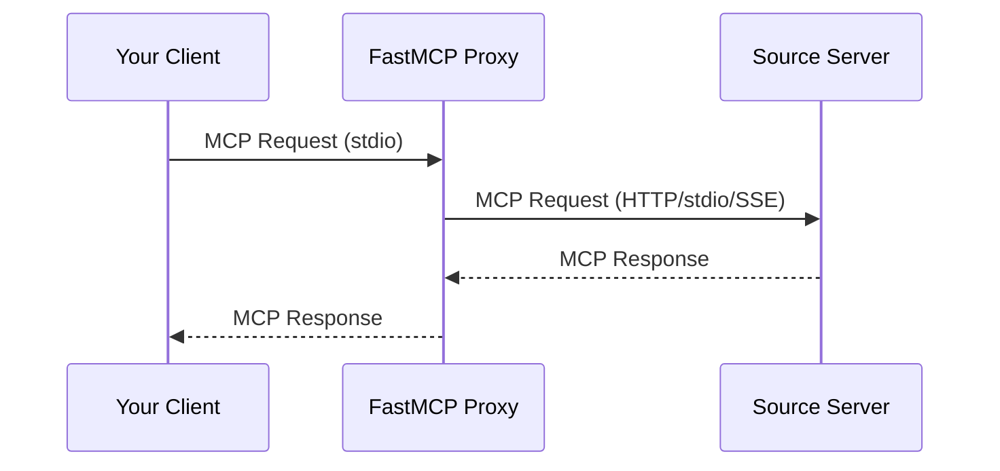

# Providers, Resources, and Sampling

Source lines: 18198-20824 from the original FastMCP documentation dump.

Custom providers, filesystem/local/proxy/skills providers, resources/templates, and sampling behavior.

---

# Custom Providers
Source: https://gofastmcp.com/servers/providers/custom

Build providers that source components from any data source

<VersionBadge />

Custom providers let you source components from anywhere - databases, APIs, configuration systems, or dynamic runtime logic. If you can write Python code to fetch or generate a component, you can wrap it in a provider.

## When to Build Custom

The built-in providers handle common cases: decorators (`LocalProvider`), composition (`FastMCPProvider`), and proxying (`ProxyProvider`). Build a custom provider when your components come from somewhere else:

* **Database-backed tools**: Admin users define tools in a database, and your server exposes them dynamically
* **API-backed resources**: Resources that fetch content from external services on demand
* **Configuration-driven components**: Components loaded from YAML/JSON config files at startup
* **Multi-tenant systems**: Different users see different tools based on their permissions
* **Plugin systems**: Third-party code registers components at runtime

## Providers vs Middleware

Both providers and [middleware](/servers/middleware) can influence what components a client sees, but they work at different levels.

**Providers** are objects that source components. They make it easy to reason about where tools, resources, and prompts come from - a database, another server, an API.

**Middleware** intercepts individual requests. It's well-suited for request-specific decisions like logging, rate limiting, or authentication.

You *could* use middleware to dynamically add tools based on request context. But it's often cleaner to have a provider source all possible tools, then use middleware or [visibility controls](/servers/visibility) to filter what each request can see. This separation makes it easier to reason about how components are sourced and how they interact with other server machinery.

## The Provider Interface

A provider implements protected `_list_*` methods that return available components. The public `list_*` methods handle transforms automatically - you override the underscore-prefixed versions:

```python theme={"theme":{"light":"snazzy-light","dark":"dark-plus"}}
from collections.abc import Sequence
from fastmcp.server.providers import Provider
from fastmcp.tools import Tool
from fastmcp.resources import Resource
from fastmcp.prompts import Prompt

class MyProvider(Provider):
    async def _list_tools(self) -> Sequence[Tool]:
        """Return all tools this provider offers."""
        return []

    async def _list_resources(self) -> Sequence[Resource]:
        """Return all resources this provider offers."""
        return []

    async def _list_prompts(self) -> Sequence[Prompt]:
        """Return all prompts this provider offers."""
        return []
```

You only need to implement the methods for component types you provide. The base class returns empty sequences by default.

The `_get_*` methods (`_get_tool`, `_get_resource`, `_get_prompt`) have default implementations that search through the list results. Override them only if you can fetch individual components more efficiently than iterating the full list.

## What Providers Return

Providers return component objects that are ready to use. When a client calls a tool, FastMCP invokes the tool's function - your provider isn't involved in execution. This means the `Tool`, `Resource`, or `Prompt` you return must actually work.

The easiest way to create components is from functions:

```python theme={"theme":{"light":"snazzy-light","dark":"dark-plus"}}
from fastmcp.tools import Tool

def add(a: int, b: int) -> int:
    """Add two numbers."""
    return a + b

tool = Tool.from_function(add)
```

The function's type hints become the input schema, and the docstring becomes the description. You can override these:

```python theme={"theme":{"light":"snazzy-light","dark":"dark-plus"}}
tool = Tool.from_function(
    add,
    name="calculator_add",
    description="Add two integers together"
)
```

Similar `from_function` methods exist for `Resource` and `Prompt`.

## Registering Providers

Add providers when creating the server:

```python theme={"theme":{"light":"snazzy-light","dark":"dark-plus"}}
mcp = FastMCP(
    "MyServer",
    providers=[
        DatabaseProvider(db_url),
        ConfigProvider(config_path),
    ]
)
```

Or add them after creation:

```python theme={"theme":{"light":"snazzy-light","dark":"dark-plus"}}
mcp = FastMCP("MyServer")
mcp.add_provider(DatabaseProvider(db_url))
```

## A Simple Provider

Here's a minimal provider that serves tools from a dictionary:

```python theme={"theme":{"light":"snazzy-light","dark":"dark-plus"}}
from collections.abc import Callable, Sequence
from fastmcp import FastMCP
from fastmcp.server.providers import Provider
from fastmcp.tools import Tool

class DictProvider(Provider):
    def __init__(self, tools: dict[str, Callable]):
        super().__init__()
        self._tools = [
            Tool.from_function(fn, name=name)
            for name, fn in tools.items()
        ]

    async def _list_tools(self) -> Sequence[Tool]:
        return self._tools
```

Use it like this:

```python theme={"theme":{"light":"snazzy-light","dark":"dark-plus"}}
def add(a: int, b: int) -> int:
    """Add two numbers."""
    return a + b

def multiply(a: int, b: int) -> int:
    """Multiply two numbers."""
    return a * b

mcp = FastMCP("Calculator", providers=[
    DictProvider({"add": add, "multiply": multiply})
])
```

## Lifecycle Management

Providers often need to set up connections when the server starts and clean them up when it stops. Override the `lifespan` method:

```python theme={"theme":{"light":"snazzy-light","dark":"dark-plus"}}
from contextlib import asynccontextmanager
from collections.abc import AsyncIterator, Sequence

class DatabaseProvider(Provider):
    def __init__(self, db_url: str):
        super().__init__()
        self.db_url = db_url
        self.db = None

    @asynccontextmanager
    async def lifespan(self) -> AsyncIterator[None]:
        self.db = await connect_database(self.db_url)
        try:
            yield
        finally:
            await self.db.close()

    async def _list_tools(self) -> Sequence[Tool]:
        rows = await self.db.fetch("SELECT * FROM tools")
        return [self._make_tool(row) for row in rows]
```

FastMCP calls your provider's `lifespan` during server startup and shutdown. The connection is available to your methods while the server runs.

## Full Example: API-Backed Resources

Here's a complete provider that fetches resources from an external REST API:

```python theme={"theme":{"light":"snazzy-light","dark":"dark-plus"}}
from contextlib import asynccontextmanager
from collections.abc import AsyncIterator, Sequence
from fastmcp.server.providers import Provider
from fastmcp.resources import Resource
import httpx

class ApiResourceProvider(Provider):
    """Provides resources backed by an external API."""

    def __init__(self, base_url: str, api_key: str):
        super().__init__()
        self.base_url = base_url
        self.api_key = api_key
        self.client = None

    @asynccontextmanager
    async def lifespan(self) -> AsyncIterator[None]:
        self.client = httpx.AsyncClient(
            base_url=self.base_url,
            headers={"Authorization": f"Bearer {self.api_key}"}
        )
        try:
            yield
        finally:
            await self.client.aclose()

    async def _list_resources(self) -> Sequence[Resource]:
        response = await self.client.get("/resources")
        response.raise_for_status()
        return [
            self._make_resource(item)
            for item in response.json()["items"]
        ]

    def _make_resource(self, data: dict) -> Resource:
        resource_id = data["id"]

        async def read_content() -> str:
            response = await self.client.get(
                f"/resources/{resource_id}/content"
            )
            return response.text

        return Resource.from_function(
            read_content,
            uri=f"api://resources/{resource_id}",
            name=data["name"],
            description=data.get("description", ""),
            mime_type=data.get("mime_type", "text/plain")
        )
```

Register it like any other provider:

```python theme={"theme":{"light":"snazzy-light","dark":"dark-plus"}}
from fastmcp import FastMCP

mcp = FastMCP("API Resources", providers=[
    ApiResourceProvider("https://api.example.com", "my-api-key")
])
```


# Filesystem Provider
Source: https://gofastmcp.com/servers/providers/filesystem

Automatic component discovery from Python files

<VersionBadge />

`FileSystemProvider` scans a directory for Python files and automatically registers functions decorated with `@tool`, `@resource`, or `@prompt`. This enables a file-based organization pattern similar to Next.js routing, where your project structure becomes your component registry.

## Why Filesystem Discovery

Traditional FastMCP servers require coordination between files. Either your tool files import the server to call `@server.tool()`, or your server file imports all the tool modules. Both approaches create coupling that some developers prefer to avoid.

`FileSystemProvider` eliminates this coordination. Each file is self-contained—it uses standalone decorators (`@tool`, `@resource`, `@prompt`) that don't require access to a server instance. The provider discovers these files at startup, so you can add new tools without modifying your server file.

This is a convention some teams prefer, not necessarily better for all projects. The tradeoffs:

* **No coordination**: Files don't import the server; server doesn't import files
* **Predictable naming**: Function names become component names (unless overridden)
* **Development mode**: Optionally re-scan files on every request for rapid iteration

## Quick Start

Create a provider pointing to your components directory, then pass it to your server. Use `Path(__file__).parent` to make the path relative to your server file.

```python theme={"theme":{"light":"snazzy-light","dark":"dark-plus"}}
from pathlib import Path

from fastmcp import FastMCP
from fastmcp.server.providers import FileSystemProvider

mcp = FastMCP("MyServer", providers=[FileSystemProvider(Path(__file__).parent / "mcp")])
```

In your `mcp/` directory, create Python files with decorated functions.

```python theme={"theme":{"light":"snazzy-light","dark":"dark-plus"}}
# mcp/tools/greet.py
from fastmcp.tools import tool

@tool
def greet(name: str) -> str:
    """Greet someone by name."""
    return f"Hello, {name}!"
```

When the server starts, `FileSystemProvider` scans the directory, imports all Python files, and registers any decorated functions it finds.

## Decorators

FastMCP provides standalone decorators that mark functions for discovery: `@tool` from `fastmcp.tools`, `@resource` from `fastmcp.resources`, and `@prompt` from `fastmcp.prompts`. These support the full syntax of server-bound decorators—all the same parameters work identically.

### @tool

Mark a function as a tool. The function name becomes the tool name by default.

```python theme={"theme":{"light":"snazzy-light","dark":"dark-plus"}}
from fastmcp.tools import tool

@tool
def calculate_sum(a: float, b: float) -> float:
    """Add two numbers together."""
    return a + b
```

Customize the tool with optional parameters.

```python theme={"theme":{"light":"snazzy-light","dark":"dark-plus"}}
from fastmcp.tools import tool

@tool(
    name="add-numbers",
    description="Add two numbers together.",
    tags={"math", "arithmetic"},
)
def add(a: float, b: float) -> float:
    return a + b
```

The decorator supports all standard tool options: `name`, `title`, `description`, `icons`, `tags`, `output_schema`, `annotations`, and `meta`.

### @resource

Mark a function as a resource. Unlike `@tool`, the `@resource` decorator requires a URI argument.

```python theme={"theme":{"light":"snazzy-light","dark":"dark-plus"}}
from fastmcp.resources import resource

@resource("config://app")
def get_app_config() -> str:
    """Get application configuration."""
    return '{"version": "1.0"}'
```

URIs with template parameters create resource templates. The provider automatically detects whether to register a static resource or a template based on whether the URI contains `{parameters}` or the function has arguments.

```python theme={"theme":{"light":"snazzy-light","dark":"dark-plus"}}
from fastmcp.resources import resource

@resource("users://{user_id}/profile")
def get_user_profile(user_id: str) -> str:
    """Get a user's profile by ID."""
    return f'{{"id": "{user_id}", "name": "User"}}'
```

The decorator supports: `uri` (required), `name`, `title`, `description`, `icons`, `mime_type`, `tags`, `annotations`, and `meta`.

### @prompt

Mark a function as a prompt template.

````python theme={"theme":{"light":"snazzy-light","dark":"dark-plus"}}
from fastmcp.prompts import prompt

@prompt
def code_review(code: str, language: str = "python") -> str:
    """Generate a code review prompt."""
    return f"Please review this {language} code:\n\n```{language}\n{code}\n```"
````

```python theme={"theme":{"light":"snazzy-light","dark":"dark-plus"}}
from fastmcp.prompts import prompt

@prompt(name="explain-concept", tags={"education"})
def explain(topic: str) -> str:
    """Generate an explanation prompt."""
    return f"Explain {topic} using clear examples and analogies."
```

The decorator supports: `name`, `title`, `description`, `icons`, `tags`, and `meta`.

## Directory Structure

The directory structure is purely organizational. The provider recursively scans all `.py` files regardless of which subdirectory they're in. Subdirectories like `tools/`, `resources/`, and `prompts/` are optional conventions that help you organize code.

```
mcp/
├── tools/
│   ├── greeting.py      # @tool functions
│   └── calculator.py    # @tool functions
├── resources/
│   └── config.py        # @resource functions
└── prompts/
    └── assistant.py     # @prompt functions
```

You can also put all components in a single file or organize by feature rather than type.

```
mcp/
├── user_management.py   # @tool, @resource, @prompt for users
├── billing.py           # @tool, @resource for billing
└── analytics.py         # @tool for analytics
```

## Discovery Rules

The provider follows these rules when scanning:

| Rule                | Behavior                                                              |
| ------------------- | --------------------------------------------------------------------- |
| File extensions     | Only `.py` files are scanned                                          |
| `__init__.py`       | Skipped (used for package structure, not components)                  |
| `__pycache__`       | Skipped                                                               |
| Private functions   | Functions starting with `_` are ignored, even if decorated            |
| No decorators       | Files without `@tool`, `@resource`, or `@prompt` are silently skipped |
| Multiple components | A single file can contain any number of decorated functions           |

### Package Imports

If your directory contains an `__init__.py` file, the provider imports files as proper Python package members. This means relative imports work correctly within your components directory.

```python theme={"theme":{"light":"snazzy-light","dark":"dark-plus"}}
# mcp/__init__.py exists

# mcp/tools/greeting.py
from ..helpers import format_name  # Relative imports work

@tool
def greet(name: str) -> str:
    return f"Hello, {format_name(name)}!"
```

Without `__init__.py`, files are imported directly using `importlib.util.spec_from_file_location`.

## Reload Mode

During development, you may want changes to component files to take effect without restarting the server. Enable reload mode to re-scan the directory on every request.

```python theme={"theme":{"light":"snazzy-light","dark":"dark-plus"}}
from pathlib import Path

from fastmcp.server.providers import FileSystemProvider

provider = FileSystemProvider(Path(__file__).parent / "mcp", reload=True)
```

With `reload=True`, the provider:

1. Re-discovers all Python files on each request
2. Re-imports modules that have changed
3. Updates the component registry with any new, modified, or removed components

<Warning>
  Reload mode adds overhead to every request. Use it only during development, not in production.
</Warning>

## Error Handling

When a file fails to import (syntax error, missing dependency, etc.), the provider logs a warning and continues scanning other files. Failed imports don't prevent the server from starting.

```
WARNING - Failed to import /path/to/broken.py: No module named 'missing_dep'
```

The provider tracks which files have failed and only re-logs warnings when the file's modification time changes. This prevents log spam when a broken file is repeatedly scanned in reload mode.

## Example Project

A complete example is available in the repository at `examples/filesystem-provider/`. The structure demonstrates the recommended organization.

```
examples/filesystem-provider/
├── server.py                    # Server entry point
└── mcp/
    ├── tools/
    │   ├── greeting.py          # greet, farewell tools
    │   └── calculator.py        # add, multiply tools
    ├── resources/
    │   └── config.py            # Static and templated resources
    └── prompts/
        └── assistant.py         # code_review, explain prompts
```

The server entry point is minimal.

```python theme={"theme":{"light":"snazzy-light","dark":"dark-plus"}}
from pathlib import Path

from fastmcp import FastMCP
from fastmcp.server.providers import FileSystemProvider

provider = FileSystemProvider(
    root=Path(__file__).parent / "mcp",
    reload=True,
)

mcp = FastMCP("FilesystemDemo", providers=[provider])
```

Run with `fastmcp run examples/filesystem-provider/server.py` or inspect with `fastmcp inspect examples/filesystem-provider/server.py`.


# Local Provider
Source: https://gofastmcp.com/servers/providers/local

The default provider for decorator-registered components

<VersionBadge />

`LocalProvider` stores components that you define directly on your server. When you use `@mcp.tool`, `@mcp.resource`, or `@mcp.prompt`, you're adding components to your server's `LocalProvider`.

## How It Works

Every FastMCP server has a `LocalProvider` as its first provider. Components registered via decorators or direct methods are stored here:

```python theme={"theme":{"light":"snazzy-light","dark":"dark-plus"}}
from fastmcp import FastMCP

mcp = FastMCP("MyServer")

# These are stored in the server's `LocalProvider`
@mcp.tool
def greet(name: str) -> str:
    """Greet someone by name."""
    return f"Hello, {name}!"

@mcp.resource("data://config")
def get_config() -> str:
    """Return configuration data."""
    return '{"version": "1.0"}'

@mcp.prompt
def analyze(topic: str) -> str:
    """Create an analysis prompt."""
    return f"Please analyze: {topic}"
```

The `LocalProvider` is always queried first when clients request components, ensuring that your directly-defined components take precedence over those from mounted or proxied servers.

## Component Registration

### Using Decorators

The most common way to register components:

```python theme={"theme":{"light":"snazzy-light","dark":"dark-plus"}}
@mcp.tool
def my_tool(x: int) -> str:
    return str(x)

@mcp.resource("data://info")
def my_resource() -> str:
    return "info"

@mcp.prompt
def my_prompt(topic: str) -> str:
    return f"Discuss: {topic}"
```

### Using Direct Methods

You can also add pre-built component objects:

```python theme={"theme":{"light":"snazzy-light","dark":"dark-plus"}}
from fastmcp.tools import Tool

# Create a tool object
my_tool = Tool.from_function(some_function, name="custom_tool")

# Add it to the server
mcp.add_tool(my_tool)
mcp.add_resource(my_resource)
mcp.add_prompt(my_prompt)
```

### Removing Components

Remove components by name or URI:

```python theme={"theme":{"light":"snazzy-light","dark":"dark-plus"}}
mcp.local_provider.remove_tool("my_tool")
mcp.local_provider.remove_resource("data://info")
mcp.local_provider.remove_prompt("my_prompt")
```

## Duplicate Handling

When you try to add a component that already exists, the behavior depends on the `on_duplicate` setting:

| Mode                | Behavior                |
| ------------------- | ----------------------- |
| `"error"` (default) | Raise `ValueError`      |
| `"warn"`            | Log warning and replace |
| `"replace"`         | Silently replace        |
| `"ignore"`          | Keep existing component |

Configure this when creating the server:

```python theme={"theme":{"light":"snazzy-light","dark":"dark-plus"}}
mcp = FastMCP("MyServer", on_duplicate="warn")
```

## Component Visibility

<VersionBadge />

Components can be dynamically enabled or disabled at runtime. Disabled components don't appear in listings and can't be called.

```python theme={"theme":{"light":"snazzy-light","dark":"dark-plus"}}
@mcp.tool(tags={"admin"})
def delete_all() -> str:
    """Delete everything."""
    return "Deleted"

@mcp.tool
def get_status() -> str:
    """Get system status."""
    return "OK"

# Disable admin tools
mcp.disable(tags={"admin"})

# Or only enable specific tools
mcp.enable(keys={"tool:get_status"}, only=True)
```

See [Visibility](/servers/visibility) for the full documentation on keys, tags, allowlist mode, and provider-level control.

## Standalone LocalProvider

You can create a LocalProvider independently and attach it to multiple servers:

```python theme={"theme":{"light":"snazzy-light","dark":"dark-plus"}}
from fastmcp import FastMCP
from fastmcp.server.providers import LocalProvider

# Create a reusable provider
shared_tools = LocalProvider()

@shared_tools.tool
def greet(name: str) -> str:
    return f"Hello, {name}!"

@shared_tools.resource("data://version")
def get_version() -> str:
    return "1.0.0"

# Attach to multiple servers
server1 = FastMCP("Server1", providers=[shared_tools])
server2 = FastMCP("Server2", providers=[shared_tools])
```

This is useful for:

* Sharing components across servers
* Testing components in isolation
* Building reusable component libraries

Standalone providers also support visibility control with `enable()` and `disable()`. See [Visibility](/servers/visibility) for details.


# Providers
Source: https://gofastmcp.com/servers/providers/overview

How FastMCP sources tools, resources, and prompts

<VersionBadge />

Every FastMCP server has one or more component providers. A provider is a source of tools, resources, and prompts - it's what makes components available to clients.

## What Is a Provider?

When a client connects to your server and asks "what tools do you have?", FastMCP asks each provider that question and combines the results. When a client calls a specific tool, FastMCP finds which provider has it and delegates the call.

You're already using providers. When you write `@mcp.tool`, you're adding a tool to your server's `LocalProvider` - the default provider that stores components you define directly in code. You just don't have to think about it for simple servers.

Providers become important when your components come from multiple sources: another FastMCP server to include, a remote MCP server to proxy, or a database where tools are defined dynamically. Each source gets its own provider, and FastMCP queries them all seamlessly.

## Why Providers?

The provider abstraction solves a common problem: as servers grow, you need to organize components across multiple sources without tangling everything together.

**Composition**: Break a large server into focused modules. A "weather" server and a "calendar" server can each be developed independently, then mounted into a main server. Each mounted server becomes a `FastMCPProvider`.

**Proxying**: Expose a remote MCP server through your local server. Maybe you're bridging transports (remote HTTP to local stdio) or aggregating multiple backends. Remote connections become `ProxyProvider` instances.

**Dynamic sources**: Load tools from a database, generate them from an OpenAPI spec, or create them based on user permissions. Custom providers let components come from anywhere.

## Built-in Providers

FastMCP includes providers for common patterns:

| Provider          | What it does                         | How you use it                |
| ----------------- | ------------------------------------ | ----------------------------- |
| `LocalProvider`   | Stores components you define in code | `@mcp.tool`, `mcp.add_tool()` |
| `FastMCPProvider` | Wraps another FastMCP server         | `mcp.mount(server)`           |
| `ProxyProvider`   | Connects to remote MCP servers       | `create_proxy(client)`        |

Most users only interact with `LocalProvider` (through decorators) and occasionally mount or proxy other servers. The provider abstraction stays invisible until you need it.

## Transforms

[Transforms](/servers/transforms/transforms) modify components as they flow from providers to clients. Each transform sits in a chain, intercepting queries and modifying results before passing them along.

| Transform       | Purpose                                                |
| --------------- | ------------------------------------------------------ |
| `Namespace`     | Prefixes names to avoid conflicts                      |
| `ToolTransform` | Modifies tool schemas (rename, description, arguments) |

The most common use is namespacing mounted servers to prevent name collisions. When you call `mount(server, namespace="api")`, FastMCP creates a `Namespace` transform automatically.

Transforms can be added to individual providers (affecting just that source) or to the server itself (affecting all components). See [Transforms](/servers/transforms/transforms) for the full picture.

## Provider Order

When a client requests a tool, FastMCP queries providers in registration order. The first provider that has the tool handles the request.

`LocalProvider` is always first, so your decorator-defined tools take precedence. Additional providers are queried in the order you added them. This means if two providers have a tool with the same name, the first one wins.

## When to Care About Providers

**You can ignore providers entirely** if you're building a simple server with decorators. Just use `@mcp.tool`, `@mcp.resource`, and `@mcp.prompt` - FastMCP handles the rest.

**Learn about providers when** you want to:

* [Mount another server](/servers/composition) into yours
* [Proxy a remote server](/servers/providers/proxy) through yours
* [Control visibility state](/servers/visibility) of components
* [Build dynamic sources](/servers/providers/custom) like database-backed tools

## Next Steps

* [Local](/servers/providers/local) - How decorators work
* [Mounting](/servers/composition) - Compose servers together
* [Proxying](/servers/providers/proxy) - Connect to remote servers
* [Transforms](/servers/transforms/transforms) - Namespace, rename, and modify components
* [Visibility](/servers/visibility) - Control which components clients can access
* [Custom](/servers/providers/custom) - Build your own providers


# MCP Proxy Provider
Source: https://gofastmcp.com/servers/providers/proxy

Source components from other MCP servers

<VersionBadge />

The Proxy Provider sources components from another MCP server through a client connection. This lets you expose any MCP server's tools, resources, and prompts through your own server, whether the source is local or accessed over the network.

## Why Use Proxy Provider

The Proxy Provider enables:

* **Bridge transports**: Make an HTTP server available via stdio, or vice versa
* **Aggregate servers**: Combine multiple source servers into one unified server
* **Add security**: Act as a controlled gateway with authentication and authorization
* **Simplify access**: Provide a stable endpoint even if backend servers change



## Quick Start

<VersionBadge />

Create a proxy using `create_proxy()`:

```python theme={"theme":{"light":"snazzy-light","dark":"dark-plus"}}
from fastmcp.server import create_proxy

# create_proxy() accepts URLs, file paths, and transports directly
proxy = create_proxy("http://example.com/mcp", name="MyProxy")

if __name__ == "__main__":
    proxy.run()
```

This gives you:

* Safe concurrent request handling
* Automatic forwarding of MCP features (sampling, elicitation, etc.)
* Session isolation to prevent context mixing

<Tip>
  To mount a proxy inside another FastMCP server, see [Mounting External Servers](/servers/composition#mounting-external-servers).
</Tip>

## Transport Bridging

A common use case is bridging transports between servers:

```python theme={"theme":{"light":"snazzy-light","dark":"dark-plus"}}
from fastmcp.server import create_proxy

# Bridge HTTP server to local stdio
http_proxy = create_proxy("http://example.com/mcp/sse", name="HTTP-to-stdio")

# Run locally via stdio for Claude Desktop
if __name__ == "__main__":
    http_proxy.run()  # Defaults to stdio
```

Or expose a local server via HTTP:

```python theme={"theme":{"light":"snazzy-light","dark":"dark-plus"}}
from fastmcp.server import create_proxy

# Bridge local server to HTTP
local_proxy = create_proxy("local_server.py", name="stdio-to-HTTP")

if __name__ == "__main__":
    local_proxy.run(transport="http", host="0.0.0.0", port=8080)
```

## Session Isolation

<VersionBadge />

`create_proxy()` provides session isolation - each request gets its own isolated backend session:

```python theme={"theme":{"light":"snazzy-light","dark":"dark-plus"}}
from fastmcp.server import create_proxy

# Each request creates a fresh backend session (recommended)
proxy = create_proxy("backend_server.py")

# Multiple clients can use this proxy simultaneously:
# - Client A calls a tool → gets isolated session
# - Client B calls a tool → gets different session
# - No context mixing
```

### Shared Sessions

If you pass an already-connected client, the proxy reuses that session:

```python theme={"theme":{"light":"snazzy-light","dark":"dark-plus"}}
from fastmcp import Client
from fastmcp.server import create_proxy

async with Client("backend_server.py") as connected_client:
    # This proxy reuses the connected session
    proxy = create_proxy(connected_client)

    # ⚠️ Warning: All requests share the same session
```

<Warning>
  Shared sessions may cause context mixing in concurrent scenarios. Use only in single-threaded situations or with explicit synchronization.
</Warning>

## MCP Feature Forwarding

<VersionBadge />

Proxies automatically forward MCP protocol features:

| Feature     | Description                     |
| ----------- | ------------------------------- |
| Roots       | Filesystem root access requests |
| Sampling    | LLM completion requests         |
| Elicitation | User input requests             |
| Logging     | Log messages from backend       |
| Progress    | Progress notifications          |

```python theme={"theme":{"light":"snazzy-light","dark":"dark-plus"}}
from fastmcp.server import create_proxy

# All features forwarded automatically
proxy = create_proxy("advanced_backend.py")

# When the backend:
# - Requests LLM sampling → forwarded to your client
# - Logs messages → appear in your client
# - Reports progress → shown in your client
```

### Disabling Features

Selectively disable forwarding:

```python theme={"theme":{"light":"snazzy-light","dark":"dark-plus"}}
from fastmcp.server.providers.proxy import ProxyClient

backend = ProxyClient(
    "backend_server.py",
    sampling_handler=None,  # Disable LLM sampling
    log_handler=None        # Disable log forwarding
)
```

## Configuration-Based Proxies

<VersionBadge />

Create proxies from configuration dictionaries:

```python theme={"theme":{"light":"snazzy-light","dark":"dark-plus"}}
from fastmcp.server import create_proxy

config = {
    "mcpServers": {
        "default": {
            "url": "https://example.com/mcp",
            "transport": "http"
        }
    }
}

proxy = create_proxy(config, name="Config-Based Proxy")
```

### Multi-Server Proxies

Combine multiple servers with automatic namespacing:

```python theme={"theme":{"light":"snazzy-light","dark":"dark-plus"}}
from fastmcp.server import create_proxy

config = {
    "mcpServers": {
        "weather": {
            "url": "https://weather-api.example.com/mcp",
            "transport": "http"
        },
        "calendar": {
            "url": "https://calendar-api.example.com/mcp",
            "transport": "http"
        }
    }
}

# Creates unified proxy with prefixed components:
# - weather_get_forecast
# - calendar_add_event
composite = create_proxy(config, name="Composite")
```

## Component Prefixing

Proxied components follow standard prefixing rules:

| Component Type | Pattern                    |
| -------------- | -------------------------- |
| Tools          | `{prefix}_{tool_name}`     |
| Prompts        | `{prefix}_{prompt_name}`   |
| Resources      | `protocol://{prefix}/path` |
| Templates      | `protocol://{prefix}/...`  |

## Mirrored Components

<VersionBadge />

Components from a proxy server are "mirrored" - they reflect the remote server's state and cannot be modified directly.

To modify a proxied component (like disabling it), create a local copy:

```python theme={"theme":{"light":"snazzy-light","dark":"dark-plus"}}
from fastmcp import FastMCP
from fastmcp.server import create_proxy

proxy = create_proxy("backend_server.py")

# Get mirrored tool
mirrored_tool = await proxy.get_tool("useful_tool")

# Create modifiable local copy
local_tool = mirrored_tool.copy()

# Add to your own server
my_server = FastMCP("MyServer")
my_server.add_tool(local_tool)

# Now you can control enabled state
my_server.disable(keys={local_tool.key})
```

## Performance Considerations

Proxying introduces network latency:

| Operation      | Local | Proxied (HTTP) |
| -------------- | ----- | -------------- |
| `list_tools()` | 1-2ms | 300-400ms      |
| `call_tool()`  | 1-2ms | 200-500ms      |

When mounting proxy servers, this latency affects all operations on the parent server.

For low-latency requirements, consider caching strategies or limiting mounting depth.

## Advanced Usage

### FastMCPProxy Class

For explicit session control, use `FastMCPProxy` directly:

```python theme={"theme":{"light":"snazzy-light","dark":"dark-plus"}}
from fastmcp.server.providers.proxy import FastMCPProxy, ProxyClient

# Custom session factory
def create_client():
    return ProxyClient("backend_server.py")

proxy = FastMCPProxy(client_factory=create_client)
```

This gives you full control over session creation and reuse strategies.

### Adding Proxied Components to Existing Server

Mount a proxy to add components from another server:

```python theme={"theme":{"light":"snazzy-light","dark":"dark-plus"}}
from fastmcp import FastMCP
from fastmcp.server import create_proxy

server = FastMCP("My Server")

# Add local tools
@server.tool
def local_tool() -> str:
    return "Local result"

# Mount proxied tools from another server
external = create_proxy("http://external-server/mcp")
server.mount(external)

# Now server has both local and proxied tools
```


# Skills Provider
Source: https://gofastmcp.com/servers/providers/skills

Expose agent skills as MCP resources

<VersionBadge />

Agent skills are directories containing instructions and supporting files that teach an AI assistant how to perform specific tasks. Tools like Claude Code, Cursor, and VS Code Copilot each have their own skills directories where users can add custom capabilities. The Skills Provider exposes these skill directories as MCP resources, making skills discoverable and shareable across different AI tools and clients.

## Why Skills as Resources

Skills live in platform-specific directories (`~/.claude/skills/`, `~/.cursor/skills/`, etc.) and typically contain a main instruction file plus supporting reference materials. When you want to share skills between tools or access them from a custom client, you need a way to discover and retrieve these files programmatically.

The Skills Provider solves this by exposing each skill as a set of MCP resources. A client can list available skills, read the main instruction file, check the manifest to see what supporting files exist, and fetch any file it needs. This transforms local skill directories into a standardized API that works with any MCP client.

## Quick Start

Create a provider pointing to your skills directory, then add it to your server.

```python theme={"theme":{"light":"snazzy-light","dark":"dark-plus"}}
from pathlib import Path

from fastmcp import FastMCP
from fastmcp.server.providers.skills import SkillsDirectoryProvider

mcp = FastMCP("Skills Server")
mcp.add_provider(SkillsDirectoryProvider(roots=Path.home() / ".claude" / "skills"))
```

Each subdirectory containing a `SKILL.md` file becomes a discoverable skill. Clients can then list resources to see available skills and read them as needed.

```python theme={"theme":{"light":"snazzy-light","dark":"dark-plus"}}
from fastmcp import Client

async with Client(mcp) as client:
    # List all skill resources
    resources = await client.list_resources()
    for r in resources:
        print(r.uri)  # skill://my-skill/SKILL.md, skill://my-skill/_manifest, ...

    # Read a skill's main instruction file
    result = await client.read_resource("skill://my-skill/SKILL.md")
    print(result[0].text)
```

## Skill Structure

A skill is a directory containing a main instruction file (default: `SKILL.md`) and optionally supporting files. The directory name becomes the skill's identifier.

```
~/.claude/skills/
├── pdf-processing/
│   ├── SKILL.md           # Main instructions
│   ├── reference.md       # Supporting documentation
│   └── examples/
│       └── sample.pdf
└── code-review/
    └── SKILL.md
```

The main file can include YAML frontmatter to provide metadata. If no frontmatter exists, the provider extracts a description from the first meaningful line of content.

```markdown theme={"theme":{"light":"snazzy-light","dark":"dark-plus"}}
---
description: Process and extract information from PDF documents
---

# PDF Processing

Instructions for handling PDFs...
```

## Resource URIs

Each skill exposes three types of resources, all using the `skill://` URI scheme.

The main instruction file contains the primary skill content. This is the resource clients read to understand what a skill does and how to use it.

```
skill://pdf-processing/SKILL.md
```

The manifest is a synthetic JSON resource listing all files in the skill directory with their sizes and SHA256 hashes. Clients use this to discover supporting files and verify content integrity.

```
skill://pdf-processing/_manifest
```

Reading the manifest returns structured file information.

```json theme={"theme":{"light":"snazzy-light","dark":"dark-plus"}}
{
  "skill": "pdf-processing",
  "files": [
    {"path": "SKILL.md", "size": 1234, "hash": "sha256:abc123..."},
    {"path": "reference.md", "size": 567, "hash": "sha256:def456..."},
    {"path": "examples/sample.pdf", "size": 89012, "hash": "sha256:ghi789..."}
  ]
}
```

Supporting files are any additional files in the skill directory. These might be reference documentation, code examples, or binary assets.

```
skill://pdf-processing/reference.md
skill://pdf-processing/examples/sample.pdf
```

## Provider Architecture

The Skills Provider uses a two-layer architecture to handle both single skills and skill directories.

### SkillProvider

`SkillProvider` handles a single skill directory. It loads the main file, parses any frontmatter, scans for supporting files, and creates the appropriate resources.

```python theme={"theme":{"light":"snazzy-light","dark":"dark-plus"}}
from pathlib import Path

from fastmcp import FastMCP
from fastmcp.server.providers.skills import SkillProvider

mcp = FastMCP("Single Skill")
mcp.add_provider(SkillProvider(Path.home() / ".claude" / "skills" / "pdf-processing"))
```

Use `SkillProvider` when you want to expose exactly one skill, or when you need fine-grained control over individual skill configuration.

### SkillsDirectoryProvider

`SkillsDirectoryProvider` scans one or more root directories and creates a `SkillProvider` for each valid skill folder it finds. A folder is considered a valid skill if it contains the main file (default: `SKILL.md`).

```python theme={"theme":{"light":"snazzy-light","dark":"dark-plus"}}
from pathlib import Path

from fastmcp import FastMCP
from fastmcp.server.providers.skills import SkillsDirectoryProvider

mcp = FastMCP("Skills")
mcp.add_provider(SkillsDirectoryProvider(roots=Path.home() / ".claude" / "skills"))
```

When scanning multiple root directories, provide them as a list. The first directory takes precedence if the same skill name appears in multiple roots.

```python theme={"theme":{"light":"snazzy-light","dark":"dark-plus"}}
from pathlib import Path

from fastmcp import FastMCP
from fastmcp.server.providers.skills import SkillsDirectoryProvider

mcp = FastMCP("Skills")
mcp.add_provider(SkillsDirectoryProvider(roots=[
    Path.cwd() / ".claude" / "skills",      # Project-level skills first
    Path.home() / ".claude" / "skills",     # User-level fallback
]))
```

## Vendor Providers

FastMCP includes pre-configured providers for popular AI coding tools. Each vendor provider extends `SkillsDirectoryProvider` with the appropriate default directory for that platform.

| Provider                 | Default Directory                           |
| ------------------------ | ------------------------------------------- |
| `ClaudeSkillsProvider`   | `~/.claude/skills/`                         |
| `CursorSkillsProvider`   | `~/.cursor/skills/`                         |
| `VSCodeSkillsProvider`   | `~/.copilot/skills/`                        |
| `CodexSkillsProvider`    | `/etc/codex/skills/` and `~/.codex/skills/` |
| `GeminiSkillsProvider`   | `~/.gemini/skills/`                         |
| `GooseSkillsProvider`    | `~/.config/agents/skills/`                  |
| `CopilotSkillsProvider`  | `~/.copilot/skills/`                        |
| `OpenCodeSkillsProvider` | `~/.config/opencode/skills/`                |

Vendor providers accept the same configuration options as `SkillsDirectoryProvider` (except for `roots`, which is locked to the platform default).

```python theme={"theme":{"light":"snazzy-light","dark":"dark-plus"}}
from fastmcp import FastMCP
from fastmcp.server.providers.skills import ClaudeSkillsProvider

mcp = FastMCP("Claude Skills")
mcp.add_provider(ClaudeSkillsProvider())  # Uses ~/.claude/skills/
```

`CodexSkillsProvider` scans both system-level (`/etc/codex/skills/`) and user-level (`~/.codex/skills/`) directories, with system skills taking precedence.

## Supporting Files Disclosure

The `supporting_files` parameter controls how supporting files (everything except the main file and manifest) appear to clients.

### Template Mode (Default)

With `supporting_files="template"`, supporting files are accessed through a `ResourceTemplate` rather than being listed as individual resources. Clients see only the main file and manifest in `list_resources()`, then discover supporting files by reading the manifest.

```python theme={"theme":{"light":"snazzy-light","dark":"dark-plus"}}
from pathlib import Path

from fastmcp.server.providers.skills import SkillsDirectoryProvider

# Default behavior - supporting files hidden from list_resources()
provider = SkillsDirectoryProvider(
    roots=Path.home() / ".claude" / "skills",
    supporting_files="template",  # This is the default
)
```

This keeps the resource list compact when skills contain many files. Clients that need supporting files read the manifest first, then request specific files by URI.

### Resources Mode

With `supporting_files="resources"`, every file in every skill appears as an individual resource in `list_resources()`. Clients get full enumeration upfront without needing to read manifests.

```python theme={"theme":{"light":"snazzy-light","dark":"dark-plus"}}
from pathlib import Path

from fastmcp.server.providers.skills import SkillsDirectoryProvider

# All files visible as individual resources
provider = SkillsDirectoryProvider(
    roots=Path.home() / ".claude" / "skills",
    supporting_files="resources",
)
```

Use this mode when clients need to discover all available files without additional round trips, or when integrating with tools that expect flat resource lists.

## Reload Mode

Enable reload mode to re-scan the skills directory on every request. Changes to skills take effect immediately without restarting the server.

```python theme={"theme":{"light":"snazzy-light","dark":"dark-plus"}}
from pathlib import Path

from fastmcp.server.providers.skills import SkillsDirectoryProvider

provider = SkillsDirectoryProvider(
    roots=Path.home() / ".claude" / "skills",
    reload=True,
)
```

With `reload=True`, the provider re-discovers skills on each `list_resources()` or `read_resource()` call. New skills appear, removed skills disappear, and modified content reflects current file state.

<Warning>
  Reload mode adds overhead to every request. Use it during development when you're actively editing skills, but disable it in production.
</Warning>

## Client Utilities

FastMCP provides utilities for downloading skills from any MCP server that exposes them. These are standalone functions in `fastmcp.utilities.skills`.

### Discovering Skills

Use `list_skills()` to see what skills are available on a server.

```python theme={"theme":{"light":"snazzy-light","dark":"dark-plus"}}
from fastmcp import Client
from fastmcp.utilities.skills import list_skills

async with Client("http://skills-server/mcp") as client:
    skills = await list_skills(client)
    for skill in skills:
        print(f"{skill.name}: {skill.description}")
```

### Downloading Skills

Use `download_skill()` to download a single skill, or `sync_skills()` to download all available skills.

```python theme={"theme":{"light":"snazzy-light","dark":"dark-plus"}}
from pathlib import Path

from fastmcp import Client
from fastmcp.utilities.skills import download_skill, sync_skills

async with Client("http://skills-server/mcp") as client:
    # Download one skill
    path = await download_skill(client, "pdf-processing", Path.home() / ".claude" / "skills")

    # Or download all skills
    paths = await sync_skills(client, Path.home() / ".claude" / "skills")
```

Both functions accept an `overwrite` parameter. When `False` (default), existing skills are skipped. When `True`, existing files are replaced.

### Inspecting Manifests

Use `get_skill_manifest()` to see what files a skill contains before downloading.

```python theme={"theme":{"light":"snazzy-light","dark":"dark-plus"}}
from fastmcp import Client
from fastmcp.utilities.skills import get_skill_manifest

async with Client("http://skills-server/mcp") as client:
    manifest = await get_skill_manifest(client, "pdf-processing")
    for file in manifest.files:
        print(f"{file.path} ({file.size} bytes, {file.hash})")
```


# Resources & Templates
Source: https://gofastmcp.com/servers/resources

Expose data sources and dynamic content generators to your MCP client.

Resources represent data or files that an MCP client can read, and resource templates extend this concept by allowing clients to request dynamically generated resources based on parameters passed in the URI.

FastMCP simplifies defining both static and dynamic resources, primarily using the `@mcp.resource` decorator.

## What Are Resources?

Resources provide read-only access to data for the LLM or client application. When a client requests a resource URI:

1. FastMCP finds the corresponding resource definition.
2. If it's dynamic (defined by a function), the function is executed.
3. The content (text, JSON, binary data) is returned to the client.

This allows LLMs to access files, database content, configuration, or dynamically generated information relevant to the conversation.

## Resources

### The `@resource` Decorator

The most common way to define a resource is by decorating a Python function. The decorator requires the resource's unique URI.

```python theme={"theme":{"light":"snazzy-light","dark":"dark-plus"}}
import json
from fastmcp import FastMCP

mcp = FastMCP(name="DataServer")

# Basic dynamic resource returning a string
@mcp.resource("resource://greeting")
def get_greeting() -> str:
    """Provides a simple greeting message."""
    return "Hello from FastMCP Resources!"

# Resource returning JSON data
@mcp.resource("data://config")
def get_config() -> str:
    """Provides application configuration as JSON."""
    return json.dumps({
        "theme": "dark",
        "version": "1.2.0",
        "features": ["tools", "resources"],
    })
```

**Key Concepts:**

* **URI:** The first argument to `@resource` is the unique URI (e.g., `"resource://greeting"`) clients use to request this data.
* **Lazy Loading:** The decorated function (`get_greeting`, `get_config`) is only executed when a client specifically requests that resource URI via `resources/read`.
* **Inferred Metadata:** By default:
  * Resource Name: Taken from the function name (`get_greeting`).
  * Resource Description: Taken from the function's docstring.

#### Decorator Arguments

You can customize the resource's properties using arguments in the `@mcp.resource` decorator:

```python theme={"theme":{"light":"snazzy-light","dark":"dark-plus"}}
from fastmcp import FastMCP

mcp = FastMCP(name="DataServer")

# Example specifying metadata
@mcp.resource(
    uri="data://app-status",      # Explicit URI (required)
    name="ApplicationStatus",     # Custom name
    description="Provides the current status of the application.", # Custom description
    mime_type="application/json", # Explicit MIME type
    tags={"monitoring", "status"}, # Categorization tags
    meta={"version": "2.1", "team": "infrastructure"}  # Custom metadata
)
def get_application_status() -> str:
    """Internal function description (ignored if description is provided above)."""
    return json.dumps({"status": "ok", "uptime": 12345, "version": mcp.settings.version})
```

<Card icon="code" title="@resource Decorator Arguments">
  <ParamField type="str">
    The unique identifier for the resource
  </ParamField>

  <ParamField type="str | None">
    A human-readable name. If not provided, defaults to function name
  </ParamField>

  <ParamField type="str | None">
    Explanation of the resource. If not provided, defaults to docstring
  </ParamField>

  <ParamField type="str | None">
    Specifies the content type. FastMCP often infers a default like `text/plain` or `application/json`, but explicit is better for non-text types
  </ParamField>

  <ParamField type="set[str] | None">
    A set of strings used to categorize the resource. These can be used by the server and, in some cases, by clients to filter or group available resources.
  </ParamField>

  <ParamField type="bool">
    <Warning>Deprecated in v3.0.0. Use `mcp.enable()` / `mcp.disable()` at the server level instead.</Warning>
    A boolean to enable or disable the resource. See [Component Visibility](#component-visibility) for the recommended approach.
  </ParamField>

  <ParamField type="list[Icon] | None">
    <VersionBadge />

    Optional list of icon representations for this resource or template. See [Icons](/servers/icons) for detailed examples
  </ParamField>

  <ParamField type="Annotations | dict | None">
    An optional `Annotations` object or dictionary to add additional metadata about the resource.

    <Expandable title="Annotations attributes">
      <ParamField type="bool | None">
        If true, the resource is read-only and does not modify its environment.
      </ParamField>

      <ParamField type="bool | None">
        If true, reading the resource repeatedly will have no additional effect on its environment.
      </ParamField>
    </Expandable>
  </ParamField>

  <ParamField type="dict[str, Any] | None">
    <VersionBadge />

    Optional meta information about the resource. This data is passed through to the MCP client as the `meta` field of the client-side resource object and can be used for custom metadata, versioning, or other application-specific purposes.
  </ParamField>

  <ParamField type="str | int | None">
    <VersionBadge />

    Optional version identifier for this resource. See [Versioning](/servers/versioning) for details.
  </ParamField>
</Card>

#### Using with Methods

For decorating instance or class methods, use the standalone `@resource` decorator and register the bound method. See [Tools: Using with Methods](/servers/tools#using-with-methods) for the pattern.

### Return Values

Resource functions must return one of three types:

* **`str`**: Sent as `TextResourceContents` (with `mime_type="text/plain"` by default).
* **`bytes`**: Base64 encoded and sent as `BlobResourceContents`. You should specify an appropriate `mime_type` (e.g., `"image/png"`, `"application/octet-stream"`).
* **`ResourceResult`**: Full control over contents, MIME types, and metadata. See [ResourceResult](#resourceresult) below.

<Note>
  To return structured data like dicts or lists, serialize them to JSON strings using `json.dumps()`. This explicit approach ensures your type checker catches errors during development rather than at runtime when a client reads the resource.
</Note>

#### ResourceResult

<VersionBadge />

`ResourceResult` gives you explicit control over resource responses: multiple content items, per-item MIME types, and metadata at both the item and result level.

```python theme={"theme":{"light":"snazzy-light","dark":"dark-plus"}}
from fastmcp import FastMCP
from fastmcp.resources import ResourceResult, ResourceContent

mcp = FastMCP()

@mcp.resource("data://users")
def get_users() -> ResourceResult:
    return ResourceResult(
        contents=[
            ResourceContent(content='[{"id": 1}]', mime_type="application/json"),
            ResourceContent(content="# Users\n...", mime_type="text/markdown"),
        ],
        meta={"total": 1}
    )
```

`ResourceContent` accepts three fields:

**`content`** - The actual resource content. Can be `str` (text content) or `bytes` (binary content). This is the data that will be returned to the client.

**`mime_type`** - Optional MIME type for the content. Defaults to `"text/plain"` for string content and `"application/octet-stream"` for binary content.

**`meta`** - Optional metadata dictionary that will be included in the MCP response's `meta` field. Use this for runtime metadata like Content Security Policy headers, caching hints, or other client-specific data.

For simple cases, you can pass `str` or `bytes` directly to `ResourceResult`:

```python theme={"theme":{"light":"snazzy-light","dark":"dark-plus"}}
return ResourceResult("plain text")           # auto-converts to ResourceContent
return ResourceResult(b"\x00\x01\x02")         # binary content
```

<Card title="ResourceResult">
  <ParamField type="str | bytes | list[ResourceContent]">
    Content to return. Strings and bytes are wrapped in a single `ResourceContent`. Use a list of `ResourceContent` for multiple items or custom MIME types.
  </ParamField>

  <ParamField type="dict[str, Any] | None">
    Result-level metadata, included in the MCP response's `_meta` field.
  </ParamField>
</Card>

<Card title="ResourceContent">
  <ParamField type="Any">
    The content data. Strings and bytes pass through directly. Other types (dict, list, BaseModel) are automatically JSON-serialized.
  </ParamField>

  <ParamField type="str | None">
    MIME type. Defaults to `text/plain` for strings, `application/octet-stream` for bytes, `application/json` for serialized objects.
  </ParamField>

  <ParamField type="dict[str, Any] | None">
    Item-level metadata for this specific content.
  </ParamField>
</Card>

### Component Visibility

<VersionBadge />

You can control which resources are enabled for clients using server-level enabled control. Disabled resources don't appear in `list_resources` and can't be read.

```python theme={"theme":{"light":"snazzy-light","dark":"dark-plus"}}
from fastmcp import FastMCP

mcp = FastMCP("MyServer")

@mcp.resource("data://public", tags={"public"})
def get_public(): return "public"

@mcp.resource("data://secret", tags={"internal"})
def get_secret(): return "secret"

# Disable specific resources by key
mcp.disable(keys={"resource:data://secret"})

# Disable resources by tag
mcp.disable(tags={"internal"})

# Or use allowlist mode - only enable resources with specific tags
mcp.enable(tags={"public"}, only=True)
```

See [Visibility](/servers/visibility) for the complete visibility control API including key formats, tag-based filtering, and provider-level control.

### Accessing MCP Context

<VersionBadge />

Resources and resource templates can access additional MCP information and features through the `Context` object. To access it, add a parameter to your resource function with a type annotation of `Context`:

```python {6, 14} theme={"theme":{"light":"snazzy-light","dark":"dark-plus"}}
from fastmcp import FastMCP, Context

mcp = FastMCP(name="DataServer")

@mcp.resource("resource://system-status")
async def get_system_status(ctx: Context) -> str:
    """Provides system status information."""
    return json.dumps({
        "status": "operational",
        "request_id": ctx.request_id
    })

@mcp.resource("resource://{name}/details")
async def get_details(name: str, ctx: Context) -> str:
    """Get details for a specific name."""
    return json.dumps({
        "name": name,
        "accessed_at": ctx.request_id
    })
```

For full documentation on the Context object and all its capabilities, see the [Context documentation](/servers/context).

### Async Resources

FastMCP supports both `async def` and regular `def` resource functions. Synchronous functions automatically run in a threadpool to avoid blocking the event loop.

For I/O-bound operations, async functions are more efficient:

```python theme={"theme":{"light":"snazzy-light","dark":"dark-plus"}}
import aiofiles
from fastmcp import FastMCP

mcp = FastMCP(name="DataServer")

@mcp.resource("file:///app/data/important_log.txt", mime_type="text/plain")
async def read_important_log() -> str:
    """Reads content from a specific log file asynchronously."""
    try:
        async with aiofiles.open("/app/data/important_log.txt", mode="r") as f:
            content = await f.read()
        return content
    except FileNotFoundError:
        return "Log file not found."
```

### Resource Classes

While `@mcp.resource` is ideal for dynamic content, you can directly register pre-defined resources (like static files or simple text) using `mcp.add_resource()` and concrete `Resource` subclasses.

```python theme={"theme":{"light":"snazzy-light","dark":"dark-plus"}}
from pathlib import Path
from fastmcp import FastMCP
from fastmcp.resources import FileResource, TextResource, DirectoryResource

mcp = FastMCP(name="DataServer")

# 1. Exposing a static file directly
readme_path = Path("./README.md").resolve()
if readme_path.exists():
    # Use a file:// URI scheme
    readme_resource = FileResource(
        uri=f"file://{readme_path.as_posix()}",
        path=readme_path, # Path to the actual file
        name="README File",
        description="The project's README.",
        mime_type="text/markdown",
        tags={"documentation"}
    )
    mcp.add_resource(readme_resource)

# 2. Exposing simple, predefined text
notice_resource = TextResource(
    uri="resource://notice",
    name="Important Notice",
    text="System maintenance scheduled for Sunday.",
    tags={"notification"}
)
mcp.add_resource(notice_resource)

# 3. Exposing a directory listing
data_dir_path = Path("./app_data").resolve()
if data_dir_path.is_dir():
    data_listing_resource = DirectoryResource(
        uri="resource://data-files",
        path=data_dir_path, # Path to the directory
        name="Data Directory Listing",
        description="Lists files available in the data directory.",
        recursive=False # Set to True to list subdirectories
    )
    mcp.add_resource(data_listing_resource) # Returns JSON list of files
```

**Common Resource Classes:**

* `TextResource`: For simple string content.
* `BinaryResource`: For raw `bytes` content.
* `FileResource`: Reads content from a local file path. Handles text/binary modes and lazy reading.
* `HttpResource`: Fetches content from an HTTP(S) URL (requires `httpx`).
* `DirectoryResource`: Lists files in a local directory (returns JSON).
* (`FunctionResource`: Internal class used by `@mcp.resource`).

Use these when the content is static or sourced directly from a file/URL, bypassing the need for a dedicated Python function.

### Notifications

<VersionBadge />

FastMCP automatically sends `notifications/resources/list_changed` notifications to connected clients when resources or templates are added, enabled, or disabled. This allows clients to stay up-to-date with the current resource set without manually polling for changes.

```python theme={"theme":{"light":"snazzy-light","dark":"dark-plus"}}
@mcp.resource("data://example")
def example_resource() -> str:
    return "Hello!"

# These operations trigger notifications:
mcp.add_resource(example_resource)                   # Sends resources/list_changed notification
mcp.disable(keys={"resource:data://example"})        # Sends resources/list_changed notification
mcp.enable(keys={"resource:data://example"})         # Sends resources/list_changed notification
```

Notifications are only sent when these operations occur within an active MCP request context (e.g., when called from within a tool or other MCP operation). Operations performed during server initialization do not trigger notifications.

Clients can handle these notifications using a [message handler](/clients/notifications) to automatically refresh their resource lists or update their interfaces.

### Annotations

<VersionBadge />

FastMCP allows you to add specialized metadata to your resources through annotations. These annotations communicate how resources behave to client applications without consuming token context in LLM prompts.

Annotations serve several purposes in client applications:

* Indicating whether resources are read-only or may have side effects
* Describing the safety profile of resources (idempotent vs. non-idempotent)
* Helping clients optimize caching and access patterns

You can add annotations to a resource using the `annotations` parameter in the `@mcp.resource` decorator:

```python theme={"theme":{"light":"snazzy-light","dark":"dark-plus"}}
@mcp.resource(
    "data://config",
    annotations={
        "readOnlyHint": True,
        "idempotentHint": True
    }
)
def get_config() -> str:
    """Get application configuration."""
    return json.dumps({"version": "1.0", "debug": False})
```

FastMCP supports these standard annotations:

| Annotation       | Type    | Default | Purpose                                                           |
| :--------------- | :------ | :------ | :---------------------------------------------------------------- |
| `readOnlyHint`   | boolean | true    | Indicates if the resource only provides data without side effects |
| `idempotentHint` | boolean | true    | Indicates if repeated reads have the same effect as a single read |

Remember that annotations help make better user experiences but should be treated as advisory hints. They help client applications present appropriate UI elements and optimize access patterns, but won't enforce behavior on their own. Always focus on making your annotations accurately represent what your resource actually does.

## Resource Templates

Resource Templates allow clients to request resources whose content depends on parameters embedded in the URI. Define a template using the **same `@mcp.resource` decorator**, but include `{parameter_name}` placeholders in the URI string and add corresponding arguments to your function signature.

Resource templates share most configuration options with regular resources (name, description, mime\_type, tags, annotations), but add the ability to define URI parameters that map to function parameters.

Resource templates generate a new resource for each unique set of parameters, which means that resources can be dynamically created on-demand. For example, if the resource template `"user://profile/{name}"` is registered, MCP clients could request `"user://profile/ford"` or `"user://profile/marvin"` to retrieve either of those two user profiles as resources, without having to register each resource individually.

<Tip>
  Functions with `*args` are not supported as resource templates. However, unlike tools and prompts, resource templates do support `**kwargs` because the URI template defines specific parameter names that will be collected and passed as keyword arguments.
</Tip>

Here is a complete example that shows how to define two resource templates:

```python theme={"theme":{"light":"snazzy-light","dark":"dark-plus"}}
import json
from fastmcp import FastMCP

mcp = FastMCP(name="DataServer")

# Template URI includes {city} placeholder
@mcp.resource("weather://{city}/current")
def get_weather(city: str) -> str:
    """Provides weather information for a specific city."""
    return json.dumps({
        "city": city.capitalize(),
        "temperature": 22,
        "condition": "Sunny",
        "unit": "celsius"
    })

# Template with multiple parameters and annotations
@mcp.resource(
    "repos://{owner}/{repo}/info",
    annotations={
        "readOnlyHint": True,
        "idempotentHint": True
    }
)
def get_repo_info(owner: str, repo: str) -> str:
    """Retrieves information about a GitHub repository."""
    return json.dumps({
        "owner": owner,
        "name": repo,
        "full_name": f"{owner}/{repo}",
        "stars": 120,
        "forks": 48
    })
```

With these two templates defined, clients can request a variety of resources:

* `weather://london/current` → Returns weather for London
* `weather://paris/current` → Returns weather for Paris
* `repos://PrefectHQ/fastmcp/info` → Returns info about the PrefectHQ/fastmcp repository
* `repos://prefecthq/prefect/info` → Returns info about the prefecthq/prefect repository

### RFC 6570 URI Templates

FastMCP implements [RFC 6570 URI Templates](https://datatracker.ietf.org/doc/html/rfc6570) for resource templates, providing a standardized way to define parameterized URIs. This includes support for simple expansion, wildcard path parameters, and form-style query parameters.

#### Wildcard Parameters

<VersionBadge />

Resource templates support wildcard parameters that can match multiple path segments. While standard parameters (`{param}`) only match a single path segment and don't cross "/" boundaries, wildcard parameters (`{param*}`) can capture multiple segments including slashes. Wildcards capture all subsequent path segments *up until* the defined part of the URI template (whether literal or another parameter). This allows you to have multiple wildcard parameters in a single URI template.

```python {15, 23} theme={"theme":{"light":"snazzy-light","dark":"dark-plus"}}
from fastmcp import FastMCP

mcp = FastMCP(name="DataServer")


# Standard parameter only matches one segment
@mcp.resource("files://{filename}")
def get_file(filename: str) -> str:
    """Retrieves a file by name."""
    # Will only match files://<single-segment>
    return f"File content for: {filename}"


# Wildcard parameter can match multiple segments
@mcp.resource("path://{filepath*}")
def get_path_content(filepath: str) -> str:
    """Retrieves content at a specific path."""
    # Can match path://docs/server/resources.mdx
    return f"Content at path: {filepath}"


# Mixing standard and wildcard parameters
@mcp.resource("repo://{owner}/{path*}/template.py")
def get_template_file(owner: str, path: str) -> dict:
    """Retrieves a file from a specific repository and path, but
    only if the resource ends with `template.py`"""
    # Can match repo://PrefectHQ/fastmcp/src/resources/template.py
    return {
        "owner": owner,
        "path": path + "/template.py",
        "content": f"File at {path}/template.py in {owner}'s repository"
    }
```

Wildcard parameters are useful when:

* Working with file paths or hierarchical data
* Creating APIs that need to capture variable-length path segments
* Building URL-like patterns similar to REST APIs

Note that like regular parameters, each wildcard parameter must still be a named parameter in your function signature, and all required function parameters must appear in the URI template.

#### Query Parameters

<VersionBadge />

FastMCP supports RFC 6570 form-style query parameters using the `{?param1,param2}` syntax. Query parameters provide a clean way to pass optional configuration to resources without cluttering the path.

Query parameters must be optional function parameters (have default values), while path parameters map to required function parameters. This enforces a clear separation: required data goes in the path, optional configuration in query params.

```python theme={"theme":{"light":"snazzy-light","dark":"dark-plus"}}
from fastmcp import FastMCP

mcp = FastMCP(name="DataServer")

# Basic query parameters
@mcp.resource("data://{id}{?format}")
def get_data(id: str, format: str = "json") -> str:
    """Retrieve data in specified format."""
    if format == "xml":
        return f"<data id='{id}' />"
    return f'{{"id": "{id}"}}'

# Multiple query parameters with type coercion
@mcp.resource("api://{endpoint}{?version,limit,offset}")
def call_api(endpoint: str, version: int = 1, limit: int = 10, offset: int = 0) -> dict:
    """Call API endpoint with pagination."""
    return {
        "endpoint": endpoint,
        "version": version,
        "limit": limit,
        "offset": offset,
        "results": fetch_results(endpoint, version, limit, offset)
    }

# Query parameters with wildcards
@mcp.resource("files://{path*}{?encoding,lines}")
def read_file(path: str, encoding: str = "utf-8", lines: int = 100) -> str:
    """Read file with optional encoding and line limit."""
    return read_file_content(path, encoding, lines)
```

**Example requests:**

* `data://123` → Uses default format `"json"`
* `data://123?format=xml` → Uses format `"xml"`
* `api://users?version=2&limit=50` → `version=2, limit=50, offset=0`
* `files://src/main.py?encoding=ascii&lines=50` → Custom encoding and line limit

FastMCP automatically coerces query parameter string values to the correct types based on your function's type hints (`int`, `float`, `bool`, `str`).

**Query parameters vs. hidden defaults:**

Query parameters expose optional configuration to clients. To hide optional parameters from clients entirely (always use defaults), simply omit them from the URI template:

```python theme={"theme":{"light":"snazzy-light","dark":"dark-plus"}}
# Clients CAN override max_results via query string
@mcp.resource("search://{query}{?max_results}")
def search_configurable(query: str, max_results: int = 10) -> dict:
    return {"query": query, "limit": max_results}

# Clients CANNOT override max_results (not in URI template)
@mcp.resource("search://{query}")
def search_fixed(query: str, max_results: int = 10) -> dict:
    return {"query": query, "limit": max_results}
```

### Template Parameter Rules

<VersionBadge />

FastMCP enforces these validation rules when creating resource templates:

1. **Required function parameters** (no default values) must appear in the URI path template
2. **Query parameters** (specified with `{?param}` syntax) must be optional function parameters with default values
3. **All URI template parameters** (path and query) must exist as function parameters

Optional function parameters (those with default values) can be:

* Included as query parameters (`{?param}`) - clients can override via query string
* Omitted from URI template - always uses default value, not exposed to clients
* Used in alternative path templates - enables multiple ways to access the same resource

**Multiple templates for one function:**

Create multiple resource templates that expose the same function through different URI patterns by manually applying decorators:

```python theme={"theme":{"light":"snazzy-light","dark":"dark-plus"}}
from fastmcp import FastMCP

mcp = FastMCP(name="DataServer")

# Define a user lookup function that can be accessed by different identifiers
def lookup_user(name: str | None = None, email: str | None = None) -> dict:
    """Look up a user by either name or email."""
    if email:
        return find_user_by_email(email)  # pseudocode
    elif name:
        return find_user_by_name(name)  # pseudocode
    else:
        return {"error": "No lookup parameters provided"}

# Manually apply multiple decorators to the same function
mcp.resource("users://email/{email}")(lookup_user)
mcp.resource("users://name/{name}")(lookup_user)
```

Now an LLM or client can retrieve user information in two different ways:

* `users://email/alice@example.com` → Looks up user by email (with name=None)
* `users://name/Bob` → Looks up user by name (with email=None)

This approach allows a single function to be registered with multiple URI patterns while keeping the implementation clean and straightforward.

Templates provide a powerful way to expose parameterized data access points following REST-like principles.

## Error Handling

<VersionBadge />

If your resource function encounters an error, you can raise a standard Python exception (`ValueError`, `TypeError`, `FileNotFoundError`, custom exceptions, etc.) or a FastMCP `ResourceError`.

By default, all exceptions (including their details) are logged and converted into an MCP error response to be sent back to the client LLM. This helps the LLM understand failures and react appropriately.

If you want to mask internal error details for security reasons, you can:

1. Use the `mask_error_details=True` parameter when creating your `FastMCP` instance:

```python theme={"theme":{"light":"snazzy-light","dark":"dark-plus"}}
mcp = FastMCP(name="SecureServer", mask_error_details=True)
```

2. Or use `ResourceError` to explicitly control what error information is sent to clients:

```python theme={"theme":{"light":"snazzy-light","dark":"dark-plus"}}
from fastmcp import FastMCP
from fastmcp.exceptions import ResourceError

mcp = FastMCP(name="DataServer")

@mcp.resource("resource://safe-error")
def fail_with_details() -> str:
    """This resource provides detailed error information."""
    # ResourceError contents are always sent back to clients,
    # regardless of mask_error_details setting
    raise ResourceError("Unable to retrieve data: file not found")

@mcp.resource("resource://masked-error")
def fail_with_masked_details() -> str:
    """This resource masks internal error details when mask_error_details=True."""
    # This message would be masked if mask_error_details=True
    raise ValueError("Sensitive internal file path: /etc/secrets.conf")

@mcp.resource("data://{id}")
def get_data_by_id(id: str) -> dict:
    """Template resources also support the same error handling pattern."""
    if id == "secure":
        raise ValueError("Cannot access secure data")
    elif id == "missing":
        raise ResourceError("Data ID 'missing' not found in database")
    return {"id": id, "value": "data"}
```

When `mask_error_details=True`, only error messages from `ResourceError` will include details, other exceptions will be converted to a generic message.

## Server Behavior

### Duplicate Resources

<VersionBadge />

You can configure how the FastMCP server handles attempts to register multiple resources or templates with the same URI. Use the `on_duplicate_resources` setting during `FastMCP` initialization.

```python theme={"theme":{"light":"snazzy-light","dark":"dark-plus"}}
from fastmcp import FastMCP

mcp = FastMCP(
    name="ResourceServer",
    on_duplicate_resources="error" # Raise error on duplicates
)

@mcp.resource("data://config")
def get_config_v1(): return {"version": 1}

# This registration attempt will raise a ValueError because
# "data://config" is already registered and the behavior is "error".
# @mcp.resource("data://config")
# def get_config_v2(): return {"version": 2}
```

The duplicate behavior options are:

* `"warn"` (default): Logs a warning, and the new resource/template replaces the old one.
* `"error"`: Raises a `ValueError`, preventing the duplicate registration.
* `"replace"`: Silently replaces the existing resource/template with the new one.
* `"ignore"`: Keeps the original resource/template and ignores the new registration attempt.

## Versioning

<VersionBadge />

Resources and resource templates support versioning, allowing you to maintain multiple implementations under the same URI while clients automatically receive the highest version. See [Versioning](/servers/versioning) for complete documentation on version comparison, retrieval, and migration patterns.


# Sampling
Source: https://gofastmcp.com/servers/sampling

Request LLM text generation from the client or a configured provider through the MCP context.

<VersionBadge />

LLM sampling allows your MCP tools to request text generation from an LLM during execution. This enables tools to leverage AI capabilities for analysis, generation, reasoning, and more—without the client needing to orchestrate multiple calls.

By default, sampling requests are routed to the client's LLM. You can also configure a fallback handler to use a specific provider (like OpenAI) when the client doesn't support sampling, or to always use your own LLM regardless of client capabilities.

## Overview

The simplest use of sampling is passing a prompt string to `ctx.sample()`. The method sends the prompt to the LLM, waits for the complete response, and returns a `SamplingResult`. You can access the generated text through the `.text` attribute.

```python theme={"theme":{"light":"snazzy-light","dark":"dark-plus"}}
from fastmcp import FastMCP, Context

mcp = FastMCP()

@mcp.tool
async def summarize(content: str, ctx: Context) -> str:
    """Generate a summary of the provided content."""
    result = await ctx.sample(f"Please summarize this:\n\n{content}")
    return result.text or ""
```

The `SamplingResult` also provides `.result` (identical to `.text` for plain text responses) and `.history` containing the full message exchange—useful if you need to continue the conversation or debug the interaction.

### System Prompts

System prompts let you establish the LLM's role and behavioral guidelines before it processes your request. This is useful for controlling tone, enforcing constraints, or providing context that shouldn't clutter the user-facing prompt.

````python theme={"theme":{"light":"snazzy-light","dark":"dark-plus"}}
from fastmcp import FastMCP, Context

mcp = FastMCP()

@mcp.tool
async def generate_code(concept: str, ctx: Context) -> str:
    """Generate a Python code example for a concept."""
    result = await ctx.sample(
        messages=f"Write a Python example demonstrating '{concept}'.",
        system_prompt=(
            "You are an expert Python programmer. "
            "Provide concise, working code without explanations."
        ),
        temperature=0.7,
        max_tokens=300
    )
    return f"```python\n{result.text}\n```"
````

The `temperature` parameter controls randomness—higher values (up to 1.0) produce more varied outputs, while lower values make responses more deterministic. The `max_tokens` parameter limits response length.

### Model Preferences

Model preferences let you hint at which LLM the client should use for a request. You can pass a single model name or a list of preferences in priority order. These are hints rather than requirements—the actual model used depends on what the client has available.

```python theme={"theme":{"light":"snazzy-light","dark":"dark-plus"}}
from fastmcp import FastMCP, Context

mcp = FastMCP()

@mcp.tool
async def technical_analysis(data: str, ctx: Context) -> str:
    """Analyze data using a reasoning-focused model."""
    result = await ctx.sample(
        messages=f"Analyze this data:\n\n{data}",
        model_preferences=["claude-opus-4-5", "gpt-5-2"],
        temperature=0.2,
    )
    return result.text or ""
```

Use model preferences when different tasks benefit from different model characteristics. Creative writing might prefer faster models with higher temperature, while complex analysis might benefit from larger reasoning-focused models.

### Multi-Turn Conversations

For requests that need conversational context, construct a list of `SamplingMessage` objects representing the conversation history. Each message has a `role` ("user" or "assistant") and `content` (a `TextContent` object).

```python theme={"theme":{"light":"snazzy-light","dark":"dark-plus"}}
from mcp.types import SamplingMessage, TextContent
from fastmcp import FastMCP, Context

mcp = FastMCP()

@mcp.tool
async def contextual_analysis(query: str, data: str, ctx: Context) -> str:
    """Analyze data with conversational context."""
    messages = [
        SamplingMessage(
            role="user",
            content=TextContent(type="text", text=f"Here's my data: {data}"),
        ),
        SamplingMessage(
            role="assistant",
            content=TextContent(type="text", text="I see the data. What would you like to know?"),
        ),
        SamplingMessage(
            role="user",
            content=TextContent(type="text", text=query),
        ),
    ]
    result = await ctx.sample(messages=messages)
    return result.text or ""
```

The LLM receives the full conversation thread and responds with awareness of the preceding context.

### Fallback Handlers

Client support for sampling is optional—some clients may not implement it. To ensure your tools work regardless of client capabilities, configure a `sampling_handler` that sends requests directly to an LLM provider.

FastMCP provides built-in handlers for [OpenAI and Anthropic APIs](/clients/sampling#built-in-handlers). These handlers support the full sampling API including tools, automatically converting your Python functions to each provider's format.

<Note>
  Install handlers with `pip install fastmcp[openai]` or `pip install fastmcp[anthropic]`.
</Note>

```python theme={"theme":{"light":"snazzy-light","dark":"dark-plus"}}
from fastmcp import FastMCP
from fastmcp.client.sampling.handlers.openai import OpenAISamplingHandler

server = FastMCP(
    name="My Server",
    sampling_handler=OpenAISamplingHandler(default_model="gpt-4o-mini"),
    sampling_handler_behavior="fallback",
)
```

The `sampling_handler_behavior` parameter controls when the handler is used:

* **`"fallback"`** (default): Use the handler only when the client doesn't support sampling. This lets capable clients use their own LLM while ensuring your tools still work with clients that lack sampling support.
* **`"always"`**: Always use the handler, bypassing the client entirely. Use this when you need guaranteed control over which LLM processes requests—for cost control, compliance requirements, or when specific model characteristics are essential.

## Structured Output

<VersionBadge />

When you need validated, typed data instead of free-form text, use the `result_type` parameter. FastMCP ensures the LLM returns data matching your type, handling validation and retries automatically.

The `result_type` parameter accepts Pydantic models, dataclasses, and basic types like `int`, `list[str]`, or `dict[str, int]`. When you specify a result type, FastMCP automatically creates a `final_response` tool that the LLM calls to provide its response. If validation fails, the error is sent back to the LLM for retry.

```python theme={"theme":{"light":"snazzy-light","dark":"dark-plus"}}
from pydantic import BaseModel
from fastmcp import FastMCP, Context

mcp = FastMCP()

class SentimentResult(BaseModel):
    sentiment: str
    confidence: float
    reasoning: str

@mcp.tool
async def analyze_sentiment(text: str, ctx: Context) -> SentimentResult:
    """Analyze text sentiment with structured output."""
    result = await ctx.sample(
        messages=f"Analyze the sentiment of: {text}",
        result_type=SentimentResult,
    )
    return result.result  # A validated SentimentResult object
```

When you call this tool, the LLM returns a structured response that FastMCP validates against your Pydantic model. You access the validated object through `result.result`, while `result.text` contains the JSON representation.

### Structured Output with Tools

Combine structured output with tools for agentic workflows that return validated data. The LLM uses your tools to gather information, then returns a response matching your type.

```python theme={"theme":{"light":"snazzy-light","dark":"dark-plus"}}
from pydantic import BaseModel
from fastmcp import FastMCP, Context

mcp = FastMCP()

def search(query: str) -> str:
    """Search the web for information."""
    return f"Results for: {query}"

def fetch_url(url: str) -> str:
    """Fetch content from a URL."""
    return f"Content from: {url}"

class ResearchResult(BaseModel):
    summary: str
    sources: list[str]
    confidence: float

@mcp.tool
async def research(topic: str, ctx: Context) -> ResearchResult:
    """Research a topic and return structured findings."""
    result = await ctx.sample(
        messages=f"Research: {topic}",
        tools=[search, fetch_url],
        result_type=ResearchResult,
    )
    return result.result
```

<Note>
  Structured output with automatic validation only applies to `sample()`. With `sample_step()`, you must manage structured output yourself.
</Note>

## Tool Use

<VersionBadge />

Sampling with tools enables agentic workflows where the LLM can call functions to gather information before responding. This implements [SEP-1577](https://github.com/modelcontextprotocol/modelcontextprotocol/issues/1577), allowing the LLM to autonomously orchestrate multi-step operations.

Pass Python functions to the `tools` parameter, and FastMCP handles the execution loop automatically—calling tools, returning results to the LLM, and continuing until the LLM provides a final response.

### Defining Tools

Define regular Python functions with type hints and docstrings. FastMCP extracts the function's name, docstring, and parameter types to create tool schemas that the LLM can understand.

```python theme={"theme":{"light":"snazzy-light","dark":"dark-plus"}}
from fastmcp import FastMCP, Context

def search(query: str) -> str:
    """Search the web for information."""
    return f"Results for: {query}"

def get_time() -> str:
    """Get the current time."""
    from datetime import datetime
    return datetime.now().strftime("%H:%M:%S")

mcp = FastMCP()

@mcp.tool
async def research(question: str, ctx: Context) -> str:
    """Answer questions using available tools."""
    result = await ctx.sample(
        messages=question,
        tools=[search, get_time],
    )
    return result.text or ""
```

The LLM sees each function's signature and docstring, using this information to decide when and how to call them. Tool errors are caught and sent back to the LLM, allowing it to recover gracefully. An internal safety limit prevents infinite loops.

### Custom Tool Definitions

For custom names or descriptions, use `SamplingTool.from_function()`:

```python theme={"theme":{"light":"snazzy-light","dark":"dark-plus"}}
from fastmcp.server.sampling import SamplingTool

tool = SamplingTool.from_function(
    my_func,
    name="custom_name",
    description="Custom description"
)

result = await ctx.sample(messages="...", tools=[tool])
```

### Error Handling

By default, when a sampling tool raises an exception, the error message (including details) is sent back to the LLM so it can attempt recovery. To prevent sensitive information from leaking to the LLM, use the `mask_error_details` parameter:

```python theme={"theme":{"light":"snazzy-light","dark":"dark-plus"}}
result = await ctx.sample(
    messages=question,
    tools=[search],
    mask_error_details=True,  # Generic error messages only
)
```

When `mask_error_details=True`, tool errors become generic messages like `"Error executing tool 'search'"` instead of exposing stack traces or internal details.

To intentionally provide specific error messages to the LLM regardless of masking, raise `ToolError`:

```python theme={"theme":{"light":"snazzy-light","dark":"dark-plus"}}
from fastmcp.exceptions import ToolError

def search(query: str) -> str:
    """Search for information."""
    if not query.strip():
        raise ToolError("Search query cannot be empty")
    return f"Results for: {query}"
```

`ToolError` messages always pass through to the LLM, making it the escape hatch for errors you want the LLM to see and handle.

### Concurrent Tool Execution

By default, tools execute sequentially — one at a time, in order. When your tools are independent (no shared state between them), you can execute them in parallel with `tool_concurrency`:

```python theme={"theme":{"light":"snazzy-light","dark":"dark-plus"}}
result = await ctx.sample(
    messages="Research these three topics",
    tools=[search, fetch_url],
    tool_concurrency=0,  # Unlimited parallel execution
)
```

The `tool_concurrency` parameter controls how many tools run at once:

* **`None`** (default): Sequential execution
* **`0`**: Unlimited parallel execution
* **`N > 0`**: Execute at most N tools concurrently

For tools that must not run concurrently (file writes, shared state mutations, etc.), mark them as `sequential` when creating the `SamplingTool`:

```python theme={"theme":{"light":"snazzy-light","dark":"dark-plus"}}
from fastmcp.server.sampling import SamplingTool

db_writer = SamplingTool.from_function(
    write_to_db,
    sequential=True,  # Forces all tools in the batch to run sequentially
)

result = await ctx.sample(
    messages="Process this data",
    tools=[search, db_writer],
    tool_concurrency=0,  # Would be parallel, but db_writer forces sequential
)
```

<Note>
  When any tool in a batch has `sequential=True`, the entire batch executes sequentially regardless of `tool_concurrency`. This is a conservative guarantee — if one tool needs ordering, all tools in that batch respect it.
</Note>

### Client Requirements

<Note>
  Sampling with tools requires the client to advertise the `sampling.tools` capability. FastMCP clients do this automatically. For external clients that don't support tool-enabled sampling, configure a fallback handler with `sampling_handler_behavior="always"`.
</Note>

## Advanced Control

<VersionBadge />

While `sample()` handles the tool execution loop automatically, some scenarios require fine-grained control over each step. The `sample_step()` method makes a single LLM call and returns a `SampleStep` containing the response and updated history.

Unlike `sample()`, `sample_step()` is stateless—it doesn't remember previous calls. You control the conversation by passing the full message history each time. The returned `step.history` includes all messages up through the current response, making it easy to continue the loop.

Use `sample_step()` when you need to:

* Inspect tool calls before they execute
* Implement custom termination conditions
* Add logging, metrics, or checkpointing between steps
* Build custom agentic loops with domain-specific logic

### Basic Loop

By default, `sample_step()` executes any tool calls and includes the results in the history. Call it in a loop, passing the updated history each time, until a stop condition is met.

```python theme={"theme":{"light":"snazzy-light","dark":"dark-plus"}}
from mcp.types import SamplingMessage
from fastmcp import FastMCP, Context

mcp = FastMCP()

def search(query: str) -> str:
    return f"Results for: {query}"

def get_time() -> str:
    return "12:00 PM"

@mcp.tool
async def controlled_agent(question: str, ctx: Context) -> str:
    """Agent with manual loop control."""
    messages: list[str | SamplingMessage] = [question]

    while True:
        step = await ctx.sample_step(
            messages=messages,
            tools=[search, get_time],
        )

        if step.is_tool_use:
            # Tools already executed (execute_tools=True by default)
            for call in step.tool_calls:
                print(f"Called tool: {call.name}")

        if not step.is_tool_use:
            return step.text or ""

        messages = step.history
```

### SampleStep Properties

Each `SampleStep` provides information about what the LLM returned:

| Property           | Description                           |
| ------------------ | ------------------------------------- |
| `step.is_tool_use` | True if the LLM requested tool calls  |
| `step.tool_calls`  | List of tool calls requested (if any) |
| `step.text`        | The text content (if any)             |
| `step.history`     | All messages exchanged so far         |

The contents of `step.history` depend on `execute_tools`:

* **`execute_tools=True`** (default): Includes tool results, ready for the next iteration
* **`execute_tools=False`**: Includes the assistant's tool request, but you add results yourself

### Manual Tool Execution

Set `execute_tools=False` to handle tool execution yourself. When disabled, `step.history` contains the user message and the assistant's response with tool calls—but no tool results. You execute the tools and append the results as a user message.

```python theme={"theme":{"light":"snazzy-light","dark":"dark-plus"}}
from mcp.types import SamplingMessage, ToolResultContent, TextContent
from fastmcp import FastMCP, Context

mcp = FastMCP()

@mcp.tool
async def research(question: str, ctx: Context) -> str:
    """Research with manual tool handling."""

    def search(query: str) -> str:
        return f"Results for: {query}"

    def get_time() -> str:
        return "12:00 PM"

    tools = {"search": search, "get_time": get_time}
    messages: list[SamplingMessage] = [question]

    while True:
        step = await ctx.sample_step(
            messages=messages,
            tools=list(tools.values()),
            execute_tools=False,
        )

        if not step.is_tool_use:
            return step.text or ""

        # Execute tools and collect results
        tool_results = []
        for call in step.tool_calls:
            fn = tools[call.name]
            result = fn(**call.input)
            tool_results.append(
                ToolResultContent(
                    type="tool_result",
                    toolUseId=call.id,
                    content=[TextContent(type="text", text=result)],
                )
            )

        messages = list(step.history)
        messages.append(SamplingMessage(role="user", content=tool_results))
```

To report an error to the LLM, set `isError=True` on the tool result:

```python theme={"theme":{"light":"snazzy-light","dark":"dark-plus"}}
tool_result = ToolResultContent(
    type="tool_result",
    toolUseId=call.id,
    content=[TextContent(type="text", text="Permission denied")],
    isError=True,
)
```

## Method Reference

<Card icon="code" title="ctx.sample()">
  <ResponseField name="ctx.sample" type="async method">
    Request text generation from the LLM, running to completion automatically.

    <Expandable title="Parameters">
      <ResponseField name="messages" type="str | list[str | SamplingMessage]">
        The prompt to send. Can be a simple string or a list of messages for multi-turn conversations.
      </ResponseField>

      <ResponseField name="system_prompt" type="str | None">
        Instructions that establish the LLM's role and behavior.
      </ResponseField>

      <ResponseField name="temperature" type="float | None">
        Controls randomness (0.0 = deterministic, 1.0 = creative).
      </ResponseField>

      <ResponseField name="max_tokens" type="int | None">
        Maximum tokens to generate.
      </ResponseField>

      <ResponseField name="model_preferences" type="str | list[str] | None">
        Hints for which model the client should use.
      </ResponseField>

      <ResponseField name="tools" type="list[Callable] | None">
        Functions the LLM can call during sampling.
      </ResponseField>

      <ResponseField name="result_type" type="type[T] | None">
        A type for validated structured output. Supports Pydantic models, dataclasses, and basic types like `int`, `list[str]`, or `dict[str, int]`.
      </ResponseField>

      <ResponseField name="mask_error_details" type="bool | None">
        If True, mask detailed error messages from tool execution. When None (default), uses the global `settings.mask_error_details` value. Tools can raise `ToolError` to bypass masking and provide specific error messages to the LLM.
      </ResponseField>

      <ResponseField name="tool_concurrency" type="int | None">
        Controls parallel execution of tools. `None` (default) for sequential, `0` for unlimited parallel, or a positive integer for bounded concurrency. If any tool has `sequential=True`, all tools execute sequentially regardless.
      </ResponseField>
    </Expandable>

    <Expandable title="Response">
      <ResponseField name="SamplingResult[T]" type="dataclass">
        * `.text`: The raw text response (or JSON for structured output)
        * `.result`: The typed result—same as `.text` for plain text, or a validated Pydantic object for structured output
        * `.history`: All messages exchanged during sampling
      </ResponseField>
    </Expandable>
  </ResponseField>
</Card>

<Card icon="code" title="ctx.sample_step()">
  <ResponseField name="ctx.sample_step" type="async method">
    Make a single LLM sampling call. Use this for fine-grained control over the sampling loop.

    <Expandable title="Parameters">
      <ResponseField name="messages" type="str | list[str | SamplingMessage]">
        The prompt or conversation history.
      </ResponseField>

      <ResponseField name="system_prompt" type="str | None">
        Instructions that establish the LLM's role and behavior.
      </ResponseField>

      <ResponseField name="temperature" type="float | None">
        Controls randomness (0.0 = deterministic, 1.0 = creative).
      </ResponseField>

      <ResponseField name="max_tokens" type="int | None">
        Maximum tokens to generate.
      </ResponseField>

      <ResponseField name="tools" type="list[Callable] | None">
        Functions the LLM can call during sampling.
      </ResponseField>

      <ResponseField name="tool_choice" type="str | None">
        Controls tool usage: `"auto"`, `"required"`, or `"none"`.
      </ResponseField>

      <ResponseField name="execute_tools" type="bool">
        If True, execute tool calls and append results to history. If False, return immediately with tool calls available for manual execution.
      </ResponseField>

      <ResponseField name="mask_error_details" type="bool | None">
        If True, mask detailed error messages from tool execution.
      </ResponseField>

      <ResponseField name="tool_concurrency" type="int | None">
        Controls parallel execution of tools. `None` (default) for sequential, `0` for unlimited parallel, or a positive integer for bounded concurrency.
      </ResponseField>
    </Expandable>

    <Expandable title="Response">
      <ResponseField name="SampleStep" type="dataclass">
        * `.response`: The raw LLM response
        * `.history`: Messages including input, assistant response, and tool results
        * `.is_tool_use`: True if the LLM requested tool execution
        * `.tool_calls`: List of tool calls (if any)
        * `.text`: The text content (if any)
      </ResponseField>
    </Expandable>
  </ResponseField>
</Card>
