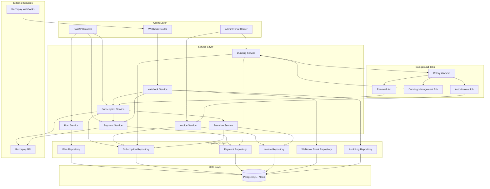
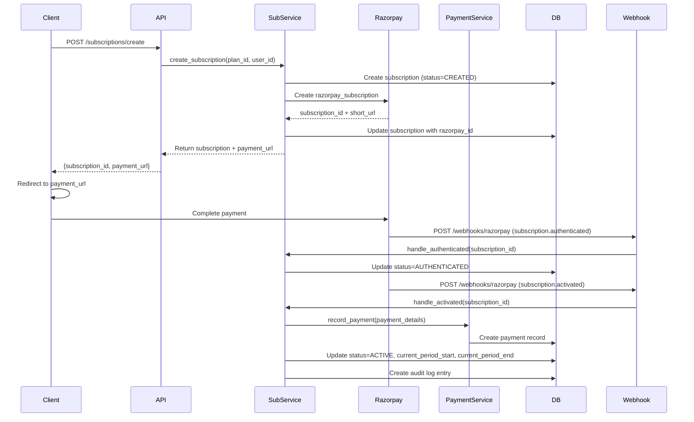
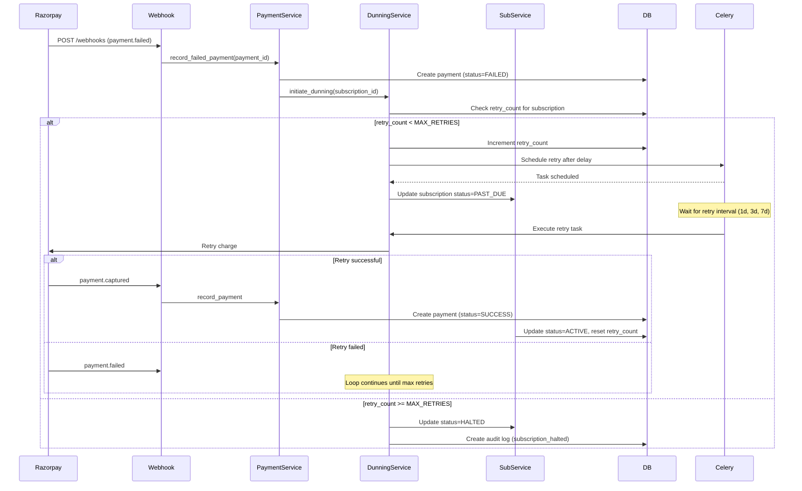
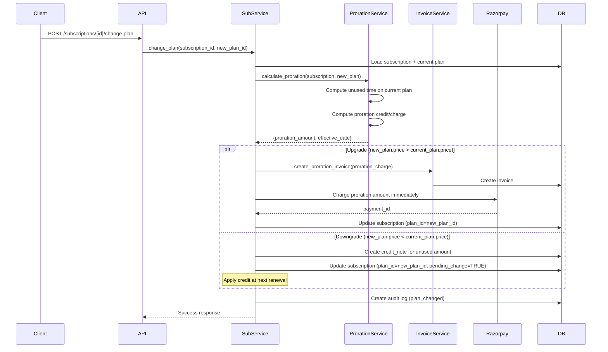

# Design Document: Razorpay SaaS Billing System

## Overview

A production-ready SaaS billing platform that orchestrates a local PostgreSQL database (Neon) with Razorpay's payment gateway and webhook infrastructure. The system provides comprehensive subscription lifecycle management, automated billing, payment retries with dunning, GST-compliant invoicing, proration handling for plan changes, and immutable audit logging for PCI-DSS compliance.

Built on FastAPI with async-first architecture, this billing engine handles the complete subscription journey from plan creation through renewals, upgrades, downgrades, pauses, cancellations, refunds, and chargebacks. It ensures financial integrity through ACID transactions, relational data modeling with foreign key constraints, webhook idempotency, and comprehensive error handling.

The system is designed as a modular monolith following feature-driven architecture, using repository patterns for data access, Result types for error handling, and typed exceptions for domain-specific failures. All payment processing adheres to PCI-DSS compliance by never storing card data locally—all sensitive payment methods are tokenized and managed by Razorpay.

## Architecture



## Main Algorithm/Workflow

### Subscription Creation Flow



### Payment Failure & Dunning Flow



### Plan Upgrade/Downgrade with Proration Flow



## Components and Interfaces

### Component 1: Plan Service

**Purpose**: Manages billing plan configuration, pricing tiers, add-ons, and usage-based billing rules.

**Interface**:
```python
from typing import Protocol
from app.features.billing.dto import PlanCreateDTO, PlanUpdateDTO, PlanResponse
from app.shared.result.types import AppResult

class IPlanService(Protocol):
    async def create_plan(self, dto: PlanCreateDTO) -> PlanResponse:
        """Create a new billing plan with pricing tiers and add-ons."""
        ...
    
    async def update_plan(self, plan_id: str, dto: PlanUpdateDTO) -> PlanResponse:
        """Update an existing plan (versioning for active subscriptions)."""
        ...
    
    async def get_plan(self, plan_id: str) -> PlanResponse:
        """Retrieve a plan by ID."""
        ...
    
    async def list_plans(self, active_only: bool = True) -> list[PlanResponse]:
        """List all available plans."""
        ...
    
    async def archive_plan(self, plan_id: str) -> None:
        """Soft-delete a plan (existing subscriptions continue)."""
        ...
```

**Responsibilities**:
- CRUD operations for billing plans
- Plan versioning to support pricing changes without breaking active subscriptions
- Validation of plan pricing rules and billing intervals
- Management of add-ons and usage-based billing components

### Component 2: Subscription Service

**Purpose**: Core subscription lifecycle engine managing state transitions, renewals, plan changes, and cancellations.

**Interface**:
```python
from typing import Protocol
from app.features.billing.dto import (
    SubscriptionCreateDTO,
    SubscriptionResponse,
    PlanChangeDTO,
    SubscriptionCancelDTO,
)
from app.features.billing.models import SubscriptionStatus

class ISubscriptionService(Protocol):
    async def create_subscription(
        self, 
        user_id: str, 
        dto: SubscriptionCreateDTO
    ) -> SubscriptionResponse:
        """Create subscription in Razorpay and local DB, return payment URL."""
        ...
    
    async def get_subscription(self, subscription_id: str) -> SubscriptionResponse:
        """Retrieve subscription details."""
        ...
    
    async def change_plan(
        self, 
        subscription_id: str, 
        dto: PlanChangeDTO
    ) -> SubscriptionResponse:
        """Upgrade/downgrade plan with proration handling."""
        ...
    
    async def cancel_subscription(
        self, 
        subscription_id: str, 
        dto: SubscriptionCancelDTO
    ) -> SubscriptionResponse:
        """Cancel subscription (immediate or at period end)."""
        ...
    
    async def pause_subscription(
        self, 
        subscription_id: str,
        pause_duration_days: int | None = None
    ) -> SubscriptionResponse:
        """Pause subscription temporarily."""
        ...
    
    async def resume_subscription(self, subscription_id: str) -> SubscriptionResponse:
        """Resume a paused subscription."""
        ...
    
    async def handle_authenticated(self, razorpay_subscription_id: str) -> None:
        """Webhook handler: subscription.authenticated event."""
        ...
    
    async def handle_activated(self, razorpay_subscription_id: str) -> None:
        """Webhook handler: subscription.activated event."""
        ...
    
    async def handle_charged(
        self, 
        razorpay_subscription_id: str,
        payment_id: str
    ) -> None:
        """Webhook handler: subscription.charged event (renewals)."""
        ...
```

**Responsibilities**:
- Subscription creation and Razorpay integration
- State machine management (CREATED → AUTHENTICATED → ACTIVE → HALTED → CANCELLED)
- Plan change orchestration with proration calculation
- Subscription pause/resume logic
- Webhook event processing for subscription lifecycle
- Renewal scheduling and grace period handling

### Component 3: Payment Service

**Purpose**: Payment transaction recording, retry management, refund processing, and chargeback handling.

**Interface**:
```python
from typing import Protocol
from app.features.billing.dto import (
    PaymentRecordDTO,
    RefundRequestDTO,
    RefundResponse,
    PaymentResponse,
)

class IPaymentService(Protocol):
    async def record_payment(self, dto: PaymentRecordDTO) -> PaymentResponse:
        """Record a payment transaction from Razorpay webhook."""
        ...
    
    async def record_failed_payment(
        self, 
        razorpay_payment_id: str,
        subscription_id: str,
        error_code: str,
        error_description: str
    ) -> PaymentResponse:
        """Record a failed payment attempt."""
        ...
    
    async def initiate_refund(
        self, 
        payment_id: str, 
        dto: RefundRequestDTO
    ) -> RefundResponse:
        """Initiate full or partial refund via Razorpay."""
        ...
    
    async def handle_refund_processed(
        self, 
        razorpay_refund_id: str,
        payment_id: str
    ) -> None:
        """Webhook handler: refund.processed event."""
        ...
    
    async def handle_chargeback(
        self, 
        razorpay_payment_id: str,
        chargeback_id: str,
        reason_code: str
    ) -> None:
        """Webhook handler: payment.dispute.created event."""
        ...
    
    async def submit_dispute_evidence(
        self, 
        dispute_id: str,
        evidence: dict
    ) -> None:
        """Submit evidence for chargeback dispute."""
        ...
```

**Responsibilities**:
- Payment transaction recording with idempotency
- Failed payment handling and dunning initiation
- Refund processing (full/partial)
- Chargeback/dispute management
- Payment method tokenization coordination
- Transaction audit trail maintenance

### Component 4: Invoice Service

**Purpose**: GST-compliant invoice generation, tax calculation, and invoice delivery.

**Interface**:
```python
from typing import Protocol
from app.features.billing.dto import InvoiceResponse, CreditNoteResponse

class IInvoiceService(Protocol):
    async def generate_invoice(
        self, 
        subscription_id: str,
        payment_id: str
    ) -> InvoiceResponse:
        """Generate GST-compliant invoice for a payment."""
        ...
    
    async def generate_proration_invoice(
        self, 
        subscription_id: str,
        proration_amount: Decimal,
        reason: str
    ) -> InvoiceResponse:
        """Generate invoice for mid-cycle plan changes."""
        ...
    
    async def generate_credit_note(
        self, 
        invoice_id: str,
        credit_amount: Decimal,
        reason: str
    ) -> CreditNoteResponse:
        """Generate credit note for refunds/downgrades."""
        ...
    
    async def get_invoice(self, invoice_id: str) -> InvoiceResponse:
        """Retrieve invoice by ID."""
        ...
    
    async def list_invoices(
        self, 
        user_id: str,
        subscription_id: str | None = None
    ) -> list[InvoiceResponse]:
        """List all invoices for a user/subscription."""
        ...
    
    async def send_invoice_email(self, invoice_id: str) -> None:
        """Email invoice PDF to customer."""
        ...
```

**Responsibilities**:
- GST-compliant invoice generation with GSTIN validation
- Tax calculation (CGST/SGST for intra-state, IGST for inter-state)
- Invoice numbering with sequential series
- Credit note generation for refunds and downgrades
- Invoice PDF generation and email delivery
- Invoice archival and retrieval

### Component 5: Webhook Service

**Purpose**: HMAC verification, idempotency enforcement, and event routing for Razorpay webhooks.

**Interface**:
```python
from typing import Protocol
from app.features.billing.dto import WebhookEventDTO

class IWebhookService(Protocol):
    async def verify_signature(
        self, 
        payload: bytes,
        signature: str,
        webhook_secret: str
    ) -> bool:
        """Verify HMAC SHA256 signature from Razorpay."""
        ...
    
    async def process_event(self, event: WebhookEventDTO) -> None:
        """Process webhook event with idempotency check."""
        ...
    
    async def is_duplicate_event(self, event_id: str) -> bool:
        """Check if event has already been processed."""
        ...
    
    async def mark_event_processed(
        self, 
        event_id: str,
        event_type: str,
        payload: dict
    ) -> None:
        """Record processed event for idempotency."""
        ...
    
    async def replay_failed_event(self, event_id: str) -> None:
        """Manually replay a failed webhook event (admin operation)."""
        ...
```

**Responsibilities**:
- HMAC SHA256 signature verification
- Idempotency enforcement via event_id tracking
- Event routing to appropriate service handlers
- Failed event logging and retry mechanism
- Manual webhook replay capability for operations

### Component 6: Dunning Service

**Purpose**: Failed payment retry orchestration with exponential backoff and grace period management.

**Interface**:
```python
from typing import Protocol
from app.features.billing.dto import DunningConfigDTO, RetryAttemptResponse

class IDunningService(Protocol):
    async def initiate_dunning(self, subscription_id: str) -> None:
        """Start dunning process after payment failure."""
        ...
    
    async def execute_retry(self, subscription_id: str) -> RetryAttemptResponse:
        """Execute a payment retry attempt."""
        ...
    
    async def halt_subscription(self, subscription_id: str) -> None:
        """Halt subscription after max retries exhausted."""
        ...
    
    async def configure_dunning_strategy(
        self, 
        dto: DunningConfigDTO
    ) -> None:
        """Configure retry intervals and max attempts."""
        ...
    
    async def get_retry_schedule(self, subscription_id: str) -> list[RetryAttemptResponse]:
        """Retrieve retry history and upcoming schedule."""
        ...
```

**Responsibilities**:
- Retry schedule management (day 1, 3, 7, 14)
- Exponential backoff configuration
- Grace period enforcement
- Subscription halting after max retries
- Customer notification coordination
- Retry history tracking

### Component 7: Proration Service

**Purpose**: Calculate proration credits/charges for mid-cycle plan changes and cancellations.

**Interface**:
```python
from typing import Protocol
from decimal import Decimal
from datetime import datetime
from app.features.billing.dto import ProrationCalculation

class IProrationService(Protocol):
    async def calculate_plan_change_proration(
        self, 
        subscription_id: str,
        new_plan_id: str,
        effective_date: datetime | None = None
    ) -> ProrationCalculation:
        """Calculate proration for plan upgrade/downgrade."""
        ...
    
    async def calculate_cancellation_proration(
        self, 
        subscription_id: str,
        cancellation_date: datetime
    ) -> ProrationCalculation:
        """Calculate refund amount for mid-cycle cancellation."""
        ...
    
    async def preview_proration(
        self, 
        subscription_id: str,
        new_plan_id: str
    ) -> ProrationCalculation:
        """Preview proration before applying change."""
        ...
```

**Responsibilities**:
- Proration calculation based on unused time
- Upgrade immediate charge calculation
- Downgrade credit calculation
- Proration preview for user transparency
- Tax-inclusive proration handling

## Data Models

### Model 1: Plan

```python
from pydantic import BaseModel, Field, ConfigDict
from decimal import Decimal
from enum import Enum

class BillingInterval(str, Enum):
    MONTHLY = "monthly"
    QUARTERLY = "quarterly"
    YEARLY = "yearly"

class Plan(BaseModel):
    """Billing plan with pricing and features."""
    model_config = ConfigDict(frozen=True)
    
    id: str = Field(description="UUID primary key")
    razorpay_plan_id: str | None = Field(default=None, description="Razorpay plan ID")
    name: str = Field(description="Plan name (e.g., 'Pro', 'Enterprise')")
    description: str | None = Field(default=None)
    amount: Decimal = Field(description="Plan price in INR (paisa)")
    currency: str = Field(default="INR")
    interval: BillingInterval = Field(description="Billing frequency")
    interval_count: int = Field(default=1, description="Number of intervals per billing cycle")
    trial_period_days: int = Field(default=0, description="Free trial duration")
    tax_rate: Decimal = Field(default=Decimal("0.18"), description="GST rate (18% = 0.18)")
    is_active: bool = Field(default=True, description="Plan availability")
    features: dict = Field(default_factory=dict, description="Plan features JSON")
    metadata: dict = Field(default_factory=dict, description="Custom metadata")
    created_at: datetime
    updated_at: datetime

```

**Validation Rules**:
- `amount` must be positive and minimum 100 paisa (₹1.00)
- `interval_count` must be positive integer
- `name` must be unique within active plans
- `trial_period_days` must be non-negative

### Model 2: Subscription

```python
from pydantic import BaseModel, Field, ConfigDict
from datetime import datetime
from enum import Enum

class SubscriptionStatus(str, Enum):
    CREATED = "created"              # Initial state
    AUTHENTICATED = "authenticated"  # Payment method captured
    ACTIVE = "active"                # Currently active
    PAST_DUE = "past_due"            # Payment failed, in grace period
    HALTED = "halted"                # Grace period expired
    CANCELLED = "cancelled"          # User cancelled
    PAUSED = "paused"                # Temporarily paused
    EXPIRED = "expired"              # Completed (non-recurring)

class Subscription(BaseModel):
    """User subscription to a billing plan."""
    model_config = ConfigDict(frozen=True)
    
    id: str = Field(description="UUID primary key")
    user_id: str = Field(description="FK to User")
    plan_id: str = Field(description="FK to Plan")
    razorpay_subscription_id: str | None = Field(default=None)
    razorpay_customer_id: str | None = Field(default=None)
    
    status: SubscriptionStatus = Field(default=SubscriptionStatus.CREATED)
    
    current_period_start: datetime | None = Field(default=None)
    current_period_end: datetime | None = Field(default=None)
    trial_end: datetime | None = Field(default=None)
    
    cancel_at_period_end: bool = Field(default=False)
    cancelled_at: datetime | None = Field(default=None)
    ended_at: datetime | None = Field(default=None)
    
    pause_start: datetime | None = Field(default=None)
    pause_end: datetime | None = Field(default=None)
    
    retry_count: int = Field(default=0, description="Failed payment retry attempts")
    max_retries: int = Field(default=4, description="Max retry attempts")
    
    version: int = Field(default=0, description="Optimistic locking version field")
    
    metadata: dict = Field(default_factory=dict)
    created_at: datetime
    updated_at: datetime
```

**Validation Rules**:
- `user_id` and `plan_id` must reference existing records (FK constraint)
- `current_period_end` must be after `current_period_start`
- `retry_count` must be non-negative and <= `max_retries`
- `status` transitions follow state machine rules
- `cancelled_at` must be None unless status is CANCELLED

### Model 3: Payment

```python
from pydantic import BaseModel, Field, ConfigDict
from decimal import Decimal
from enum import Enum

class PaymentStatus(str, Enum):
    CREATED = "created"
    AUTHORIZED = "authorized"
    CAPTURED = "captured"
    FAILED = "failed"
    REFUNDED = "refunded"
    PARTIALLY_REFUNDED = "partially_refunded"

class PaymentMethod(str, Enum):
    CARD = "card"
    UPI = "upi"
    NETBANKING = "netbanking"
    WALLET = "wallet"
    EMI = "emi"

class Payment(BaseModel):
    """Payment transaction record."""
    model_config = ConfigDict(frozen=True)
    
    id: str = Field(description="UUID primary key")
    subscription_id: str = Field(description="FK to Subscription")
    invoice_id: str | None = Field(default=None, description="FK to Invoice")
    
    razorpay_payment_id: str = Field(description="Razorpay payment ID")
    razorpay_order_id: str | None = Field(default=None)
    
    amount: Decimal = Field(description="Payment amount in paisa")
    currency: str = Field(default="INR")
    status: PaymentStatus
    
    method: PaymentMethod | None = Field(default=None)
    
    captured_at: datetime | None = Field(default=None)
    failed_at: datetime | None = Field(default=None)
    error_code: str | None = Field(default=None)
    error_description: str | None = Field(default=None)
    
    refund_amount: Decimal = Field(default=Decimal("0"))
    
    metadata: dict = Field(default_factory=dict)
    created_at: datetime
    updated_at: datetime
```

**Validation Rules**:
- `amount` must be positive
- `subscription_id` must reference existing subscription (FK)
- `refund_amount` must be <= `amount`
- `status` must be CAPTURED before refund operations
- `captured_at` required when status is CAPTURED

### Model 4: Invoice

```python
from pydantic import BaseModel, Field, ConfigDict
from decimal import Decimal
from enum import Enum

class InvoiceStatus(str, Enum):
    DRAFT = "draft"
    ISSUED = "issued"
    PAID = "paid"
    VOID = "void"

class Invoice(BaseModel):
    """GST-compliant invoice."""
    model_config = ConfigDict(frozen=True)
    
    id: str = Field(description="UUID primary key")
    invoice_number: str = Field(description="Sequential invoice number (INV-2024-0001)")
    subscription_id: str = Field(description="FK to Subscription")
    payment_id: str | None = Field(default=None, description="FK to Payment")
    user_id: str = Field(description="FK to User")
    
    status: InvoiceStatus = Field(default=InvoiceStatus.DRAFT)
    
    subtotal: Decimal = Field(description="Amount before tax")
    tax_rate: Decimal = Field(description="GST rate snapshot (18% = 0.18)")
    tax_amount: Decimal = Field(description="Calculated GST")
    total: Decimal = Field(description="Subtotal + tax")
    currency: str = Field(default="INR")
    
    # GST fields
    seller_gstin: str = Field(description="Seller GSTIN")
    buyer_gstin: str | None = Field(default=None, description="Buyer GSTIN (B2B)")
    place_of_supply: str = Field(description="State code (e.g., '27' for Maharashtra)")
    
    # Tax breakdown for intra-state (CGST+SGST) or inter-state (IGST)
    cgst_amount: Decimal = Field(default=Decimal("0"))
    sgst_amount: Decimal = Field(default=Decimal("0"))
    igst_amount: Decimal = Field(default=Decimal("0"))
    
    issued_at: datetime | None = Field(default=None)
    due_at: datetime | None = Field(default=None)
    paid_at: datetime | None = Field(default=None)
    
    pdf_url: str | None = Field(default=None, description="S3/storage URL for PDF")
    
    metadata: dict = Field(default_factory=dict)
    created_at: datetime
    updated_at: datetime
```

**Validation Rules**:
- `invoice_number` must be unique and sequential
- `total` must equal `subtotal + tax_amount`
- `tax_amount` must equal `subtotal * tax_rate`
- For intra-state: `cgst_amount + sgst_amount = tax_amount`, `igst_amount = 0`
- For inter-state: `igst_amount = tax_amount`, `cgst_amount = sgst_amount = 0`
- `seller_gstin` must match valid GSTIN format
- `buyer_gstin` required for B2B transactions
- `paid_at` required when status is PAID

### Model 5: WebhookEvent

```python
from pydantic import BaseModel, Field, ConfigDict
from enum import Enum

class WebhookEventType(str, Enum):
    SUBSCRIPTION_AUTHENTICATED = "subscription.authenticated"
    SUBSCRIPTION_ACTIVATED = "subscription.activated"
    SUBSCRIPTION_CHARGED = "subscription.charged"
    SUBSCRIPTION_PENDING = "subscription.pending"
    SUBSCRIPTION_HALTED = "subscription.halted"
    SUBSCRIPTION_CANCELLED = "subscription.cancelled"
    SUBSCRIPTION_PAUSED = "subscription.paused"
    SUBSCRIPTION_RESUMED = "subscription.resumed"
    PAYMENT_AUTHORIZED = "payment.authorized"
    PAYMENT_CAPTURED = "payment.captured"
    PAYMENT_FAILED = "payment.failed"
    REFUND_CREATED = "refund.created"
    REFUND_PROCESSED = "refund.processed"
    DISPUTE_CREATED = "payment.dispute.created"

class WebhookEventStatus(str, Enum):
    PENDING = "pending"
    PROCESSING = "processing"
    PROCESSED = "processed"
    FAILED = "failed"

class WebhookEvent(BaseModel):
    """Webhook event log for idempotency and replay."""
    model_config = ConfigDict(frozen=True)
    
    id: str = Field(description="UUID primary key")
    razorpay_event_id: str = Field(description="Razorpay event ID (idempotency key)")
    event_type: WebhookEventType
    status: WebhookEventStatus = Field(default=WebhookEventStatus.PENDING)
    
    payload: dict = Field(description="Full webhook payload")
    
    processed_at: datetime | None = Field(default=None)
    failed_at: datetime | None = Field(default=None)
    error_message: str | None = Field(default=None)
    retry_count: int = Field(default=0)
    
    created_at: datetime
    updated_at: datetime
```

**Validation Rules**:
- `razorpay_event_id` must be unique (idempotency key)
- `processed_at` required when status is PROCESSED
- `failed_at` and `error_message` required when status is FAILED
- `retry_count` must be non-negative

### Model 6: AuditLog

```python
from pydantic import BaseModel, Field, ConfigDict
from enum import Enum

class AuditAction(str, Enum):
    SUBSCRIPTION_CREATED = "subscription.created"
    SUBSCRIPTION_ACTIVATED = "subscription.activated"
    SUBSCRIPTION_CANCELLED = "subscription.cancelled"
    PLAN_CHANGED = "plan.changed"
    PAYMENT_CAPTURED = "payment.captured"
    PAYMENT_FAILED = "payment.failed"
    REFUND_ISSUED = "refund.issued"
    INVOICE_GENERATED = "invoice.generated"

class AuditLog(BaseModel):
    """Immutable audit trail for compliance."""
    model_config = ConfigDict(frozen=True)
    
    id: str = Field(description="UUID primary key")
    entity_type: str = Field(description="Entity type (subscription, payment, invoice)")
    entity_id: str = Field(description="Entity ID")
    action: AuditAction
    
    user_id: str | None = Field(default=None, description="Actor user ID")
    ip_address: str | None = Field(default=None)
    user_agent: str | None = Field(default=None)
    
    changes: dict = Field(default_factory=dict, description="Before/after diff")
    metadata: dict = Field(default_factory=dict)
    
    created_at: datetime = Field(description="Immutable timestamp")
```

**Validation Rules**:
- `entity_id` must reference valid entity
- `created_at` is immutable (no updates allowed)
- `changes` should contain before/after snapshots for critical operations
- Records are append-only (no DELETE operations)

## Algorithmic Pseudocode

### Algorithm 1: Subscription Creation with Razorpay Integration

```python
async def create_subscription(
    user_id: str,
    plan_id: str,
    customer_email: str,
    customer_phone: str,
    customer_notify: bool = True,
    trial_period_days: int | None = None
) -> SubscriptionResponse:
    """
    Create subscription in local DB and Razorpay, return payment URL.
    
    Preconditions:
    - user_id references valid user
    - plan_id references active plan
    - customer_email is valid email format
    - customer_phone is valid Indian phone number
    
    Postconditions:
    - Subscription created in DB with status=CREATED
    - Razorpay subscription created with payment link
    - Audit log entry created
    - Returns subscription with payment URL
    """
    
    # Step 1: Load plan
    result = await plan_repo.find_by_id(plan_id)
    if isinstance(result, Failure):
        error = result.failure()
        log_expected_failure(error, operation="find_plan")
        raise app_error_to_exception(error)
    plan = result.unwrap()
    if plan is None:
        raise NotFoundException("Plan", plan_id)
    if not plan.is_active:
        raise ValidationException("Plan is not active")
    
    # Step 2: Begin DB transaction
    async with db.transaction():
        # Create local subscription record
        subscription = Subscription(
            id=generate_uuid(),
            user_id=user_id,
            plan_id=plan_id,
            status=SubscriptionStatus.CREATED,
            trial_end=calculate_trial_end(trial_period_days or plan.trial_period_days),
            max_retries=4,
            created_at=utc_now(),
            updated_at=utc_now()
        )
        
        result = await subscription_repo.create(subscription)
        if isinstance(result, Failure):
            error = result.failure()
            log_expected_failure(error, operation="create_subscription")
            raise app_error_to_exception(error)
        
        # Step 3: Create/retrieve Razorpay customer
        razorpay_customer = await razorpay_client.create_or_get_customer(
            email=customer_email,
            contact=customer_phone,
            name=user.name,
            notes={"user_id": user_id}
        )
        
        # Step 4: Create Razorpay subscription
        razorpay_subscription = await razorpay_client.create_subscription(
            plan_id=plan.razorpay_plan_id,
            customer_id=razorpay_customer.id,
            total_count=0 if plan.interval == BillingInterval.MONTHLY else calculate_total_count(plan),
            quantity=1,
            customer_notify=customer_notify,
            notes={"subscription_id": subscription.id}
        )
        
        # Step 5: Update local subscription with Razorpay IDs
        subscription = subscription.model_copy(update={
            "razorpay_subscription_id": razorpay_subscription.id,
            "razorpay_customer_id": razorpay_customer.id,
            "updated_at": utc_now()
        })
        
        result = await subscription_repo.update(subscription)
        if isinstance(result, Failure):
            error = result.failure()
            log_expected_failure(error, operation="update_subscription")
            raise app_error_to_exception(error)
        
        # Step 6: Create audit log
        await audit_repo.create(AuditLog(
            id=generate_uuid(),
            entity_type="subscription",
            entity_id=subscription.id,
            action=AuditAction.SUBSCRIPTION_CREATED,
            user_id=user_id,
            metadata={"plan_id": plan_id, "razorpay_subscription_id": razorpay_subscription.id},
            created_at=utc_now()
        ))
        
        # Step 7: Return response with payment URL
        return SubscriptionResponse(
            id=subscription.id,
            status=subscription.status,
            plan=plan,
            payment_url=razorpay_subscription.short_url,
            current_period_start=subscription.current_period_start,
            current_period_end=subscription.current_period_end,
            created_at=subscription.created_at
        )
```

**Loop Invariants**: N/A (no loops in this algorithm)

### Algorithm 2: Webhook Event Processing with Idempotency

```python
async def process_webhook_event(
    event_id: str,
    event_type: str,
    payload: dict,
    signature: str,
    webhook_secret: str
) -> None:
    """
    Process Razorpay webhook event with HMAC verification and idempotency.
    
    Preconditions:
    - event_id is non-empty string
    - signature is valid HMAC SHA256 hex string
    - payload contains valid webhook data structure
    
    Postconditions:
    - Event processed exactly once (idempotency)
    - WebhookEvent record created with status
    - Appropriate service handler invoked
    - Audit log entry created for critical events
    """
    
    # Step 1: Verify HMAC signature
    payload_bytes = json.dumps(payload, separators=(',', ':')).encode('utf-8')
    computed_signature = hmac.new(
        webhook_secret.encode('utf-8'),
        payload_bytes,
        hashlib.sha256
    ).hexdigest()
    
    if not hmac.compare_digest(signature, computed_signature):
        logger.error("Webhook signature verification failed", event_id=event_id)
        raise ValidationException("Invalid webhook signature")
    
    # Step 2: Check for duplicate event (idempotency)
    existing_event = await webhook_repo.find_by_razorpay_event_id(event_id)
    if existing_event is not None:
        logger.info("Duplicate webhook event ignored", event_id=event_id)
        return  # Already processed
    
    # Step 3: Create webhook event record
    webhook_event = WebhookEvent(
        id=generate_uuid(),
        razorpay_event_id=event_id,
        event_type=WebhookEventType(event_type),
        status=WebhookEventStatus.PENDING,
        payload=payload,
        created_at=utc_now(),
        updated_at=utc_now()
    )
    
    result = await webhook_repo.create(webhook_event)
    if isinstance(result, Failure):
        error = result.failure()
        log_expected_failure(error, operation="create_webhook_event")
        raise app_error_to_exception(error)
    
    # Step 4: Update event status to PROCESSING
    webhook_event = webhook_event.model_copy(update={
        "status": WebhookEventStatus.PROCESSING,
        "updated_at": utc_now()
    })
    await webhook_repo.update(webhook_event)
    
    try:
        # Step 5: Route to appropriate handler
        match event_type:
            case WebhookEventType.SUBSCRIPTION_AUTHENTICATED:
                await subscription_service.handle_authenticated(
                    payload["subscription"]["id"]
                )
            case WebhookEventType.SUBSCRIPTION_ACTIVATED:
                await subscription_service.handle_activated(
                    payload["subscription"]["id"]
                )
            case WebhookEventType.SUBSCRIPTION_CHARGED:
                await subscription_service.handle_charged(
                    payload["subscription"]["id"],
                    payload["payment"]["id"]
                )
            case WebhookEventType.PAYMENT_CAPTURED:
                await payment_service.record_payment(PaymentRecordDTO(
                    razorpay_payment_id=payload["payment"]["id"],
                    subscription_id=extract_subscription_id(payload),
                    amount=Decimal(payload["payment"]["amount"]) / 100,
                    status=PaymentStatus.CAPTURED,
                    method=PaymentMethod(payload["payment"]["method"])
                ))
            case WebhookEventType.PAYMENT_FAILED:
                await payment_service.record_failed_payment(
                    razorpay_payment_id=payload["payment"]["id"],
                    subscription_id=extract_subscription_id(payload),
                    error_code=payload["payment"]["error_code"],
                    error_description=payload["payment"]["error_description"]
                )
                await dunning_service.initiate_dunning(
                    extract_subscription_id(payload)
                )
            case WebhookEventType.REFUND_PROCESSED:
                await payment_service.handle_refund_processed(
                    payload["refund"]["id"],
                    payload["refund"]["payment_id"]
                )
            case _:
                logger.warning("Unhandled webhook event type", event_type=event_type)
        
        # Step 6: Mark event as processed
        webhook_event = webhook_event.model_copy(update={
            "status": WebhookEventStatus.PROCESSED,
            "processed_at": utc_now(),
            "updated_at": utc_now()
        })
        await webhook_repo.update(webhook_event)
        
    except Exception as e:
        # Step 7: Mark event as failed
        webhook_event = webhook_event.model_copy(update={
            "status": WebhookEventStatus.FAILED,
            "failed_at": utc_now(),
            "error_message": str(e),
            "retry_count": webhook_event.retry_count + 1,
            "updated_at": utc_now()
        })
        await webhook_repo.update(webhook_event)
        logger.error("Webhook processing failed", event_id=event_id, error=str(e))
        raise
```

**Loop Invariants**: N/A (no loops in this algorithm)

### Algorithm 3: Proration Calculation for Plan Changes

```python
async def calculate_plan_change_proration(
    subscription: Subscription,
    current_plan: Plan,
    new_plan: Plan,
    effective_date: datetime | None = None
) -> ProrationCalculation:
    """
    Calculate proration credit/charge for plan upgrade/downgrade.
    
    Preconditions:
    - subscription.status == ACTIVE
    - current_period_start <= effective_date <= current_period_end
    - current_plan and new_plan have same billing interval
    - All amounts are in same currency
    
    Postconditions:
    - Returns ProrationCalculation with amount and direction
    - amount >= 0 (absolute value)
    - direction indicates CHARGE (upgrade) or CREDIT (downgrade)
    - No side effects on input objects
    
    Loop Invariants: N/A
    """
    
    # Step 1: Determine effective date
    if effective_date is None:
        effective_date = utc_now()
    
    # Step 2: Validate effective date is within current period
    if not (subscription.current_period_start <= effective_date <= subscription.current_period_end):
        raise ValidationException(
            "Effective date must be within current billing period"
        )
    
    # Step 3: Calculate time fractions
    total_period_seconds = (
        subscription.current_period_end - subscription.current_period_start
    ).total_seconds()
    
    elapsed_seconds = (
        effective_date - subscription.current_period_start
    ).total_seconds()
    
    remaining_seconds = (
        subscription.current_period_end - effective_date
    ).total_seconds()
    
    remaining_fraction = Decimal(str(remaining_seconds / total_period_seconds))
    
    # Step 4: Calculate unused amount on current plan
    unused_current_plan_amount = (current_plan.amount / 100) * remaining_fraction
    
    # Step 5: Calculate cost for remaining period on new plan
    new_plan_remaining_amount = (new_plan.amount / 100) * remaining_fraction
    
    # Step 6: Calculate proration difference
    proration_amount = new_plan_remaining_amount - unused_current_plan_amount
    
    # Step 7: Determine direction and absolute amount
    if proration_amount > 0:
        # Upgrade: charge the difference
        direction = ProrationDirection.CHARGE
        amount = proration_amount
    elif proration_amount < 0:
        # Downgrade: credit the difference
        direction = ProrationDirection.CREDIT
        amount = abs(proration_amount)
    else:
        # No change in price
        direction = ProrationDirection.NONE
        amount = Decimal("0")
    
    # Step 8: Apply tax if applicable
    if direction == ProrationDirection.CHARGE:
        tax_amount = amount * current_plan.tax_rate
        total_with_tax = amount + tax_amount
    else:
        tax_amount = Decimal("0")
        total_with_tax = amount
    
    # Step 9: Return calculation result
    return ProrationCalculation(
        old_plan_id=current_plan.id,
        new_plan_id=new_plan.id,
        effective_date=effective_date,
        remaining_days=(subscription.current_period_end - effective_date).days,
        unused_amount=unused_current_plan_amount,
        new_amount=new_plan_remaining_amount,
        proration_amount=amount,
        tax_amount=tax_amount,
        total_amount=total_with_tax,
        direction=direction,
        currency=current_plan.currency
    )
```

**Loop Invariants**: N/A (no loops in this algorithm)

### Algorithm 4: Dunning Management with Exponential Backoff

```python
async def execute_dunning_retry(subscription_id: str) -> RetryAttemptResponse:
    """
    Execute payment retry with exponential backoff for failed subscriptions.
    
    Preconditions:
    - subscription exists and status in [PAST_DUE, HALTED]
    - subscription.retry_count < subscription.max_retries
    - Razorpay subscription is still active
    
    Postconditions:
    - retry_count incremented
    - Payment attempt recorded
    - Subscription status updated based on result
    - Next retry scheduled if needed
    - Audit log entry created
    """
    
    # Step 1: Load subscription
    result = await subscription_repo.find_by_id(subscription_id)
    if isinstance(result, Failure):
        error = result.failure()
        log_expected_failure(error, operation="find_subscription")
        raise app_error_to_exception(error)
    
    subscription = result.unwrap()
    if subscription is None:
        raise NotFoundException("Subscription", subscription_id)
    
    # Step 2: Validate retry eligibility
    if subscription.retry_count >= subscription.max_retries:
        logger.warning(
            "Max retries exhausted, halting subscription",
            subscription_id=subscription_id
        )
        await halt_subscription(subscription_id)
        raise ValidationException("Maximum retry attempts exhausted")
    
    if subscription.status not in [SubscriptionStatus.PAST_DUE, SubscriptionStatus.HALTED]:
        raise ValidationException(
            f"Cannot retry subscription in status {subscription.status}"
        )
    
    # Step 3: Calculate retry delay using exponential backoff
    # Retry schedule: attempt 1 = 1 day, attempt 2 = 3 days, attempt 3 = 7 days, attempt 4 = 14 days
    retry_delays = [1, 3, 7, 14]  # days
    if subscription.retry_count < len(retry_delays):
        delay_days = retry_delays[subscription.retry_count]
    else:
        delay_days = 14  # max delay
    
    # Step 4: Attempt payment retry via Razorpay
    try:
        retry_response = await razorpay_client.retry_subscription_charge(
            subscription.razorpay_subscription_id
        )
        
        # Step 5: Record payment attempt
        payment = Payment(
            id=generate_uuid(),
            subscription_id=subscription_id,
            razorpay_payment_id=retry_response.payment_id,
            amount=retry_response.amount,
            currency=retry_response.currency,
            status=PaymentStatus.CREATED,
            created_at=utc_now(),
            updated_at=utc_now()
        )
        
        result = await payment_repo.create(payment)
        if isinstance(result, Failure):
            error = result.failure()
            log_expected_failure(error, operation="create_payment")
            raise app_error_to_exception(error)
        
        # Step 6: Update subscription retry count
        subscription = subscription.model_copy(update={
            "retry_count": subscription.retry_count + 1,
            "updated_at": utc_now()
        })
        
        result = await subscription_repo.update(subscription)
        if isinstance(result, Failure):
            error = result.failure()
            log_expected_failure(error, operation="update_subscription")
            raise app_error_to_exception(error)
        
        # Step 7: Schedule next retry if this one fails
        next_retry_at = utc_now() + timedelta(days=delay_days)
        await celery_client.apply_async(
            "billing.tasks.retry_failed_payment",
            args=[subscription_id],
            eta=next_retry_at
        )
        
        # Step 8: Create audit log
        await audit_repo.create(AuditLog(
            id=generate_uuid(),
            entity_type="subscription",
            entity_id=subscription_id,
            action=AuditAction.PAYMENT_RETRY_ATTEMPTED,
            metadata={
                "retry_count": subscription.retry_count,
                "payment_id": payment.id,
                "next_retry_at": next_retry_at.isoformat()
            },
            created_at=utc_now()
        ))
        
        return RetryAttemptResponse(
            subscription_id=subscription_id,
            attempt_number=subscription.retry_count,
            payment_id=payment.id,
            status="pending",
            next_retry_at=next_retry_at
        )
        
    except ExternalServiceException as e:
        # Razorpay API failure
        logger.error(
            "Razorpay retry failed",
            subscription_id=subscription_id,
            error=str(e)
        )
        e.add_note(f"subscription_id={subscription_id}, retry_count={subscription.retry_count}")
        raise
```

**Loop Invariants**: N/A (no loops in this algorithm)

### Algorithm 5: GST-Compliant Invoice Generation

```python
async def generate_invoice(
    subscription_id: str,
    payment_id: str,
    seller_gstin: str,
    buyer_gstin: str | None,
    seller_state_code: str,
    buyer_state_code: str
) -> InvoiceResponse:
    """
    Generate GST-compliant invoice with proper tax breakdown.
    
    Preconditions:
    - subscription exists and is ACTIVE
    - payment exists and status is CAPTURED
    - seller_gstin matches valid GSTIN format (15 chars)
    - buyer_gstin matches valid GSTIN format if provided (B2B)
    - seller_state_code and buyer_state_code are valid 2-digit state codes
    
    Postconditions:
    - Invoice created with unique sequential invoice_number
    - Tax amount correctly calculated and split (CGST+SGST or IGST)
    - total = subtotal + tax_amount
    - Invoice PDF generated and stored
    - Audit log entry created
    """
    
    # Step 1: Load subscription and payment
    subscription = await load_subscription(subscription_id)
    payment = await load_payment(payment_id)
    plan = await load_plan(subscription.plan_id)
    
    # Step 2: Validate payment is captured
    if payment.status != PaymentStatus.CAPTURED:
        raise ValidationException("Payment must be captured to generate invoice")
    
    # Step 3: Generate sequential invoice number
    invoice_number = await generate_invoice_number()
    
    # Step 4: Calculate subtotal and tax
    subtotal = payment.amount / 100  # Convert paisa to rupees
    tax_rate = Decimal("0.18")  # 18% GST
    tax_amount = subtotal * tax_rate
    
    # Step 5: Determine tax breakdown (intra-state vs inter-state)
    if seller_state_code == buyer_state_code:
        # Intra-state: CGST + SGST
        cgst_amount = tax_amount / 2
        sgst_amount = tax_amount / 2
        igst_amount = Decimal("0")
    else:
        # Inter-state: IGST
        cgst_amount = Decimal("0")
        sgst_amount = Decimal("0")
        igst_amount = tax_amount
    
    # Step 6: Calculate total
    total = subtotal + tax_amount
    
    # Step 7: Create invoice record
    invoice = Invoice(
        id=generate_uuid(),
        invoice_number=invoice_number,
        subscription_id=subscription_id,
        payment_id=payment_id,
        user_id=subscription.user_id,
        status=InvoiceStatus.ISSUED,
        subtotal=subtotal,
        tax_rate=tax_rate,
        tax_amount=tax_amount,
        total=total,
        currency="INR",
        seller_gstin=seller_gstin,
        buyer_gstin=buyer_gstin,
        place_of_supply=buyer_state_code,
        cgst_amount=cgst_amount,
        sgst_amount=sgst_amount,
        igst_amount=igst_amount,
        issued_at=utc_now(),
        due_at=utc_now(),
        paid_at=utc_now(),
        created_at=utc_now(),
        updated_at=utc_now()
    )
    
    # Step 8: Save invoice to database
    result = await invoice_repo.create(invoice)
    if isinstance(result, Failure):
        error = result.failure()
        log_expected_failure(error, operation="create_invoice")
        raise app_error_to_exception(error)
    
    # Step 9: Generate and store PDF
    pdf_bytes = await generate_invoice_pdf(invoice, subscription, payment, plan)
    pdf_url = await storage_service.upload_pdf(
        f"invoices/{invoice.invoice_number}.pdf",
        pdf_bytes
    )
    
    # Step 10: Update invoice with PDF URL
    invoice = invoice.model_copy(update={
        "pdf_url": pdf_url,
        "updated_at": utc_now()
    })
    await invoice_repo.update(invoice)
    
    # Step 11: Create audit log
    await audit_repo.create(AuditLog(
        id=generate_uuid(),
        entity_type="invoice",
        entity_id=invoice.id,
        action=AuditAction.INVOICE_GENERATED,
        metadata={
            "invoice_number": invoice_number,
            "payment_id": payment_id,
            "subtotal": str(subtotal),
            "tax_amount": str(tax_amount),
            "total": str(total)
        },
        created_at=utc_now()
    ))
    
    # Step 12: Return invoice response
    return InvoiceResponse(
        id=invoice.id,
        invoice_number=invoice.invoice_number,
        status=invoice.status,
        subtotal=invoice.subtotal,
        tax_amount=invoice.tax_amount,
        total=invoice.total,
        pdf_url=invoice.pdf_url,
        issued_at=invoice.issued_at,
        paid_at=invoice.paid_at
    )
```

**Loop Invariants**: N/A (no loops in this algorithm)

## Key Functions with Formal Specifications

### Function 1: create_subscription()

```python
async def create_subscription(
    user_id: str,
    dto: SubscriptionCreateDTO
) -> SubscriptionResponse:
    """Create a new subscription with Razorpay integration."""
    ...
```

**Preconditions:**
- `user_id` is non-empty and references valid user
- `dto.plan_id` references active plan
- `dto.customer_email` is valid email format
- `dto.customer_phone` is valid phone number format
- User does not have existing ACTIVE subscription for same plan

**Postconditions:**
- Returns valid `SubscriptionResponse` object
- Subscription created in database with status=CREATED
- Razorpay subscription created with payment link
- `response.payment_url` is non-null HTTPS URL
- Audit log entry created
- No side effects on input parameters

**Loop Invariants:** N/A

### Function 2: process_webhook_event()

```python
async def process_webhook_event(
    event_id: str,
    event_type: str,
    payload: dict,
    signature: str
) -> None:
    """Process Razorpay webhook with idempotency."""
    ...
```

**Preconditions:**
- `event_id` is non-empty string (Razorpay event ID)
- `event_type` is valid `WebhookEventType` enum value
- `payload` is valid JSON dictionary
- `signature` is valid HMAC SHA256 hex string

**Postconditions:**
- Event processed exactly once (idempotent)
- If signature invalid, raises `ValidationException`
- If duplicate event, returns early without processing
- `WebhookEvent` record created with appropriate status
- For new events: status progresses PENDING → PROCESSING → PROCESSED or FAILED
- Appropriate service handler invoked based on event type
- For critical events: audit log entry created

**Loop Invariants:** N/A

### Function 3: calculate_plan_change_proration()

```python
async def calculate_plan_change_proration(
    subscription: Subscription,
    current_plan: Plan,
    new_plan: Plan,
    effective_date: datetime | None = None
) -> ProrationCalculation:
    """Calculate proration for plan upgrade/downgrade."""
    ...
```

**Preconditions:**
- `subscription.status == SubscriptionStatus.ACTIVE`
- `subscription.current_period_start` and `subscription.current_period_end` are non-null
- `current_plan.id == subscription.plan_id`
- `current_plan.interval == new_plan.interval` (same billing cycle)
- `current_plan.currency == new_plan.currency`
- If `effective_date` provided: `current_period_start <= effective_date <= current_period_end`

**Postconditions:**
- Returns valid `ProrationCalculation` object
- `result.proration_amount >= 0` (absolute value)
- `result.direction` indicates CHARGE, CREDIT, or NONE
- If upgrade: `result.direction == ProrationDirection.CHARGE`
- If downgrade: `result.direction == ProrationDirection.CREDIT`
- `result.total_amount == result.proration_amount + result.tax_amount`
- No modifications to input objects (pure function)

**Loop Invariants:** N/A

### Function 4: execute_dunning_retry()

```python
async def execute_dunning_retry(subscription_id: str) -> RetryAttemptResponse:
    """Execute payment retry with exponential backoff."""
    ...
```

**Preconditions:**
- `subscription_id` references existing subscription
- `subscription.status` in [PAST_DUE, HALTED]
- `subscription.retry_count < subscription.max_retries`
- Razorpay subscription is active
- Subscription has valid `razorpay_subscription_id`

**Postconditions:**
- Returns `RetryAttemptResponse` with attempt details
- `subscription.retry_count` incremented by 1
- Payment attempt recorded in database
- Next retry scheduled with exponential backoff delay
- If retry succeeds (via webhook): subscription status → ACTIVE, retry_count reset
- If max retries exhausted: subscription status → HALTED
- Audit log entry created

**Loop Invariants:** N/A

### Function 5: generate_invoice()

```python
async def generate_invoice(
    subscription_id: str,
    payment_id: str,
    seller_gstin: str,
    buyer_gstin: str | None,
    seller_state_code: str,
    buyer_state_code: str
) -> InvoiceResponse:
    """Generate GST-compliant invoice."""
    ...
```

**Preconditions:**
- `subscription_id` references ACTIVE subscription
- `payment_id` references payment with status=CAPTURED
- `seller_gstin` matches format `[0-9]{2}[A-Z]{5}[0-9]{4}[A-Z]{1}[1-9A-Z]{1}Z[0-9A-Z]{1}` (15 chars)
- If `buyer_gstin` provided: matches same format (B2B transaction)
- `seller_state_code` and `buyer_state_code` are valid 2-digit state codes ("01" to "37")

**Postconditions:**
- Returns valid `InvoiceResponse`
- Invoice created with unique sequential `invoice_number`
- `invoice.total == invoice.subtotal + invoice.tax_amount`
- `invoice.tax_amount == invoice.subtotal * invoice.tax_rate`
- For intra-state: `cgst_amount + sgst_amount == tax_amount` and `igst_amount == 0`
- For inter-state: `igst_amount == tax_amount` and `cgst_amount == sgst_amount == 0`
- Invoice PDF generated and uploaded
- `invoice.pdf_url` is valid accessible HTTPS URL
- Audit log entry created

**Loop Invariants:** N/A

## Correctness Properties

### Property 1: Financial Integrity - No Phantom Charges

**Invariant**: Every captured payment must reference a valid subscription and have a corresponding invoice. Invoice total must match payment amount.

**Mathematical Formulation**:
```
∀ payment ∈ Payments where payment.status = CAPTURED:
  ∃ subscription ∈ Subscriptions: subscription.id = payment.subscription_id
  ∧ ∃ invoice ∈ Invoices: invoice.payment_id = payment.id
  ∧ invoice.total = payment.amount
```

**Verification Strategy**: Property-based testing with Hypothesis generating random payment scenarios.

**Test Cases**:
- Generate 100 payment records with random amounts and subscriptions
- Verify each has a valid subscription FK
- Verify each has exactly one invoice with matching amount
- Verify paisa-to-rupee conversion is lossless

### Property 2: Webhook Idempotency

**Invariant**: Processing the same webhook event N times produces identical system state to processing it once.

**Mathematical Formulation**:
```
∀ event ∈ WebhookEvents:
  process(event) ≡ process(event) ∘ process(event) ∘ ... ∘ process(event)  [N times]
  ∧ |{e ∈ WebhookEvents | e.razorpay_event_id = event.razorpay_event_id}| = 1
```

**Verification Strategy**: Property-based testing processing same event 1, 2, 5, 10 times and asserting state equivalence.

**Test Cases**:
- Generate webhook event with random payload
- Process it 1, 2, 5, 10 times
- Assert subscription status identical after all runs
- Assert exactly one WebhookEvent record exists
- Assert payment record count unchanged after first processing

### Property 3: Subscription State Machine Validity

**Invariant**: All subscription status transitions must follow valid state machine rules. No invalid transitions are allowed.

**State Transition Rules**:
```
CREATED → AUTHENTICATED
AUTHENTICATED → ACTIVE
ACTIVE → {PAST_DUE, PAUSED, CANCELLED}
PAST_DUE → {ACTIVE, HALTED}
HALTED → {ACTIVE, CANCELLED}
PAUSED → {ACTIVE, CANCELLED}
```

**Verification Strategy**: Property-based testing generating random transition sequences and rejecting invalid ones.

**Test Cases**:
- Generate valid transition sequences → all succeed
- Generate invalid transitions (e.g., CREATED → ACTIVE) → all raise ValidationException
- Verify audit log records every transition

### Property 4: Proration Calculation Correctness

**Invariant**: Proration must be proportional to unused time. For upgrades, charge is positive. For downgrades, credit is positive.

**Mathematical Formulation**:
```
remaining_fraction = (period_end - effective_date) / (period_end - period_start)
proration_amount = (new_plan.amount - old_plan.amount) * remaining_fraction

upgrade: new_plan.amount > old_plan.amount → proration_amount > 0
downgrade: new_plan.amount < old_plan.amount → proration_amount < 0
```

**Verification Strategy**: Property-based testing with random dates, plan amounts, and intervals.

**Test Cases**:
- Random subscription periods (monthly, yearly)
- Random effective dates within period
- Random plan amounts (₹100 to ₹10,000)
- Verify proration at period_start = full price difference
- Verify proration at period_end = ₹0
- Verify proration at period_middle ≈ 50% of price difference
- Verify upgrade direction is positive charge
- Verify downgrade direction is negative (credit)

### Property 5: GST Tax Calculation Compliance

**Invariant**: Tax calculations must follow GST rules. Total must equal subtotal + tax. Tax must equal subtotal * rate. Intra-state and inter-state tax splits must be correct.

**Mathematical Formulation**:
```
∀ invoice ∈ Invoices:
  invoice.tax_amount = invoice.subtotal * invoice.tax_rate
  ∧ invoice.total = invoice.subtotal + invoice.tax_amount
  ∧ (seller_state = buyer_state →
       invoice.cgst_amount = invoice.tax_amount / 2
       ∧ invoice.sgst_amount = invoice.tax_amount / 2
       ∧ invoice.igst_amount = 0)
  ∧ (seller_state ≠ buyer_state →
       invoice.igst_amount = invoice.tax_amount
       ∧ invoice.cgst_amount = 0
       ∧ invoice.sgst_amount = 0)
```

**Verification Strategy**: Property-based testing with random subtotals, tax rates, and state combinations.

**Test Cases**:
- Random subtotals (₹100 to ₹1,000,000)
- Random tax rates (0.18, 0.12, 0.05)
- Random state combinations (intra-state and inter-state)
- Verify tax_amount = subtotal * tax_rate (exact Decimal arithmetic)
- Verify total = subtotal + tax_amount
- Verify CGST + SGST = tax_amount for intra-state
- Verify IGST = tax_amount for inter-state
- Verify CGST = SGST for intra-state

## Enhanced Resilience Patterns

### Tenacity-Based Retry for Razorpay API Calls

All Razorpay API interactions use declarative retry logic via the Tenacity library to handle transient failures gracefully.

**Implementation**:
```python
from tenacity import (
    retry,
    stop_after_attempt,
    wait_exponential,
    retry_if_exception_type,
)
from app.utils.exceptions import ExternalServiceException

@retry(
    stop=stop_after_attempt(3),
    wait=wait_exponential(multiplier=1, min=1, max=10),
    retry=retry_if_exception_type(
        lambda e: isinstance(e, ExternalServiceException) and e.retryable
    ),
)
async def create_razorpay_subscription(data: dict) -> dict:
    """Create Razorpay subscription with automatic retry on transient errors."""
    try:
        response = await razorpay_client.subscription.create(data)
        return response
    except RazorpayAPIError as e:
        if e.status_code in (503, 504, 429):
            raise ExternalServiceException(
                service="Razorpay",
                detail=e.message,
                retryable=True,
            ) from e
        raise ExternalServiceException(
            service="Razorpay",
            detail=e.message,
            retryable=False,
        ) from e
```

**Key Features**:
- Automatic retry on `ExternalServiceException` with `retryable=True`
- Exponential backoff: 1s, 2s, 4s, 8s, 10s (capped at max=10)
- Stop after 3 attempts
- Permanent errors (401, 403) do not retry
- Transient errors (503, 504, 429) retry with backoff

**Applied To**:
- `create_customer()`
- `create_subscription()`
- `cancel_subscription()`
- `create_payment()`
- `create_refund()`
- `submit_dispute_evidence()`

### Optimistic Locking for Concurrent Subscription Updates

Prevents race conditions when multiple processes attempt to modify the same subscription simultaneously (e.g., webhook processing + user-initiated plan change).

**Database Schema**:
```sql
ALTER TABLE subscriptions ADD COLUMN version INTEGER NOT NULL DEFAULT 0;
CREATE INDEX idx_subscriptions_version ON subscriptions(id, version);
```

**Repository Implementation**:
```python
async def update_with_lock(
    self,
    subscription_id: str,
    expected_version: int,
    updates: dict,
) -> AppResult[Subscription]:
    """Update subscription with optimistic locking."""
    result = await Subscription.find_one(
        Subscription.id == subscription_id,
        Subscription.version == expected_version,
    ).update({
        "$set": updates,
        "$inc": {"version": 1},
    })
    
    if result.modified_count == 0:
        return Failure(
            ConflictAppError(
                message="Subscription modified concurrently",
                details={"subscription_id": subscription_id, "expected_version": expected_version},
            )
        )
    
    updated = await Subscription.get(subscription_id)
    return Success(updated)
```

**Service Usage**:
```python
async def change_plan(
    self,
    subscription_id: str,
    new_plan_id: str,
) -> SubscriptionResponse:
    subscription = await self._repo.find_by_id(subscription_id)
    expected_version = subscription.version
    
    # Calculate proration...
    
    result = await self._repo.update_with_lock(
        subscription_id=subscription_id,
        expected_version=expected_version,
        updates={"plan_id": new_plan_id},
    )
    
    if isinstance(result, Failure):
        error = result.failure()
        log_expected_failure(error, operation="change_plan")
        raise app_error_to_exception(error)
    
    return SubscriptionResponse.from_model(result.unwrap())
```

**Benefits**:
- Prevents lost updates
- No pessimistic locks (no blocking)
- Detects conflicts immediately
- Client can retry with fresh data

### Jitter in Dunning Retry Delays

Adds randomized jitter to retry delays to prevent thundering herd when many subscriptions fail simultaneously (e.g., Razorpay outage).

**Implementation**:
```python
import secrets
from datetime import datetime, timedelta

def calculate_retry_delay_with_jitter(attempt: int, base_delay_days: int) -> timedelta:
    """Calculate exponential backoff delay with jitter."""
    # Base delays: 1, 3, 7, 14 days
    base_delays = [1, 3, 7, 14]
    base_delay = base_delays[min(attempt, len(base_delays) - 1)]
    
    # Add random jitter: 0 to 3600 seconds (1 hour)
    jitter_seconds = secrets.randbelow(3600)
    
    total_delay = timedelta(days=base_delay, seconds=jitter_seconds)
    return total_delay

async def schedule_retry(self, subscription_id: str, attempt: int) -> None:
    """Schedule dunning retry with jitter."""
    delay = calculate_retry_delay_with_jitter(attempt, base_delay_days=1)
    retry_at = datetime.utcnow() + delay
    
    await celery_client.apply_async(
        "retry_payment",
        args=[subscription_id],
        eta=retry_at,
    )
    
    log.info(
        "Scheduled dunning retry",
        subscription_id=subscription_id,
        attempt=attempt,
        retry_at=retry_at.isoformat(),
        jitter_applied=True,
    )
```

**Benefits**:
- Prevents 1000 subscriptions retrying at exact same time
- Spreads load over 1-hour window
- Uses cryptographically secure random (secrets.randbelow)
- Maintains base exponential backoff pattern

### State Validation on Webhook Replay

When administrators replay failed webhook events, the system validates current subscription state to prevent corrupting data.

**Implementation**:
```python
async def process_payment_captured(
    self,
    event: WebhookEventDTO,
    is_replay: bool = False,
) -> None:
    """Process payment.captured webhook with state validation on replay."""
    subscription = await self._subscription_repo.find_by_razorpay_id(
        event.payload["subscription"]["id"]
    )
    
    if is_replay:
        # State validation for replayed events
        if subscription.status == SubscriptionStatus.CANCELLED:
            log.warning(
                "Skipping replayed payment.captured for cancelled subscription",
                subscription_id=subscription.id,
                event_id=event.razorpay_event_id,
            )
            await self._webhook_repo.mark_event_skipped(event.id)
            return
        
        if subscription.status in (SubscriptionStatus.CREATED, SubscriptionStatus.AUTHENTICATED):
            log.warning(
                "Subscription not yet activated, cannot process payment",
                subscription_id=subscription.id,
                event_id=event.razorpay_event_id,
            )
            await self._webhook_repo.mark_event_skipped(event.id)
            return
    
    # Normal payment processing...
    await self._payment_service.record_payment(...)
```

**State Validation Rules**:
- `payment.captured` → skip if subscription is CANCELLED
- `subscription.activated` → skip if already ACTIVE
- `subscription.charged` → skip if subscription is PAUSED or CANCELLED

**Benefits**:
- Prevents replay-induced state corruption
- Logs skipped replays for audit
- Marks events as SKIPPED (not PROCESSED or FAILED)

### Tax Rate Versioning

Tax rates are stored per-plan and snapshotted to invoices at generation time, ensuring historical invoices remain accurate when GST rates change.

**Plan Model**:
```python
class Plan(BaseModel):
    tax_rate: Decimal = Field(
        default=Decimal("0.18"),
        description="GST rate for this plan version (18% = 0.18)",
    )
```

**Invoice Generation**:
```python
async def generate_invoice(
    self,
    subscription_id: str,
    payment_id: str,
) -> InvoiceResponse:
    subscription = await self._subscription_repo.find_by_id(subscription_id)
    plan = await self._plan_repo.find_by_id(subscription.plan_id)
    
    # Snapshot tax_rate from plan
    tax_rate_snapshot = plan.tax_rate
    
    invoice = Invoice(
        subscription_id=subscription_id,
        payment_id=payment_id,
        subtotal=plan.amount,
        tax_rate=tax_rate_snapshot,  # Snapshot preserves historical accuracy
        tax_amount=plan.amount * tax_rate_snapshot,
        total=plan.amount + (plan.amount * tax_rate_snapshot),
        ...
    )
    
    await self._invoice_repo.create(invoice)
    return InvoiceResponse.from_model(invoice)
```

**Benefits**:
- Historical invoices show correct tax rate used at generation time
- New plans can use updated tax rates without affecting existing invoices
- Supports multiple simultaneous tax rates for different plans
- Compliant with tax audit requirements

### Decimal Precision in Proration

Proration calculations use exact integer microsecond arithmetic before converting to Decimal, eliminating floating-point precision errors.

**Implementation**:
```python
from decimal import Decimal, ROUND_HALF_EVEN
from datetime import datetime

def calculate_proration_fraction(
    period_start: datetime,
    period_end: datetime,
    effective_date: datetime,
) -> Decimal:
    """Calculate proration fraction with exact decimal arithmetic."""
    # Convert to integer microseconds to avoid float precision loss
    elapsed_microseconds = int((effective_date - period_start).total_seconds() * 1_000_000)
    total_microseconds = int((period_end - period_start).total_seconds() * 1_000_000)
    
    # Use Decimal for exact fractional arithmetic
    elapsed = Decimal(elapsed_microseconds)
    total = Decimal(total_microseconds)
    
    fraction = elapsed / total
    return fraction

def calculate_proration_amount(
    old_plan_amount: Decimal,
    new_plan_amount: Decimal,
    remaining_fraction: Decimal,
) -> Decimal:
    """Calculate proration charge/credit with Banker's rounding."""
    price_difference = new_plan_amount - old_plan_amount
    proration_amount = price_difference * remaining_fraction
    
    # Apply Banker's rounding (ROUND_HALF_EVEN) for currency
    rounded_amount = proration_amount.quantize(Decimal("0.01"), rounding=ROUND_HALF_EVEN)
    
    return rounded_amount
```

**Key Features**:
- Integer microsecond arithmetic eliminates float errors
- Decimal type preserves exact fractional values
- Banker's rounding (ROUND_HALF_EVEN) for final currency amounts
- No precision loss from `timedelta.total_seconds()` float conversion

**Before (Incorrect)**:
```python
# ❌ Float precision loss
elapsed_seconds = (now - start).total_seconds()  # Returns float!
fraction = Decimal(str(elapsed_seconds)) / Decimal(str(total_seconds))
```

**After (Correct)**:
```python
# ✅ Exact integer arithmetic
elapsed_microseconds = int((now - start).total_seconds() * 1_000_000)
fraction = Decimal(elapsed_microseconds) / Decimal(total_microseconds)
```

### Daily Razorpay Reconciliation

Background job that cross-checks local payment/subscription records against Razorpay's source of truth, catching lost webhooks and data inconsistencies.

**Implementation**:
```python
from datetime import datetime, timedelta

@celery.task
async def daily_razorpay_reconciliation() -> None:
    """Reconcile local records with Razorpay data."""
    reconciliation_window = timedelta(days=7)
    start_date = datetime.utcnow() - reconciliation_window
    
    # Fetch Razorpay payments for last 7 days
    razorpay_payments = await razorpay_client.payment.all(
        created_at_gte=int(start_date.timestamp())
    )
    
    discrepancies = []
    
    for rz_payment in razorpay_payments:
        local_payment = await payment_repo.find_by_razorpay_id(rz_payment["id"])
        
        if not local_payment:
            # Missing payment — webhook was lost!
            log.critical(
                "Missing payment detected during reconciliation",
                razorpay_payment_id=rz_payment["id"],
                amount=rz_payment["amount"],
                subscription_id=rz_payment.get("subscription_id"),
            )
            
            # Synthesize webhook processing
            await webhook_service.process_event(
                WebhookEventDTO(
                    razorpay_event_id=f"reconciliation_{rz_payment['id']}",
                    event_type="payment.captured",
                    payload={"payment": rz_payment},
                )
            )
            
            discrepancies.append({
                "type": "missing_payment",
                "razorpay_payment_id": rz_payment["id"],
                "action": "synthetic_webhook_processed",
            })
    
    # Fetch Razorpay subscriptions
    razorpay_subscriptions = await razorpay_client.subscription.all(
        created_at_gte=int(start_date.timestamp())
    )
    
    for rz_sub in razorpay_subscriptions:
        local_sub = await subscription_repo.find_by_razorpay_id(rz_sub["id"])
        
        if local_sub and local_sub.status != rz_sub["status"]:
            # Status mismatch
            log.error(
                "Subscription status mismatch detected",
                subscription_id=local_sub.id,
                local_status=local_sub.status,
                razorpay_status=rz_sub["status"],
            )
            
            discrepancies.append({
                "type": "status_mismatch",
                "subscription_id": local_sub.id,
                "local_status": local_sub.status,
                "razorpay_status": rz_sub["status"],
            })
    
    # Generate reconciliation report
    if discrepancies:
        await generate_reconciliation_report(discrepancies)
        await alert_operations_team(discrepancies)
    
    log.info(
        "Daily reconciliation completed",
        discrepancies_found=len(discrepancies),
        payments_checked=len(razorpay_payments),
        subscriptions_checked=len(razorpay_subscriptions),
    )

# Schedule daily at 2:00 AM UTC
celery.add_periodic_task(
    crontab(hour=2, minute=0),
    daily_razorpay_reconciliation.s(),
)
```

**Key Features**:
- Runs daily at 2:00 AM UTC
- Checks last 7 days of data
- Detects missing payments (lost webhooks)
- Detects subscription status mismatches
- Synthesizes webhook events for missing payments
- Generates reconciliation reports
- Alerts operations team on discrepancies
- Retries up to 3 times on failure

**Benefits**:
- Catches Razorpay webhook delivery failures (>24hr downtime)
- Detects data drift between systems
- Self-healing via synthetic webhook processing
- Audit trail for all reconciliation actions

## Correctness Properties

### Property 1: Financial Integrity - No Phantom Charges

**Validates: Requirements 8.1, 8.2, 8.6, 12.1, 12.9**

**Property Statement:**
```
∀ payment p ∈ Payments:
  p.status = CAPTURED ⟹
    ∃! subscription s ∈ Subscriptions: s.id = p.subscription_id ∧
    ∃! invoice i ∈ Invoices: i.payment_id = p.id ∧
    i.total * 100 = p.amount
```

**Natural Language:**
Every captured payment must reference exactly one valid subscription and have exactly one corresponding invoice where the invoice total (in rupees) matches the payment amount (in paisa).

**Verification Strategy:**
- Database foreign key constraints enforce subscription existence
- Unique constraint on `invoice.payment_id` ensures one-to-one mapping
- Database CHECK constraint: `payment.amount = (SELECT total * 100 FROM invoices WHERE payment_id = payment.id)`
- Property-based test: Generate random payment records and verify referential integrity

**Test Implementation:**
```python
@given(st.builds(Payment, status=st.just(PaymentStatus.CAPTURED)))
async def test_payment_has_subscription_and_invoice(payment: Payment):
    """Every captured payment must have valid subscription and invoice."""
    subscription = await subscription_repo.find_by_id(payment.subscription_id)
    assert subscription is not None, "Payment must reference valid subscription"
    
    invoice = await invoice_repo.find_by_payment_id(payment.id)
    assert invoice is not None, "Payment must have corresponding invoice"
    assert invoice.total * 100 == payment.amount, "Invoice total must match payment amount"
```

### Property 2: Webhook Idempotency

**Validates: Requirements 14.1, 14.2, 14.3, 14.4, 14.5, 14.6, 14.7, 15.1, 15.3, 15.4, 15.5**

**Property Statement:**
```
∀ event_id e, ∀ n ≥ 1:
  process_webhook_event(e) executed n times ⟹
    |{webhook_events w ∈ WebhookEvents: w.razorpay_event_id = e}| = 1 ∧
    system_state after n executions ≡ system_state after 1 execution
```

**Natural Language:**
Processing the same webhook event multiple times (identified by `razorpay_event_id`) must create exactly one `WebhookEvent` record and produce identical system state regardless of the number of executions.

**Verification Strategy:**
- Unique database constraint on `webhook_event.razorpay_event_id`
- Early return when duplicate detected (before any state changes)
- Property-based test: Process same event ID 1, 2, 5, 10 times and verify state equivalence
- Integration test: Simulate network retry scenarios with identical payloads

**Test Implementation:**
```python
@given(st.builds(WebhookEventDTO))
async def test_webhook_idempotency(event_dto: WebhookEventDTO):
    """Processing same webhook multiple times produces identical result."""
    # Process event 1 time
    await webhook_service.process_event(event_dto)
    state_after_1 = await capture_system_state(event_dto.entity_id)
    
    # Process event 5 more times
    for _ in range(5):
        await webhook_service.process_event(event_dto)
    
    state_after_6 = await capture_system_state(event_dto.entity_id)
    assert state_after_1 == state_after_6, "State must be identical after repeated processing"
    
    # Verify only one webhook event record exists
    events = await webhook_repo.find_by_razorpay_event_id(event_dto.event_id)
    assert len(events) == 1, "Must have exactly one webhook event record"
```

### Property 3: Subscription State Machine Validity

**Validates: Requirements 4.1, 4.2, 4.3, 4.4, 4.5, 4.6, 4.7, 4.8**

**Property Statement:**
```
∀ subscription s ∈ Subscriptions, ∀ transitions t:
  valid_transitions = {
    CREATED → AUTHENTICATED,
    AUTHENTICATED → ACTIVE,
    ACTIVE → PAST_DUE,
    ACTIVE → PAUSED,
    ACTIVE → CANCELLED,
    PAST_DUE → ACTIVE,
    PAST_DUE → HALTED,
    HALTED → ACTIVE,
    HALTED → CANCELLED,
    PAUSED → ACTIVE,
    PAUSED → CANCELLED
  }
  ⟹ (s.prev_status, s.current_status) ∈ valid_transitions
```

**Natural Language:**
Subscription status transitions must follow the defined state machine. Invalid transitions (e.g., CREATED → ACTIVE, CANCELLED → ACTIVE) are prohibited.

**Verification Strategy:**
- Enum-based status representation prevents invalid values
- Service-layer transition guards validate current state before updates
- Database trigger (optional): Verify transition validity on UPDATE
- Property-based test: Generate random transition sequences and verify validity
- State machine visualization test: Export actual transitions from audit logs

**Test Implementation:**
```python
INVALID_TRANSITIONS = [
    (SubscriptionStatus.CREATED, SubscriptionStatus.ACTIVE),
    (SubscriptionStatus.CANCELLED, SubscriptionStatus.ACTIVE),
    (SubscriptionStatus.EXPIRED, SubscriptionStatus.ACTIVE),
]

@pytest.mark.parametrize("from_status,to_status", INVALID_TRANSITIONS)
async def test_invalid_subscription_transitions_rejected(
    from_status: SubscriptionStatus,
    to_status: SubscriptionStatus
):
    """Invalid state transitions must raise ValidationException."""
    subscription = await create_test_subscription(status=from_status)
    
    with pytest.raises(ValidationException, match="Invalid status transition"):
        await subscription_service.update_status(subscription.id, to_status)
```

### Property 4: Proration Calculation Correctness

**Validates: Requirements 5.1, 5.2, 5.3, 5.4, 5.5, 5.6, 5.7, 19.1, 19.2, 19.3**

**Property Statement:**
```
∀ subscription s, plans p_old, p_new, time t:
  s.current_period_start ≤ t ≤ s.current_period_end ⟹
    proration = calculate_proration(s, p_old, p_new, t)
    
    remaining_fraction = (s.current_period_end - t) / (s.current_period_end - s.current_period_start)
    unused_old = p_old.amount * remaining_fraction
    cost_new = p_new.amount * remaining_fraction
    
    proration.amount = |cost_new - unused_old| ∧
    proration.direction = CHARGE if cost_new > unused_old else CREDIT ∧
    proration.total_amount = proration.amount + (proration.amount * tax_rate)
```

**Natural Language:**
Proration calculation must correctly compute the difference between the unused portion of the current plan and the cost of the remaining period on the new plan, applying appropriate tax.

**Verification Strategy:**
- Unit tests with known inputs and expected outputs
- Property-based test: Generate random subscription periods and plan prices, verify mathematical properties
- Boundary tests: proration at period start, middle, end
- Roundtrip test: upgrade then downgrade should sum to ~0 (accounting for tax rounding)

**Test Implementation:**
```python
@given(
    current_price=st.decimals(min_value=100, max_value=100000),
    new_price=st.decimals(min_value=100, max_value=100000),
    days_elapsed=st.integers(min_value=0, max_value=30),
    total_days=st.just(30)
)
async def test_proration_mathematical_correctness(
    current_price: Decimal,
    new_price: Decimal,
    days_elapsed: int,
    total_days: int
):
    """Proration calculation must satisfy mathematical properties."""
    remaining_days = total_days - days_elapsed
    remaining_fraction = Decimal(remaining_days) / Decimal(total_days)
    
    unused_current = current_price * remaining_fraction
    cost_new = new_price * remaining_fraction
    expected_diff = abs(cost_new - unused_current)
    
    proration = await proration_service.calculate(
        current_price=current_price,
        new_price=new_price,
        days_elapsed=days_elapsed,
        total_days=total_days
    )
    
    assert abs(proration.amount - expected_diff) < Decimal("0.01"), "Proration amount must match expected"
    
    if cost_new > unused_current:
        assert proration.direction == ProrationDirection.CHARGE
    elif cost_new < unused_current:
        assert proration.direction == ProrationDirection.CREDIT
    else:
        assert proration.direction == ProrationDirection.NONE
```


### Property 5: GST Tax Calculation Compliance

**Validates: Requirements 12.2, 12.3, 12.4, 12.5, 12.6**

**Property Statement:**
```
∀ invoice i ∈ Invoices:
  i.tax_amount = i.subtotal * i.tax_rate ∧
  i.total = i.subtotal + i.tax_amount ∧
  (
    (i.seller_state = i.buyer_state ⟹
      i.cgst_amount + i.sgst_amount = i.tax_amount ∧
      i.cgst_amount = i.sgst_amount ∧
      i.igst_amount = 0)
    ∨
    (i.seller_state ≠ i.buyer_state ⟹
      i.igst_amount = i.tax_amount ∧
      i.cgst_amount = 0 ∧
      i.sgst_amount = 0)
  )
```

**Natural Language:**
Invoice tax calculation must be mathematically correct, and GST must be properly split into CGST+SGST for intra-state transactions or IGST for inter-state transactions.

**Verification Strategy:**
- Database CHECK constraints for tax equality
- Service-layer validation before invoice creation
- Property-based test: Generate invoices with random states and verify tax breakdown
- Audit sample of production invoices for compliance

**Test Implementation:**
```python
@given(
    subtotal=st.decimals(min_value=100, max_value=100000, places=2),
    seller_state=st.sampled_from(INDIAN_STATE_CODES),
    buyer_state=st.sampled_from(INDIAN_STATE_CODES),
    tax_rate=st.just(Decimal("0.18"))
)
async def test_gst_tax_calculation_compliance(
    subtotal: Decimal,
    seller_state: str,
    buyer_state: str,
    tax_rate: Decimal
):
    """GST tax must be correctly calculated and split."""
    invoice = await invoice_service.generate(
        subtotal=subtotal,
        seller_state_code=seller_state,
        buyer_state_code=buyer_state,
        tax_rate=tax_rate
    )
    
    # Verify total calculation
    expected_tax = subtotal * tax_rate
    expected_total = subtotal + expected_tax
    assert abs(invoice.tax_amount - expected_tax) < Decimal("0.01")
    assert abs(invoice.total - expected_total) < Decimal("0.01")
    
    # Verify GST breakdown
    if seller_state == buyer_state:
        # Intra-state: CGST + SGST
        assert invoice.cgst_amount + invoice.sgst_amount == invoice.tax_amount
        assert invoice.cgst_amount == invoice.sgst_amount
        assert invoice.igst_amount == Decimal("0")
    else:
        # Inter-state: IGST
        assert invoice.igst_amount == invoice.tax_amount
        assert invoice.cgst_amount == Decimal("0")
        assert invoice.sgst_amount == Decimal("0")
```

### Property 6: Audit Log Immutability

**Validates: Requirements 16.1, 16.2, 16.3, 16.4, 16.5, 16.6, 16.7, 16.8**

**Property Statement:**
```
∀ audit_log a ∈ AuditLogs, ∀ time t:
  a.created_at ≤ t ⟹
    UPDATE AuditLogs SET * WHERE id = a.id ⟹ REJECT ∧
    DELETE FROM AuditLogs WHERE id = a.id ⟹ REJECT
```

**Natural Language:**
Audit log entries are immutable - once created, they cannot be updated or deleted. Only INSERT operations are permitted.

**Verification Strategy:**
- Database triggers to reject UPDATE and DELETE on audit_logs table
- Application-layer safeguard: no update/delete methods in AuditLogRepository
- Property-based test: Attempt modifications and verify rejection
- Periodic audit: verify no audit logs have been modified (check updated_at if exists)

**Test Implementation:**
```python
async def test_audit_log_immutability():
    """Audit logs cannot be updated or deleted."""
    # Create audit log
    audit_log = await audit_repo.create(AuditLog(
        id=generate_uuid(),
        entity_type="subscription",
        entity_id="sub_123",
        action=AuditAction.SUBSCRIPTION_CREATED,
        created_at=utc_now()
    ))
    
    # Attempt update (should fail)
    with pytest.raises(MethodNotAllowedError):
        await audit_repo.update(audit_log)
    
    # Attempt delete (should fail)
    with pytest.raises(MethodNotAllowedError):
        await audit_repo.delete(audit_log.id)
    
    # Verify record still exists unchanged
    retrieved = await audit_repo.find_by_id(audit_log.id)
    assert retrieved == audit_log
```

## Error Handling

### Error Category 1: Razorpay API Failures

**Scenarios:**
- Network timeout or connection refused
- Rate limiting (HTTP 429)
- Razorpay service degradation (HTTP 503)
- Invalid API credentials (HTTP 401)
- Malformed request (HTTP 400)

**Handling Strategy:**
- Wrap all Razorpay API calls in try-except blocks
- Raise `ExternalServiceException` with service="Razorpay"
- For transient errors (timeout, 503, 429): Implement exponential backoff retry
- For permanent errors (400, 401): Log error and raise immediately, no retry
- Circuit breaker pattern: After N consecutive failures, stop calling Razorpay temporarily

**Example:**
```python
try:
    response = await razorpay_client.create_subscription(...)
except httpx.TimeoutException as e:
    # Transient error - retry with backoff
    raise ExternalServiceException(
        service="Razorpay",
        detail="Subscription creation timed out",
        error_code="RAZORPAY_TIMEOUT",
        retryable=True
    ) from e
except httpx.HTTPStatusError as e:
    if e.response.status_code == 401:
        # Permanent error - no retry
        raise ExternalServiceException(
            service="Razorpay",
            detail="Invalid API credentials",
            error_code="RAZORPAY_AUTH_FAILED",
            retryable=False
        ) from e
    elif e.response.status_code in [429, 503]:
        # Rate limit or degradation - retry
        raise ExternalServiceException(
            service="Razorpay",
            detail=f"Razorpay service unavailable: {e.response.status_code}",
            error_code="RAZORPAY_UNAVAILABLE",
            retryable=True
        ) from e
```

### Error Category 2: Database Failures

**Scenarios:**
- Connection pool exhausted
- Deadlock during transaction
- Foreign key constraint violation
- Unique constraint violation (duplicate records)
- Query timeout

**Handling Strategy:**
- Repository layer returns `AppResult[T]` wrapping `InfrastructureAppError`
- Service layer unwraps Result and raises typed exception via `app_error_to_exception()`
- For connection pool exhaustion: Return 503 with retry-after header
- For constraint violations: Map to `ConflictException` or `ValidationException`
- For deadlocks: Automatic retry up to 3 times with jitter

**Example:**
```python
# Repository layer
async def create_subscription_result(self, subscription: Subscription) -> AppResult[Subscription]:
    try:
        await subscription.insert()
        return Success(subscription)
    except pymongo.errors.DuplicateKeyError as e:
        return Failure(ConflictAppError(
            message="Subscription already exists",
            code="SUBSCRIPTION_DUPLICATE",
            details={"subscription_id": subscription.id}
        ))
    except pymongo.errors.ConnectionFailure as e:
        return Failure(InfrastructureAppError(
            message="Database connection failed",
            code="DB_CONNECTION_FAILED",
            retryable=True,
            details={"error": str(e)}
        ))

# Service layer
async def create_subscription(self, dto: SubscriptionCreateDTO) -> SubscriptionResponse:
    result = await self._repo.create_subscription_result(subscription)
    if isinstance(result, Failure):
        error = result.failure()
        log_expected_failure(error, operation="create_subscription")
        raise app_error_to_exception(error)
    subscription = result.unwrap()
    return SubscriptionResponse.from_model(subscription)
```

### Error Category 3: Webhook Signature Verification Failures

**Scenarios:**
- Invalid HMAC signature (spoofed webhook)
- Missing X-Razorpay-Signature header
- Webhook secret mismatch (incorrect configuration)

**Handling Strategy:**
- Always verify signature before processing
- Log all signature failures with request metadata (IP, headers, payload hash)
- Return HTTP 401 for invalid signatures (do NOT process event)
- Alert operations team after 5 consecutive signature failures (potential attack)

**Example:**
```python
async def verify_webhook_signature(payload: bytes, signature: str) -> None:
    if not signature:
        logger.warning("Missing webhook signature header")
        raise UnauthorizedException("Missing X-Razorpay-Signature header")
    
    expected_signature = hmac.new(
        settings.RAZORPAY_WEBHOOK_SECRET.get_secret_value().encode(),
        payload,
        hashlib.sha256
    ).hexdigest()
    
    if not hmac.compare_digest(signature, expected_signature):
        logger.error(
            "Webhook signature verification failed",
            received_signature=signature[:10] + "...",
            payload_hash=hashlib.sha256(payload).hexdigest()
        )
        raise UnauthorizedException("Invalid webhook signature")
```


### Error Category 4: Payment Failures

**Scenarios:**
- Insufficient funds in customer account
- Card declined or expired
- Bank rejection (suspected fraud)
- UPI transaction timeout
- Payment method not supported

**Handling Strategy:**
- Record all failed payments in database with error code and description
- Initiate dunning process automatically
- Do NOT immediately revoke access - provide grace period
- Send customer notification with clear action (update payment method)
- Surface error codes to frontend for user-friendly messaging

**Example:**
```python
async def handle_payment_failed(webhook_payload: dict) -> None:
    payment_data = webhook_payload["payment"]
    error_code = payment_data["error_code"]
    error_description = payment_data["error_description"]
    
    # Record failed payment
    payment = await payment_service.record_failed_payment(
        razorpay_payment_id=payment_data["id"],
        subscription_id=extract_subscription_id(webhook_payload),
        error_code=error_code,
        error_description=error_description
    )
    
    # Map error code to user-friendly message
    user_message = map_razorpay_error_to_message(error_code)
    
    # Initiate dunning (grace period + retries)
    await dunning_service.initiate_dunning(payment.subscription_id)
    
    # Send notification
    await notification_service.send_payment_failed_email(
        subscription_id=payment.subscription_id,
        error_message=user_message,
        retry_date=calculate_next_retry_date()
    )
```

### Error Category 5: Proration Calculation Edge Cases

**Scenarios:**
- Plan change at exact period boundary
- Negative proration due to rounding errors
- Plan change with different billing intervals
- Decimal precision issues with currency conversion

**Handling Strategy:**
- Validate preconditions before calculation
- Use Python `Decimal` type for all currency math
- Round proration amounts using banker's rounding
- Reject plan changes with different billing intervals
- Set minimum proration threshold (e.g., ₹1.00)

**Example:**
```python
async def calculate_proration(
    subscription: Subscription,
    new_plan: Plan
) -> ProrationCalculation:
    current_plan = await self._plan_repo.find_by_id(subscription.plan_id)
    
    # Validate same billing interval
    if current_plan.interval != new_plan.interval:
        raise ValidationException(
            "Cannot change between different billing intervals",
            error_code="INTERVAL_MISMATCH",
            data={
                "current_interval": current_plan.interval,
                "new_interval": new_plan.interval
            }
        )
    
    # Calculate proration
    proration_amount = calculate_difference(...)
    
    # Handle edge case: negative proration (shouldn't happen)
    if proration_amount < Decimal("0"):
        logger.error(
            "Negative proration calculated",
            subscription_id=subscription.id,
            amount=str(proration_amount)
        )
        raise InfrastructureAppError(
            "Proration calculation error",
            error_code="PRORATION_NEGATIVE"
        )
    
    # Apply minimum threshold
    if proration_amount < Decimal("1.00"):
        proration_amount = Decimal("0")
        direction = ProrationDirection.NONE
    
    return ProrationCalculation(...)
```

### Error Category 6: Audit Log Write Failures

**Scenarios:**
- Database unavailable during critical operation
- Disk full / storage quota exceeded
- Audit log write timeout

**Handling Strategy:**
- Audit log failures should NOT block primary operations
- Wrap audit writes in try-except and log errors
- Queue failed audit entries for retry
- Alert operations if audit write failure rate exceeds threshold
- Periodic reconciliation: compare transaction count vs audit log count

**Example:**
```python
async def create_subscription_with_audit(self, dto: SubscriptionCreateDTO):
    # Primary operation
    subscription = await self._repo.create(...)
    
    # Best-effort audit logging
    try:
        await self._audit_repo.create(AuditLog(
            entity_type="subscription",
            entity_id=subscription.id,
            action=AuditAction.SUBSCRIPTION_CREATED,
            ...
        ))
    except Exception as e:
        # Do NOT fail the primary operation
        logger.error(
            "Audit log write failed",
            subscription_id=subscription.id,
            error=str(e)
        )
        # Queue for retry
        await audit_retry_queue.enqueue({
            "entity_type": "subscription",
            "entity_id": subscription.id,
            "action": "SUBSCRIPTION_CREATED",
            "timestamp": utc_now().isoformat()
        })
    
    return subscription
```

## Testing Strategy

### Unit Testing

**Scope:** Individual functions and methods in isolation

**Framework:** pytest with pytest-asyncio

**Coverage Target:** 90%+ line coverage for service and repository layers

**Key Areas:**
- Proration calculation logic (pure functions)
- GST tax breakdown logic
- Status transition validation
- Webhook signature verification
- DTO validation with Pydantic

**Example:**
```python
class TestProrationService:
    @pytest.mark.asyncio
    async def test_upgrade_proration_calculation(self):
        """Upgrading to more expensive plan charges difference."""
        subscription = SubscriptionFactory.create(
            current_period_start=datetime(2024, 1, 1),
            current_period_end=datetime(2024, 2, 1),
            status=SubscriptionStatus.ACTIVE
        )
        current_plan = PlanFactory.create(amount=Decimal("99900"))  # ₹999
        new_plan = PlanFactory.create(amount=Decimal("199900"))  # ₹1999
        
        effective_date = datetime(2024, 1, 16)  # Mid-cycle
        
        proration = await proration_service.calculate_plan_change_proration(
            subscription=subscription,
            current_plan=current_plan,
            new_plan=new_plan,
            effective_date=effective_date
        )
        
        # 15 days remaining out of 31 days
        assert proration.direction == ProrationDirection.CHARGE
        assert proration.remaining_days == 16
        # Expect charge for difference on remaining period
        assert proration.proration_amount > Decimal("0")
```

### Integration Testing

**Scope:** Component interactions, database operations, external API calls

**Framework:** pytest with Docker Compose for dependencies

**Test Database:** PostgreSQL test instance with migrations applied

**Mock External Services:** Razorpay API mocked using `respx` or `pytest-httpx`

**Key Scenarios:**
- Subscription creation flow (DB + Razorpay)
- Webhook processing with database updates
- Plan change with proration and invoice generation
- Payment failure with dunning initiation

**Example:**
```python
class TestSubscriptionIntegration:
    @pytest.mark.asyncio
    @pytest.mark.integration
    async def test_subscription_creation_with_razorpay(
        self,
        db_session,
        mock_razorpay_client
    ):
        """End-to-end subscription creation."""
        # Setup mock
        mock_razorpay_client.create_subscription.return_value = RazorpaySubscription(
            id="sub_test123",
            short_url="https://razorpay.com/pay/sub_test123",
            status="created"
        )
        
        # Execute
        dto = SubscriptionCreateDTO(
            plan_id="plan_test",
            customer_email="test@example.com",
            customer_phone="+919876543210"
        )
        response = await subscription_service.create_subscription(
            user_id="user_test",
            dto=dto
        )
        
        # Verify
        assert response.id is not None
        assert response.status == SubscriptionStatus.CREATED
        assert response.payment_url == "https://razorpay.com/pay/sub_test123"
        
        # Verify database record
        subscription = await subscription_repo.find_by_id(response.id)
        assert subscription is not None
        assert subscription.razorpay_subscription_id == "sub_test123"
        
        # Verify audit log
        audit_logs = await audit_repo.find_by_entity_id(response.id)
        assert len(audit_logs) == 1
        assert audit_logs[0].action == AuditAction.SUBSCRIPTION_CREATED
```

### Property-Based Testing

**Scope:** Correctness properties verified with randomized inputs

**Framework:** pytest with Hypothesis library

**Properties to Test:**
1. Financial integrity (no phantom charges)
2. Webhook idempotency
3. Proration mathematical correctness
4. GST tax calculation compliance
5. State machine validity

**Example:**
```python
from hypothesis import given, strategies as st

class TestCorrectnessProperties:
    @given(
        subtotal=st.decimals(min_value=100, max_value=100000, places=2),
        tax_rate=st.decimals(min_value=Decimal("0.05"), max_value=Decimal("0.28"), places=2)
    )
    async def test_invoice_total_equals_subtotal_plus_tax(
        self,
        subtotal: Decimal,
        tax_rate: Decimal
    ):
        """Invoice total must always equal subtotal + tax_amount."""
        tax_amount = subtotal * tax_rate
        expected_total = subtotal + tax_amount
        
        invoice = InvoiceFactory.create(
            subtotal=subtotal,
            tax_rate=tax_rate,
            tax_amount=tax_amount,
            total=expected_total
        )
        
        # Property: total = subtotal + tax_amount
        assert invoice.total == invoice.subtotal + invoice.tax_amount
```

### End-to-End Testing

**Scope:** Complete user workflows from API to database

**Framework:** pytest with FastAPI TestClient

**Test Environment:** Staging with real Razorpay test mode API

**Key Workflows:**
1. User subscribes → receives payment link → completes payment → subscription activated
2. Payment fails → dunning initiated → retries → eventually halted
3. User upgrades plan → proration charged → invoice generated
4. User cancels → subscription ended at period end

**Example:**
```python
class TestE2EWorkflows:
    @pytest.mark.e2e
    async def test_complete_subscription_lifecycle(self, api_client):
        """Test full subscription journey."""
        # Step 1: Create subscription
        response = await api_client.post("/subscriptions", json={
            "plan_id": "plan_pro",
            "customer_email": "user@example.com",
            "customer_phone": "+919876543210"
        })
        assert response.status_code == 200
        subscription_id = response.json()["data"]["id"]
        payment_url = response.json()["data"]["payment_url"]
        
        # Step 2: Simulate Razorpay webhook (subscription.authenticated)
        await api_client.post("/webhooks/razorpay", json={
            "event": "subscription.authenticated",
            "payload": {"subscription": {"id": subscription_id}}
        }, headers={"X-Razorpay-Signature": generate_test_signature(...)})
        
        # Verify status updated
        response = await api_client.get(f"/subscriptions/{subscription_id}")
        assert response.json()["data"]["status"] == "authenticated"
        
        # Step 3: Simulate payment capture webhook
        await api_client.post("/webhooks/razorpay", json={
            "event": "subscription.activated",
            "payload": {
                "subscription": {"id": subscription_id},
                "payment": {"id": "pay_test123", "amount": 99900}
            }
        }, headers={"X-Razorpay-Signature": generate_test_signature(...)})
        
        # Verify subscription activated
        response = await api_client.get(f"/subscriptions/{subscription_id}")
        assert response.json()["data"]["status"] == "active"
        
        # Verify invoice generated
        invoices_response = await api_client.get(f"/invoices?subscription_id={subscription_id}")
        assert len(invoices_response.json()["data"]) == 1
```

### Load Testing

**Scope:** Performance under realistic traffic patterns

**Framework:** Locust or k6

**Scenarios:**
- 100 concurrent subscription creations/sec
- 1000 webhook events/sec
- 50 concurrent plan changes/sec

**Metrics to Track:**
- P50, P95, P99 latency
- Error rate
- Database connection pool utilization
- Razorpay API rate limit headroom

**Example (Locust):**
```python
from locust import HttpUser, task, between

class BillingUser(HttpUser):
    wait_time = between(1, 3)
    
    @task(weight=10)
    def create_subscription(self):
        self.client.post("/subscriptions", json={
            "plan_id": "plan_basic",
            "customer_email": f"user_{uuid4()}@example.com",
            "customer_phone": "+919876543210"
        })
    
    @task(weight=2)
    def get_subscription(self):
        subscription_id = self.get_random_subscription_id()
        self.client.get(f"/subscriptions/{subscription_id}")
    
    @task(weight=1)
    def change_plan(self):
        subscription_id = self.get_random_subscription_id()
        self.client.post(f"/subscriptions/{subscription_id}/change-plan", json={
            "new_plan_id": "plan_pro"
        })
```
