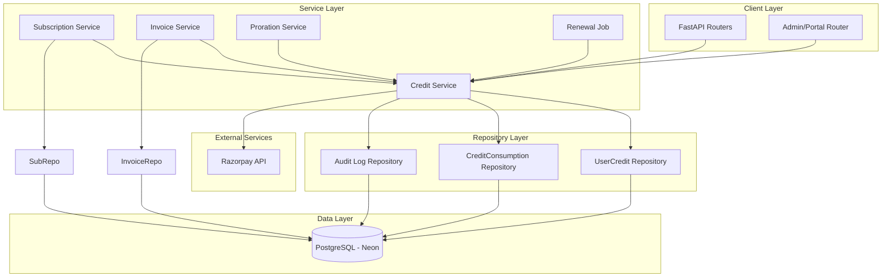

# Design Document: User Credit Integration

## Overview

This document specifies the technical design for a user credit integration feature in the Razorpay SaaS billing system. The feature enables administrators and the system itself to grant credit balances to users, which are automatically applied to subscription renewals and plan changes. The credit system operates as a payment method (not a discount), ensuring GST compliance by calculating tax on the full invoice total before credit application.

Key architectural decisions:

- **Credit amounts stored in paisa** (Decimal type) across the system, matching the existing `Payment.amount` convention
- **Invoice totals stored in rupees** (Decimal) — this is the existing billing system convention
- **Single paisa-to-rupee conversion** happens ONLY in `CreditService.apply_credit_to_invoice()` — no other component performs raw paisa↔rupee conversions
- **Credit is a payment method choice**, not a discount: GST tax is calculated on the full invoice total before credit application
- **Consumption order**: soonest-expiring-first, then oldest-created (credits with no expiry are consumed last)
- **No user-facing credit redemption endpoint** in v1 — credit is applied automatically by the system

### Architecture Overview



## Architecture

### Core Components

1. **Credit Service** (`CreditService`)
   - Core business logic for credit grant, consumption, and management
   - Coordinates with repositories for persistence
   - Integrates with Razorpay for payment processing
   - Enforces ledger integrity constraints

2. **Credit Repository** (`UserCreditRepository`)
   - CRUD operations for `UserCredit` model
   - Query methods for balance calculation and consumption ordering
   - Transactional support for atomic updates

3. **CreditConsumption Repository** (`CreditConsumptionRepository`)
   - CRUD operations for `CreditConsumption` model
   - Query methods for consumption history and ledger integrity verification
   - Transactional support for atomic record creation

4. **Audit Log Repository** (`AuditLogRepository`)
   - Immutable audit trail for all credit operations
   - Compliance and troubleshooting support

5. **Background Jobs** (Celery)
   - Daily expiration job for expired credits
   - Credit balance reporting and reconciliation

### Database Schema

#### UserCredit Model

```python
from datetime import UTC, datetime
from decimal import Decimal
from enum import StrEnum
from uuid import UUID, uuid4

from sqlalchemy import BigInteger, DateTime, ForeignKey, Index, Numeric, String, Text
from sqlalchemy.dialects.postgresql import JSONB
from sqlalchemy.dialects.postgresql import UUID as PGUUID
from sqlalchemy.orm import Mapped, mapped_column

from app.shared import Base


class CreditType(StrEnum):
    """Origin of the credit grant."""
    PLAN_CREDIT = "plan_credit"        # From plan downgrade proration
    PROMOTIONAL = "promotional"       # Marketing/promotional credit
    ADMIN_GRANT = "admin_grant"       # Admin-granted goodwill credit


class CreditStatus(StrEnum):
    """Lifecycle status of a credit record."""
    ACTIVE = "active"      # Available for consumption
    CONSUMED = "consumed"  # Fully consumed
    EXPIRED = "expired"    # Past valid_until timestamp


class UserCredit(Base):
    """User credit balance record (Requirement 49).

    ``amount`` and ``remaining_balance`` are stored in paisa (smallest
    currency unit) to match Payment.amount convention.
    """

    __tablename__ = "user_credits"
    __table_args__ = (
        Index("ix_user_credits_user_id", "user_id"),
        Index("ix_user_credits_status", "status"),
        Index("ix_user_credits_valid_until", "valid_until"),
        Index("ix_user_credits_created_at", "created_at"),
    )

    id: Mapped[UUID] = mapped_column(PGUUID(as_uuid=True), primary_key=True, default=uuid4)
    user_id: Mapped[str] = mapped_column(String(length=255), nullable=False)
    
    # Credit details
    credit_type: Mapped[str] = mapped_column(String(length=32), nullable=False)
    credit_amount: Mapped[int] = mapped_column(BigInteger, nullable=False)
    remaining_balance: Mapped[int] = mapped_column(BigInteger, nullable=False)
    
    # Validity period
    valid_from: Mapped[datetime] = mapped_column(
        DateTime(timezone=True),
        nullable=False,
        default=lambda: datetime.now(tz=UTC),
    )
    valid_until: Mapped[datetime | None] = mapped_column(
        DateTime(timezone=True),
        nullable=True,
        default=None,
    )
    
    # Status tracking
    status: Mapped[str] = mapped_column(String(length=16), nullable=False, default="active")
    consumed_at: Mapped[datetime | None] = mapped_column(
        DateTime(timezone=True), nullable=True
    )
    
    # Metadata for audit and tracking
    metadata_: Mapped[dict[str, object]] = mapped_column(JSONB, default=dict, nullable=False)
    
    # Soft delete for audit compliance
    deleted_at: Mapped[datetime | None] = mapped_column(DateTime(timezone=True), nullable=True)
    
    created_at: Mapped[datetime] = mapped_column(
        DateTime(timezone=True),
        default=lambda: datetime.now(tz=UTC),
        nullable=False,
    )
    updated_at: Mapped[datetime] = mapped_column(
        DateTime(timezone=True),
        default=lambda: datetime.now(tz=UTC),
        onupdate=lambda: datetime.now(tz=UTC),
        nullable=False,
    )
```

**Key Fields:**
- `credit_amount`: Original credit amount in paisa (immutable)
- `remaining_balance`: Current available balance in paisa (decremented on consumption)
- `valid_from`: Earliest date credit is available
- `valid_until`: Expiry date (nullable for credits with no expiry)
- `credit_type`: Origin of the credit (PLAN_CREDIT, PROMOTIONAL, ADMIN_GRANT)
- `status`: Lifecycle state (ACTIVE, CONSUMED, EXPIRED)
- `metadata_`: JSONB field for type-specific data (e.g., `admin_user_id` for ADMIN_GRANT)

**Validation Rules:**
- `credit_amount` must be positive (minimum 1 paisa)
- `remaining_balance` must be <= `credit_amount`
- `valid_from` must be <= `valid_until` (if valid_until is set)
- `status` transitions follow state machine rules
- `consumed_at` required when status is CONSUMED

#### CreditConsumption Model

```python
from datetime import UTC, datetime
from decimal import Decimal
from uuid import UUID, uuid4

from sqlalchemy import BigInteger, DateTime, ForeignKey, Index, Numeric, String
from sqlalchemy.dialects.postgresql import UUID as PGUUID
from sqlalchemy.orm import Mapped, mapped_column

from app.shared import Base


class CreditConsumption(Base):
    """Credit consumption ledger record (Requirement 50.5).

    Tracks when and how much credit was applied to an invoice.
    ``consumed_amount`` is stored in paisa.
    """

    __tablename__ = "credit_consumptions"
    __table_args__ = (
        Index("ix_credit_consumptions_user_id", "user_id"),
        Index("ix_credit_consumptions_credit_id", "credit_id"),
        Index("ix_credit_consumptions_invoice_id", "invoice_id"),
        Index("ix_credit_consumptions_created_at", "created_at"),
    )

    id: Mapped[UUID] = mapped_column(PGUUID(as_uuid=True), primary_key=True, default=uuid4)
    user_id: Mapped[str] = mapped_column(String(length=255), nullable=False)
    credit_id: Mapped[UUID] = mapped_column(
        PGUUID(as_uuid=True),
        ForeignKey(column="user_credits.id", ondelete="RESTRICT"),
        nullable=False,
    )
    invoice_id: Mapped[UUID | None] = mapped_column(
        PGUUID(as_uuid=True),
        ForeignKey(column="invoices.id"),
        nullable=True,
    )
    razorpay_payment_id: Mapped[str | None] = mapped_column(String(length=64), nullable=True)
    
    consumed_amount: Mapped[int] = mapped_column(BigInteger, nullable=False)
    description: Mapped[str | None] = mapped_column(Text, nullable=True)
    
    metadata_: Mapped[dict[str, object]] = mapped_column(JSONB, default=dict, nullable=False)
    
    created_at: Mapped[datetime] = mapped_column(
        DateTime(timezone=True),
        default=lambda: datetime.now(tz=UTC),
        nullable=False,
    )
```

**Key Fields:**
- `credit_id`: Reference to the `UserCredit` record being consumed
- `consumed_amount`: Amount consumed in paisa
- `invoice_id`: Reference to the invoice being paid (nullable if not yet paid)
- `razorpay_payment_id`: Payment ID if partial cash payment was made
- `metadata_`: Additional context (e.g., `invoice_number`, `cash_amount`)

**Validation Rules:**
- `consumed_amount` must be positive
- `consumed_amount` must not exceed `UserCredit.remaining_balance`
- `invoice_id` and `razorpay_payment_id` can be null initially (created first, updated later)

## Components and Interfaces

### Component 1: Credit Service

**Purpose**: Core credit business logic for grant, consumption, balance queries, and expiration.

**Interface**:
```python
from typing import Protocol
from decimal import Decimal
from uuid import UUID

from app.features.credits.dto import (
    CreditGrantDTO,
    CreditGrantResponse,
    CreditBalanceResponse,
    CreditHistoryResponse,
    CreditConsumptionResult,
)
from app.features.credits.model import CreditType, CreditStatus

class ICreditService(Protocol):
    async def grant_credit(
        self, 
        user_id: str, 
        dto: CreditGrantDTO
    ) -> CreditGrantResponse:
        """Grant credit to a user (Requirement 49)."""
        ...
    
    async def consume_credits(
        self,
        user_id: str,
        invoice_id: UUID,
        invoice_gross_total: Decimal,  # in rupees
    ) -> CreditConsumptionResult:
        """Apply available credits to an invoice (Requirement 50)."""
        ...
    
    async def get_credit_balance(self, user_id: str) -> Decimal:
        """Get user's total available credit balance in rupees (Requirement 52.1)."""
        ...
    
    async def get_credit_history(
        self, 
        user_id: str,
        limit: int = 50,
        offset: int = 0,
    ) -> CreditHistoryResponse:
        """Get user's credit and consumption history (Requirement 52.2)."""
        ...
    
    async def expire_credits(self) -> None:
        """Background job to expire past-due credits (Requirement 51)."""
        ...
    
    async def grant_credit_on_downgrade(
        self,
        user_id: str,
        subscription_id: UUID,
        proration_amount: int,  # in paisa
    ) -> CreditGrantResponse:
        """Grant credit from plan downgrade proration (Requirement 54)."""
        ...
```

**Responsibilities**:
- Credit grant with validation and audit logging
- Credit consumption with proper ordering and transactional integrity
- Balance calculation for active, non-expired credits
- History retrieval with consumption tracking
- Daily expiration job for past-due credits
- Proration credit grant for plan downgrades

### Component 2: Credit Repository

**Purpose**: Persistence operations for `UserCredit` model.

**Interface**:
```python
from typing import Protocol
from uuid import UUID

from app.features.credits.model import CreditStatus

class ICreditRepository(Protocol):
    async def create(self, credit: UserCredit) -> UserCredit:
        """Create a new credit record."""
        ...
    
    async def find_by_id(self, credit_id: UUID) -> UserCredit | None:
        """Find a credit by ID."""
        ...
    
    async def find_by_user(
        self,
        user_id: str,
        *,
        status: CreditStatus | None = None,
        limit: int = 50,
        offset: int = 0,
    ) -> tuple[list[UserCredit], int]:
        """List credits for a user with pagination."""
        ...
    
    async def find_available_for_consumption(
        self,
        user_id: str,
        *, 
        limit: int = 100,
    ) -> list[UserCredit]:
        """Find credits eligible for consumption, sorted by expiry then creation."""
        ...
    
    async def update_balance(
        self,
        credit: UserCredit,
        new_remaining_balance: int,
        new_status: CreditStatus | None = None,
        consumed_at: datetime | None = None,
    ) -> UserCredit:
        """Update remaining balance and optionally status."""
        ...
    
    async def expire_credits_past_date(self, cutoff: datetime) -> list[UserCredit]:
        """Find and expire credits past their valid_until date."""
        ...
```

**Responsibilities**:
- CRUD operations for `UserCredit`
- Query for available credits sorted by consumption order
- Balance updates with status transitions
- Expiration batch processing

### Component 3: CreditConsumption Repository

**Purpose**: Persistence operations for `CreditConsumption` model.

**Interface**:
```python
from typing import Protocol
from uuid import UUID

class ICreditConsumptionRepository(Protocol):
    async def create(
        self,
        consumption: CreditConsumption,
    ) -> CreditConsumption:
        """Create a new consumption record."""
        ...
    
    async def find_by_credit_id(
        self, 
        credit_id: UUID,
    ) -> list[CreditConsumption]:
        """Find all consumption records for a credit."""
        ...
    
    async def find_by_user(
        self,
        user_id: str,
        *,
        limit: int = 50,
        offset: int = 0,
    ) -> tuple[list[CreditConsumption], int]:
        """List consumption records for a user with pagination."""
        ...
    
    async def find_by_invoice_id(
        self,
        invoice_id: UUID,
    ) -> CreditConsumption | None:
        """Find consumption record for an invoice."""
        ...
    
    async def get_total_consumed(
        self,
        credit_id: UUID,
    ) -> int:
        """Get total consumed amount for a credit (in paisa)."""
        ...
```

**Responsibilities**:
- CRUD operations for `CreditConsumption`
- Ledger integrity queries for consumption tracking
- History retrieval for credit statements

### Component 4: Audit Log Integration

**Purpose**: Immutable audit trail for all credit operations.

**Interface**:
```python
from typing import Protocol
from app.features.audit.model import AuditAction, AuditLog

class IAuditLogRepository(Protocol):
    async def create(self, audit_log: AuditLog) -> AuditLog:
        """Create an audit log entry."""
        ...
```

**Audit Events**:
- `CREDIT_GRANTED`: When credits are granted to a user
- `CREDIT_CONSUMED`: When credits are applied to an invoice
- `CREDIT_EXPIRED`: When credits expire past their valid_until date

## Data Models

### Data Transfer Objects (DTOs)

#### CreditGrantDTO

```python
from datetime import datetime
from decimal import Decimal
from pydantic import BaseModel, Field

class CreditGrantDTO(BaseModel):
    """Request to grant credit to a user."""
    
    credit_type: str  # "plan_credit", "promotional", "admin_grant"
    credit_amount: int = Field(
        description="Amount in paisa (minimum 1 paisa, positive integer)"
    )
    valid_from: datetime | None = Field(
        default=None,
        description="Earliest date credit is available (default: now)"
    )
    valid_until: datetime | None = Field(
        default=None,
        description="Expiry date (nullable for credits with no expiry)"
    )
    description: str | None = Field(
        default=None,
        max_length=500,
        description="Optional description for audit trail"
    )
    metadata_: dict = Field(
        default_factory=dict,
        description="Type-specific metadata (e.g., admin_user_id for admin grants)"
    )
```

**Validation Rules:**
- `credit_amount` must be positive (minimum 1 paisa)
- `valid_from` must be <= `valid_until` (if both set)
- `metadata_` for ADMIN_GRANT must include `admin_user_id`

#### CreditGrantResponse

```python
from datetime import datetime
from pydantic import BaseModel, Field

class CreditGrantResponse(BaseModel):
    """Response from credit grant operation."""
    
    credit_id: str = Field(serialization_alias="creditId")
    user_id: str = Field(serialization_alias="userId")
    credit_type: str = Field(serialization_alias="creditType")
    credit_amount: int = Field(serialization_alias="creditAmount")
    remaining_balance: int = Field(serialization_alias="remainingBalance")
    valid_from: datetime = Field(serialization_alias="validFrom")
    valid_until: datetime | None = Field(default=None, serialization_alias="validUntil")
    status: str = Field(serialization_alias="status")
    created_at: datetime = Field(serialization_alias="createdAt")
```

#### CreditConsumptionResult

```python
from decimal import Decimal
from pydantic import BaseModel, Field

class CreditConsumptionResult(BaseModel):
    """Result of credit application to an invoice."""
    
    credit_applied: Decimal = Field(
        serialization_alias="creditApplied",
        description="Total credit applied in rupees"
    )
    cash_due: Decimal = Field(
        serialization_alias="cashDue",
        description="Remaining amount to be charged in rupees"
    )
    credits_consumed: list[ConsumedCredit] = Field(
        serialization_alias="creditsConsumed"
    )
    invoice_paid_in_full: bool = Field(
        serialization_alias="invoicePaidInFull",
        description="True if invoice is fully covered by credit"
    )


class ConsumedCredit(BaseModel):
    """Individual credit consumption record."""
    
    credit_id: str = Field(serialization_alias="creditId")
    consumed_amount: int = Field(
        serialization_alias="consumedAmount",
        description="Amount consumed in paisa"
    )
    remaining_balance: int = Field(
        serialization_alias="remainingBalance",
        description="New remaining balance in paisa"
    )
```

#### CreditBalanceResponse

```python
from decimal import Decimal
from pydantic import BaseModel, Field

class CreditBalanceResponse(BaseModel):
    """User's available credit balance."""
    
    total_balance: Decimal = Field(
        serialization_alias="totalBalance",
        description="Sum of active, non-expired credits in rupees"
    )
    currency: str = Field(default="INR")
```

#### CreditHistoryResponse

```python
from datetime import datetime
from pydantic import BaseModel, Field

class CreditHistoryResponse(BaseModel):
    """User's credit and consumption history."""
    
    credits: list[CreditRecord] = Field(default_factory=list)
    consumptions: list[ConsumptionRecord] = Field(default_factory=list)
    total: int = Field(description="Total number of records")
    limit: int = Field(description="Page size")
    offset: int = Field(description="Page offset")


class CreditRecord(BaseModel):
    """Individual credit record."""
    
    credit_id: str = Field(serialization_alias="creditId")
    credit_type: str = Field(serialization_alias="creditType")
    credit_amount: int = Field(serialization_alias="creditAmount")
    remaining_balance: int = Field(serialization_alias="remainingBalance")
    valid_from: datetime = Field(serialization_alias="validFrom")
    valid_until: datetime | None = Field(default=None, serialization_alias="validUntil")
    status: str = Field(serialization_alias="status")
    created_at: datetime = Field(serialization_alias="createdAt")


class ConsumptionRecord(BaseModel):
    """Individual consumption record."""
    
    consumption_id: str = Field(serialization_alias="consumptionId")
    credit_id: str = Field(serialization_alias="creditId")
    consumed_amount: int = Field(serialization_alias="consumedAmount")
    invoice_id: str | None = Field(default=None, serialization_alias="invoiceId")
    created_at: datetime = Field(serialization_alias="createdAt")
```

## Correctness Properties

*A property is a characteristic or behavior that should hold true across all valid executions of a system—essentially, a formal statement about what the system should do. Properties serve as the bridge between human-readable specifications and machine-verifiable correctness guarantees.*

### Property 1: Ledger Integrity (Amount Conservation)

*For any* UserCredit record, the original `credit_amount` MUST equal the sum of `remaining_balance` plus all `consumed_amount` records referencing that credit.

**Validates: Requirements 53.1**

**Property Type**: Invariant + Round-trip

**Explanation**: This property ensures that credits are never lost or double-spent. The sum of remaining balance and all consumptions must equal the original grant amount. This is tested by generating random credits and consumption sequences, then verifying the ledger equation holds.

**Test Strategy**: Generate random credit grants, apply random consumption sequences, verify `credit_amount == remaining_balance + SUM(consumed_amount)`.

### Property 2: Transactional Atomicity

*For any* credit consumption event, the `CreditConsumption` record and corresponding invoice/payment rows MUST be created in the same database transaction.

**Validates: Requirements 53.2**

**Property Type**: Atomicity

**Explanation**: This property ensures that credit consumption is atomic with invoice/payment creation. Either both records are created successfully, or neither is. This is tested by simulating transaction failures and verifying rollback behavior.

**Test Strategy**: Generate random consumption scenarios with simulated transaction failures, verify no partial records are left behind.

### Property 3: Rollback on Payment Failure

*For any* Razorpay charge failure, the ENTIRE transaction—including the credit deduction—MUST roll back.

**Validates: Requirements 53.3**

**Property Type**: Atomicity + Idempotence

**Explanation**: This property ensures that failed payments don't leave credits consumed. If Razorpay fails to charge the remaining cash amount, the entire transaction (including credit deduction) is rolled back. This is tested by simulating Razorpay failures and verifying rollback.

**Test Strategy**: Generate random partial coverage scenarios, simulate Razorpay failure, verify credit balance is unchanged.

### Property 4: Status Transition Integrity

*For any* UserCredit, `credit_status` MUST be CONSUMED ONLY when `remaining_balance` equals zero, and MUST be EXPIRED ONLY when the current timestamp exceeds `valid_until` and status was previously ACTIVE.

**Validates: Requirements 53.4, 53.5**

**Property Type**: Invariant + Round-trip

**Explanation**: This property ensures status transitions are correct. Credits are only marked CONSUMED when fully used, and only marked EXPIRED when past their validity period. This is tested by generating random credit states and transitions, verifying status changes are valid.

**Test Strategy**: Generate random credits with various states and validity periods, apply consumption/expiry operations, verify status transitions follow rules.

### Property 5: Consumption Order Correctness

*For any* user, credits MUST be consumed in order of soonest `valid_until` first, then oldest `created_at` (credits with no expiry are consumed last).

**Validates: Requirement 50.2**

**Property Type**: Ordering + Idempotence

**Explanation**: This property ensures fair consumption order. Credits expiring soonest are consumed first, and credits with the same expiry are consumed in order of creation. This is tested by generating random credits with varying expiry dates and creation times, verifying consumption order.

**Test Strategy**: Generate random credit sets with varying expiry dates and creation times, apply consumption, verify order is correct.

### Property 6: Expiration Exclusion

*For any* expired credit, the credit MUST be excluded from consumption ordering and balance calculations.

**Validates: Requirement 51.3**

**Property Type**: Filtering + Invariant

**Explanation**: This property ensures expired credits are not used. Only ACTIVE, non-expired credits are considered for consumption and balance calculations. This is tested by generating expired and active credits, verifying expired ones are excluded.

**Test Strategy**: Generate random expired and active credits, verify expired ones are excluded from consumption and balance.

### Property 7: GST Compliance (Full-Price Tax)

*For any* invoice with credit applied, the subtotal, tax_amount, and total calculations MUST NOT be affected by credit application—GST is calculated on the full invoice price before credit application.

**Validates: Requirement 55.4**

**Property Type**: Invariant + Round-trip

**Explanation**: This property ensures GST compliance. Tax is calculated on the full invoice total before credit is applied, not on the reduced amount. This is tested by generating invoices with and without credits, verifying tax calculations are identical.

**Test Strategy**: Generate random invoices with varying amounts and credits, verify tax calculations match between credit and no-credit scenarios.

### Property 8: Balance Calculation Correctness

*For any* user, the credit balance MUST equal the sum of `remaining_balance` across all ACTIVE, non-expired UserCredit records.

**Validates: Requirement 52.1**

**Property Type**: Aggregation + Invariant

**Explanation**: This property ensures balance calculations are correct. Only active, non-expired credits contribute to the balance. This is tested by generating random credit states and validity periods, verifying balance calculation.

**Test Strategy**: Generate random credits with varying states and validity, verify balance equals sum of active, non-expired credits.

## Error Handling

### Credit Grant Errors

| Error Code | HTTP Status | Description |
|------------|-------------|-------------|
| `CREDIT_AMOUNT_MUST_BE_POSITIVE` | 422 | Credit amount must be positive (minimum 1 paisa) |
| `CREDIT_INVALID_DATE_RANGE` | 422 | `valid_from` must be <= `valid_until` |
| `CREDIT_METADATA_MISSING` | 422 | ADMIN_GRANT requires `admin_user_id` in metadata |
| `CREDIT_DATABASE_ERROR` | 500 | Database error during credit creation |

### Credit Consumption Errors

| Error Code | HTTP Status | Description |
|------------|-------------|-------------|
| `CREDIT_NOT_FOUND` | 404 | Credit record not found |
| `CREDIT_INSUFFICIENT_BALANCE` | 400 | Credit balance insufficient for requested consumption |
| `CREDIT_EXPIRED` | 400 | Credit has expired and cannot be consumed |
| `CREDIT_ALREADY_CONSUMED` | 400 | Credit has been fully consumed |
| `CREDIT_TRANSACTION_ROLLBACK` | 500 | Transaction rolled back due to payment failure |

### Expiration Job Errors

| Error Code | HTTP Status | Description |
|------------|-------------|-------------|
| `EXPIRATION_DATABASE_ERROR` | 500 | Database error during expiration batch |
| `EXPIRATION_AUDIT_ERROR` | 500 | Audit log creation failed |

### Proration Integration Errors

| Error Code | HTTP Status | Description |
|------------|-------------|-------------|
| `PRORATION_CREDIT_GRANT_FAILED` | 500 | Failed to grant credit from proration |
| `PRORATION_INVALID_SUBSCRIPTION` | 400 | Subscription not in ACTIVE status for proration |

## Testing Strategy

### Dual Testing Approach

1. **Property-Based Tests** (100+ iterations each)
   - Verify universal properties across all valid inputs
   - Use `fast-check` (Python) or `hypothesis` for property-based testing
   - Minimum 100 iterations per property

2. **Example-Based Unit Tests**
   - Verify specific scenarios and edge cases
   - Cover error conditions and boundary conditions
   - Use `pytest` for example-based testing

### Property-Based Testing Configuration

| Property | Test Strategy | Expected Pass Rate |
|----------|---------------|-------------------|
| Ledger Integrity | Generate credits, apply random consumptions, verify sum | 100% |
| Transactional Atomicity | Simulate failures, verify rollback | 100% |
| Rollback on Failure | Simulate Razorpay failures, verify rollback | 100% |
| Status Transitions | Generate state machines, verify rules | 100% |
| Consumption Order | Generate credits, verify sort order | 100% |
| Expiration Exclusion | Generate expired/active credits, verify filtering | 100% |
| GST Compliance | Generate invoices, verify tax calculations | 100% |
| Balance Calculation | Generate credit sets, verify sum | 100% |

### Unit Testing Balance

**Example Tests** (1-3 iterations):
- Specific scenario: Credit grant with ADMIN_GRANT type
- Edge case: Credit with no expiry (valid_until=None)
- Error case: Insufficient balance for partial payment
- Integration: Credit application with invoice creation

### Integration Tests

| Test | Strategy | Iterations |
|------|----------|-----------|
| Daily expiration job | Run job, verify expired credits | 1-3 |
| Credit history retrieval | Verify sorted results | 1-3 |
| Proration credit grant | End-to-end downgrade flow | 1-3 |
| Audit log creation | Verify all events logged | 1-3 |

### Test Tagging Format

Each property-based test must include:
```python
# Feature: user-credit-integration, Property {number}: {property_text}
```

Example:
```python
# Feature: user-credit-integration, Property 1: Ledger Integrity (Amount Conservation)
@given(credit=generate_user_credit(), consumptions=generate_consumption_sequence())
def test_ledger_integrity(credit, consumptions):
    # Test implementation
```

### Coverage Requirements

- **Property-based tests**: 8 core properties (100+ iterations each)
- **Unit tests**: All edge cases, error conditions, boundary values
- **Integration tests**: All external service integrations, background jobs
- **Manual testing**: UI flows, admin operations, end-to-end scenarios

## Background Jobs

### Daily Credit Expiration Job

**Purpose**: Expire credits past their `valid_until` date.

**Schedule**: Daily (configurable via environment variable)

**Implementation**:
```python
from datetime import datetime, UTC
from app.features.audit.model import AuditAction

async def expire_credits_job() -> None:
    """Background job to expire past-due credits."""
    now = datetime.now(tz=UTC)
    
    # Find ACTIVE credits past valid_until
    expired_credits = await credit_repo.expire_credits_past_date(now)
    
    for credit in expired_credits:
        # Update status to EXPIRED
        await credit_repo.update_status(credit, CreditStatus.EXPIRED)
        
        # Create audit log
        await audit_log.create(
            AuditLog(
                entity_type="user_credit",
                entity_id=str(credit.id),
                action=AuditAction.CREDIT_EXPIRED.value,
                changes={
                    "user_id": credit.user_id,
                    "credit_id": str(credit.id),
                    "expired_at": now.isoformat(),
                },
            )
        )
```

**Error Handling**:
- Failed expiration: Log error, continue with other credits
- Audit log failure: Log error, credit status remains unchanged
- Transaction rollback: Credit remains ACTIVE

### Credit Reconciliation Job

**Purpose**: Verify ledger integrity and detect discrepancies.

**Schedule**: Weekly (configurable)

**Implementation**:
```python
async def reconcile_credits_job() -> None:
    """Verify ledger integrity for all credits."""
    # Get all credits
    credits, _ = await credit_repo.find_by_user("*", limit=10000)
    
    discrepancies = []
    for credit in credits:
        # Calculate total consumed
        total_consumed = await consumption_repo.get_total_consumed(credit.id)
        
        # Verify ledger integrity
        expected_remaining = credit.credit_amount - total_consumed
        if credit.remaining_balance != expected_remaining:
            discrepancies.append({
                "credit_id": str(credit.id),
                "expected_remaining": expected_remaining,
                "actual_remaining": credit.remaining_balance,
                "total_consumed": total_consumed,
            })
    
    if discrepancies:
        logger.error("Ledger discrepancies detected", discrepancies=discrepancies)
        # Alert operations team
        await alert_ops_team(discrepancies)
```
    ProrationSvc --> CreditSvc
    RenewalJob --> CreditSvc

    CreditSvc --> CreditRepo
    CreditSvc --> ConsumptionRepo
    CreditSvc --> AuditRepo
    CreditSvc --> Razorpay

    SubSvc --> SubRepo
    InvoiceSvc --> InvoiceRepo

    CreditRepo --> PostgreSQL
    ConsumptionRepo --> PostgreSQL
    AuditRepo --> PostgreSQL
    InvoiceRepo --> PostgreSQL
    SubRepo --> PostgreSQL
```

## API Endpoints and Data Transfer Objects

### Admin/Portal API Endpoints

#### 1. Grant Credit to User

```python
from fastapi import APIRouter, Depends
from app.shared.response_type import APIResponse
from app.features.credits.dto import CreditGrantDTO, CreditGrantResponse

router = APIRouter(prefix="/credits", tags=["Credits"])


@router.post("", response_model=APIResponse[CreditGrantResponse])
async def grant_credit(
    dto: CreditGrantDTO,
    current_user: Annotated[User, Depends(get_admin_user)],
) -> APIResponse[CreditGrantResponse]:
    """Grant credit to a user (Requirement 49).
    
    **Permission**: Admin only
    
    **Payload**:
    - `credit_type`: "plan_credit", "promotional", or "admin_grant"
    - `credit_amount`: Amount in paisa (minimum 1 paisa)
    - `valid_from`: Earliest date credit is available (default: now)
    - `valid_until`: Expiry date (nullable for credits with no expiry)
    - `description`: Optional description for audit trail
    - `metadata_`: Type-specific metadata (e.g., `admin_user_id` for admin grants)
    """
    try:
        result = await credit_service.grant_credit(
            user_id=dto.metadata_.get("target_user_id") or dto.metadata_.get("user_id"),
            dto=dto,
        )
        return http_response(result)
    except ValidationException as exc:
        raise exc
```

**Request Body**:
```json
{
  "credit_type": "admin_grant",
  "credit_amount": 5000,
  "valid_from": "2024-01-01T00:00:00Z",
  "valid_until": "2025-01-01T00:00:00Z",
  "description": "Goodwill credit for billing issue",
  "metadata": {
    "admin_user_id": "admin-uuid",
    "target_user_id": "user-uuid"
  }
}
```

**Response**:
```json
{
  "success": true,
  "data": {
    "creditId": "credit-uuid",
    "userId": "user-uuid",
    "creditType": "admin_grant",
    "creditAmount": 5000,
    "remainingBalance": 5000,
    "validFrom": "2024-01-01T00:00:00Z",
    "validUntil": "2025-01-01T00:00:00Z",
    "status": "active",
    "createdAt": "2024-01-01T00:00:00Z"
  }
}
```

**Error Responses**:
| Code | Status | Description |
|------|--------|-------------|
| `CREDIT_AMOUNT_MUST_BE_POSITIVE` | 422 | Amount must be positive |
| `CREDIT_INVALID_DATE_RANGE` | 422 | Invalid date range |
| `CREDIT_METADATA_MISSING` | 422 | Missing admin_user_id for admin grants |

---

#### 2. Get User Credit Balance

```python
@router.get("/balance", response_model=APIResponse[CreditBalanceResponse])
async def get_credit_balance(
    user_id: str,
    current_user: Annotated[User, Depends(get_admin_or_user)],
) -> APIResponse[CreditBalanceResponse]:
    """Get user's total available credit balance (Requirement 52.1).
    
    **Permission**: Admin or user (self only)
    """
    if current_user.id != user_id and not current_user.is_admin:
        raise ForbiddenException("Cannot view other users' credit balances")
    
    balance = await credit_service.get_credit_balance(user_id=user_id)
    return http_response(CreditBalanceResponse(total_balance=balance))
```

**Response**:
```json
{
  "success": true,
  "data": {
    "totalBalance": 50.00,
    "currency": "INR"
  }
}
```

---

#### 3. Get User Credit History

```python
@router.get("/history", response_model=APIResponse[CreditHistoryResponse])
async def get_credit_history(
    user_id: str,
    limit: int = Query(default=50, le=100),
    offset: int = Query(default=0),
    current_user: Annotated[User, Depends(get_admin_or_user)],
) -> APIResponse[CreditHistoryResponse]:
    """Get user's credit and consumption history (Requirement 52.2).
    
    **Permission**: Admin or user (self only)
    """
    if current_user.id != user_id and not current_user.is_admin:
        raise ForbiddenException("Cannot view other users' credit history")
    
    history = await credit_service.get_credit_history(
        user_id=user_id, limit=limit, offset=offset
    )
    return http_response(history)
```

**Response**:
```json
{
  "success": true,
  "data": {
    "credits": [
      {
        "creditId": "credit-uuid",
        "creditType": "promotional",
        "creditAmount": 10000,
        "remainingBalance": 5000,
        "validFrom": "2024-01-01T00:00:00Z",
        "validUntil": "2025-01-01T00:00:00Z",
        "status": "active",
        "createdAt": "2024-01-01T00:00:00Z"
      }
    ],
    "consumptions": [
      {
        "consumptionId": "consumption-uuid",
        "creditId": "credit-uuid",
        "consumedAmount": 5000,
        "invoiceId": "invoice-uuid",
        "createdAt": "2024-06-01T00:00:00Z"
      }
    ],
    "total": 2,
    "limit": 50,
    "offset": 0
  }
}
```

---

### System-Internal Endpoints (Called by InvoiceService)

#### 4. Apply Credit to Invoice

```python
@router.post("/apply-to-invoice", response_model=APIResponse[CreditConsumptionResult])
async def apply_credit_to_invoice(
    user_id: str,
    invoice_id: str,
    invoice_gross_total: Decimal = Body(..., description="Invoice gross total in rupees"),
) -> APIResponse[CreditConsumptionResult]:
    """Apply available credits to an invoice (Requirement 50, 55).
    
    This endpoint is called internally by InvoiceService during invoice generation.
    It consumes credits in order of soonest expiry first, then oldest creation.
    
    **Permission**: System/internal only (no user-facing endpoint)
    """
    result = await credit_service.consume_credits(
        user_id=user_id,
        invoice_id=UUID(invoice_id),
        invoice_gross_total=invoice_gross_total,
    )
    return http_response(result)
```

**Request Body**:
```json
{
  "user_id": "user-uuid",
  "invoice_id": "invoice-uuid",
  "invoice_gross_total": 118.00
}
```

**Response**:
```json
{
  "success": true,
  "data": {
    "creditApplied": 50.00,
    "cashDue": 68.00,
    "creditsConsumed": [
      {
        "creditId": "credit-uuid",
        "consumedAmount": 5000,
        "remainingBalance": 0
      }
    ],
    "invoicePaidInFull": false
  }
}
```

---

## Error Handling

### Credit Grant Errors

| Error Code | HTTP Status | Description |
|------------|-------------|-------------|
| `CREDIT_AMOUNT_MUST_BE_POSITIVE` | 422 | Credit amount must be positive (minimum 1 paisa) |
| `CREDIT_INVALID_DATE_RANGE` | 422 | `valid_from` must be <= `valid_until` |
| `CREDIT_METADATA_MISSING` | 422 | ADMIN_GRANT requires `admin_user_id` in metadata |
| `CREDIT_DATABASE_ERROR` | 500 | Database error during credit creation |

### Credit Consumption Errors

| Error Code | HTTP Status | Description |
|------------|-------------|-------------|
| `CREDIT_NOT_FOUND` | 404 | Credit record not found |
| `CREDIT_INSUFFICIENT_BALANCE` | 400 | Credit balance insufficient for requested consumption |
| `CREDIT_EXPIRED` | 400 | Credit has expired and cannot be consumed |
| `CREDIT_ALREADY_CONSUMED` | 400 | Credit has been fully consumed |
| `CREDIT_TRANSACTION_ROLLBACK` | 500 | Transaction rolled back due to payment failure |

### Expiration Job Errors

| Error Code | HTTP Status | Description |
|------------|-------------|-------------|
| `EXPIRATION_DATABASE_ERROR` | 500 | Database error during expiration batch |
| `EXPIRATION_AUDIT_ERROR` | 500 | Audit log creation failed |

### Proration Integration Errors

| Error Code | HTTP Status | Description |
|------------|-------------|-------------|
| `PRORATION_CREDIT_GRANT_FAILED` | 500 | Failed to grant credit from proration |
| `PRORATION_INVALID_SUBSCRIPTION` | 400 | Subscription not in ACTIVE status for proration |
