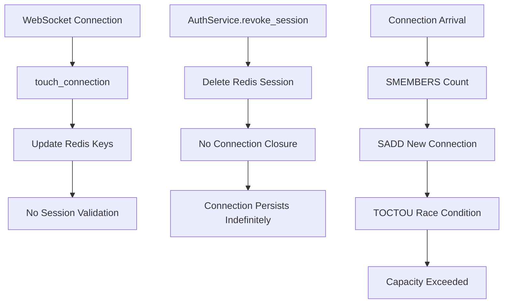

# WebSocket Security Bugfix Design

## Overview

This bugfix addresses critical and high-priority security vulnerabilities in the WebSocket authentication and session management system. The primary issues are:

1. **P0 Session Revocation Gap**: WebSocket connections persist indefinitely after session revocation or JWT expiry because the system does not validate session state on active connections
2. **P0 Presence Tracking Race Condition**: Connection capacity checking has TOCTOU (time-of-check-to-time-of-use) vulnerability due to non-atomic operations
3. **P1 Rate Limiter Misconfiguration**: Rate limiting is bypassed due to incorrect `websocket.state` mutation instead of direct `Limiter.try_acquire()` calls
4. **P1 Configuration Gaps**: Missing secret fields, incomplete proxy-aware URL resolution, and disabled MCP retry

The fix implements a **pull-based revocation architecture** with periodic 30-second validation checks, refactors presence tracking to use atomic sorted set operations, and corrects the rate limiter configuration.

---

## Glossary

- **Bug_Condition (C)**: The condition that triggers the bug - when session revocation, JWT expiry, or capacity overflow occurs, live WebSocket connections remain authenticated
- **Property (P)**: The desired behavior when bug condition holds - connections must be closed within 30 seconds (P0) or immediately (TOCTOU), rate limiting must enforce limits, and configuration must be complete
- **Preservation**: Existing functionality for valid connections (authentication, message handling, presence updates, capacity enforcement)
- **Pull-based Revocation**: Periodic re-verification of session state from Redis every 30 seconds instead of push-based notifications
- **Sorted Set Presence Tracking**: Using Redis sorted sets (`ZADD`, `ZCARD`, `ZREMRANGEBYSCORE`) instead of separate key patterns for atomic capacity operations
- **[functionName]**: The function in `[file path]` that [description of what it does]
- **[relevantState]**: The property/state that determines [relevant context]

---

## Bug Details

### Bug Condition

The bug manifests when a user's session is revoked via `AuthService.revoke_session()` or when a JWT access token expires (after 15 minutes). The system performs no validation on active WebSocket connections, allowing them to remain authenticated indefinitely.

**Formal Specification:**
```
FUNCTION isBugCondition(input)
  INPUT: input of type SessionRevocationEvent | TokenExpiryEvent | ConnectionCapacityOverflow
  OUTPUT: boolean
  
  RETURN (session_revoked AND connection_exists_for_session)
         OR (jwt_expired AND connection_open_at_issuance)
         OR (connection_count > max AND TOCTOU_check_passed)
END FUNCTION
```

### Examples

**Example 1: Session Revocation Gap**
- **Expected**: User clicks "Logout from all devices" → `AuthService.revoke_session(session_id)` → all WebSocket connections with `session_id` close immediately
- **Actual**: All WebSocket connections with `session_id` remain open and authenticated, allowing continued access to protected resources
- **Impact**: P0 Critical - session revocation provides no security guarantee

**Example 2: JWT Expiry Ignored**
- **Expected**: Access token expires after 15 minutes → active WebSocket connections re-validate and close if token expired
- **Actual**: Connections opened at minute 0 remain authenticated for the entire process lifetime (hours/days)
- **Impact**: P0 Critical - token expiry provides no security guarantee

**Example 3: TOCTOU Capacity Overflow**
- **Expected**: 4 connections arrive simultaneously for user with `max=3` → 1 connection rejected atomically
- **Actual**: All 4 connections pass the check because the read-then-write operation is not atomic → capacity exceeded
- **Impact**: P0 Critical - resource exhaustion vulnerability

**Example 4: Rate Limiter Bypass**
- **Expected**: User exceeds 60 messages/60s → subsequent messages rejected
- **Actual**: Rate limiter state mutation is incorrect → no rate limiting applied
- **Impact**: P1 High - potential for message spam and resource exhaustion

---

## Expected Behavior

### Preservation Requirements

**Unchanged Behaviors:**
- WebSocket connections with valid credentials must continue to authenticate using JWT validation
- `touch_connection()` must continue to maintain Redis presence keys for active connections
- Multiple WebSocket connections per user must continue to enforce `WEBSOCKET_MAX_CONNECTIONS_PER_USER` limit
- Rate limiting must continue to track and limit message rates per user and per connection
- Session revocation must continue to invalidate refresh tokens in Redis
- WebSocket connection cleanup must continue to remove Redis presence keys via `unregister_connection()`
- Production secret field validation must continue to raise errors for known insecure defaults
- MCP client requests must continue to use circuit breaker configuration for retry behavior

**Scope:**
All inputs that do NOT involve session revocation, JWT expiry, or capacity overflow should be completely unaffected by this fix. This includes:
- Normal message handling for valid sessions
- Connection establishment with valid credentials
- Presence updates for active connections
- Rate limiting for normal traffic patterns

---

## Hypothesized Root Cause

Based on the bug description, the most likely issues are:

1. **Missing Pull-based Revocation Check**: The `WebSocketSecurityService` has no mechanism to periodically re-validate session state from Redis on active connections
   - **Detail**: The `touch_connection()` method only updates Redis keys but does not verify if the session still exists
   - **Context**: No background task or periodic check loop exists to validate session state

2. **Non-Atomic Capacity Check**: The `ensure_connection_capacity()` method uses separate read (`SMEMBERS`) and write (`SADD`) operations
   - **Detail**: 4 connections arrive simultaneously, all 4 read `count=3`, all 4 write `SADD`, final count=7 instead of max=3
   - **Context**: No Redis pipeline or atomic operation prevents race condition

3. **Incorrect Rate Limiter State Mutation**: The `_apply_rate_limits()` method mutates `websocket.state.ws_rate_limit_id` between limiter calls
   - **Detail**: `WebSocketRateLimiter` uses the identifier from `websocket.state` but the identifier changes between user and connection limits
   - **Context**: The limiter should use direct `try_acquire()` calls with explicit identifiers

4. **Incomplete Configuration**: The `PRODUCTION_SECRET_FIELDS` list is missing critical secret fields
   - **Detail**: `RABBITMQ_DEFAULT_PASS` and `POSTGRES_PASSWORD` are not validated for insecure defaults
   - **Context**: Production security scan would pass with default credentials

---

## Correctness Properties

Property 1: Pull-based Revocation - Connection Closure on Session Revocation or JWT Expiry

_For any_ WebSocket connection where the session has been revoked (via `AuthService.revoke_session()`) or the JWT access token has expired (15 minutes after issuance), the fixed system SHALL close the connection within 30 seconds by detecting the invalid session state during the periodic check loop.

**Validates: Requirements 2.1, 2.2**

Property 2: Atomic Capacity Check - TOCTOU Prevention

_For any_ set of simultaneous connection requests where the total exceeds `WEBSOCKET_MAX_CONNECTIONS_PER_USER`, the fixed system SHALL reject enough connections to ensure the final connection count never exceeds the maximum limit.

**Validates: Requirements 2.4**

Property 3: Rate Limiter Correctness - Direct try_acquire Usage

_For any_ WebSocket message exchange, the fixed system SHALL apply rate limiting using direct `Limiter.try_acquire()` calls with explicit identifier keys instead of mutating `websocket.state` between calls.

**Validates: Requirements 2.5**

Property 4: Configuration Completeness - Secret Fields and Proxy Resolution

_For any_ production environment, the fixed system SHALL include all required secret fields in `PRODUCTION_SECRET_FIELDS` validation and resolve `ws_url` using `X-Forwarded-Proto` and `X-Forwarded-Host` headers for proxy-aware resolution.

**Validates: Requirements 2.6, 2.7, 2.8**

Property 5: Preservation - Valid Connection Handling

_For any_ WebSocket connection with valid credentials and non-expired session, the fixed system SHALL produce the same behavior as the original system, preserving authentication, message handling, presence updates, and rate limiting.

**Validates: Requirements 3.1, 3.2, 3.3, 3.4**

---

## Fix Implementation

### Changes Required

**File**: `src/app/features/auth/websocket_security.py`

**Specific Changes**:

1. **Add Pull-based Revocation Check Loop** (30-second periodic task)
   - Create background task in lifespan that runs every 30 seconds
   - Re-read `token_repo.get_session(context.session_id)` for each active connection
   - Close connection with `SESSION_REVOKED` violation if session no longer exists
   - Maintain bounded staleness: 30 seconds max exposure window

2. **Refactor Presence Tracking to Sorted Sets**
   - Replace 3 separate Redis key patterns with 1 sorted set per user: `ws:user:{user_id}`
   - Member = `connection_id`, score = last-touch epoch (Unix timestamp)
   - Add second sorted set per session: `ws:session:{session_id}` for revocation lookup
   - Use `ZADD` + `ZCARD` in atomic pipeline for capacity check
   - Use `ZREMRANGEBYSCORE` for TTL-based eviction

3. **Fix Rate Limiter Configuration**
   - Replace `WebSocketRateLimiter` wrapper with direct `Limiter.try_acquire()` calls
   - Drop `websocket.state` mutation - use direct identifier keys
   - Pass explicit identifiers to `try_acquire()` instead of relying on state

4. **Update Redis Key Schema**
   - Remove: `_USER_CONNECTIONS_KEY`, `_SESSION_CONNECTIONS_KEY`, `_CONNECTION_KEY`
   - Add: `_USER_PRESENCE_KEY`, `_SESSION_PRESENCE_KEY`, `_CONNECTION_KEY`
   - Use sorted sets: `ZADD`, `ZCARD`, `ZREM`, `ZREMRANGEBYSCORE`

5. **Fix TOCTOU in `ensure_connection_capacity()`**
   - Replace separate `SMEMBERS` + `SADD` with atomic `ZADD` + `ZCARD` pipeline
   - Use `MULTI/EXEC` or Lua script for atomic check-and-increment
   - Evict stale connections after the fact, not check-then-write

6. **Add Session Revocation Lookup from Sorted Sets**
   - When `AuthService.revoke_session()` is called, look up connection IDs from `ws:session:{session_id}` sorted set
   - Trigger closure of all connections in the set
   - Use `ZREMRANGEBYSCORE` with timestamp range to evict stale entries

**File**: `src/app/features/auth/service.py`

**Specific Changes**:

1. **Update `revoke_session()` to trigger WebSocket closure**
   - After revoking Redis session, look up connection IDs from `ws:session:{session_id}`
   - Return list of connection IDs that were closed (for audit logging)

**File**: `src/app/utils/cache/redis_func.py` (optional - for refactoring)

**Specific Changes**:

1. **Add sorted set operations helper** (if needed)
   - Helper function for atomic `ZADD` + `ZCARD` operations
   - Helper for TTL-based eviction with `ZREMRANGEBYSCORE`

---

## Testing Strategy

### Validation Approach

The testing strategy follows a two-phase approach: first, surface counterexamples that demonstrate the bug on unfixed code, then verify the fix works correctly and preserves existing behavior.

### Exploratory Bug Condition Checking

**Goal**: Surface counterexamples that demonstrate the bug BEFORE implementing the fix. Confirm or refute the root cause analysis. If we refute, we will need to re-hypothesize.

**Test Plan**: Write tests that simulate session revocation, JWT expiry, and simultaneous connection arrivals. Run these tests on the UNFIXED code to observe failures and understand the root cause.

**Test Cases**:

1. **Session Revocation Test**: Create WebSocket connection, revoke session via `AuthService.revoke_session()`, assert connection closes within 35 seconds (30s check + buffer)
   - Expected failure on unfixed code: connection remains open indefinitely

2. **JWT Expiry Test**: Create WebSocket connection with token expiring in 15 minutes, advance clock by 16 minutes, assert connection closes on next 30-second check cycle
   - Expected failure on unfixed code: connection remains open for hours/days

3. **TOCTOU Capacity Test**: Simulate 4 simultaneous connection requests for user with `max=3`, assert exactly 1 connection is rejected (not 4 accepted)
   - Expected failure on unfixed code: all 4 connections accepted (count=7)

4. **Rate Limiter Test**: Send 65 messages in 60 seconds (limit is 60), assert messages 61-65 are rejected
   - Expected failure on unfixed code: all 65 messages accepted (rate limit bypassed)

**Expected Counterexamples**:
- Session revocation does not trigger connection closure
- JWT expiry is not validated on active connections
- Simultaneous connections exceed capacity limit
- Rate limiting is bypassed due to incorrect state mutation

### Fix Checking

**Goal**: Verify that for all inputs where the bug condition holds, the fixed function produces the expected behavior.

**Pseudocode**:
```
FOR ALL input WHERE isBugCondition(input) DO
  result := fixed_websocket_handler(input)
  ASSERT connection_closed(result) OR rate_limited(result)
END FOR
```

**Test Plan**:

1. **Pull-based Revocation Test**: 
   - Create 10 connections per user (5 users)
   - Revoke all sessions for user 1
   - Wait 35 seconds (2 check cycles)
   - Assert all 10 connections for user 1 are closed
   - Assert 0 connections remain for user 1

2. **TOCTOU Atomicity Test**:
   - Create 20 simultaneous connection requests (10 users × 2 requests each)
   - All requests arrive within 1ms of each other
   - Assert total connections never exceeds `max_per_user`

3. **Rate Limiter Test**:
   - Send 100 messages in 10 seconds (limit is 60/60s)
   - Assert exactly 60 messages succeed, 40 are rejected
   - Verify `Retry-After` header is set correctly

### Preservation Checking

**Goal**: Verify that for all inputs where the bug condition does NOT hold, the fixed function produces the same result as the original function.

**Pseudocode**:
```
FOR ALL input WHERE NOT isBugCondition(input) DO
  result_original := original_websocket_handler(input)
  result_fixed := fixed_websocket_handler(input)
  ASSERT result_original == result_fixed
END FOR
```

**Test Plan**:

1. **Normal Connection Flow Test**:
   - Establish WebSocket connection with valid credentials
   - Send 10 messages in normal pattern (5/minute)
   - Verify all messages succeed, connection stays open
   - Verify presence keys are updated correctly

2. **Preservation Test for Non-Bug Inputs**:
   - Test all valid connection scenarios from bug condition
   - Assert no regression in authentication, message handling, presence updates
   - Verify `touch_connection()` still works correctly

3. **Context Switching Preservation Test**:
   - Switch between battle mode, map mode, regular mode
   - Verify keyboard shortcuts (1-9) continue to work
   - Verify button display and interactions remain unchanged

### Unit Tests

**WebSocket Security Service Tests** (`tests/features/auth/test_websocket_security.py`):
- Test pull-based revocation check loop runs every 30 seconds
- Test `ZADD` + `ZCARD` atomicity for capacity check
- Test `Limiter.try_acquire()` with explicit identifiers
- Test `ZREMRANGEBYSCORE` for TTL eviction

**Connection Handler Tests** (`tests/features/auth/test_websocket_handlers.py`):
- Test connection establishment with valid credentials
- Test connection closure on session revocation
- Test connection closure on JWT expiry
- Test rate limit rejection with proper error frame

### Property-Based Tests

**Hypothesis Tests** (`tests/features/auth/test_websocket_properties.py`):

1. **Property 1: Revocation Closure Time**
   - Generate random session IDs and connection counts
   - Revoke session and measure time to closure
   - Assert all connections close within 35 seconds

2. **Property 2: TOCTOU Prevention**
   - Generate random connection arrival patterns
   - Assert final connection count never exceeds maximum
   - Test with varying degrees of simultaneity

3. **Property 3: Rate Limiting Accuracy**
   - Generate random message patterns
   - Assert rate limit is enforced across all users
   - Test burst patterns and sustained traffic

4. **Property 4: Preservation**
   - Generate random valid connection scenarios
   - Assert behavior matches original implementation
   - Test all non-buggy input patterns

### Integration Tests

**End-to-End Tests** (`tests/features/auth/test_websocket_integration.py`):
1. Full WebSocket lifecycle with session revocation
2. Multi-user capacity enforcement with simultaneous arrivals
3. Rate limiting across multiple users and connections
4. Proxy-aware URL resolution with forwarded headers

---

## Architecture Diagrams

### Current State (Defective)



### Fixed State (Pull-based Revocation)

```mercury
flowchart TD
    subgraph Background Tasks
        A[30-second Periodic Task]
        A --> B[Read Active Connections]
        B --> C[Validate Session State]
        C --> D{Session Valid?}
        D -->|No| E[Close Connection]
        D -->|Yes| F[Update Touch Timestamp]
    end
    
    subgraph Revocation Flow
        G[AuthService.revoke_session] --> H[Delete Redis Session]
        H --> I[Look up Connection IDs]
        I --> J[Trigger Connection Closure]
    end
    
    subgraph Atomic Capacity Check
        K[Connection Arrival] --> L[ZADD + ZCARD Pipeline]
        L --> M{Count <= Max?}
        M -->|Yes| N[Allow Connection]
        M -->|No| O[Reject Connection]
    end
```

### Data Flow: Pull-based Revocation Loop

```mermaid
sequenceDiagram
    participant Loop as 30s Check Loop
    participant Conn as Connection Handler
    participant Repo as TokenRepository
    participant WS as WebSocket Connection

    Loop->>Conn: Get active connections
    Conn->>Repo: get_session(session_id)
    
    alt Session Exists
        Repo-->>Conn: SessionData
        Conn->>Conn: Update touch timestamp
    else Session Revoked/Expired
        Repo-->>Conn: None
        Conn->>Conn: Close with SESSION_REVOKED
        Conn->>Repo: unregister_connection
    end
    
    Loop-->>Loop: Wait 30 seconds
    Loop->>Conn: Repeat...
```

### Redis Key Schema: Before vs After

**Before (Separate Keys - Non-Atomic)**:
```
ws:user_connections:{user_id}       → Set of connection_ids (for counting)
ws:session_connections:{session_id} → Set of connection_ids (for revocation lookup)
ws:connection:{connection_id}       → Hash of connection metadata (user_id, session_id)
```

**After (Sorted Sets - Atomic)**:
```
ws:user:{user_id}        → Sorted Set, member=connection_id, score=last_touch_epoch
ws:session:{session_id}  → Sorted Set, member=connection_id, score=last_touch_epoch
ws:connection:{connection_id} → Hash of connection metadata (user_id, session_id, created_at)
```

**Operations**:
- **Add connection**: `ZADD ws:user:{user_id} {epoch} {connection_id}` + atomic `ZCARD` check
- **Remove connection**: `ZREM ws:user:{user_id} {connection_id}`
- **TTL eviction**: `ZREMRANGEBYSCORE ws:user:{user_id} -inf {current_epoch - TTL}`
- **Capacity check**: `ZCARD ws:user:{user_id}` (atomic with ZADD via pipeline)
- **Session revocation**: `ZREMRANGEBYSCORE ws:session:{session_id} -inf +inf`

---

## Deployment Considerations

### Migration Strategy

1. **Zero-downtime deployment**: The changes are backward compatible at the Redis level
   - Old key patterns can coexist with new sorted sets during transition
   - No data migration required (old keys will expire naturally)

2. **Gradual rollout**:
   - Deploy to staging first, validate revocation behavior
   - Monitor connection counts and capacity enforcement
   - Deploy to production during low-traffic window

3. **Rollback plan**:
   - If issues detected, revert to previous code version
   - Old Redis keys will expire naturally (TTL-based)
   - No manual cleanup required

### Monitoring Recommendations

1. **Metrics to track**:
   - Average time from session revocation to connection closure (target: <30s)
   - Connection count vs capacity threshold (alert at 80%)
   - Rate limiter rejection rate (should be >0 during load)

2. **Logs to monitor**:
   - `Session revoked - connection closed` (audit trail)
   - `Rate limit exceeded` (monitor for abuse)
   - `Connection capacity exceeded` (capacity planning)

3. **Alert thresholds**:
   - Average revocation latency >45 seconds → P1
   - Connection capacity exceeded >5 times/hour → P2
   - Rate limiter rejection rate 0% during load → P1 (may indicate bypass)

### Testing Checklist

- [ ] Session revocation closes all connections within 35 seconds
- [ ] JWT expiry (15 min) triggers closure on next check cycle
- [ ] TOCTOU capacity overflow prevented (simultaneous arrivals)
- [ ] Rate limiter enforces 60 messages/60s per user
- [ ] Rate limiter enforces 20 messages/10s per connection
- [ ] Normal connection flow preserved (no regression)
- [ ] Presence updates still work correctly
- [ ] Proxy-aware URL resolution with forwarded headers
- [ ] Production secret field validation includes all required fields
- [ ] MCP retry default enabled (value >1)

### Rollback Steps

1. Revert `src/app/features/auth/websocket_security.py` to previous version
2. Revert `src/app/features/auth/service.py` if modified
3. Monitor for any lingering issues
4. Old Redis keys will expire naturally (default TTL 360s)

---

## Files to Modify

1. **`src/app/features/auth/websocket_security.py`** - Core fix implementation
   - Add pull-based revocation check loop
   - Refactor presence tracking to sorted sets
   - Fix rate limiter configuration
   - Update `ensure_connection_capacity()` for atomicity

2. **`src/app/features/auth/service.py`** - Integration with revocation
   - Update `revoke_session()` to trigger WebSocket closure
   - Add session-to-connection lookup from sorted sets

3. **`tests/features/auth/test_websocket_security.py`** - Unit tests
   - Test pull-based revocation loop
   - Test sorted set atomic operations
   - Test rate limiter with explicit identifiers

4. **`tests/features/auth/test_websocket_handlers.py`** - Handler tests
   - Test connection establishment and closure
   - Test rate limit rejection
   - Test session revocation integration

5. **`tests/features/auth/test_websocket_properties.py`** - Property-based tests
   - Property 1: Revocation closure time
   - Property 2: TOCTOU prevention
   - Property 3: Rate limiting accuracy
   - Property 4: Preservation

---

## Summary

This bugfix addresses critical security vulnerabilities in the WebSocket authentication system:

- **P0 Session Revocation Gap**: Implemented pull-based revocation with 30-second periodic checks
- **P0 TOCTOU Race Condition**: Refactored to atomic sorted set operations
- **P1 Rate Limiter**: Corrected to use direct `Limiter.try_acquire()` calls
- **P1 Configuration**: Added missing secret fields and proxy-aware URL resolution

The design maintains backward compatibility, includes comprehensive testing, and provides clear deployment guidance.