# Agent Saul

Graph-backed, human-verified legal intelligence for Indian contracts.

This project is built with FastAPI, LangChain, LangGraph, LangSmith, Gemini, TigerData-backed Postgres, Neo4j, and Graphiti. It is not a generic agent sandbox. It is a stateful legal reasoning system designed around resumability, memory discipline, human review, and deterministic execution.

## Moto of this project

AI Agents should never be replacing Humans. They should be your devoted digital companions, ever-ready to absorb the soul-crushing repetition and mindless grunt work that slowly poisons the very profession you once chased with youthful fire.

Neither should you use AI Agents to do the job for you completely end-to-end. Instead, you should be doing AI-assisted work that feels like a genuinely ergonomic work chair: removing avoidable strain, reducing dread-filled procrastination, cutting down existential second-guessing, and lowering the quiet terror of "what if I chose wrong?".

If your agents free time that would otherwise be wasted on repetitive cognitive drag, that time should go back to being more human, lifting invisible weight off your shoulders instead of turning your hair white early.

This is a graph-backed, human-verified legal intelligence platform for Indian contracts.

## I am building a stateful, resumable, memory-aware reasoning pipeline

A distributed, resumable, schema-driven cognitive workflow engine with controlled reasoning surfaces. It has three layers:

1. Memory shaping: filters, trimming, bounded context.
2. Runtime control: dynamic agents, routing, orchestration.
3. Execution durability: pause, resume, retry, replay.

The real architecture:

- LLM = stateless reasoning engine
- State = source of truth
- Memory = indexed projections of state

The deepest insight: if your system cannot deterministically replay a run, you do not control your agent.

Final mental model:

```text
Plan -> deterministic execution -> validated output -> persisted state
```

Not:

```text
LLM -> decide -> act -> hope it works
```

## Workflow choice and reasoning

The orchestration model is deliberate.

Main agent plans -> delegates to workers -> synthesizes.

That maps cleanly to the actual requirements:

- Deterministic workflows: explicit plan -> worker -> reflect loop
- Multi-step planning: main orchestrator generates plan steps
- Repeated tool calls: workers loop until the plan is complete
- Self-reflection: orchestrator reviews worker outputs
- Error recovery: orchestrator handles failures and replans
- Agent coordination: workers are specialized sub-agents
- Shared state: orchestrator owns `LegalAgentState`, workers read and write through controlled surfaces

## Why this exists

This is not about shallow "time-saving".

The actual pain in India is different:

- Small startups often cannot access strong legal teams.
- Individuals are frequently unaware of their legal rights and get intimidated by fine print and legal notices.
- A lot of legal work is repetitive, high-volume, low-intelligence grunt work that should be automated.
- Most existing contract AI products were trained around US/UK assumptions, not Indian statutes, procedures, and enforcement realities.

High-volume work worth automating:

- Clause tagging
- Risk flagging such as one-sided indemnity or unlimited liability
- Deadline tracking
- Template comparison
- Stamp duty and jurisdiction sanity checks
- "Is this clause enforceable in India?"

Time is a symptom. Risk and uncertainty are the disease.

## What is inside

- Indian contract analysis with human verification before trusted persistence
- LangGraph-based orchestration for resumable, stateful legal workflows
- TigerData/Postgres-backed retrieval using `pgvector`, `pgvectorscale`, and `pg_textsearch`
- Neo4j + Graphiti for graph-backed memory, precedent chains, and relationship traversal
- Document ingestion and parsing with Docling
- Web research and crawling with Crawl4AI and Tavily-backed tools
- FastAPI APIs for ingestion, search, crawling, chat, knowledge base, and Agent Saul workflows
- LangSmith tracing for execution visibility and debugging
- Redis, Celery, and durable checkpoints for retries, resumability, and background work

## Architecture



The architecture notes that drive this repo live in [tests/performance/Saul_agent_Arch.md](/home/harmeet/Desktop/Projects/langchain-fastapi-production/tests/performance/Saul_agent_Arch.md).

## Stack

- API layer: FastAPI
- Orchestration: LangGraph
- LLM layer: LangChain + Google Gemini
- Observability: LangSmith
- Vector and text retrieval: Postgres on TigerData with `pgvector`, `pgvectorscale`, `pg_textsearch`
- Graph memory: Neo4j
- Graph extraction and retrieval: Graphiti
- Cache and idempotency: Redis
- Background execution: Celery
- Document processing: Docling, LangExtract, PageIndex
- Crawling and search: Crawl4AI, Tavily
- MCP integration: FastMCP

## Human-in-the-loop is mandatory

Why humans are required:

- Legal liability
- Continuous improvement
- Trust formation

What humans do:

- Approve or reject risks
- Correct clauses
- Annotate reasoning

What gets stored:

- Overrides
- Comments
- Reviewer role

This becomes training data and audit data, not just UI feedback.

## Why this workflow is correct

- No cycles before human review: avoids compounding hallucinations
- Risk and compliance are separated: legal correctness matters more than linguistic fluency
- Human gate before persistence: memory becomes trusted memory

In Indian legal work, judgment interpretation is not optional context. The system has to preserve judgment context, surface conflicting rulings, and distinguish what binds a District Court, a High Court, and the Supreme Court of India.

## Prerequisites

- Python `3.12+`
- `uv`
- `ruff`
- `ty`
- PostgreSQL or TigerData Postgres
- Neo4j
- Redis
- MongoDB
- Google Gemini API key
- LangSmith API key for tracing, if you want observability enabled

## Installation

### 1. Clone the repository

```bash
git clone https://github.com/Harmeet10000/langchain-fastapi-production.git
cd langchain-fastapi-production
```

### 2. Create the environment file

```bash
touch .env.development
```

Populate it with the credentials and connection strings your local stack needs, especially:

- `POSTGRES_URL`
- `NEO4J_URI`
- `NEO4J_USERNAME`
- `NEO4J_PASSWORD`
- `REDIS_URL`
- `MONGODB_URI`
- `GOOGLE_API_KEY`
- `LANGSMITH_API_KEY`

### 3. Install dependencies

```bash
uv venv
source .venv/bin/activate
uv sync
uv sync --extra dev
```

### 4. Run the app

```bash
uv run uvicorn src.app.main:app --reload --reload-dir src --host 0.0.0.0 --port 5000 --no-access-log
```

Alternative entrypoints:

```bash
uv run python src/app/server.py
uv run hmr src/app/main.py --host 0.0.0.0 --port 5000
```

## Common commands

```bash
uv run pre-commit run --all-files
uv run alembic revision --autogenerate -m "Add user table"
uv run alembic upgrade head
uv run alembic downgrade -1
uv run alembic current
uv run alembic history --verbose
uv run ruff check --fix
uv run ruff format
uv run pytest -x
uv run celery -A celery_config worker --loglevel=info
```

## Project structure

```text
.
├── README.md
├── docs/
│   ├── README.md
│   ├── CAP for AI Agents.md
│   └── LANGGRAPH_COMPLETE_GUIDE.md
├── tests/
│   ├── performance/
│   │   ├── Saul_agent_Arch.md
│   │   ├── agent_saul_full_architecture.svg
│   │   └── python_memory_optimization_cheatsheet.md
│   ├── integration/
│   ├── e2e/
│   └── unit/
├── src/
│   ├── app/
│   │   ├── api/
│   │   ├── config/
│   │   ├── connections/
│   │   ├── features/
│   │   │   ├── agent_saul/
│   │   │   ├── ingestion/
│   │   │   ├── knowledge_base/
│   │   │   ├── search/
│   │   │   └── web_scraping/
│   │   ├── lifecycle/
│   │   ├── middleware/
│   │   ├── shared/
│   │   │   ├── agents/
│   │   │   ├── document_processing/
│   │   │   ├── langchain_layer/
│   │   │   ├── langgraph_layer/
│   │   │   │   └── agent_saul/
│   │   │   ├── mcp/
│   │   │   ├── rag/
│   │   │   │   └── graphiti/
│   │   │   └── vectorstore/
│   │   └── utils/
│   ├── database/
│   │   ├── schemas/
│   │   └── seeders/
│   └── tasks/
├── infra/
│   └── gcp/
├── docker/
├── caddy/
├── pyproject.toml
└── uv.lock
```

## Notes

- This repo still contains Docker and deployment assets, but this README intentionally focuses on the local architecture and application model instead of container setup.
- Some older settings and files still reference Pinecone. The current storage direction described here is Postgres/TigerData for retrieval and Neo4j + Graphiti for graph-backed memory.

## Acknowledgments

- LangChain and LangGraph
- LangSmith
- FastAPI
- Google Gemini
- TigerData and PostgreSQL
- Neo4j
- Graphiti
- The open-source community
