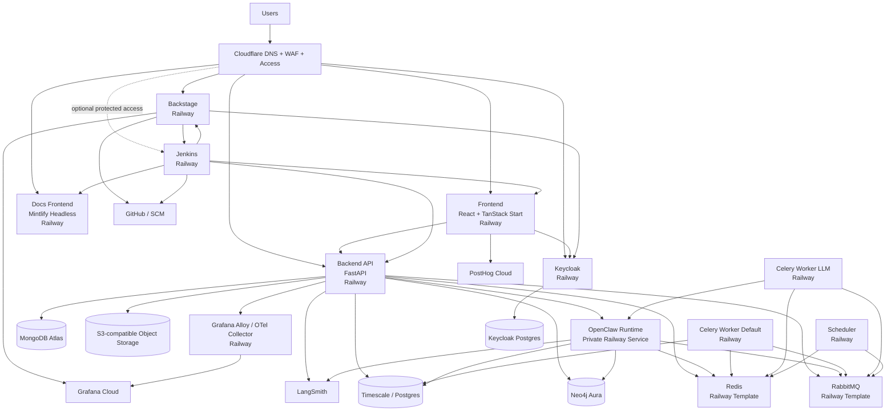

# Production Deployment Plan

## Agent Saul + OpenClaw + Frontend + Docs

**Primary platform:** Railway  
**Secondary platforms:** Dokploy and Coolify as future alternatives / migration tracks  
**Target profile:** medium scale, premium budget, any region, Keycloak as IdP

---

## Executive Summary

The right deployment model for this project is **Railway for the application plane** and **specialized managed services for the critical data plane**.

That means:

- Use **Railway** for the public frontend, FastAPI backend, OpenClaw runtime, Celery workers, internal docs frontend, and telemetry collector.
- Use **managed external services** for the databases that matter most operationally:
  - **Timescale / Postgres:** TigerData / Timescale Cloud
  - **Neo4j:** Neo4j Aura
  - **MongoDB:** MongoDB Atlas
  - **RabbitMQ:** CloudAMQP
- Use **Railway Redis** only if you want simplicity and low-latency internal access, or use **Redis Cloud / Upstash** if you want stronger operational separation.
- Use **Grafana Cloud** for observability and **PostHog Cloud** for product analytics, session replay, and feature flags.
- Use **self-hosted Keycloak on Railway**, backed by a dedicated external Postgres database.
- Use **Mintlify headless mode** for docs, but host the docs frontend yourself on Railway under `docs.yourdomain.com`.

This is the best fit for your stated constraints because Railway is excellent for fast, high-quality service deployment and private networking, but it is not the ideal long-term home for every stateful dependency in a multi-service AI system with queues, graph storage, legal data, and authentication.

The architectural rule underneath all of this:

> Put the **compute plane** where deployment velocity is highest, and put the **data plane** where operational guarantees are strongest.

---

## Why Railway Is The Primary Recommendation

Railway is the right primary platform for this project because it gives you:

- Fast deployment for many cooperating services
- Built-in private networking between services in the same environment
- Good enough built-in observability for first-level diagnosis
- Easy service-per-repo or service-per-Dockerfile workflow
- Strong fit for app services, workers, proxies, and internal tooling

Current Railway docs confirm:

- private service-to-service networking over `railway.internal`
- built-in service metrics and observability dashboards
- persistent volumes with backups, but also important caveats:
  - one volume per service
  - replicas cannot be used with volumes
  - services with attached volumes experience small redeploy downtime

That last point is exactly why Railway should be your **app plane**, not your universal platform for every stateful dependency.

---

## Non-Obvious Architectural Decision

Do **not** force everything onto Railway just because Railway can run containers.

Experienced teams separate the system into two planes:

### 1. Application Plane

Stateless or horizontally replaceable services:

- frontend
- backend API
- OpenClaw runtime
- Celery workers
- background schedulers
- docs frontend
- telemetry collector
- internal admin tools

These belong on Railway.

### 2. Data Plane

Stateful systems where operational mistakes are expensive:

- Postgres / Timescale
- Neo4j
- MongoDB
- RabbitMQ
- object storage
- backup storage
- IdP database

These should be managed by providers optimized for durability, backups, failover, and storage behavior.

The mistake many teams make is treating “can run in Docker” as equivalent to “should be self-hosted on the same deployment platform.” It is not.

---

## Recommended Production Topology

## Architecture Diagram

### Public domains

- `app.yourdomain.com` -> React + TanStack Start frontend
- `api.yourdomain.com` -> FastAPI backend
- `docs.yourdomain.com` -> self-hosted Mintlify headless docs frontend
- `sso.yourdomain.com` -> Keycloak public auth endpoints
- `sso-admin.yourdomain.com` -> optional separate Keycloak admin hostname
- `portal.yourdomain.com` -> Backstage developer portal
- `jenkins.yourdomain.com` -> Jenkins, ideally protected behind Access / VPN
- `grafana.yourdomain.com` -> only if self-hosting Grafana later
- `flower.yourdomain.com` -> optional, internal or VPN-only

### Railway services

- `frontend`
- `backend-api`
- `openclaw-runtime`
- `celery-worker-default`
- `celery-worker-llm`
- `scheduler`
- `docs-frontend`
- `otel-collector` or `grafana-alloy`
- `keycloak`
- `backstage`
- `jenkins`
- `redis`
- `rabbitmq`
- optional `admin-portal`

### Managed external services

- `timescale-cloud`
- `neo4j-aura`
- `mongodb-atlas`
- `s3-compatible-object-storage`
- `grafana-cloud`
- `posthog-cloud`

### Internal-only traffic

The following should never be public by default:

- `openclaw-runtime`
- Celery workers
- scheduler
- collector
- Flower
- Jenkins if exposed at all
- Backstage if you decide it should be employee-only
- any queue management UI
- any database admin UI

Only `frontend`, `backend-api`, `docs-frontend`, and `Keycloak` should be internet-facing by default. `Backstage` should usually be employee-only. `Jenkins` should be protected and never left broadly public.

---

## Service-By-Service Plan

## 1. Frontend

**Stack:** React + TanStack Start  
**Platform:** Railway  
**Ingress:** public

### Role

- Main user-facing application
- Talks to `api.yourdomain.com`
- Uses Keycloak for browser login flows
- Emits product analytics to PostHog

### Deployment pattern

- Deploy as its own Railway service
- Use separate Railway environments for `preview`, `staging`, and `production`
- Inject only public-safe runtime variables into the browser bundle

### Hard rules

- Never let the frontend call private Railway hostnames directly
- Never place service credentials in frontend runtime config
- Feature flags should be evaluated server-side when possible and bootstrapped to the client to avoid flicker and dependency on live flag fetches

### Key frontend integrations

- Keycloak OIDC client
- PostHog web SDK
- Sentry browser SDK if you add Sentry

---

## 2. FastAPI Backend

**Platform:** Railway  
**Ingress:** public

### Role

- Public API surface
- Orchestrates LangGraph and LangChain workflows
- Talks to OpenClaw over private Railway networking
- Reads and writes managed data services
- Emits telemetry to the collector

### Deployment pattern

- Docker-based deployment using your existing [prod.Dockerfile]
- Separate Railway service from workers
- Health endpoint must remain lightweight and not block on deep infra

### Critical production settings

- Run with explicit worker count, not default guesswork
- Set aggressive request timeouts at the ingress edge for sync endpoints
- Move long-running work to Celery
- Ensure app listens on all interfaces
- Keep Railway private networking enabled for internal calls

### Important nuance

The backend is your **policy enforcement point**:

- auth token validation
- rate limiting
- tenant / organization scoping
- request tracing
- audit event capture
- feature gate evaluation for sensitive actions

Do not let OpenClaw or internal workers become the first line of security enforcement.

---

## 3. OpenClaw Runtime

**Platform:** Railway  
**Ingress:** private only

### Role

- Separate self-hosted agent runtime
- Handles agent execution, long-running reasoning, tool orchestration, or isolation-heavy tasks

### Deployment pattern

- Dedicated Railway service
- No public domain initially
- Reachable only from backend via `railway.internal`

### Why separate it

- Prevents your main API from inheriting OpenClaw’s latency profile
- Lets you scale agent runtime independently from API traffic
- Reduces blast radius when the agent runtime misbehaves or saturates memory

### Non-obvious rule

Do not share the same database credentials blindly with the backend. OpenClaw should get:

- least-privilege DB roles
- limited queue permissions
- restricted tool access
- isolated API tokens where possible

Agent runtimes should be treated as **controlled high-trust compute**, not unrestricted superusers.

---

## 4. Celery Workers And Scheduler

**Platform:** Railway  
**Ingress:** private only

### Services

- `celery-worker-default`
- `celery-worker-llm`
- `scheduler`
- optional `flower`

### Why split worker types

Not all jobs have the same failure mode.

Split queues by job profile:

- `default`: short operational jobs
- `ingestion`: file parsing and chunking
- `llm`: expensive model workflows
- `crawl`: web crawling and extraction
- `email`: transactional email

### Why this matters

Without queue separation:

- one bad crawl can starve auth email
- one giant ingestion task can delay user-facing work
- memory-heavy LLM tasks can churn worker restarts

### RabbitMQ recommendation

Use the **Railway RabbitMQ template** as your primary queue deployment path.

This matches your stated preference and is viable at your scale, but there are operational caveats:

- treat RabbitMQ as a single-service stateful component, not an infinitely disposable container
- attach a Railway volume and monitor disk growth aggressively
- keep queue TTL, DLQ, and max-length policies explicit
- avoid using RabbitMQ as a long-term task-result store
- test restart behavior before production cutover

The hidden risk with template-based brokers is false confidence: they are easy to launch, but durability and queue-growth mistakes still behave like RabbitMQ mistakes, not like generic PaaS issues.

### Flower

Expose Flower only if necessary and protect it behind:

- Keycloak auth proxy
- IP allowlist
- or VPN / Tailscale

Do not leave Flower public.

---

## 5. Databases

## PostgreSQL / Timescale

**Recommendation:** TigerData / Timescale Cloud

### Why

- Your project is clearly vector-, retrieval-, and memory-heavy
- You already frame the system around TigerData-backed Postgres in the repo docs
- This is the wrong place to optimize for deployment convenience

### Usage split

- transactional app data
- vector search
- time-series telemetry where appropriate
- task / audit / ingestion metadata

### Best practice

Split logical databases or schemas by workload:

- `app_core`
- `observability_support`
- `keycloak`
- `analytics_exports` if needed later

Do not put everything into one giant shared schema because “it is one Postgres cluster.” That creates upgrade and permission coupling.

## Neo4j

**Recommendation:** Neo4j Aura

### Why

- graph infra is hard to run well casually
- Aura removes backup and cluster management pain
- graph storage is central to your product, not a side accessory

## MongoDB

**Recommendation:** MongoDB Atlas

### Why

- Atlas is still the lowest-friction operational path for this project’s shape
- Railway can technically host Mongo, but that is not where you want to spend attention

## Redis

**Recommendation:** Railway Redis template

This is the simplest fit with your platform choice and service topology.

### Railway template guidance

- deploy Redis as a dedicated Railway template service
- do not share Redis across unrelated environments
- use it for cache, rate limiting, idempotency, ephemeral coordination, and short-lived worker state
- define memory eviction policy intentionally
- monitor memory fragmentation and key cardinality from the beginning

### Rule

Use Redis for:

- cache
- idempotency
- rate limiting
- ephemeral locks
- short-lived task metadata

Do not quietly turn Redis into your system of record.

---

## 6. Authentication And Identity

**IdP:** Keycloak  
**Platform:** Railway  
**State:** external Postgres database

### Deployment pattern

- Deploy Keycloak as a dedicated Railway service
- Back it with a dedicated Postgres database, not your main application DB
- Use explicit public hostname configuration
- Consider separate public and admin hostnames

### Recommended domains

- `sso.yourdomain.com`
- `sso-admin.yourdomain.com`

### Critical Keycloak production rules

- set explicit hostname values
- do not rely on implicit dynamic hostname resolution
- do not expose Keycloak management port `9000`
- keep TLS termination and proxy headers correct
- backchannel traffic from your app to Keycloak should use the internal network where possible

### Identity architecture

Use Keycloak as:

- OIDC provider for frontend and backend
- source of truth for users, sessions, organizations, and roles
- broker for social login if needed later

Use application DB for:

- app-specific profile state
- product entitlements
- legal workflow permissions beyond generic identity roles

The subtle but important rule:

> Identity owns who the user is. Your application owns what the user can do in the product.

Do not collapse those into the same model too early.

---

## 7. Backstage Developer Portal

**Role:** internal developer portal, software catalog, service inventory, and operational control plane  
**Important correction:** Backstage is **not** your IdP. Keep **Keycloak** as the identity provider and put **Backstage behind Keycloak**.

### Why Backstage belongs here

Backstage gives you a governed internal surface for:

- service catalog
- ownership and team boundaries
- CI/CD links
- documentation aggregation
- operational links to Grafana, Jenkins, GitHub, Railway, and runbooks
- scaffolding and developer workflows later

### Authentication model

Use Backstage with Keycloak-backed sign-in.

Official Backstage docs emphasize that authentication and sign-in identity must be configured explicitly, including user identity resolution. In production, Backstage should not rely on guest auth or ambiguous identity mapping.

### Deployment pattern

- deploy Backstage as a dedicated Railway service
- expose it at `portal.yourdomain.com`
- use Keycloak for sign-in
- use Backstage catalog and groups/users to model system ownership
- integrate GitHub, Jenkins, Grafana, and docs links into the portal

### Non-obvious best practice

Do not start Backstage as “just another dashboard.” Make it the **system map**:

- every Railway service becomes a Backstage component
- every queue becomes a resource
- every database becomes a resource
- every owner and escalation path becomes explicit
- every runbook gets linked from the owning component

That turns Backstage from vanity infra to operational leverage.

---

## 8. Documentation

**Requirement from this plan:** self-hosted docs at `docs.yourdomain.com`  
**Content engine:** Mintlify  
**Frontend hosting:** Railway

### Important platform nuance

Mintlify’s default model is hosted docs with custom domains. True self-hosted docs while retaining Mintlify’s content engine and AI features is now a **headless custom frontend** path, and Mintlify’s official headless guidance is built around **Astro**, not TanStack Start.

### Recommendation

Use an intentional framework exception:

- product app: React + TanStack Start
- docs app: Mintlify headless frontend on Astro

### Why this is the right exception

- It keeps your main product stack clean
- It aligns with Mintlify’s official headless integration
- It avoids fighting the docs tool just to maintain framework uniformity

### Deployment pattern

- Separate docs repository or `/docs-site` workspace
- Build Astro docs frontend using Mintlify headless mode
- Deploy on Railway as `docs-frontend`
- Use `docs.yourdomain.com`

### Docs content flow

- docs content in Git
- Mintlify processes content and provides content/search/assistant integration
- your self-hosted docs frontend renders and serves the final experience

### Best practice

Keep docs versioning tied to product releases. AI products drift fastest at the seams between UI, auth, and API behavior, so docs release coordination matters more here than in simpler SaaS systems.

---

## 9. Observability And Monitoring

**Recommendation:** Grafana Cloud + Grafana Alloy / OTel collector on Railway

### Why

You already have OpenTelemetry packages in the backend. The missing piece is a proper signal pipeline.

### Recommended observability stack

- **Collector:** Grafana Alloy or OTel Collector on Railway
- **Metrics:** Grafana Cloud Prometheus / Mimir
- **Logs:** Grafana Cloud Loki
- **Traces:** Grafana Cloud Tempo
- **Dashboards and alerts:** Grafana Cloud

### Signal model

- backend API -> OTLP -> Alloy
- OpenClaw runtime -> OTLP -> Alloy
- workers -> OTLP -> Alloy
- frontend -> web vitals and JS errors to PostHog and optionally Sentry
- infrastructure/service metrics -> Railway built-ins + Alloy where possible

### Golden dashboards

You need these from day one:

- API latency, error rate, request volume
- worker queue depth and task runtime
- LLM cost, latency, timeout rate, retry rate
- ingestion throughput and failure rate
- graph query latency
- auth success/failure rate
- external dependency health

### Non-obvious best practice

Create a **single correlation ID** that survives:

- frontend request
- backend request
- Celery task enqueue
- worker execution
- OpenClaw handoff
- external API call

Without this, your traces are pretty pictures, not operational tools.

---

## 10. Product Analytics

**Recommendation:** PostHog Cloud

### Why

For your stated budget and scale, PostHog Cloud is the right tradeoff. Self-hosting PostHog is possible, but it adds a surprising amount of operational surface area for very little strategic advantage here.

### Use PostHog for

- product analytics
- session replay
- feature flags
- experiments
- user journey analysis
- AI workflow analytics where useful

### Recommended event taxonomy

Track at least:

- sign_up_completed
- login_succeeded
- document_uploaded
- ingestion_started
- ingestion_completed
- ingestion_failed
- agent_run_started
- agent_run_completed
- agent_run_failed
- clause_flagged
- human_override_submitted
- docs_search_used

### Best practice

Define an event dictionary before instrumenting broadly. Otherwise your analytics becomes an archaeology problem instead of a decision system.

---

## 11. Object Storage And File Handling

**Recommendation:** S3-compatible object storage

Use one of:

- Railway Buckets if you want proximity and simplicity
- Cloudflare R2 if you want lower egress sensitivity
- AWS S3 if you want the most standard ecosystem path

### Use object storage for

- original uploaded files
- transformed artifacts
- document previews
- export bundles
- backup staging

### Rule

Never store large file artifacts permanently on Railway volumes. Volumes are for attached service persistence, not long-term document storage strategy.

---

## 12. Networking And Security

### Edge

Use Cloudflare in front of public domains for:

- DNS
- WAF
- bot protection
- rate limiting
- optional Access policies for internal tools

### Public exposure policy

Public:

- frontend
- backend API
- docs
- Keycloak

Private or access-controlled:

- OpenClaw
- workers
- Flower
- admin portals
- any queue or database admin UI

### Secrets

Use Railway environment variables for runtime injection, but treat your secret source of truth separately:

- 1Password Secrets Automation
- Doppler
- Vault
- or a tightly controlled GitHub Actions secrets model

The key principle:

> Railway is where secrets are consumed. It should not be the only place secrets are governed.

---

## 13. CI/CD And Release Engineering

**Primary CI/CD control plane:** Jenkins  
**Source of truth:** `Jenkinsfile` in source control

Jenkins remains a strong fit here because the platform is multi-service, Docker-heavy, and likely to accumulate custom release gates, migration rules, smoke tests, and controlled approvals. Official Jenkins guidance continues to treat `Jenkinsfile`-based pipeline-as-code as the correct default.

### Jenkins deployment model

- deploy Jenkins as a dedicated Railway service
- attach a Railway volume for Jenkins home
- keep Jenkins behind Cloudflare Access, VPN, or strong SSO restrictions
- use ephemeral agents where possible instead of making the controller do build work
- prefer GitHub webhooks for pipeline triggers

### Recommended Jenkins topology

- Jenkins controller on Railway
- remote or ephemeral build agents for Docker-heavy builds if controller resource pressure grows
- GitHub as SCM source
- Railway deployment credentials stored as controlled secrets

### Pipeline stages

1. Checkout and dependency bootstrap
2. Lint and type-check
3. Unit and integration tests
4. Build Docker images
5. Security scans and dependency checks
6. Database migration safety checks
7. Deploy to preview or staging
8. Smoke tests
9. Manual approval for production where required
10. Production deploy
11. Post-deploy health verification

### Jenkins best practices

- use Declarative Pipeline unless you truly need Scripted flexibility
- store the pipeline in a repo `Jenkinsfile`
- move repeated logic into shared libraries only after repeated use becomes real
- separate build and deploy credentials
- sign and tag Docker images consistently
- keep migrations as an explicit deploy stage, never an implicit side effect

### Important nuance

Jenkins should orchestrate delivery, not become your internal identity system, artifact database, or documentation hub. That is why it should integrate with Backstage, not replace it.

### Branching model

- `main` -> production
- `staging` -> staging environment
- feature branches -> preview environments where useful

### Delivery flow

1. GitHub Actions runs tests, lint, and build checks
2. Docker images are built for backend, OpenClaw, workers, docs if needed
3. Railway deploys only after CI success
4. migrations run in a controlled pre-deploy job
5. smoke tests hit health and auth endpoints

### Critical release rules

- schema migrations must be backward-compatible first
- deploy app before destructive migration cleanup
- do not combine queue-routing changes and worker image changes casually
- keep auth changes and frontend auth rollout behind flags or staged rollout

### Deployment order

1. data migrations compatible with old and new code
2. backend
3. workers
4. OpenClaw runtime
5. frontend
6. docs

---

## 14. Backups, DR, And Recovery

### Required backups

- Postgres automated backups and PITR
- Neo4j managed backups
- MongoDB Atlas snapshots
- RabbitMQ broker recovery plan
- Redis persistence and restore procedure if you enable AOF or snapshots
- object storage versioning or backup policy
- Jenkins home backup and plugin manifest recovery procedure
- Backstage config, catalog source definitions, and secret recovery procedure
- Keycloak realm export strategy

### Recovery objectives

Target:

- RPO: <= 15 minutes for critical app data
- RTO: <= 2 hours for production application plane

### Disaster recovery rule

Document both:

- **data restoration procedure**
- **service recreation procedure**

Most teams only document one.

If you can restore a database but not rehydrate Railway services, DNS, env vars, and secrets safely, you do not yet have DR.

---

## 15. Environment Strategy

Use at least three environments:

- `preview`
- `staging`
- `production`

### Environment design rules

- separate Keycloak realms per environment
- separate PostHog projects per environment
- separate Grafana stacks or labels per environment
- separate message queues per environment
- no shared production databases with staging

### Common trap

Do not let staging share auth callbacks or OAuth app configuration with production. Auth bugs often hide in redirect URI mismatches and cookie domain mistakes.

---

## 16. Recommended Implementation Sequence

## Phase 1: Foundation

- Set up Railway project and environments
- Deploy frontend, backend, OpenClaw, Redis, and RabbitMQ skeleton services
- Provision managed Postgres, Neo4j, and MongoDB
- Configure private networking and baseline env vars
- Put Cloudflare in front of public domains

## Phase 2: Identity And Core Data

- Deploy Keycloak on Railway
- Deploy Backstage on Railway behind Keycloak
- Configure dedicated Keycloak Postgres
- Wire frontend and backend to OIDC
- Establish user/session/audit model

## Phase 3: Background And Agent Workloads

- Deploy Celery workers and scheduler
- Wire Railway RabbitMQ and Redis templates
- Route long-running operations off the API path
- Introduce Flower behind access control if needed

## Phase 4: Observability

- Deploy Alloy / OTel collector
- Send logs, metrics, and traces to Grafana Cloud
- Create service and workflow dashboards
- Add alerting for critical failure paths

## Phase 4B: CI/CD Control Plane

- Deploy Jenkins on Railway
- Add repository `Jenkinsfile`
- Wire GitHub webhooks and secrets
- Implement build, test, migration, staging deploy, and production approval stages
- Link Jenkins pipelines into Backstage

## Phase 5: Analytics And Docs

- Integrate PostHog in frontend and backend
- Deploy Mintlify headless docs frontend on Railway
- Publish docs to `docs.yourdomain.com`

## Phase 6: Hardening

- backup verification drills
- auth failover and callback validation
- queue failure injection
- LLM timeout and retry policy validation
- load tests for ingestion and agent workflows

---

## 17. What To Leave As TODO For Dokploy And Coolify

These are not the primary recommendation now. They are future tracks.

## Dokploy TODO

Use Dokploy later if you want:

- more direct Docker Compose control
- automated named-volume backups to S3
- stronger self-hosting posture for application services
- a migration path away from Railway operational dependency

Best Dokploy use later:

- self-host internal tooling
- self-host docs frontend
- self-host Keycloak if you want tighter network control

## Coolify TODO

Use Coolify later if you want:

- broader self-hosted PaaS control
- multi-server expansion
- more opinionated self-hosting workflows

Best Coolify use later:

- migration target for non-critical public services first
- not the first place to migrate the core stateful data plane

The mature pattern is:

> first externalize the data plane, then move compute platforms if needed.

That keeps platform migration survivable.

---

## Final Recommendation

For this project, the most defensible production setup is:

- **Railway** for compute and service deployment
- **Railway templates** for Redis and RabbitMQ
- **managed external data services** for the heaviest critical state
- **Keycloak on Railway** with dedicated Postgres
- **Backstage on Railway** behind Keycloak as the internal developer portal
- **Jenkins on Railway** as the CI/CD control plane
- **Grafana Cloud + Alloy** for observability
- **PostHog Cloud** for analytics and feature flags
- **Mintlify headless self-hosted docs frontend** on Railway
- **Cloudflare** for DNS, WAF, and access control

This gives you:

- high deployment speed
- good internal networking
- lower operational drag
- better failure isolation
- a clean path to evolve toward Dokploy or Coolify later if you decide Railway is no longer the right control plane

---
